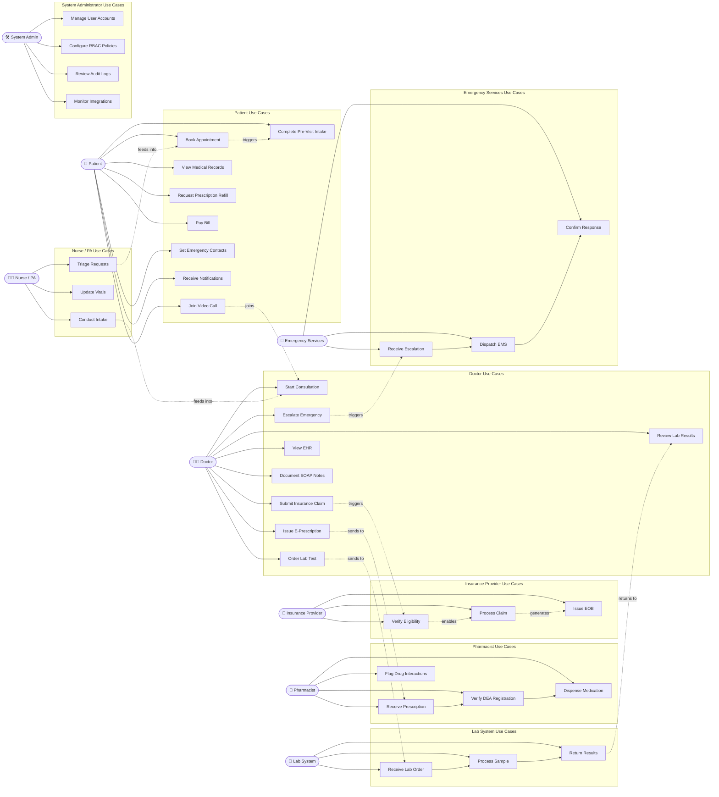

# Use Case Diagram — Telemedicine Platform

## Overview

The Telemedicine Platform is a HIPAA-compliant digital health system that enables remote clinical care delivery between patients and licensed healthcare providers. It integrates scheduling, real-time video consultation, electronic prescribing, lab ordering, insurance billing, and emergency escalation into a single regulated platform.

The use case model defines every meaningful interaction between system actors and the platform. It serves as the authoritative reference for feature scoping, acceptance criteria authoring, and compliance mapping (HIPAA Security Rule §164.312, HITECH Act, DEA 21 CFR Part 1311).

Actors are categorized as **primary** (they initiate interactions with the platform) or **secondary** (they respond to or support interactions). All actors that handle Protected Health Information (PHI) are subject to Business Associate Agreement (BAA) requirements.

---

## Actors

### Patient
The end-user seeking telehealth services. Patients access the platform via a web browser or native mobile application (iOS/Android). They schedule appointments, join video consultations, review their clinical records, request prescription refills, pay copays, and designate emergency contacts. Patients must complete identity verification (NIST IAL2) and provide informed consent before their first consultation.

### Doctor (Physician / Licensed Provider)
A board-certified physician, nurse practitioner, or physician assistant licensed to practice telemedicine in the patient's state. Doctors conduct video consultations, issue electronic prescriptions (including controlled substances where DEA authorization exists), order laboratory tests, document SOAP notes in structured EHR format, submit insurance claims, and escalate clinical emergencies.

### Nurse / PA (Clinical Support Staff)
Registered nurses and physician assistants who perform pre-consultation intake, capture chief complaint and vital signs reported by the patient, triage incoming requests by acuity, and coordinate care transitions. They operate within a clinical supervision framework and do not independently prescribe.

### Pharmacist
Licensed pharmacists connected to the platform via the Surescripts network. They receive electronic prescriptions, verify DEA registration for controlled substance orders, perform drug-drug and drug-allergy interaction screening, confirm insurance formulary coverage, and dispense or flag issues back to the prescriber.

### Insurance Provider
Payer organizations (commercial insurance, Medicare Advantage, Medicaid managed care) connected via the Availity clearinghouse. They verify patient eligibility and benefits, adjudicate submitted claims (CMS-1500 / 837P), issue Explanation of Benefits (EOB), and communicate prior authorization decisions.

### Lab System
Laboratory information systems operated by reference labs (Quest Diagnostics, LabCorp) or hospital-affiliated labs. They receive electronic lab orders via HL7 v2.5 or FHIR R4, process specimens, and return structured results to the platform for provider review and patient notification.

### Emergency Services
Public Safety Answering Points (PSAPs) and 911 Computer-Aided Dispatch (CAD) systems. They receive structured emergency notifications from the platform, dispatch appropriate emergency medical services (EMS), and confirm acknowledgment of dispatch to close the escalation loop.

### System Administrator
Internal platform operations staff responsible for user account lifecycle management, RBAC policy configuration, audit log review, security incident response, HIPAA compliance monitoring, and integration health oversight.

---

## Use Cases by Actor

### Patient Use Cases
| ID | Use Case | Description |
|----|----------|-------------|
| UC-P01 | Book Appointment | Search provider availability and reserve a consultation slot |
| UC-P02 | Join Video Call | Enter waiting room and connect to a WebRTC video session |
| UC-P03 | View Medical Records | Access personal health records including visit notes, labs, imaging |
| UC-P04 | Request Prescription Refill | Submit a refill request for an active medication |
| UC-P05 | Pay Bill | Pay copays, coinsurance, or outstanding balances online |
| UC-P06 | Set Emergency Contacts | Designate individuals to be notified in a clinical emergency |
| UC-P07 | Complete Pre-Visit Intake | Submit symptoms, vitals, and consent forms before consultation |
| UC-P08 | Receive Notifications | Receive appointment reminders, results alerts, prescription status |

### Doctor Use Cases
| ID | Use Case | Description |
|----|----------|-------------|
| UC-D01 | Start Consultation | Launch video session and access patient context dashboard |
| UC-D02 | Issue Prescription | Electronically prescribe medications via Surescripts (EPCS for controlled) |
| UC-D03 | Order Lab Test | Submit a lab requisition to the connected lab system |
| UC-D04 | View EHR | Access full longitudinal patient record including prior visit history |
| UC-D05 | Document SOAP Notes | Structured clinical note authoring with ICD-10 and CPT coding |
| UC-D06 | Escalate Emergency | Trigger emergency escalation workflow for at-risk patients |
| UC-D07 | Submit Insurance Claim | Initiate claim submission with coded encounter data |
| UC-D08 | Review Lab Results | View and acknowledge returned lab results, annotate for patient |

### Nurse / PA Use Cases
| ID | Use Case | Description |
|----|----------|-------------|
| UC-N01 | Conduct Intake | Lead structured pre-consultation interview and record findings |
| UC-N02 | Update Vitals | Enter patient-reported or device-transmitted vital signs |
| UC-N03 | Triage Requests | Score and prioritize incoming appointment requests by acuity |

### Pharmacist Use Cases
| ID | Use Case | Description |
|----|----------|-------------|
| UC-PH01 | Receive Prescription | Accept incoming e-prescription from the platform |
| UC-PH02 | Verify DEA | Validate prescriber DEA registration for controlled substances |
| UC-PH03 | Dispense Medication | Confirm dispense and transmit fill confirmation to platform |
| UC-PH04 | Flag Drug Interactions | Alert prescriber to identified interaction or formulary issue |

### Insurance Provider Use Cases
| ID | Use Case | Description |
|----|----------|-------------|
| UC-I01 | Verify Eligibility | Respond to 270/271 eligibility transaction |
| UC-I02 | Process Claim | Adjudicate 837P claim and return 835 remittance |
| UC-I03 | Issue EOB | Generate and transmit Explanation of Benefits to patient |

### Lab System Use Cases
| ID | Use Case | Description |
|----|----------|-------------|
| UC-L01 | Receive Order | Accept structured lab requisition |
| UC-L02 | Process Sample | Internal lab processing (not modeled in platform boundary) |
| UC-L03 | Return Results | Transmit structured result report via HL7 ORU message or FHIR DiagnosticReport |

### Emergency Services Use Cases
| ID | Use Case | Description |
|----|----------|-------------|
| UC-E01 | Receive Escalation | Accept structured emergency notification from the platform |
| UC-E02 | Dispatch Services | Deploy EMS resources based on patient location data |
| UC-E03 | Confirm Response | Acknowledge dispatch and update platform with incident ID |

### System Administrator Use Cases
| ID | Use Case | Description |
|----|----------|-------------|
| UC-A01 | Manage User Accounts | Create, deactivate, and manage provider and staff accounts |
| UC-A02 | Configure RBAC Policies | Define and update role-based access control rules |
| UC-A03 | Review Audit Logs | Access immutable audit trails for HIPAA compliance review |
| UC-A04 | Monitor Integrations | Track health status of all external system connections |

---

## Primary Use Case Diagram

---

## Secondary Relationships

### Include Relationships
Include relationships denote functionality that is **always** invoked as part of another use case — it is not optional.

| Base Use Case | Included Use Case | Rationale |
|---------------|-------------------|-----------|
| Book Appointment | Verify Eligibility | Insurance eligibility is checked at scheduling to surface copay estimates |
| Join Video Call | Complete Pre-Visit Intake | Intake form must be submitted before the waiting room is accessible |
| Issue E-Prescription | Verify DEA Registration | DEA validation is mandatory for all prescription submissions |
| Submit Insurance Claim | Document SOAP Notes | Claims cannot be submitted without a coded, signed encounter note |
| Issue E-Prescription | Flag Drug Interactions | Interaction screening runs automatically on every prescription submission |
| Start Consultation | View EHR | The EHR panel loads automatically when a consultation session opens |

### Extend Relationships
Extend relationships denote functionality that is **conditionally** invoked — only when certain criteria are met during a base use case.

| Base Use Case | Extending Use Case | Extension Condition |
|---------------|--------------------|---------------------|
| Join Video Call | Escalate Emergency | Provider identifies patient as presenting with an emergency condition |
| Issue E-Prescription | Prior Authorization Check | Drug is on payer's prior authorization required list |
| Order Lab Test | Prior Authorization Check | Lab test requires payer pre-authorization |
| Book Appointment | Receive Notifications | Appointment confirmed — reminder notifications are scheduled |
| Process Claim | Denial Management | Claim is rejected by payer and requires appeal or correction |
| View Medical Records | Export to Patient Portal | Patient explicitly requests a downloadable copy (HIPAA Right of Access) |

---

## Use Case Inventory

| Use Case ID | Name | Primary Actor | Secondary Actors | Priority | HIPAA Relevant |
|-------------|------|---------------|------------------|----------|----------------|
| UC-P01 | Book Appointment | Patient | Nurse/PA, Insurance | High | Yes |
| UC-P02 | Join Video Call | Patient | Doctor | Critical | Yes |
| UC-P03 | View Medical Records | Patient | System | High | Yes — Right of Access |
| UC-P04 | Request Prescription Refill | Patient | Doctor, Pharmacist | High | Yes |
| UC-P05 | Pay Bill | Patient | Billing Staff | Medium | Yes — Financial PHI |
| UC-P06 | Set Emergency Contacts | Patient | System | Medium | Yes |
| UC-P07 | Complete Pre-Visit Intake | Patient | Nurse/PA | High | Yes |
| UC-P08 | Receive Notifications | Patient | System | High | Yes |
| UC-D01 | Start Consultation | Doctor | Patient | Critical | Yes |
| UC-D02 | Issue E-Prescription | Doctor | Pharmacist, System | Critical | Yes — DEA |
| UC-D03 | Order Lab Test | Doctor | Lab System | High | Yes |
| UC-D04 | View EHR | Doctor | System | Critical | Yes |
| UC-D05 | Document SOAP Notes | Doctor | System | Critical | Yes |
| UC-D06 | Escalate Emergency | Doctor | Emergency Services | Critical | Yes |
| UC-D07 | Submit Insurance Claim | Doctor / Billing | Insurance Provider | High | Yes |
| UC-D08 | Review Lab Results | Doctor | Patient | High | Yes |
| UC-N01 | Conduct Intake | Nurse/PA | Patient | High | Yes |
| UC-N02 | Update Vitals | Nurse/PA | Patient | High | Yes |
| UC-N03 | Triage Requests | Nurse/PA | System | Medium | Yes |
| UC-PH01 | Receive Prescription | Pharmacist | Doctor | Critical | Yes — DEA |
| UC-PH02 | Verify DEA Registration | Pharmacist | System | Critical | Yes |
| UC-PH03 | Dispense Medication | Pharmacist | Patient | Critical | Yes |
| UC-PH04 | Flag Drug Interactions | Pharmacist | Doctor | High | Yes |
| UC-I01 | Verify Eligibility | Insurance Provider | System | High | Yes |
| UC-I02 | Process Claim | Insurance Provider | Billing Staff | High | Yes |
| UC-I03 | Issue EOB | Insurance Provider | Patient | High | Yes |
| UC-L01 | Receive Lab Order | Lab System | Doctor | High | Yes |
| UC-L02 | Process Sample | Lab System | — | High | Internal |
| UC-L03 | Return Results | Lab System | Doctor, Patient | High | Yes |
| UC-E01 | Receive Escalation | Emergency Services | Doctor | Critical | Yes |
| UC-E02 | Dispatch EMS | Emergency Services | Patient | Critical | Yes |
| UC-E03 | Confirm Response | Emergency Services | System | Critical | Yes |
| UC-A01 | Manage User Accounts | System Admin | — | High | Yes |
| UC-A02 | Configure RBAC Policies | System Admin | — | High | Yes |
| UC-A03 | Review Audit Logs | System Admin | — | High | Yes — §164.312(b) |
| UC-A04 | Monitor Integrations | System Admin | — | Medium | Yes |

---

*Document version 1.0 — aligned with HIPAA Security Rule 45 CFR Part 164, DEA 21 CFR Part 1311 (EPCS), and HL7 FHIR R4 interoperability standards.*
