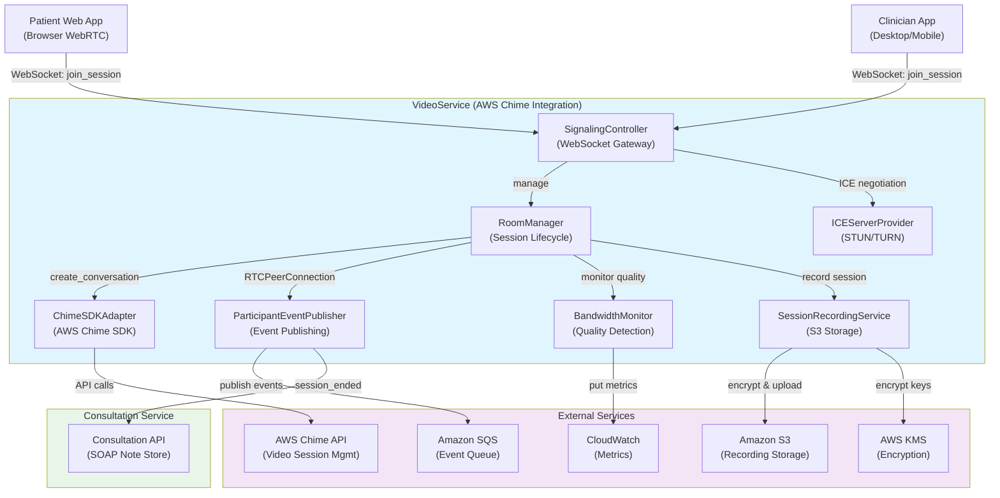
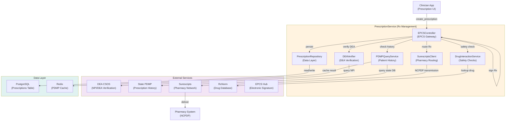

# Telemedicine Platform C4 Component Diagram

This document defines the C4 Component level architecture for the telemedicine platform, focusing on two critical services: VideoService and PrescriptionService. Each component is mapped to specific technologies, responsibilities, and public interfaces.

---

## 1. VideoService Architecture

The VideoService manages real-time video consultations with reliability, quality monitoring, and HIPAA-compliant recording.

### Component Diagram: VideoService



---

### Component Details

#### 1.1 SignalingController

**Technology**: Node.js with Socket.IO (WebSocket)

**Responsibility**:
- Accept WebSocket connections from patient and clinician applications
- Exchange Session Description Protocol (SDP) offers/answers for WebRTC peer connection setup
- Distribute ICE candidates between participants
- Manage connection state (connecting, connected, disconnected, failed)
- Enforce authentication and authorization before allowing session join

**Public Interfaces**:
```typescript
// WebSocket Events (incoming)
socket.on('join_session', (data: {
    appointmentId: UUID,
    participantRole: 'patient' | 'clinician',
    authToken: string
}) => Promise<RoomMetadata>

socket.on('send_ice_candidate', (data: {
    candidate: RTCIceCandidate,
    roomId: string
}) => void

socket.on('leave_session', () => void

// WebSocket Events (outgoing)
socket.emit('session_joined', metadata: RoomMetadata)
socket.emit('participant_joined', {
    participantId: string,
    participantRole: 'patient' | 'clinician'
})
socket.emit('ice_candidate', candidate: RTCIceCandidate)
socket.emit('session_ended', reason: string)
socket.emit('error', errorCode: string, message: string)
```

**Key Behavior**:
- Connection timeout: 30 seconds to establish WebSocket and authenticate
- SDP exchange timeout: 15 seconds per candidate batch
- Automatic disconnect if both participants missing for >1 minute
- Graceful degradation: switch to audio-only if video codec negotiation fails

---

#### 1.2 RoomManager

**Technology**: Node.js service with state persistence (Redis cache)

**Responsibility**:
- Create and manage video session rooms (namespaces)
- Track active participants and their connection states
- Coordinate session lifecycle (waiting, active, on-hold, ended)
- Initiate recording when both participants present
- Handle reconnection attempts (grace period: 5 minutes)
- Enforce session timeout (max 4 hours per HIPAA workflow requirements)

**Public Interfaces**:
```typescript
class RoomManager {
    createRoom(appointmentId: UUID): Promise<{
        roomId: string,
        chimeConversationId: string,
        attemptTimestamp: number
    }>
    
    addParticipant(
        roomId: string,
        participantId: string,
        role: 'patient' | 'clinician'
    ): Promise<ParticipantMetadata>
    
    removeParticipant(roomId: string, participantId: string): Promise<void>
    
    onParticipantStateChange(
        roomId: string,
        callback: (state: ParticipantState) => void
    ): void
    
    getRoomState(roomId: string): Promise<RoomState>
    
    holdSession(roomId: string): Promise<void>
    resumeSession(roomId: string): Promise<void>
    
    endSession(roomId: string, reason: string): Promise<SessionSummary>
}
```

**Data Stored in Redis**:
```
room:{roomId}:metadata = {
    appointmentId: UUID,
    chimeConversationId: string,
    createdAt: timestamp,
    state: 'waiting' | 'active' | 'on_hold' | 'ended'
}

room:{roomId}:participants = {
    patient: { id, joinedAt, lastHeartbeat },
    clinician: { id, joinedAt, lastHeartbeat }
}
```

---

#### 1.3 ICEServerProvider

**Technology**: AWS Lambda + DynamoDB (credential caching)

**Responsibility**:
- Provision STUN/TURN server credentials dynamically
- Cache Coturn server list with failover
- Generate time-limited credentials (15-minute TTL) per WebRTC RFC 8656
- Select optimal TURN server based on participant geographic location
- Monitor STUN/TURN server health and mark unhealthy servers

**Public Interfaces**:
```typescript
interface ICEServer {
    urls: string[];  // STUN/TURN URLs
    username?: string;  // TURN credential
    credential?: string;  // TURN credential
}

class ICEServerProvider {
    async getICEServers(
        region: 'us-east', 'us-west', 'eu-west'
    ): Promise<ICEServer[]>
    
    async refreshCredentials(
        participantId: string,
        existingServers: ICEServer[]
    ): Promise<ICEServer[]>
    
    async reportServerFailure(
        serverUrl: string,
        errorCode: string
    ): Promise<void>
}
```

**Key Behavior**:
- Primary STUN servers: Google (stun.l.google.com), AWS (stun.services.mozilla.com)
- Fallback TURN: Coturn cluster (self-hosted or AWS TURN service)
- Credential refresh: automatic every 12 minutes
- Server down detection: >3 consecutive timeouts triggers failover
- Fallback to audio-only if all TURN servers unavailable (UX downgrade path)

---

#### 1.4 SessionRecordingService

**Technology**: AWS Chime SDK (built-in recording), S3, AWS KMS

**Responsibility**:
- Receive recording stream from AWS Chime media services
- Encrypt video recording with AES-256 (encryption key from KMS)
- Upload encrypted MP4 to S3 with redundancy (replicate across AZs)
- Generate S3 object lifecycle policy (auto-delete after 7 years for HIPAA compliance)
- Create audit log entry for recording start/stop
- Handle recording failure gracefully (notify clinician, allow consultation to continue)

**Public Interfaces**:
```typescript
interface RecordingConfig {
    appointmentId: UUID,
    consultationId: UUID,
    chimeConversationId: string,
    s3Bucket: string,
    encryptionKeyArn: string,
    retentionDays: number  // 2555 = 7 years
}

class SessionRecordingService {
    async startRecording(config: RecordingConfig): Promise<{
        recordingId: string,
        startTime: timestamp
    }>
    
    async stopRecording(recordingId: string): Promise<{
        s3Path: string,
        duration: number,  // seconds
        fileSize: number   // bytes
    }>
    
    async verifyRecordingEncryption(s3Path: string): Promise<{
        encrypted: boolean,
        keyArn: string,
        lastVerified: timestamp
    }>
}
```

**S3 Lifecycle Policy**:
```json
{
    "Rules": [{
        "Id": "delete-old-recordings",
        "Filter": {"Prefix": "consultations/"},
        "Expiration": {"Days": 2555},
        "Status": "Enabled"
    }]
}
```

**Recording Failure Scenarios**:
- AWS Chime service unavailable: recording not started, consultation proceeds with warning
- S3 upload fails: retry exponentially (1s, 2s, 4s, 8s, 16s max)
- KMS key access denied: alert compliance team, recording retried after manual intervention
- Disk space exhausted: prioritize real-time streaming, queue recording for batch processing

---

#### 1.5 BandwidthMonitor

**Technology**: WebRTC statistics API (via Chime SDK), Node.js service

**Responsibility**:
- Collect RTC statistics every 1 second (jitter, packet loss, bandwidth estimation)
- Detect network degradation (packet loss >5%, bandwidth <200 Kbps)
- Trigger quality adaptation signals: suggest video downgrade or audio-only fallback
- Monitor codec selection and re-negotiation
- Send metrics to CloudWatch for alerting and dashboards

**Public Interfaces**:
```typescript
interface RTCMetrics {
    timestamp: number,
    videoInbound: {
        bitrate: number,  // Kbps
        packetLoss: number,  // percentage
        jitter: number,  // ms
        frameRate: number,
        videoResolution: string  // e.g., "640x480"
    },
    audioInbound: {
        bitrate: number,  // Kbps
        packetLoss: number,
        jitter: number,  // ms
        audioLevel: number
    },
    videoOutbound: {
        bitrate: number,
        frameRate: number
    },
    audioOutbound: {
        bitrate: number
    }
}

class BandwidthMonitor {
    onMetrics(
        roomId: string,
        callback: (metrics: RTCMetrics) => void
    ): void
    
    async reportQualityIssue(
        roomId: string,
        severity: 'low' | 'medium' | 'high'
    ): Promise<AdaptationAction>
    
    getSessionQualityReport(roomId: string): Promise<QualityReport>
}

interface AdaptationAction {
    action: 'degrade_video' | 'audio_only' | 'pause_screen_share',
    reason: string,
    recommend_to_clinician: boolean
}
```

**Adaptation Logic**:
```
if (packetLoss > 10% OR bitrate < 150 Kbps) {
    recommend_audio_only_fallback();
} else if (packetLoss > 5% OR bitrate < 200 Kbps) {
    degrade_video_resolution('352x240');  // QCIF
} else if (bitrate > 500 Kbps) {
    upgrade_video_resolution('1280x720');  // HD
}
```

---

#### 1.6 ParticipantEventPublisher

**Technology**: Amazon SQS (message queue), AWS Lambda (event processor)

**Responsibility**:
- Listen to RTC connection state changes (joining, connected, disconnected, failed)
- Publish structured events to SQS for asynchronous processing
- Trigger downstream workflows: recording finalization, SOAP note auto-save, notification emails
- Ensure message deduplication (session_id + event_type + timestamp)

**Public Interfaces**:
```typescript
interface ParticipantEvent {
    eventId: string,  // UUID for deduplication
    timestamp: number,
    eventType: 'participant_joined' | 'participant_left' | 'session_ended' | 'recording_complete',
    roomId: string,
    appointmentId: UUID,
    consultationId: UUID,
    payload: {
        participantId?: string,
        participantRole?: 'patient' | 'clinician',
        sessionDuration?: number,
        reason?: string,  // for leave/end events
        recordingPath?: string  // for recording_complete events
    }
}

class ParticipantEventPublisher {
    async publishEvent(event: ParticipantEvent): Promise<{
        messageId: string,
        sent: timestamp
    }>
    
    async subscribeToEvents(
        eventTypes: string[],
        handler: (event: ParticipantEvent) => Promise<void>
    ): Promise<void>
}
```

**SQS Queue Configuration**:
```
Queue Name: telemedicine-video-events
Visibility Timeout: 60s (enough time for Lambda to process)
Message Retention Period: 14 days
Dead Letter Queue: telemedicine-video-events-dlq
```

---

#### 1.7 ChimeSDKAdapter

**Technology**: AWS Chime SDK (JavaScript client library)

**Responsibility**:
- Wrap AWS Chime SDK APIs with retry logic and error handling
- Create Chime meetings and attendees for consultation sessions
- Initialize video/audio session with meeting credentials
- Handle Chime API errors (rate limiting, service unavailable)
- Manage Chime credential lifecycle (invalidate on session end)

**Public Interfaces**:
```typescript
class ChimeSDKAdapter {
    async createMeeting(
        externalMeetingId: string,  // appointment_id
        mediaPlacement?: {
            videoSigServerUrl?: string,
            audioSigServerUrl?: string
        }
    ): Promise<{
        Meeting: {
            MeetingId: string,
            MediaPlacement: MediaPlacement
        }
    }>
    
    async createAttendee(
        meetingId: string,
        externalUserId: string,  // participant_id
        externalUserIdPriority?: number
    ): Promise<{
        Attendee: {
            AttendeeId: string,
            JoinToken: string
        }
    }>
    
    async deleteMeeting(meetingId: string): Promise<void>
    
    async sendChimeDeviceTest(): Promise<{
        microphoneWorking: boolean,
        speakerWorking: boolean,
        cameraWorking: boolean
    }>
}
```

**Error Handling Strategy**:
- Rate limit (429): exponential backoff with jitter (max 10 retries)
- Service unavailable (5xx): fallback to local P2P WebRTC (no cloud recording)
- Credential expiry: refresh attendee token every 30 minutes
- Network failure: circuit breaker pattern (fail fast after 3 consecutive failures)

---

## 2. PrescriptionService Architecture

The PrescriptionService handles EPCS (Electronic Prescriptions for Controlled Substances), pharmacy routing, and DEA compliance.

### Component Diagram: PrescriptionService



---

### Component Details

#### 2.1 EPCSController

**Technology**: Node.js/Express REST API with middleware

**Responsibility**:
- Accept prescription creation requests from clinician application
- Orchestrate DEA verification, PDMP checks, and drug interaction screening
- Apply digital signature (EPCS) using clinician's private key
- Route prescription to Surescripts network or fallback to fax
- Persist prescription record with audit trail
- Handle DEA EPCS outage with graceful degradation (fax fallback)

**Public Interfaces**:
```typescript
interface CreatePrescriptionRequest {
    consultationId: UUID,
    patientId: UUID,
    clinicianId: UUID,
    medication: {
        name: string,
        dosagetForm: string,  // 'tablet', 'liquid', etc.
        strength: string,  // '500mg', '2mg/5mL'
        rxNormCode?: string
    },
    dosage: {
        dose: string,  // '500mg'
        frequency: string,  // 'twice daily'
        route: string,  // 'oral', 'intramuscular'
        duration?: string,  // '5 days'
    },
    quantity: number,
    refills: number,
    deaSchedule?: 'II' | 'III' | 'IV' | 'V',
    pharmacyNcpdpId?: string,
    pharmacyName?: string
}

class EPCSController {
    async createPrescription(
        req: CreatePrescriptionRequest
    ): Promise<{
        prescriptionId: UUID,
        status: 'signed' | 'pending_signature',
        eRxNumber: string,
        transmittedAt?: timestamp
    }>
    
    async signPrescription(
        prescriptionId: UUID,
        clinicianPrivateKey: string,
        signingTime: timestamp
    ): Promise<{
        signedAt: timestamp,
        signatureAlgorithm: 'RSA-SHA256' | 'ECDSA',
        signatureVerified: boolean
    }>
    
    async transmitToPharmacy(
        prescriptionId: UUID,
        method: 'surescripts' | 'fax'
    ): Promise<{
        transmittedAt: timestamp,
        transmissionId: string,
        deliveryStatus: 'sent' | 'failed'
    }>
}
```

**Prescription Creation Workflow**:
```
1. Receive prescription creation request (clinician → EPCSController)
2. Validate clinician DEA registration (→ DEAVerifier)
3. Query patient's PDMP history (→ PDMPQueryService)
4. Check for drug-drug interactions (→ DrugInteractionService)
5. If Schedule II controlled substance:
   - Require digital signature by clinician
   - Apply EPCS signing rules (no countersignature, no fax)
6. Store prescription record in PostgreSQL
7. Route to pharmacy:
   - If EPCS-eligible → Surescripts NCPDP transmission
   - If non-EPCS → fax with digital signature image
8. Publish transmission event to SQS
```

---

#### 2.2 DEAVerifier

**Technology**: REST client for DEA CSOS API

**Responsibility**:
- Verify clinician NPI and DEA number against DEA CSOS (Controlled Substance Ordering System)
- Check DEA registration status (active, inactive, revoked)
- Verify DEA scheduling authority for controlled substance prescribing
- Cache verification results (TTL: 24 hours) to minimize API calls
- Handle DEA API timeouts with fail-safe (allow Rx if cache entry recent and valid)

**Public Interfaces**:
```typescript
interface DEARegistration {
    npi: string,
    deaNumber: string,
    registrationStatus: 'active' | 'inactive' | 'revoked' | 'suspended',
    schedulesAuthorized: ['II', 'III', 'IV', 'V'],
    registrationExpiryDate: date,
    lastVerifiedAt: timestamp
}

class DEAVerifier {
    async verifyDEANumber(
        deaNumber: string
    ): Promise<DEARegistration>
    
    async verifyScheduleAuthority(
        deaNumber: string,
        schedule: 'II' | 'III' | 'IV' | 'V'
    ): Promise<{
        authorized: boolean,
        reason?: string  // 'revoked', 'expired', etc.
    }>
    
    async isValidPrescriber(
        clinicianId: UUID
    ): Promise<{
        valid: boolean,
        deaNumber?: string,
        schedulesAuthorized?: string[]
    }>
}
```

**DEA CSOS Verification Query**:
```
Request: GET https://www.deacsos.com/api/verify
Params: npi={npi}, deaNumber={deaNumber}

Response: {
    "npi": "1234567890",
    "deaRegistrationNumber": "AB1234567",
    "registrationStatus": "ACTIVE",
    "schedulesAuthorized": [2, 3, 4, 5],
    "expirationDate": "2025-06-30"
}
```

**Failure Handling**:
- DEA API timeout (>10s): return cached entry if <24h old, else deny prescription
- DEA returns 404: check local NPI database; if NPI valid, allow with clinician approval warning
- DEA CSOS down: circuit breaker trips after 5 consecutive failures; disallow Rx for 30 minutes

---

#### 2.3 PDMPQueryService

**Technology**: Secure state-to-state PDMP network client (varies by state)

**Responsibility**:
- Query patient's prescription drug history from state PDMP (Prescription Drug Monitoring Program)
- Detect doctor shopping (multiple opioid Rx from different doctors) and flag
- Cache PDMP query results (TTL: 48 hours; subject to state regulations)
- Handle state PDMP API timeouts with conservative failover
- Return clear indicators for clinician review (e.g., "3 opioid Rx filled in last 30 days")

**Public Interfaces**:
```typescript
interface PDMPQuery {
    patientId: UUID,
    queryState: string,  // patient's home state
    queryTimestamp: timestamp,
    prescriptionsFound: number,
    flagsRaised: string[]  // e.g., 'doctor_shopping', 'high_dose_opioid'
}

interface PDMPQueryResult {
    success: boolean,
    prescriptions: {
        medicationName: string,
        dea_schedule: string,
        filledDate: date,
        prescriber: string,
        prescriber_npi: string,
        pharmacy: string,
        quantity: number,
        daysSupply: number
    }[],
    suspiciousPatterns: {
        pattern: string,  // 'doctor_shopping', 'early_refill', 'controlled_substance_overuse'
        severity: 'low' | 'medium' | 'high',
        description: string
    }[],
    cachedResult: boolean,
    cacheExpiresAt: timestamp
}

class PDMPQueryService {
    async queryPatientHistory(
        patientId: UUID,
        patientState: string
    ): Promise<PDMPQueryResult>
    
    async getStateConnectionStatus(
        state: string
    ): Promise<{
        available: boolean,
        lastHealthCheck: timestamp,
        responseTime: number
    }>
}
```

**PDMP Query Failure Scenarios**:
- State PDMP network down: return cached result if <48h old, else alert clinician to manual check
- Patient not found: not suspicious; allow prescription
- Query timeout (>30s): abort after 2 retries, alert clinician, allow Rx with warning
- Flagged suspicious pattern: clinician review required; optionally require patient discussion

---

#### 2.4 SurescriptsClient

**Technology**: SFTP client + NCPDP D0 file format

**Responsibility**:
- Format prescription in NCPDP D0 standard format for e-Rx transmission
- Establish SFTP connection to Surescripts network
- Transmit prescription file and receive acknowledgment
- Detect transmission failures and trigger retry logic
- Fall back to fax transmission if Surescripts unavailable
- Track delivery status from pharmacy (optional delivery confirmation)

**Public Interfaces**:
```typescript
interface SurescriptsTransmission {
    prescriptionId: UUID,
    ncpdpD0File: string,  // SFTP file path
    transmittedAt: timestamp,
    transmissionId: string,
    acknowledgment?: {
        receivedAt: timestamp,
        pharmacyNcpdpId: string,
        status: 'accepted' | 'rejected'
    }
}

class SurescriptsClient {
    async formatPrescriptionForNCPDP(
        prescription: Prescription
    ): Promise<string>  // D0 format string
    
    async transmitViaEPCS(
        prescriptionId: UUID,
        ncpdpFormattedData: string,
        targetPharmacyNcpdpId: string
    ): Promise<{
        transmissionId: string,
        accepted: boolean,
        errorCode?: string,
        errorMessage?: string
    }>
    
    async initiatePharmacyRoutingLookup(
        patientZip: string,
        pharmacyName?: string
    ): Promise<{
        suggestedPharmacies: {
            name: string,
            address: string,
            ncpdpId: string,
            distanceKm: number
        }[]
    }>
    
    async trackDeliveryStatus(
        transmissionId: string
    ): Promise<{
        status: 'sent' | 'delivered' | 'rejected',
        lastUpdated: timestamp
    }>
}
```

**NCPDP D0 Message Format** (subset):
```
|HEADER|
|VERSION|10201|
|DELIM|~|COMP|^|REP|*|
|...header fields...|

|PRESCRIPTION|
|RxNumber|1234567890|
|MedicationName|Metformin|
|Strength|500mg|
|Dose|1 tablet|
|Frequency|twice daily|
|Quantity|60|
|Refills|3|
...

|TRAILER|
|ReqNumber|REQ001234|
|TransactionCount|001|
```

**Transmission Retry Logic**:
```
Attempt 1: immediate
Attempt 2: 5 minutes later
Attempt 3: 30 minutes later
Attempt 4: 2 hours later
After Attempt 4: escalate to fax fallback
```

---

#### 2.5 PDMPQueryService

**Technology**: PostgreSQL (local cache), REST API clients (state PDMP APIs)

**Responsibility** (detailed):
- Maintain local Redis cache of PDMP query results (key: patient_id + state)
- Query external state PDMP APIs (varies by state: some use COTS, some proprietary)
- Implement circuit breaker for state PDMP outages (fail-safe: allow Rx with warning)
- Generate clinician alerts for high-risk patterns (opioid overuse, doctor shopping)

**State-Specific PDMP Integration**:
| State | PDMP System | API Type | Query Time |
|-------|-------------|----------|-----------|
| CA | CURES | REST API | 2-5s |
| NY | PDMP | HL7 API | 3-7s |
| TX | TXPDMP | SOAP web service | 5-10s |
| FL | PDMP | SFTP batch | 24-48h (not real-time) |

---

#### 2.6 DrugInteractionService

**Technology**: REST client for RxNorm/NLM drug database

**Responsibility**:
- Check prescribed medication against patient's current medications (from EHR)
- Query RxNorm for drug-drug interactions
- Flag moderate and severe interactions
- Allow clinician to override after explicit review
- Document clinician's override decision in audit log

**Public Interfaces**:
```typescript
interface DrugInteraction {
    drug1: string,
    drug2: string,
    severity: 'mild' | 'moderate' | 'severe',
    description: string,
    recommendation: string,
    source: 'FDA' | 'RxNorm'
}

class DrugInteractionService {
    async checkInteractions(
        newMedicationRxNormCode: string,
        currentMedicationRxNormCodes: string[]
    ): Promise<DrugInteraction[]>
    
    async dismissInteractionAlert(
        interactionId: string,
        clinicianId: UUID,
        clinicianNotes: string
    ): Promise<{
        dismissedAt: timestamp,
        auditLogId: UUID
    }>
}
```

---

#### 2.7 PrescriptionRepository

**Technology**: PostgreSQL ORM (TypeORM/Sequelize)

**Responsibility**:
- CRUD operations for prescriptions table
- Enforce state machine transitions (draft → signed → transmitted)
- Trigger audit log entry for each mutation
- Cache frequently-queried prescriptions (Redis)

**Public Interfaces**:
```typescript
class PrescriptionRepository {
    async createPrescription(data: CreatePrescriptionRequest): Promise<Prescription>
    
    async getPrescription(prescriptionId: UUID): Promise<Prescription>
    
    async updatePrescriptionStatus(
        prescriptionId: UUID,
        status: PrescriptionStatus
    ): Promise<Prescription>
    
    async listPatientPrescriptions(patientId: UUID): Promise<Prescription[]>
    
    async getPrescriptionsForConsultation(consultationId: UUID): Promise<Prescription[]>
}
```

---

## 3. Inter-Service Communication

### Synchronous (Request-Response)

- **Clinician App ↔ EPCSController**: REST API (JSON)
- **EPCSController ↔ DEAVerifier**: Internal function call
- **EPCSController ↔ DrugInteractionService**: Internal function call
- **VideoService ↔ Consultation Service**: REST API (for session finalization)

### Asynchronous (Event-Driven)

- **VideoService ↔ ParticipantEventPublisher**: WebRTC state changes → SQS events
- **SurescriptsClient → Pharmacy Notification System**: SNS topic for transmission confirmation
- **PDMP Query → Audit Service**: Log all PDMP queries to audit_logs table

---

## 4. Deployment & Scaling

**VideoService**:
- Auto-scale based on active WebSocket connections
- CloudFront CDN for signaling API endpoints
- Multi-region Chime APIs for failover (US-East-1, US-West-2, EU-West-1)

**PrescriptionService**:
- Horizontal scaling (stateless Node.js instances)
- Rate limiting: 100 prescriptions/minute per clinician
- Circuit breakers for all external API calls (DEA, PDMP, Surescripts)

---

## 5. HIPAA & Security Notes

- All inter-service communication uses TLS 1.3
- PHI in flight encrypted (video stream AES-256 + DTLS-SRTP)
- PHI at rest encrypted (S3 KMS, PostgreSQL column-level encryption)
- Service-to-service authentication: mTLS certificates or AWS IAM roles
- All API calls logged with user ID, timestamp, action, and PHI access flag
