# Class Diagram — Telemedicine Platform

This document contains the detailed domain class model for the Telemedicine Platform. The diagram is expressed in Mermaid classDiagram notation and captures entities, attributes (with types), methods, enumerations, and all significant relationships across the core domain.

---

## Domain Overview

The Telemedicine Platform domain is organised around the following core aggregates:

- **Patient** — the person receiving care, with associated insurance and medical history
- **Doctor** — the licensed clinician delivering care, with credentials and scheduling
- **Appointment** — the scheduled slot linking patient and doctor
- **Consultation** — the clinical encounter that occurs within an appointment (video session + documentation)
- **Prescription** — a medication order issued during a consultation, with DEA EPCS controls
- **LabOrder** — a laboratory test order issued during or after a consultation
- **InsuranceClaim** — the billing artefact submitted to the payer on behalf of the patient
- **VitalSign** — biometric measurements recorded before or during a consultation
- Supporting entities: **VideoSession**, **SoapNote**, **Medication**, **InsurancePolicy**, **Address**, **EmergencyContact**, **AuditLog**, **Notification**

---

## Class Diagram

```mermaid
classDiagram
    direction TB

    %% ─── Enumerations ───────────────────────────────────────────────
    class AppointmentStatus {
        <<enumeration>>
        SCHEDULED
        CONFIRMED
        IN_PROGRESS
        COMPLETED
        CANCELLED
        NO_SHOW
        RESCHEDULED
    }

    class VisitType {
        <<enumeration>>
        SYNCHRONOUS_VIDEO
        ASYNCHRONOUS_MESSAGE
        PHONE
        IN_PERSON
    }

    class PrescriptionStatus {
        <<enumeration>>
        DRAFT
        SIGNED
        TRANSMITTED
        DISPENSED
        VOIDED
        EXPIRED
    }

    class DEASchedule {
        <<enumeration>>
        SCHEDULE_II
        SCHEDULE_III
        SCHEDULE_IV
        SCHEDULE_V
        NON_CONTROLLED
    }

    class ClaimStatus {
        <<enumeration>>
        DRAFT
        SUBMITTED
        PENDING
        APPROVED
        DENIED
        APPEALED
        PAID
        WRITTEN_OFF
    }

    class Gender {
        <<enumeration>>
        MALE
        FEMALE
        NON_BINARY
        PREFER_NOT_TO_SAY
        OTHER
    }

    class LabOrderStatus {
        <<enumeration>>
        CREATED
        SENT_TO_LAB
        SPECIMEN_COLLECTED
        IN_PROGRESS
        RESULTED
        CANCELLED
    }

    class ConsultationStatus {
        <<enumeration>>
        INITIALIZING
        WAITING_ROOM
        IN_SESSION
        ON_HOLD
        COMPLETED
        ABANDONED
        ESCALATED_TO_EMERGENCY
    }

    class NotificationType {
        <<enumeration>>
        APPOINTMENT_REMINDER
        PRESCRIPTION_SENT
        LAB_RESULTS_READY
        BILLING_STATEMENT
        EMERGENCY_ALERT
        SYSTEM_MESSAGE
    }

    %% ─── Value Objects ───────────────────────────────────────────────
    class Address {
        +String street1
        +String street2
        +String city
        +String state
        +String zip
        +String country
        +Float latitude
        +Float longitude
        +validate() Boolean
    }

    class EmergencyContact {
        +String name
        +String relationship
        +String phoneNumber
        +String email
    }

    class InsurancePolicy {
        +String insurerId
        +String memberIdEncrypted
        +String groupNumber
        +String planName
        +String payerIdNpi
        +Date effectiveDate
        +Date terminationDate
        +Boolean isActive()
    }

    class NpiCredential {
        +String npiNumber
        +String taxonomyCode
        +String registeredName
        +Date lastVerified
    }

    class DeaCredential {
        +String deaNumberEncrypted
        +String[] schedulesPrescribable
        +Date expirationDate
        +String businessActivity
        +Boolean isValid() Boolean
    }

    %% ─── Core Domain Classes ─────────────────────────────────────────
    class Patient {
        +UUID id
        +String mrn [PHI, encrypted]
        +String firstNameEncrypted [PHI]
        +String lastNameEncrypted [PHI]
        +Date dateOfBirth [PHI, encrypted]
        +Gender gender
        +Address addressEncrypted [PHI]
        +String phoneNumberEncrypted [PHI]
        +String emailEncrypted [PHI]
        +EmergencyContact emergencyContact [PHI]
        +InsurancePolicy primaryInsurance [PHI]
        +InsurancePolicy secondaryInsurance [PHI]
        +String preferredLanguage
        +String[] allergies [PHI]
        +Boolean isActive
        +DateTime createdAt
        +DateTime updatedAt
        +String createdBy

        +getUpcomingAppointments() Appointment[]
        +getMedicalHistory() Consultation[]
        +getActivePrescriptions() Prescription[]
        +getLabResults() LabResult[]
        +requestRecordsExport(format: String) ExportJob
        +updateInsurance(policy: InsurancePolicy) void
        +revokeConsent(consentType: String) void
        +getAuditLog() AuditEntry[]
    }

    class Doctor {
        +UUID id
        +NpiCredential npiCredential
        +DeaCredential deaCredential [PHI, encrypted]
        +String firstNameEncrypted [PHI]
        +String lastNameEncrypted [PHI]
        +String[] licenseStates
        +String[] specialties
        +String[] boardCertifications
        +String clinicId
        +String bio
        +Boolean acceptingNewPatients
        +Boolean mfaEnrolled
        +Boolean epcsEnabled
        +Integer consultationDurationMinutes
        +DateTime createdAt
        +DateTime updatedAt

        +getSchedule(date: Date) TimeSlot[]
        +getAvailableSlots(from: DateTime, to: DateTime) TimeSlot[]
        +prescribe(consultationId: UUID, medication: MedicationRequest) Prescription
        +signPrescription(prescriptionId: UUID, totpCode: String) Prescription
        +writeSOAPNote(consultationId: UUID, note: SoapNoteInput) SoapNote
        +orderLab(consultationId: UUID, order: LabOrderInput) LabOrder
        +isLicensedInState(state: String) Boolean
        +getActiveLicense(state: String) License
    }

    class Appointment {
        +UUID id
        +UUID patientId
        +UUID doctorId
        +UUID clinicId
        +DateTime scheduledAt
        +Integer durationMinutes
        +AppointmentStatus status
        +VisitType visitType
        +String chiefComplaint [PHI]
        +String patientNotes [PHI]
        +String cancellationReason
        +String bookingChannel
        +Boolean reminderSent
        +DateTime confirmedAt
        +DateTime cancelledAt
        +UUID cancelledBy
        +DateTime createdAt
        +DateTime updatedAt

        +confirm() void
        +cancel(reason: String, cancelledBy: UUID) void
        +reschedule(newTime: DateTime) void
        +start() Consultation
        +markNoShow() void
        +sendReminder() void
        +isWithinCancellationWindow() Boolean
        +canReschedule() Boolean
    }

    class Consultation {
        +UUID id
        +UUID appointmentId
        +UUID patientId
        +UUID doctorId
        +ConsultationStatus status
        +SoapNote soapNote
        +String[] icd10Codes
        +String[] cptCodes
        +UUID videoSessionId
        +Integer durationSeconds
        +Boolean recordingConsented
        +String recordingUri
        +DateTime startedAt
        +DateTime endedAt
        +String terminatedBy
        +Boolean emergencyEscalated
        +DateTime createdAt

        +addNote(content: String) void
        +setIcd10Codes(codes: String[]) void
        +setCptCodes(codes: String[]) void
        +complete() void
        +escalateToEmergency(type: String) EmergencyEvent
        +addVitalSign(vitals: VitalSignInput) VitalSign
        +getPrescriptions() Prescription[]
        +getLabOrders() LabOrder[]
        +generateSummary() ConsultationSummary
    }

    class SoapNote {
        +UUID id
        +UUID consultationId
        +String subjectiveEncrypted [PHI, encrypted]
        +String objectiveEncrypted [PHI, encrypted]
        +String assessmentEncrypted [PHI, encrypted]
        +String planEncrypted [PHI, encrypted]
        +String[] diagnosisCodes
        +Boolean isSigned
        +DateTime signedAt
        +UUID signedBy
        +Integer version
        +DateTime createdAt
        +DateTime updatedAt

        +sign(doctorId: UUID) void
        +addAmendment(amendment: String, authorId: UUID) void
        +export(format: String) Blob
    }

    class Prescription {
        +UUID id
        +UUID consultationId
        +UUID patientId
        +UUID doctorId
        +String medicationNameEncrypted [PHI]
        +String ndcCode
        +DEASchedule deaSchedule
        +String strengthAndDosageForm
        +String directions [PHI]
        +Integer quantity
        +String quantityUnit
        +Integer refillsAuthorised
        +Integer refillsRemaining
        +Boolean daw
        +String pharmacyNcpdpId
        +String surescriptsMessageId
        +String pdmpQueryId
        +PrescriptionStatus status
        +DateTime prescribedAt
        +DateTime expiresAt
        +DateTime transmittedAt
        +DateTime dispensedAt
        +DateTime voidedAt
        +String voidReason
        +DateTime createdAt

        +send() void
        +void(reason: String) void
        +refill() Prescription
        +checkInteractions() DrugInteraction[]
        +getPdmpHistory() PdmpRecord[]
        +isExpired() Boolean
        +isControlledSubstance() Boolean
    }

    class LabOrder {
        +UUID id
        +UUID consultationId
        +UUID patientId
        +UUID doctorId
        +String[] loincTestCodes
        +String[] icd10DiagnosisCodes
        +LabOrderStatus status
        +String labProviderId
        +String externalLabOrderId
        +String specimenType
        +String priority
        +String collectionMethod
        +String collectionInstructions [PHI]
        +DateTime orderedAt
        +DateTime collectedAt
        +DateTime resultedAt
        +DateTime createdAt

        +send() void
        +cancel() void
        +getResult() LabResult
        +requiresSpecimenCollection() Boolean
    }

    class LabResult {
        +UUID id
        +UUID labOrderId
        +UUID patientId
        +String loincCode
        +String resultValue [PHI]
        +String resultUnit
        +String referenceRange
        +String abnormalFlag
        +String resultStatus
        +String performingLab
        +DateTime reportedAt
        +DateTime createdAt

        +isAbnormal() Boolean
        +requiresImmediateAction() Boolean
    }

    class InsuranceClaim {
        +UUID id
        +UUID appointmentId
        +UUID patientId
        +String insuranceMemberIdEncrypted [PHI]
        +String payerId
        +String clearinghouseTrackingId
        +String[] cptCodes
        +String[] icd10Codes
        +String placeOfServiceCode
        +Decimal billedAmount
        +Decimal allowedAmount
        +Decimal paidAmount
        +Decimal patientResponsibility
        +Decimal adjustmentAmount
        +String adjustmentReason
        +ClaimStatus status
        +String remittanceId
        +DateTime submittedAt
        +DateTime adjudicatedAt
        +DateTime paidAt
        +Integer appealCount
        +DateTime createdAt
        +DateTime updatedAt

        +submit() void
        +appeal(reason: String) void
        +voidClaim() void
        +applyRemittance(era: RemittanceAdvice) void
        +calculatePatientBalance() Decimal
        +isEligibleForAppeal() Boolean
        +getDenialReason() String
    }

    class VitalSign {
        +UUID id
        +UUID consultationId
        +UUID patientId
        +Decimal systolicBp
        +Decimal diastolicBp
        +Integer heartRateBpm
        +Decimal temperatureCelsius
        +Integer respiratoryRate
        +Decimal oxygenSaturationPct
        +Decimal weightKg
        +Decimal heightCm
        +String bmi
        +String recordedMethod
        +DateTime recordedAt
        +UUID recordedBy
        +DateTime createdAt

        +calculateBmi() Decimal
        +isAbnormal() Boolean
        +getAlerts() VitalAlert[]
    }

    class VideoSession {
        +UUID id
        +UUID consultationId
        +String chimeExternalMeetingId
        +String chimeMeetingId
        +String patientAttendeeId
        +String doctorAttendeeId
        +DateTime roomCreatedAt
        +DateTime patientJoinedAt
        +DateTime doctorJoinedAt
        +DateTime endedAt
        +Integer durationSeconds
        +String terminationReason
        +Boolean recordingEnabled
        +String recordingS3Uri
        +String mediaRegion
        +Object networkQualityMetrics

        +createRoom() void
        +generateToken(participantId: UUID, role: String) String
        +startRecording() void
        +stopRecording() void
        +end(reason: String) void
        +getIceServers() IceServerConfig
        +getQualityMetrics() QualityMetrics
    }

    class AuditLog {
        +UUID id
        +String eventType
        +UUID actorId
        +String actorRole
        +UUID resourceId
        +String resourceType
        +String action
        +String ipAddress
        +String userAgent
        +Object beforeState
        +Object afterState
        +String correlationId
        +DateTime occurredAt
        +Boolean isTamperEvident

        +verify() Boolean
    }

    class Notification {
        +UUID id
        +UUID recipientId
        +String recipientType
        +NotificationType notificationType
        +String channel
        +String subject
        +String body
        +Boolean containsPhi
        +String deliveryStatus
        +DateTime scheduledAt
        +DateTime sentAt
        +DateTime deliveredAt
        +String externalMessageId
        +Integer retryCount
        +DateTime createdAt

        +send() void
        +retry() void
        +cancel() void
    }

    %% ─── Relationships ───────────────────────────────────────────────
    Patient "1" --> "0..*" Appointment : has
    Patient "1" --> "0..*" VitalSign : records
    Patient "1" --> "0..*" InsuranceClaim : subject of
    Patient "1" --> "1" InsurancePolicy : covered by

    Doctor "1" --> "0..*" Appointment : conducts
    Doctor "1" --> "1" NpiCredential : holds
    Doctor "1" --> "0..1" DeaCredential : may hold

    Appointment "1" --> "0..1" Consultation : results in
    Appointment "1" --> "1" AppointmentStatus : has status
    Appointment "1" --> "1" VisitType : of type

    Consultation "1" --> "0..1" SoapNote : documented in
    Consultation "1" --> "0..*" Prescription : generates
    Consultation "1" --> "0..*" LabOrder : generates
    Consultation "1" --> "0..*" VitalSign : includes
    Consultation "1" --> "0..1" VideoSession : conducted via
    Consultation "1" --> "1" ConsultationStatus : has status

    Prescription "1" --> "1" DEASchedule : classified as
    Prescription "1" --> "1" PrescriptionStatus : has status

    LabOrder "1" --> "0..1" LabResult : produces
    LabOrder "1" --> "1" LabOrderStatus : has status

    InsuranceClaim "1" --> "1" ClaimStatus : has status

    Patient "1" --> "1" Address : lives at
    Patient "1" --> "0..*" EmergencyContact : has

    AuditLog "0..*" --> "1" Patient : references
    AuditLog "0..*" --> "1" Doctor : references
    Notification "0..*" --> "1" Patient : sent to
```

---

## Key Design Decisions

### PHI Handling in Domain Objects

Fields annotated `[PHI, encrypted]` in the class diagram are stored encrypted (AES-256-GCM) at the application layer before being written to PostgreSQL. The KMS key used for encryption is separate from the database credentials. This ensures that a database credential compromise does not expose PHI.

Methods that return PHI (e.g., `getMedicalHistory()`, `getActivePrescriptions()`) enforce the HIPAA minimum-necessary standard: they accept a requester context and return only the fields that the requester's role is authorised to see. A patient can see their own full chart; a billing clerk can see CPT/ICD-10 codes but not SOAP note content.

### Prescription Aggregate Integrity

The `Prescription` class enforces the following business rules through its methods:
- `send()` fails if `isExpired()` returns true.
- `send()` for Schedule II substances requires `pdmpQueryId` to be set (i.e., PDMP must have been queried before transmission).
- `void()` is only callable while `status == SIGNED` or `status == TRANSMITTED`; once dispensed, a void requires a separate reversal workflow.
- `refill()` creates a new `Prescription` instance; it does not mutate the original.

### Consultation as Process Root

`Consultation` is the process root for the clinical encounter. All clinical artefacts (prescriptions, lab orders, vital signs, SOAP notes) are created within the context of a consultation. The `complete()` method on `Consultation` validates that the SOAP note is signed before allowing the status transition to `COMPLETED`.

### VideoSession Lifecycle Independence

`VideoSession` is modelled separately from `Consultation` because video sessions can outlive or predate the clinical documentation. A patient may join a waiting room before the doctor arrives (session exists, consultation not yet started) and the doctor may continue writing notes after the video session ends (consultation in progress, session ended).

### Audit Immutability

`AuditLog` has no `update()` or `delete()` methods by design. Entries are append-only. The `isTamperEvident` field is backed by a hash chain: each entry includes the SHA-256 hash of the previous entry, enabling detection of any tampering. The `verify()` method recomputes the hash chain and returns false if any entry has been altered.
