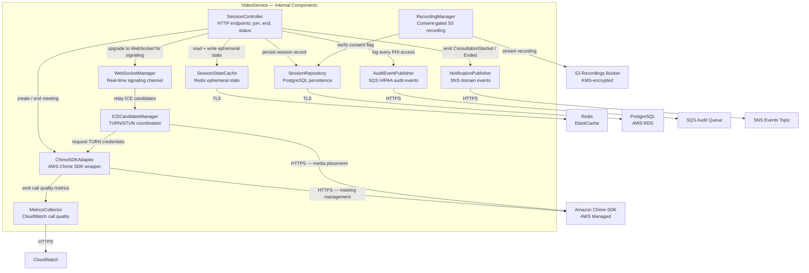
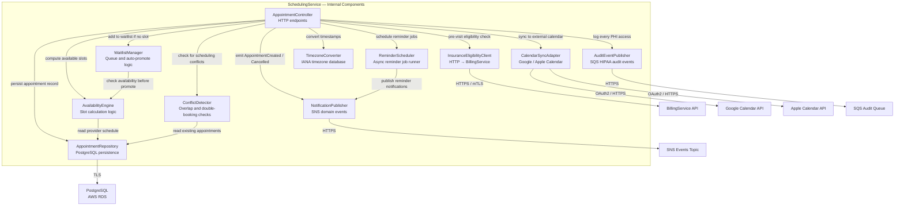
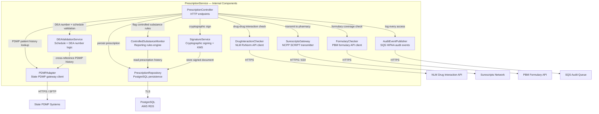
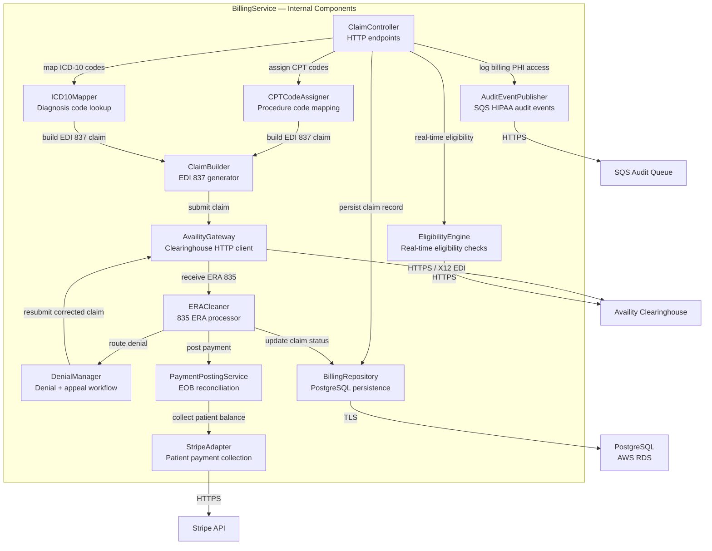

# Component Diagrams — Telemedicine Platform

## Overview

This document captures the internal component structure of the four core backend services in the Telemedicine Platform: **VideoService**, **SchedulingService**, **PrescriptionService**, and **BillingService**. Each diagram maps responsibilities, intra-service dependencies, and external integration points.

Component boundaries are designed around the principle of **minimum necessary access**: no component holds more data or capabilities than required for its single purpose. All PHI-touching components route access through an `AuditEventPublisher` before any data leaves the service. External system adapters encapsulate protocol and credential details, keeping core business logic clean and independently testable.

Arrows are labeled with the semantic purpose of the relationship, not the transport protocol, except where the protocol itself is a security constraint (TLS, mTLS, HTTPS).

---

## VideoService Component Diagram

The VideoService owns the lifecycle of a video consultation session. It uses Amazon Chime SDK for managed WebRTC infrastructure, Redis for ephemeral session state, PostgreSQL for durable session records, and SQS/SNS for audit and domain event publication. Recording is consent-gated — the `RecordingManager` checks the patient's explicit recording consent flag before initiating any capture.

---

## SchedulingService Component Diagram

The SchedulingService coordinates appointment booking across multiple dimensions: provider availability calculation, double-booking prevention, insurance eligibility pre-checks, external calendar synchronisation, and automated patient reminders. It delegates eligibility verification to the BillingService via a dedicated HTTP client rather than replicating insurance logic.

---

## PrescriptionService Component Diagram

The PrescriptionService manages the full e-prescription lifecycle: drug interaction screening, DEA schedule validation, state PDMP lookups for controlled substance history, insurance formulary checking, cryptographic signing of the prescription document, and transmission to pharmacies via the Surescripts network using the NCPDP SCRIPT standard.

---

## BillingService Component Diagram

The BillingService covers the full revenue cycle: real-time eligibility verification, CPT/ICD-10 coding, EDI 837 claim construction, clearinghouse submission via Availity, ERA (835) ingestion and payment posting, denial management with appeal workflows, and patient balance collection via Stripe.

---

## Component Interaction Patterns

### Synchronous Calls

Components that require an immediate response before the request can continue use synchronous in-process calls or blocking HTTP with enforced timeouts and circuit breakers.

| Caller | Callee | Transport | Timeout | Circuit Breaker |
|--------|--------|-----------|---------|-----------------|
| AppointmentController | InsuranceEligibilityClient | HTTP / mTLS | 5 s | Half-open after 30 s |
| PrescriptionController | DrugInteractionChecker | HTTPS | 3 s | Half-open after 20 s |
| PrescriptionController | DEAValidationService | In-process | < 100 ms | N/A |
| PrescriptionController | FormularyChecker | HTTPS | 4 s | Half-open after 30 s |
| SessionController | ChimeSDKAdapter | In-process | 2 s | N/A |
| ClaimController | EligibilityEngine | In-process | 8 s | N/A |
| EligibilityEngine | AvailityGateway | HTTPS | 8 s | Half-open after 60 s |

### Asynchronous Events

Components that do not need to block the caller publish events to SNS/SQS. Consumers process events independently, allowing services to remain decoupled across failure boundaries.

| Publisher | Event Name | Primary Consumers |
|-----------|-----------|-------------------|
| AuditEventPublisher (all services) | `phi.accessed` | AuditService (SQS) |
| NotificationPublisher (Scheduling) | `appointment.created` | NotificationService |
| NotificationPublisher (Scheduling) | `appointment.cancelled` | NotificationService, VideoService |
| NotificationPublisher (Video) | `consultation.started` | BillingService |
| NotificationPublisher (Video) | `consultation.ended` | BillingService, MedicalRecordsService |
| ControlledSubstanceMonitor | `controlled.rx.issued` | ComplianceService |
| ERACleaner | `claim.paid` | AccountsReceivable ledger |
| ReminderScheduler | `appointment.reminder` | NotificationService |

---

## Component Failure Modes

| Component | Failure Mode | Service Impact | Recovery Strategy |
|-----------|-------------|----------------|-------------------|
| ChimeSDKAdapter | AWS Chime API timeout / 5xx | Video session cannot start | Circuit breaker opens; route to Twilio Video fallback via feature flag |
| SessionStateCache | Redis cluster unavailable | Higher latency; cache misses on every call | Degrade gracefully; fall back to SessionRepository reads; page on-call |
| AuditEventPublisher | SQS unavailable | PHI access cannot be recorded | **Fail-closed**: reject request with 503; write to local dead-letter file; trigger PagerDuty P1 |
| SessionRepository | PostgreSQL primary unavailable | Sessions cannot be persisted or retrieved | Return 503; retry with exponential backoff (3 attempts, jitter); fail open to read replica for reads |
| RecordingManager | S3 bucket unreachable | Recording cannot be stored | Allow call without recording; display in-session banner to both parties; log incident ticket |
| AvailityGateway | Clearinghouse down | Claims cannot be submitted | Queue claims in DenialManager retry queue; auto-retry at 1-hour intervals; alert billing team |
| SurescriptsGateway | Network failure | Prescription cannot be transmitted | Enqueue for manual fax fallback; alert prescribing physician via notification |
| DrugInteractionChecker | NLM API down | Interaction check unavailable | Fail-open with prominent prescriber warning banner; log unavailability in audit trail |
| PDMPAdapter | State system unreachable | PDMP history unavailable | Block controlled substance prescriptions (fail-closed); allow non-controlled; alert compliance officer |
| ConflictDetector | In-process exception | Risk of double-booking | Fail-closed: reject booking; log error; alert ops; do not degrade silently |
| InsuranceEligibilityClient | BillingService unreachable | Pre-visit eligibility unavailable | Allow booking with "eligibility pending" status; retry at appointment reminder time |
| FormularyChecker | PBM API timeout | Formulary coverage unknown | Warn prescriber; allow prescription with manual coverage note required |

---

## Testing Approach

### Unit Test Boundaries

Each component is tested in isolation with its direct collaborators mocked at the interface boundary.

| Component | Test Framework | Mocking Strategy |
|-----------|---------------|------------------|
| SessionController | Jest + Supertest | Mock ChimeSDKAdapter, SessionRepository, AuditEventPublisher |
| ChimeSDKAdapter | Jest | Mock `@aws-sdk/client-chime-sdk-meetings` with jest.mock |
| RecordingManager | Jest | Mock S3 client; mock SessionRepository consent flag |
| AuditEventPublisher | Jest | Mock SQS `SendMessageCommand`; assert message envelope schema |
| AvailabilityEngine | Jest | No mocks — pure function; use property-based tests with fast-check |
| DrugInteractionChecker | Jest + nock | Mock NLM HTTP response with fixture JSON |
| ClaimBuilder | Jest | Compare EDI 837 output against known-good fixture files |
| ICD10Mapper | Jest | Use embedded ICD-10 lookup table; no I/O |
| TimezoneConverter | Jest | DST edge cases with `@date-fns/tz`; no mocks needed |
| ConflictDetector | Jest | Pure function; exhaustive boundary test cases |
| SignatureService | Jest | Mock KMS `SignCommand`; verify signature format |

### Integration Test Boundaries

Integration tests use Docker Compose with real PostgreSQL and Redis, plus LocalStack for AWS services (SQS, SNS, S3, CloudWatch). External HTTP services (Surescripts, Availity, NLM, state PDMP systems) are stubbed with WireMock. All integration tests run in CI on every pull request to `main`.

Contract tests using Pact verify the HTTP interface between InsuranceEligibilityClient (SchedulingService) and the BillingService eligibility endpoint, ensuring schema compatibility is caught before integration deployment.
