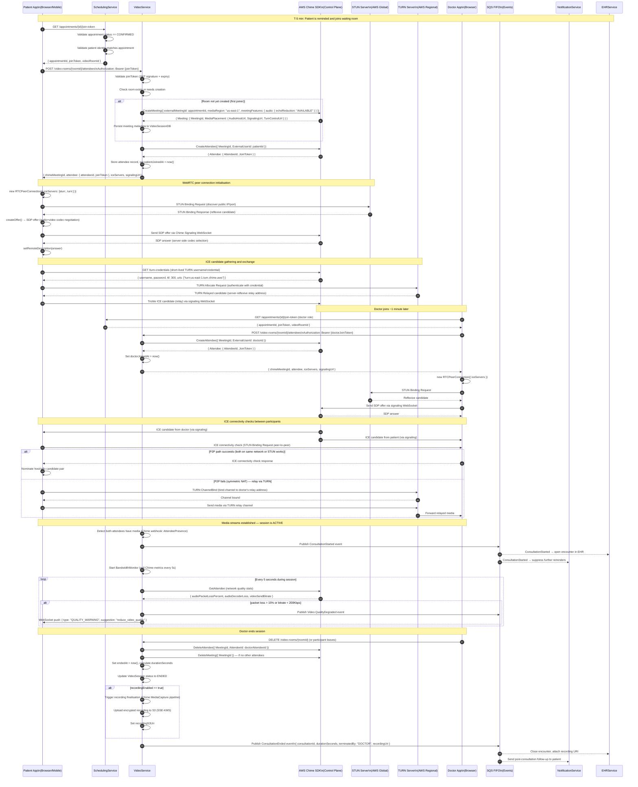
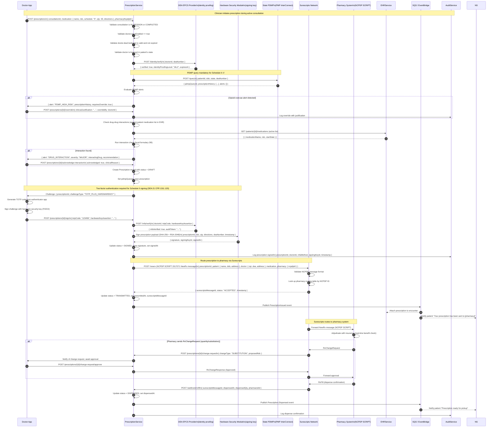
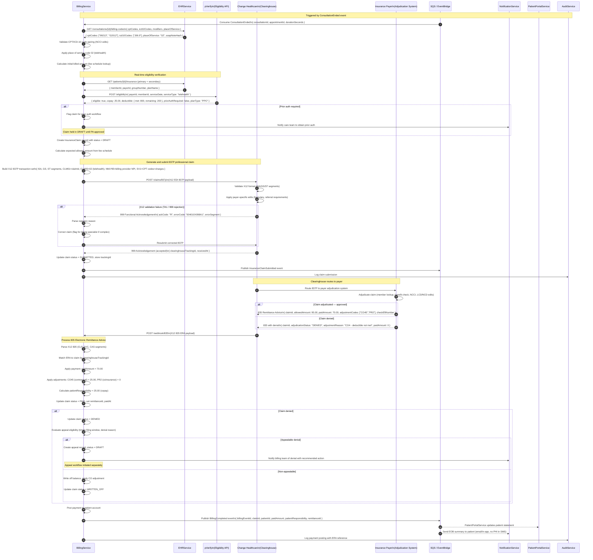

# Sequence Diagrams — Telemedicine Platform

This document contains three detailed sequence diagrams covering the most complex technical workflows in the Telemedicine Platform: WebRTC video consultation setup, DEA EPCS e-prescription compliance, and insurance claims processing.

---

## WebRTC Video Consultation Setup

This sequence covers the complete signaling and media establishment flow from a patient joining a scheduled consultation through to a stable bidirectional audio/video stream with the clinician. It includes Chime session creation, ICE negotiation (STUN/TURN), and the event trail published for downstream services.

---

## E-Prescription DEA EPCS Compliance

This sequence covers the full e-prescribing workflow for a Schedule II controlled substance, including DEA EPCS two-factor authentication, PDMP query, Surescripts routing, and pharmacy confirmation.

---

## Insurance Claims Processing

This sequence covers the complete revenue cycle from consultation completion through claim generation, eligibility verification, 837P submission, 835 remittance, and payment posting.

---

## Sequence Diagram Cross-References

| Sequence | Key SLO | Failure Modes Covered |
|---|---|---|
| WebRTC Video Consultation | Session established < 8 s; ICE completion < 3 s | STUN failure (fallback to TURN), bandwidth degradation, packet loss > 15% |
| E-Prescription DEA EPCS | Prescription transmitted < 30 s of clinician signature | PDMP timeout, EPCS outage, Surescripts rejection, pharmacy change request |
| Insurance Claims Processing | 837P submitted < 5 min of consultation end; ERA processed < 24 h | X12 validation failure, payer denial, clearinghouse downtime, ERA parsing error |

Detailed failure mode handling for each of these flows is documented in the `edge-cases/` directory.
