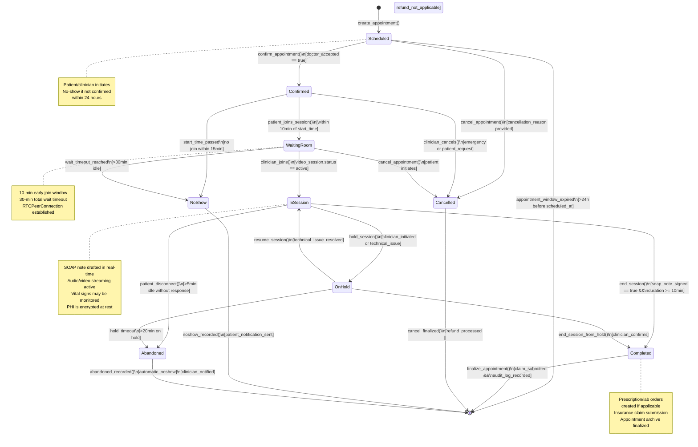
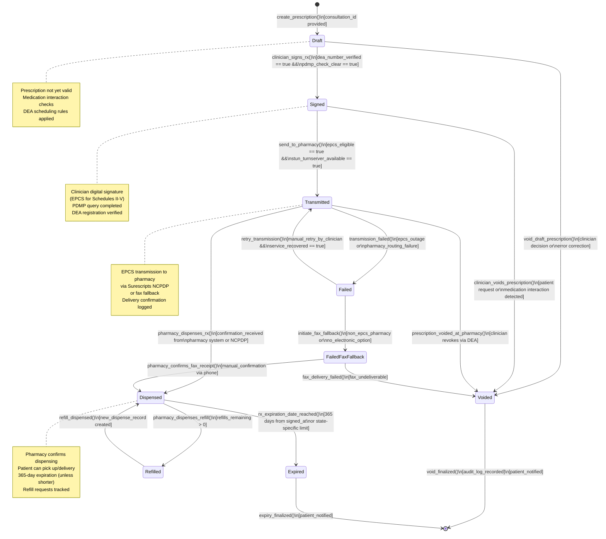
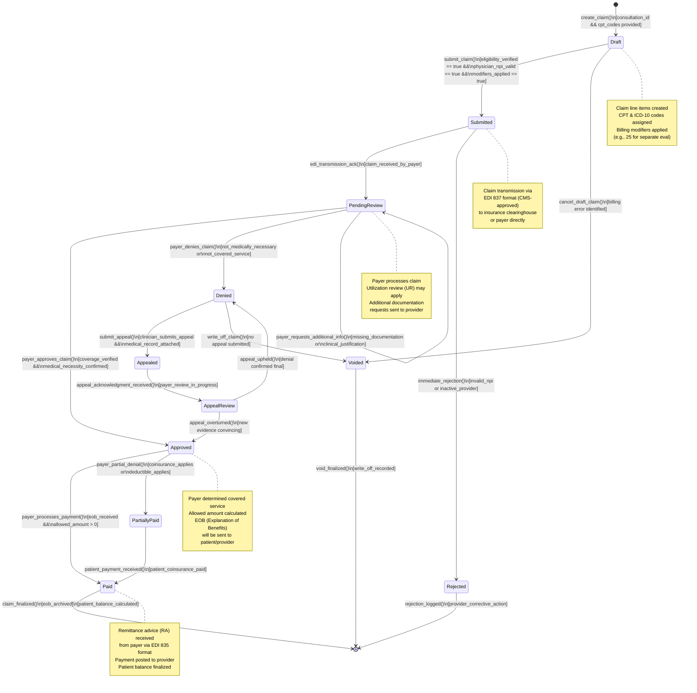
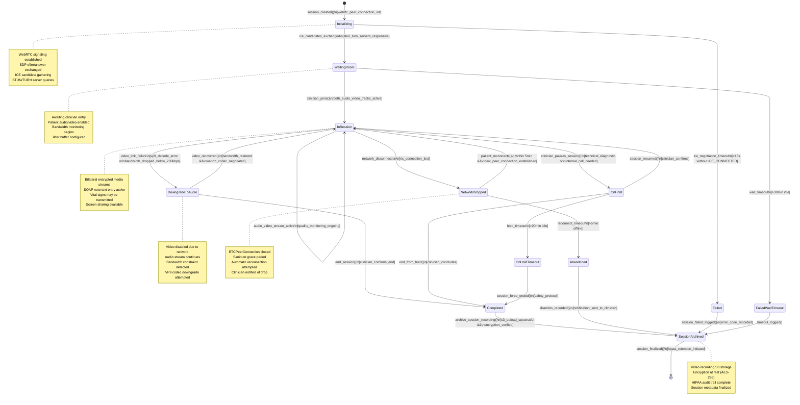

# Telemedicine Platform State Machine Diagrams

This document defines the formal state machines for critical telemedicine workflows: appointment lifecycle, prescription management, insurance claims processing, and video consultation sessions. Each state transition is guarded by business rules and HIPAA compliance requirements.

## 1. Appointment Lifecycle State Machine

### Appointment State Transition Details

- **Scheduled → Confirmed**: Triggered when doctor accepts appointment via mobile app or portal. Email confirmation sent to patient.
- **Scheduled → Cancelled**: Patient or doctor initiates cancellation before appointment window. Refund issued per telehealth provider policy.
- **Scheduled → NoShow**: Appointment start time passed and patient did not join within 15 minutes. Notification emails sent to both parties. Insurance may not reimburse.
- **Confirmed → WaitingRoom**: Patient joins video session URL 10 minutes before scheduled time. WebRTC connection initialized.
- **WaitingRoom → InSession**: Clinician joins session and SOAP note creation begins. Start time officially recorded.
- **InSession → OnHold**: Clinician pauses consultation for technical troubleshooting or brief interruption. Patient notified.
- **InSession → Completed**: Clinician signs off SOAP note, prescriptions finalized, consultation duration ≥10 minutes. Insurance claim created.
- **OnHold → InSession**: Technical issue resolved, clinician resumes consultation.
- **Completed/Cancelled/NoShow/Abandoned → [*]**: Final state where audit logs are committed, patient portal updated, and archive created.

---

## 2. Prescription State Machine

### Prescription State Transition Details

- **Draft → Signed**: Clinician verifies patient PDMP history is clear (no doctor shopping), confirms DEA number, and applies digital signature. Controlled substance prescriptions require EPCS compliance.
- **Draft → Voided**: Corrects medication errors or patient-requested changes before signing.
- **Signed → Transmitted**: For EPCS-eligible controlled substances (Schedules II-V), prescription routed via Surescripts to patient's preferred pharmacy. Non-controlled medications may be transmitted or printed.
- **Signed → Voided**: Clinician revokes after signing (e.g., patient allergy discovered) and notifies pharmacy via DEA revocation system.
- **Transmitted → Dispensed**: Pharmacy NCPDP system confirms receipt and dispensing. Patient notification sent.
- **Transmitted → Failed**: EPCS outage, Surescripts unavailable, or pharmacy routing error. Clinician may retry or initiate fax fallback.
- **Failed → FailedFaxFallback**: For non-EPCS pharmacies, prescription sent via fax with clinician signature image. Manual confirmation required.
- **FailedFaxFallback → Dispensed**: Pharmacy calls clinic to verbally confirm fax receipt and dispenses medication.
- **Dispensed → Expired**: Prescription valid for 365 days or state-specific shorter period. After expiration, no refills allowed.
- **Dispensed → Refilled**: Patient requests refill within refills_remaining count. New dispense record created per pharmacy, original prescription remains active.

---

## 3. Insurance Claim State Machine

### Insurance Claim State Transition Details

- **Draft → Submitted**: Clinician finalizes claim with ICD-10 diagnosis codes, CPT procedure codes, and billing modifiers. Eligibility verification completed. Claim converted to EDI 837 format and transmitted to insurance clearinghouse.
- **Draft → Voided**: Billing department identifies error (wrong patient, duplicate) and cancels before submission.
- **Submitted → PendingReview**: Clearinghouse acknowledges receipt and forwards to payer. Payer begins claim adjudication.
- **Submitted → Rejected**: Immediate rejection if NPI invalid or provider not in-network. No appeal process available; must correct and resubmit.
- **PendingReview → Approved**: Payer confirms coverage, verifies medical necessity, and approves payment. EOB generated.
- **PendingReview → Denied**: Service not covered per patient's plan, medical necessity not met, or out-of-network. Denial reason code recorded.
- **PendingReview → PendingReview**: Payer requests additional clinical documentation or medical record excerpts to complete review.
- **Approved → Paid**: Payer submits payment to provider bank account. Remittance advice (RA) includes line-item adjustments and patient balance.
- **Approved → PartiallyPaid**: Coinsurance applies (patient owes 20%), or deductible not yet met. Patient balance calculated.
- **PartiallyPaid → Paid**: Patient pays coinsurance or deductible. Claim fully resolved.
- **Denied → Appealed**: Clinician submits appeal with supporting clinical documentation within 30-180 days (varies by payer).
- **Appealed → AppealReview**: Payer acknowledges appeal and conducts independent review.
- **AppealReview → Approved**: Appeal evidence convinces payer; original denial overturned and claim paid.
- **AppealReview → Denied**: Payer upholds original denial; final determination.

---

## 4. Consultation Session State Machine

### Consultation Session State Transition Details

- **Initializing → WaitingRoom**: WebRTC peer connection successfully negotiates ICE candidates with STUN/TURN servers. Both patient and clinician audio/video tracks are configured.
- **Initializing → Failed**: ICE negotiation timeout (>15 seconds) without establishing connected state. Common cause: STUN/TURN server unreachable, firewall blocking UDP.
- **WaitingRoom → InSession**: Clinician successfully joins session. Audio and video streams become active. SOAP note creation begins. Bandwidth monitoring initialized.
- **WaitingRoom → FailedWaitTimeout**: Clinician does not join within 30 minutes. Patient kept waiting, automatic timeout for safety.
- **InSession → OnHold**: Clinician pauses consultation for brief internal call or technical troubleshooting. Audio/video remains but streaming halted.
- **InSession → DowngradeToAudio**: Video stream degradation detected (VP9 decoder error or bandwidth <200 Kbps). Audio continues while video disabled.
- **DowngradeToAudio → InSession**: Network bandwidth recovers; video codec re-negotiated and restored.
- **InSession → NetworkDropped**: Patient's network connection lost (RTCPeerConnection state changes to disconnected/failed). 5-minute grace period for automatic reconnection.
- **NetworkDropped → InSession**: Patient reconnects within 5 minutes and new WebRTC session established with same consultation context.
- **NetworkDropped → Abandoned**: Reconnection not attempted or fails after 5 minutes. Session ends with abandon status.
- **OnHold → InSession**: Clinician resumes session after technical issue resolved.
- **OnHold → OnHoldTimeout**: Consultation held >20 minutes without activity; automatic timeout triggers for patient safety.
- **Completed → SessionArchived**: Clinician confirms session end. Video recording uploaded to S3 with AES-256 encryption. Audit log committed.
- **SessionArchived → [*]**: Final state. HIPAA retention policy applied; session may be auto-deleted after 6 years (or per state regulation).

---

## 5. Summary of Guard Conditions

All state transitions are guarded by conditions that enforce HIPAA compliance, data integrity, and clinical safety:

| Guard Condition | Purpose | Enforced By |
|---|---|---|
| `hipaa_retention_initiated` | Ensures records kept per 45 CFR 164.530(j) (6-year minimum) | Compliance controller |
| `phi_encrypted_at_rest` | All PHI encrypted before storage (AES-256) | Data encryption service |
| `audit_log_recorded` | Action logged with user ID, timestamp, action code, PHI access flag | Audit logging middleware |
| `dea_number_verified` | NPI/DEA number valid and active in NPI Registry or DEA CSOS | External DEA verification API |
| `pdmp_check_clear` | Patient's PDMP report shows no opioid prescriptions from other doctors | PDMP Query Service (per state) |
| `ice_candidates_exchanged` | WebRTC ICE negotiation successful (candidates gathered) | RoomManager (AWS Chime SDK) |
| `video_session.status == active` | Peer connection in CONNECTED state; media flowing | WebRTC adapter |
| `soap_note_signed` | Clinician applied digital signature to clinical note | SOAP note signer service |
| `claim_submitted` | EDI 837 claim transmission acknowledged by clearinghouse | Claims API |
| `epcs_eligible` | Medication schedule and DEA verification support electronic prescribing | DEA schedules database |
| `stun_turnserver_available` | STUN/TURN servers responding within SLA | ICE server provider |
| `eob_received` | Payer EOB (EDI 835) received and parsed successfully | Claims API |
| `s3_upload_successful` | Video recording persisted to S3 with redundancy | Session recording service |

All transitions are also subject to HIPAA audit logging: every state change is recorded with actor, timestamp, resource ID, and PHI access indicator.
