# Architecture Diagram — Telemedicine Platform

This document describes the microservices architecture of the Telemedicine Platform. The platform is designed for HIPAA compliance, high availability (99.99% SLA for video infrastructure), and horizontal scalability to support thousands of concurrent video consultations.

---

## Architectural Principles

- **Domain-driven decomposition**: Each bounded context maps to exactly one microservice. Services own their data stores and expose capabilities only through well-defined APIs.
- **Event-driven asynchrony**: Services communicate asynchronously via SQS/EventBridge for all non-real-time workflows, reducing coupling and improving resilience.
- **HIPAA compliance by design**: PHI never transits in plain text. All service-to-service communication uses mTLS. PHI fields are encrypted at the application layer with AWS KMS in addition to TLS in transit.
- **Zero-trust networking**: No service is trusted by network position alone. All requests carry a short-lived JWT signed by the internal identity provider; services verify signatures before processing.
- **Multi-region active-active for video**: AWS Chime global meetings ensure video consultations survive a regional failure without interruption.
- **Observability first**: Every service emits structured logs (JSON), metrics (CloudWatch EMF), and traces (AWS X-Ray). A unified OpenTelemetry collector aggregates all signals.

---

## System Overview Diagram

```mermaid
flowchart TD
    subgraph ClientLayer["Client Applications"]
        WEB["Web App\n(React + TypeScript)"]
        MOB["Mobile App\n(React Native iOS/Android)"]
        ADM["Admin Portal\n(React)"]
    end

    subgraph Gateway["API & Security Layer"]
        APIGW["API Gateway\n(Kong)"]
        WAF["AWS WAF\n(OWASP rules)"]
        AUTH["Auth Service\n(OAuth 2.0 / SMART on FHIR)"]
        RATELIMIT["Rate Limiter\n(Redis token bucket)"]
    end

    subgraph CoreServices["Core Microservices"]
        SCHED["SchedulingService\n(NestJS)"]
        VIDEO["VideoService\n(Go)"]
        RX["PrescriptionService\n(Java Spring Boot)"]
        BILLING["BillingService\n(Python FastAPI)"]
        EHR["EHRService\n(Java Spring Boot)"]
        NOTIFY["NotificationService\n(Node.js)"]
        PORTAL["PatientPortalService\n(NestJS)"]
        ANALYTICS["AnalyticsService\n(Python)"]
        EMERGENCY["EmergencyService\n(Go — ultra-low latency)"]
    end

    subgraph Messaging["Message Broker"]
        SQS["AWS SQS FIFO\n(per-patient ordering)"]
        EB["EventBridge\n(fan-out routing)"]
        SNS["Amazon SNS\n(push notifications)"]
    end

    subgraph DataStores["Data Persistence"]
        PGSCH["PostgreSQL\nSchedulingDB"]
        PGVID["PostgreSQL\nVideoSessionDB"]
        PGRX["PostgreSQL\nPrescriptionDB"]
        PGBILL["PostgreSQL\nBillingDB"]
        PGEHR["PostgreSQL\nEHRDB (PHI encrypted)"]
        REDIS["Redis Cluster\n(session cache, idempotency keys)"]
        S3["S3\n(recordings, medical records)"]
        DYNAMO["DynamoDB\n(notification state)"]
    end

    subgraph ExternalIntegrations["External Integrations"]
        CHIME["AWS Chime SDK\n(global video)"]
        SURES["Surescripts\n(pharmacy routing)"]
        PVERIFY["pVerify\n(insurance eligibility)"]
        PDMP["State PDMP\n(controlled substance registry)"]
        HGORILLA["Health Gorilla\n(lab orders / FHIR)"]
        TWILIO["Twilio\n(SMS / voice fallback)"]
        CHANGE["Change Healthcare\n(837P/835 clearinghouse)"]
        EPIC["Epic FHIR API\n(EHR integration)"]
    end

    subgraph Observability["Observability & Compliance"]
        OTEL["OpenTelemetry Collector"]
        CW["CloudWatch\n(metrics, logs, alarms)"]
        XRAY["AWS X-Ray\n(distributed tracing)"]
        CT["CloudTrail\n(API audit log)"]
        SIEM["SIEM\n(Splunk / security events)"]
        MACIE["Amazon Macie\n(PHI detection in S3)"]
    end

    WEB & MOB & ADM -->|HTTPS| WAF
    WAF -->|filtered traffic| APIGW
    APIGW -->|JWT validation| AUTH
    APIGW -->|rate check| RATELIMIT
    APIGW -->|mTLS| SCHED & VIDEO & RX & BILLING & EHR & NOTIFY & PORTAL & ANALYTICS & EMERGENCY

    SCHED -->|publish| EB
    VIDEO -->|publish| EB
    RX -->|publish| EB
    BILLING -->|publish| EB
    EHR -->|publish| EB
    EMERGENCY -->|publish| EB

    EB -->|route| SQS
    SQS -->|consume| SCHED & VIDEO & RX & BILLING & EHR & NOTIFY & ANALYTICS & EMERGENCY

    NOTIFY -->|push| SNS
    SNS -->|deliver| TWILIO

    SCHED --- PGSCH
    VIDEO --- PGVID
    RX --- PGRX
    BILLING --- PGBILL
    EHR --- PGEHR
    NOTIFY --- DYNAMO
    VIDEO --- S3
    EHR --- S3

    SCHED & VIDEO & RX & BILLING & EHR & PORTAL & ANALYTICS & EMERGENCY --- REDIS

    VIDEO -->|WebRTC sessions| CHIME
    RX -->|e-Rx routing| SURES
    RX -->|PDMP check| PDMP
    BILLING -->|eligibility| PVERIFY
    BILLING -->|837P / 835| CHANGE
    EHR -->|lab orders| HGORILLA
    EHR -->|patient records| EPIC

    SCHED & VIDEO & RX & BILLING & EHR & NOTIFY & PORTAL & ANALYTICS & EMERGENCY -->|telemetry| OTEL
    OTEL --> CW & XRAY
    APIGW & AUTH -->|API calls| CT
    CT --> SIEM
    S3 --> MACIE
```

---

## Service Descriptions

### SchedulingService

Manages appointment slots, provider availability calendars, and booking lifecycle. Integrates with the patient-facing portal for slot discovery and with NotificationService for reminders.

- **Technology**: NestJS (TypeScript), PostgreSQL, Redis (availability cache)
- **Key APIs**: `POST /appointments`, `GET /slots`, `PATCH /appointments/{id}/cancel`
- **Events produced**: `AppointmentBooked`, `AppointmentCancelled`, `AppointmentRescheduled`
- **Scaling**: Horizontal auto-scaling. Availability cache served from Redis to avoid DB contention during peak booking windows.
- **Compliance**: Appointment records are not PHI per se but link to patient records; access is controlled via RBAC.

### VideoService

Orchestrates WebRTC video sessions using AWS Chime SDK. Handles signaling, room lifecycle, ICE server provisioning, adaptive bitrate monitoring, and session recording.

- **Technology**: Go, AWS Chime SDK, PostgreSQL, S3
- **Key APIs**: `POST /video-rooms`, `GET /video-rooms/{id}/token`, `DELETE /video-rooms/{id}`
- **Events produced**: `ConsultationStarted`, `ConsultationEnded`, `Video.RecordingCompleted`, `Video.ParticipantJoined`, `Video.ParticipantLeft`
- **Scaling**: Stateless; session state in Redis. Chime meetings are globally distributed.
- **Compliance**: Session recordings encrypted with KMS CMK before S3 upload. Recording requires explicit patient consent stored in EHRService. Recordings deleted after 7 years per HIPAA minimum.

### PrescriptionService (DEA EPCS)

Handles the full e-prescribing lifecycle including DEA Electronic Prescriptions for Controlled Substances (EPCS) identity proofing, two-factor authentication for Schedule II–V drugs, PDMP queries, and Surescripts routing.

- **Technology**: Java Spring Boot, PostgreSQL, HSM (hardware security module for DEA signing)
- **Key APIs**: `POST /prescriptions`, `GET /prescriptions/{id}`, `POST /prescriptions/{id}/void`
- **Events produced**: `PrescriptionIssued`, `PrescriptionVoided`, `Prescription.PDMPAlertRaised`
- **External integrations**: Surescripts (NCPDP SCRIPT 2017071), state PDMP APIs (PMP InterConnect), DEA EPCS-certified identity proofing vendor
- **Compliance**: Audit log of every prescribing action stored immutably. DEA regulations require logical access controls and two-factor authentication for controlled substance prescribing (21 CFR Part 1311).

### BillingService (CPT / ICD-10)

Generates professional claims (837P), verifies insurance eligibility, processes remittance advice (835 ERA), and calculates patient responsibility.

- **Technology**: Python FastAPI, PostgreSQL, Change Healthcare clearinghouse
- **Key APIs**: `POST /claims`, `GET /claims/{id}`, `POST /claims/{id}/appeal`
- **Events produced**: `InsuranceClaimSubmitted`, `BillingCompleted`, `Billing.PaymentFailed`, `Billing.AppealInitiated`
- **External integrations**: pVerify (real-time eligibility), Change Healthcare (clearinghouse), Stripe (patient payments)
- **Compliance**: PCI DSS for payment card data (Stripe handles card tokenisation, never stored in platform). HIPAA for claim-level PHI.

### EHRService

Manages clinical records: SOAP notes, ICD-10/CPT coding, lab orders, vital signs, and allergy/medication lists. Integrates with external EHR systems via FHIR R4.

- **Technology**: Java Spring Boot, PostgreSQL (column-level encryption for PHI), S3 (documents)
- **Key APIs**: `POST /encounters`, `POST /soap-notes`, `GET /patients/{id}/chart`, `POST /lab-orders`
- **Events produced**: `LabOrderCreated`, `LabResultReceived`, `EHR.RecordExported`
- **External integrations**: Epic FHIR API, Health Gorilla (lab routing), CommonWell / Carequality (health information exchange)
- **Compliance**: HIPAA minimum necessary standard enforced at query level. All PHI columns encrypted with AES-256-GCM, keys managed in AWS KMS. Break-glass access for emergency with full audit trail.

### NotificationService

Delivers multi-channel notifications (email via SES, SMS via Twilio, push via FCM/APNs, in-app via WebSocket).

- **Technology**: Node.js, DynamoDB (notification state), SQS (fan-out)
- **Key APIs**: `POST /notifications` (internal only), `GET /notifications/preferences`
- **Events consumed**: All domain events with a notification implication
- **Compliance**: SMS and email content must not include PHI per HIPAA guidance. Notifications reference appointment IDs, not clinical details.

### PatientPortalService

BFF (Backend for Frontend) aggregating data from multiple services into patient-facing views: dashboard, appointment history, billing statements, medical record download.

- **Technology**: NestJS (TypeScript), Redis (session)
- **Key APIs**: `GET /dashboard`, `GET /appointments`, `GET /billing/statements`
- **Compliance**: All data returned is filtered to the authenticated patient's records only. RBAC enforced at every aggregation call. Session tokens expire in 30 minutes with silent refresh.

### AnalyticsService

Aggregates de-identified event data for operational dashboards, population health insights, and quality reporting (HEDIS, MIPS).

- **Technology**: Python, Redshift (warehouse), Kinesis Data Firehose
- **Compliance**: De-identification per HIPAA Expert Determination method (§164.514(b)). Raw PHI never written to analytics store. Cell suppression applied when cohort size < 11.

### EmergencyService

Low-latency service responsible for detecting and acting on life-safety events during consultations. Integrates with PSAP (Public Safety Answering Points) for 911 dispatch and with on-call physician routing.

- **Technology**: Go (chosen for sub-millisecond latency), Redis (real-time patient location cache)
- **Key APIs**: `POST /emergency/escalate`, `GET /emergency/{id}/status`
- **Events produced**: `EmergencyEscalated`, `Emergency.Resolved`, `Emergency.FalseAlarm`
- **Compliance**: Patient location data is treated as sensitive PHI and is encrypted at rest. Location is cached for maximum 30 minutes in Redis (TTL enforced).

---

## Security Architecture

### Network Security

- All external traffic terminates at AWS WAF + ALB before reaching Kong API Gateway.
- Services run in private VPC subnets with no public IP addresses.
- Service-to-service communication uses mTLS with certificates issued by AWS Private CA (rotated every 90 days).
- VPC flow logs enabled and shipped to SIEM for anomaly detection.

### HIPAA PHI Encryption

| Layer | Mechanism |
|---|---|
| In transit (external) | TLS 1.3 (ECDHE, minimum AES-128-GCM) |
| In transit (internal) | mTLS with AWS Private CA certificates |
| At rest (database) | PostgreSQL column-level encryption (pgcrypto + KMS) for PHI columns |
| At rest (S3) | SSE-KMS with customer-managed CMK |
| Application layer | AES-256-GCM for highest-sensitivity fields (DEA number, MRN, SSN) |
| Key management | AWS KMS with automatic annual rotation; HSM for DEA signing keys |

### Identity and Access

- Clinician authentication: TOTP MFA mandatory, hardware key (YubiKey) required for EPCS signing.
- Patient authentication: Email/SMS OTP, optional FIDO2 passkey.
- Service identity: IAM roles with least-privilege policies; no long-lived credentials.
- Break-glass access: Audit-logged, time-limited role assumption for emergency clinical access.

### Audit Logging (CloudTrail)

Every API call through Kong is logged to CloudTrail with: caller identity, resource ARN, action, timestamp, source IP. Logs are immutable (S3 Object Lock), replicated to a separate AWS account to prevent tampering by a compromised workload account.

---

## External Integration Map

| Integration | Protocol | Data Exchanged | Compliance |
|---|---|---|---|
| Surescripts (Pharmacy) | NCPDP SCRIPT 2017071 / HTTPS | Prescription routing, refill requests, drug history | DEA 21 CFR 1311, NCPDP standards |
| pVerify (Insurance Eligibility) | REST / HTTPS | Member eligibility, benefit details | HIPAA BAA required |
| Health Gorilla (Labs) | FHIR R4 / HTTPS | Lab orders (LOINC), results (HL7 2.5.1) | HIPAA BAA required |
| State PDMP (Controlled Substances) | PMP InterConnect / SOAP | Prescription history for scheduled drugs | State law (varies by state) |
| Change Healthcare (Clearinghouse) | X12 EDI 837P / 835 | Claims submission, remittance | HIPAA Transaction Standards |
| AWS Chime (Video) | SDK / HTTPS + WebRTC | Video session tokens, media negotiation | AWS HIPAA-eligible service |
| Epic FHIR (EHR) | FHIR R4 / HTTPS | Patient demographics, clinical records | HIPAA BAA, ONC Cures Act §171 |
| Twilio (SMS/Voice) | REST / HTTPS | Appointment reminders (no PHI content) | HIPAA BAA required |

---

## Deployment Topology

The platform is deployed across two AWS regions (us-east-1 primary, us-west-2 DR) using multi-region active-standby for all services except VideoService (active-active via Chime global meetings) and EmergencyService (active-active for life-safety).

- **ECS Fargate** for all stateless microservices (auto-scaling groups, 2–50 tasks per service)
- **RDS Aurora PostgreSQL** with Multi-AZ in primary region, cross-region read replica in DR
- **ElastiCache Redis** with cluster mode enabled (6 shards, 2 replicas each)
- **S3 Cross-Region Replication** for medical records and session recordings
- **Route 53** health-check failover for API Gateway endpoints
- **AWS Certificate Manager** for TLS certificate lifecycle; 60-day renewal automation
