# C4 Context and Container Diagrams — Telemedicine Platform

This document contains two levels of the C4 model for the Telemedicine Platform: the System Context diagram (level 1) and the Container diagram (level 2). Together they communicate who uses the system, what external systems it depends on, and how the platform is decomposed into deployable units.

---

## C4 Context Diagram

The context diagram shows the Telemedicine Platform as a single black box in the centre of its ecosystem. It identifies all human actors and external systems that interact with the platform, and the nature of each interaction.

```mermaid
C4Context
    title System Context — Telemedicine Platform

    Person(patient, "Patient", "A registered patient who books and attends video consultations, reviews their medical history, and manages billing through the patient portal.")

    Person(doctor, "Doctor / Clinician", "A licensed medical professional who conducts video consultations, writes SOAP notes, issues e-prescriptions, orders lab tests, and reviews patient charts.")

    Person(pharmacist, "Pharmacist", "A licensed pharmacist at a retail or mail-order pharmacy who receives e-prescriptions via Surescripts and fulfils medication orders.")

    Person(insurancePayer, "Insurance Payer", "A health insurance company (commercial or government payer) that receives 837P claims, adjudicates them, and returns 835 remittance advice.")

    Person(labProvider, "Lab Provider", "A clinical laboratory (e.g., Quest, LabCorp via Health Gorilla) that receives lab orders and returns results in FHIR or HL7 2.5.1 format.")

    Person(emergencyServices, "Emergency Services (PSAP)", "A Public Safety Answering Point (911 dispatch) that receives patient location and emergency details when a life-safety event is detected during a consultation.")

    Person(stateRegulator, "State Regulator / PDMP", "State health regulatory bodies and Prescription Drug Monitoring Programs that receive controlled-substance reporting and provide drug history queries.")

    Person(adminUser, "Admin User", "A clinic administrator or platform operator who manages provider rosters, clinic configurations, billing settings, and compliance reports.")

    System(telemedicine, "Telemedicine Platform", "A HIPAA-compliant cloud-based platform enabling video consultations, e-prescribing (DEA EPCS), insurance billing, EHR integration, and patient engagement.")

    System_Ext(surescripts, "Surescripts Network", "National pharmacy routing network. Receives NCPDP SCRIPT e-prescriptions and relays them to the patient's chosen pharmacy.")

    System_Ext(pVerify, "pVerify", "Real-time insurance eligibility verification API. Returns benefit details, co-pay amounts, and prior-auth requirements.")

    System_Ext(healthGorilla, "Health Gorilla", "Health information network providing FHIR-based lab order routing and result retrieval from 2,000+ labs.")

    System_Ext(pdmp, "State PDMP (PMP InterConnect)", "Multi-state prescription drug monitoring program. Provides controlled-substance prescription history for clinical decision support.")

    System_Ext(chime, "AWS Chime SDK", "Cloud video infrastructure providing WebRTC session management, STUN/TURN servers, and global media routing.")

    System_Ext(epic, "Epic FHIR API", "Health system EHR. Provides and receives patient demographics, clinical notes, and medication reconciliation data via FHIR R4.")

    System_Ext(changeHealthcare, "Change Healthcare", "EDI clearinghouse that translates and routes 837P professional claims to payers, and returns 835 ERA remittance files.")

    System_Ext(twilio, "Twilio", "Cloud communications platform. Sends appointment reminder SMS and voice calls with no PHI content.")

    Rel(patient, telemedicine, "Books appointments, joins video consultations, views records and bills", "HTTPS / React Web / React Native Mobile")
    Rel(doctor, telemedicine, "Conducts consultations, writes notes, prescribes, orders labs", "HTTPS / Web Portal")
    Rel(pharmacist, telemedicine, "Receives e-prescriptions, sends dispense confirmations", "Surescripts / NCPDP SCRIPT")
    Rel(insurancePayer, telemedicine, "Receives claims, returns remittance advice", "X12 EDI via Change Healthcare")
    Rel(labProvider, telemedicine, "Receives lab orders, returns results", "FHIR R4 via Health Gorilla")
    Rel(emergencyServices, telemedicine, "Receives 911 dispatch requests with patient location", "REST API / Phone")
    Rel(stateRegulator, telemedicine, "Receives controlled-substance reports, provides drug history", "PMP InterConnect / SOAP")
    Rel(adminUser, telemedicine, "Configures platform, manages providers, reviews compliance", "HTTPS / Admin Portal")

    Rel(telemedicine, surescripts, "Routes e-prescriptions to pharmacies", "NCPDP SCRIPT 2017071 / HTTPS")
    Rel(telemedicine, pVerify, "Verifies patient insurance eligibility", "REST / HTTPS")
    Rel(telemedicine, healthGorilla, "Routes lab orders, retrieves results", "FHIR R4 / HTTPS")
    Rel(telemedicine, pdmp, "Queries patient controlled-substance history", "PMP InterConnect / SOAP / HTTPS")
    Rel(telemedicine, chime, "Creates and manages WebRTC video sessions", "AWS SDK / WebRTC")
    Rel(telemedicine, epic, "Reads/writes patient clinical records", "FHIR R4 / HTTPS")
    Rel(telemedicine, changeHealthcare, "Submits 837P claims, receives 835 remittance", "X12 EDI / HTTPS")
    Rel(telemedicine, twilio, "Sends appointment SMS/voice reminders", "REST / HTTPS")
```

---

## C4 Container Diagram

The container diagram decomposes the Telemedicine Platform into its individually deployable units. Each container represents a process or data store that can be deployed, scaled, and updated independently.

```mermaid
C4Container
    title Container Diagram — Telemedicine Platform

    Person(patient, "Patient", "Uses web or mobile app to access care")
    Person(doctor, "Doctor", "Uses web portal to conduct consultations and prescribe")
    Person(adminUser, "Admin User", "Manages platform via admin portal")

    System_Ext(surescripts, "Surescripts", "Pharmacy routing network")
    System_Ext(pVerify, "pVerify", "Insurance eligibility")
    System_Ext(healthGorilla, "Health Gorilla", "Lab routing")
    System_Ext(chime, "AWS Chime SDK", "Video infrastructure")
    System_Ext(changeHealthcare, "Change Healthcare", "Claims clearinghouse")
    System_Ext(twilio, "Twilio", "SMS / voice")
    System_Ext(epic, "Epic FHIR", "EHR integration")
    System_Ext(pdmp, "State PDMP", "Drug monitoring")

    Container_Boundary(telemedicine, "Telemedicine Platform") {

        Container(webApp, "Web Application", "React 18 + TypeScript + Vite", "Single-page application served from CloudFront. Provides patient portal, clinician workspace, and admin console. Communicates with services via API Gateway.")

        Container(mobileApp, "Mobile Application", "React Native (iOS + Android)", "Cross-platform mobile app for patients. Supports video consultations via WebRTC, push notifications (FCM/APNs), and biometric authentication.")

        Container(apiGateway, "API Gateway", "Kong 3.x", "Single entry point for all client traffic. Enforces JWT authentication, rate limiting, request transformation, and mTLS for upstream service calls. Routes to appropriate microservice.")

        Container(schedulingService, "SchedulingService", "NestJS / TypeScript", "Manages provider availability calendars, appointment booking, rescheduling, and cancellation. Integrates with Redis for slot availability caching.")

        Container(videoService, "VideoService", "Go 1.22", "Orchestrates WebRTC video sessions via AWS Chime SDK. Manages room lifecycle, ICE server provisioning, adaptive bitrate, session recording, and participant events.")

        Container(prescriptionService, "PrescriptionService", "Java 21 / Spring Boot 3", "E-prescribing with DEA EPCS compliance. Manages prescription lifecycle: draft → signed → transmitted → dispensed. Integrates with PDMP and Surescripts.")

        Container(billingService, "BillingService", "Python 3.12 / FastAPI", "Generates 837P claims, verifies eligibility via pVerify, processes 835 remittance, calculates patient responsibility, and manages payment plans.")

        Container(ehrService, "EHRService", "Java 21 / Spring Boot 3", "Manages SOAP notes, ICD-10/CPT codes, lab orders, vital signs, allergy lists, and medication reconciliation. Exposes FHIR R4 endpoints for external EHR integration.")

        Container(notificationService, "NotificationService", "Node.js 20", "Multi-channel notification delivery: email (SES), SMS (Twilio), push (SNS), and WebSocket in-app alerts. Manages notification preferences and delivery state.")

        Container(patientPortalService, "PatientPortalService", "NestJS / TypeScript", "BFF (Backend for Frontend) aggregating data from multiple services into patient-optimised views: dashboard, appointments, billing, records.")

        Container(analyticsService, "AnalyticsService", "Python 3.12 / FastAPI", "Ingests de-identified events via Kinesis Firehose, aggregates into Redshift for operational dashboards, population health, and HEDIS/MIPS quality reporting.")

        Container(emergencyService, "EmergencyService", "Go 1.22", "Low-latency service handling life-safety events. Caches patient location in Redis, coordinates 911 dispatch, and routes to on-call clinicians.")

        ContainerDb(pgScheduling, "SchedulingDB", "PostgreSQL 16 (Aurora)", "Stores appointments, provider availability, clinic configurations. No PHI; links to patient by UUID only.")

        ContainerDb(pgVideo, "VideoSessionDB", "PostgreSQL 16 (Aurora)", "Stores video session metadata, participant records, quality metrics. Session recordings referenced by S3 URI.")

        ContainerDb(pgPrescription, "PrescriptionDB", "PostgreSQL 16 (Aurora)", "Stores prescription records with PHI columns encrypted (AES-256-GCM). Immutable audit trail table.")

        ContainerDb(pgBilling, "BillingDB", "PostgreSQL 16 (Aurora)", "Stores claims, remittance records, payment plans. PHI columns encrypted. PCI scope isolated.")

        ContainerDb(pgEHR, "EHRDB", "PostgreSQL 16 (Aurora)", "Stores patient clinical records, SOAP notes, lab results, vital signs. All rows PHI-classified; column-level encryption enforced.")

        ContainerDb(redis, "Redis Cluster", "ElastiCache Redis 7 (6 shards)", "Shared cache for: slot availability, session tokens, idempotency keys, patient location (emergency), rate-limit counters. TTL enforced on all PHI keys (≤30 min).")

        ContainerDb(s3Medical, "S3 Medical Records", "Amazon S3 (SSE-KMS)", "Stores encrypted session recordings, medical document attachments, exported patient records. Object Lock WORM for recordings. Macie scans for unencrypted PHI.")

        ContainerDb(sqs, "SQS FIFO Queues", "Amazon SQS FIFO", "Message broker for all asynchronous domain events. Per-patient message ordering. DLQ configured for all queues. EventBridge routes events to appropriate queues.")

        ContainerDb(dynamo, "NotificationStateDB", "DynamoDB", "Stores notification delivery state, preferences, and template configurations. PAX-compliant (no PHI in notification content).")
    }

    Rel(patient, webApp, "Uses", "HTTPS / browser")
    Rel(patient, mobileApp, "Uses", "HTTPS / native app")
    Rel(doctor, webApp, "Uses", "HTTPS / browser")
    Rel(adminUser, webApp, "Uses", "HTTPS / browser (admin role)")

    Rel(webApp, apiGateway, "API calls", "HTTPS / REST + WebSocket")
    Rel(mobileApp, apiGateway, "API calls", "HTTPS / REST + WebSocket")

    Rel(apiGateway, schedulingService, "Routes scheduling requests", "mTLS / HTTP/2")
    Rel(apiGateway, videoService, "Routes video session requests", "mTLS / HTTP/2")
    Rel(apiGateway, prescriptionService, "Routes prescription requests", "mTLS / HTTP/2")
    Rel(apiGateway, billingService, "Routes billing requests", "mTLS / HTTP/2")
    Rel(apiGateway, ehrService, "Routes clinical record requests", "mTLS / HTTP/2")
    Rel(apiGateway, patientPortalService, "Routes portal requests", "mTLS / HTTP/2")
    Rel(apiGateway, emergencyService, "Routes emergency requests", "mTLS / HTTP/2 (priority lane)")

    Rel(schedulingService, pgScheduling, "Reads/writes", "TLS / PostgreSQL")
    Rel(videoService, pgVideo, "Reads/writes", "TLS / PostgreSQL")
    Rel(prescriptionService, pgPrescription, "Reads/writes", "TLS / PostgreSQL")
    Rel(billingService, pgBilling, "Reads/writes", "TLS / PostgreSQL")
    Rel(ehrService, pgEHR, "Reads/writes", "TLS / PostgreSQL")
    Rel(notificationService, dynamo, "Reads/writes", "TLS / DynamoDB SDK")
    Rel(videoService, s3Medical, "Stores recordings", "TLS / S3 SDK")
    Rel(ehrService, s3Medical, "Stores documents", "TLS / S3 SDK")

    Rel(schedulingService, redis, "Caches availability", "TLS / Redis")
    Rel(videoService, redis, "Session state", "TLS / Redis")
    Rel(prescriptionService, redis, "Idempotency keys", "TLS / Redis")
    Rel(emergencyService, redis, "Patient location cache", "TLS / Redis")

    Rel(schedulingService, sqs, "Publishes events", "SQS SDK")
    Rel(videoService, sqs, "Publishes events", "SQS SDK")
    Rel(prescriptionService, sqs, "Publishes events", "SQS SDK")
    Rel(billingService, sqs, "Publishes/consumes events", "SQS SDK")
    Rel(ehrService, sqs, "Publishes/consumes events", "SQS SDK")
    Rel(notificationService, sqs, "Consumes events", "SQS SDK")
    Rel(analyticsService, sqs, "Consumes events", "SQS SDK")
    Rel(emergencyService, sqs, "Publishes events", "SQS SDK")

    Rel(videoService, chime, "Creates sessions", "AWS SDK")
    Rel(prescriptionService, surescripts, "Routes prescriptions", "NCPDP SCRIPT")
    Rel(prescriptionService, pdmp, "Queries drug history", "PMP InterConnect")
    Rel(billingService, pVerify, "Eligibility checks", "REST")
    Rel(billingService, changeHealthcare, "Claims submission", "X12 EDI")
    Rel(ehrService, healthGorilla, "Lab orders/results", "FHIR R4")
    Rel(ehrService, epic, "Record exchange", "FHIR R4")
    Rel(notificationService, twilio, "SMS/voice delivery", "REST")
```

---

## Container Responsibilities Summary

| Container | Runtime | Owns Database | PHI Processed | Key Interfaces |
|---|---|---|---|---|
| Web Application | React 18 | None | Rendered in browser (never stored) | API Gateway (REST, WebSocket) |
| Mobile Application | React Native | Device secure storage (tokens only) | Rendered (never stored locally) | API Gateway (REST, WebSocket) |
| API Gateway (Kong) | Kong 3.x | None | JWT tokens (no PHI in tokens) | All microservices (mTLS) |
| SchedulingService | NestJS | SchedulingDB | Appointment metadata (patient UUID) | EventBridge, Redis |
| VideoService | Go | VideoSessionDB, S3 | Recording URI, participant IDs | Chime SDK, EventBridge |
| PrescriptionService | Spring Boot | PrescriptionDB | Medication, DEA number, patient ID | Surescripts, PDMP, EventBridge |
| BillingService | FastAPI | BillingDB | Member ID, claim codes | pVerify, Change Healthcare |
| EHRService | Spring Boot | EHRDB, S3 | Full clinical PHI (SOAP, results) | Epic FHIR, Health Gorilla |
| NotificationService | Node.js | DynamoDB | Notification state (no PHI content) | Twilio, SNS, SQS |
| PatientPortalService | NestJS | None (BFF) | Aggregated PHI (read-only pass-through) | All services |
| AnalyticsService | FastAPI | Redshift | De-identified data only | SQS, Kinesis Firehose |
| EmergencyService | Go | None | Patient location (encrypted, TTL-limited) | EventBridge, Redis, PSAP gateway |
| SchedulingDB | Aurora PostgreSQL | — | Appointment metadata | — |
| VideoSessionDB | Aurora PostgreSQL | — | Session metadata | — |
| PrescriptionDB | Aurora PostgreSQL | — | PHI: medication, DEA | — |
| BillingDB | Aurora PostgreSQL | — | PHI: member ID, amounts | — |
| EHRDB | Aurora PostgreSQL | — | Full clinical PHI | — |
| Redis Cluster | ElastiCache | — | Limited PHI (TTL ≤30 min) | — |
| S3 Medical Records | Amazon S3 | — | PHI: recordings, documents | — |
| SQS FIFO | Amazon SQS | — | PHI in event payloads (encrypted) | — |
| DynamoDB | Amazon DynamoDB | — | No PHI | — |

---

## HIPAA Boundary Notes

All containers within the `Telemedicine Platform` boundary are covered by the platform's HIPAA Business Associate Agreement (BAA) with AWS. Every container that processes PHI:

- Runs in a private VPC subnet with no direct internet access
- Communicates only via mTLS with peer services
- Logs to CloudTrail with tamper-proof immutable storage
- Has encryption at rest enforced (Aurora storage encryption + KMS, S3 SSE-KMS, ElastiCache in-transit encryption + KMS)
- Is subject to quarterly penetration testing and annual HIPAA risk assessment
- Is covered by the platform's SOC 2 Type II audit scope
