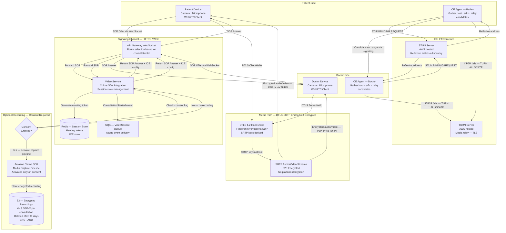
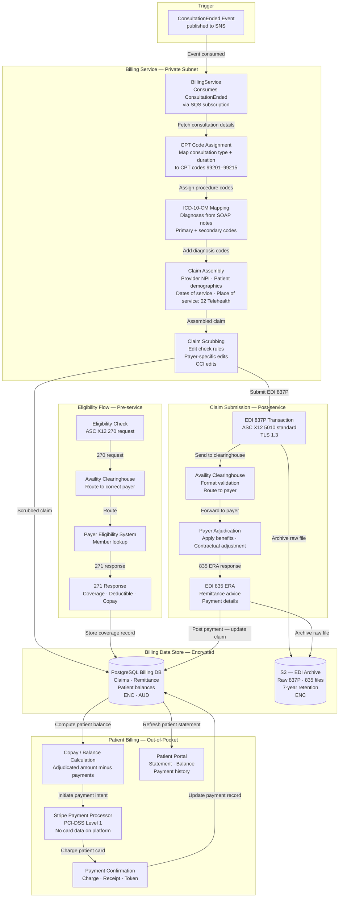
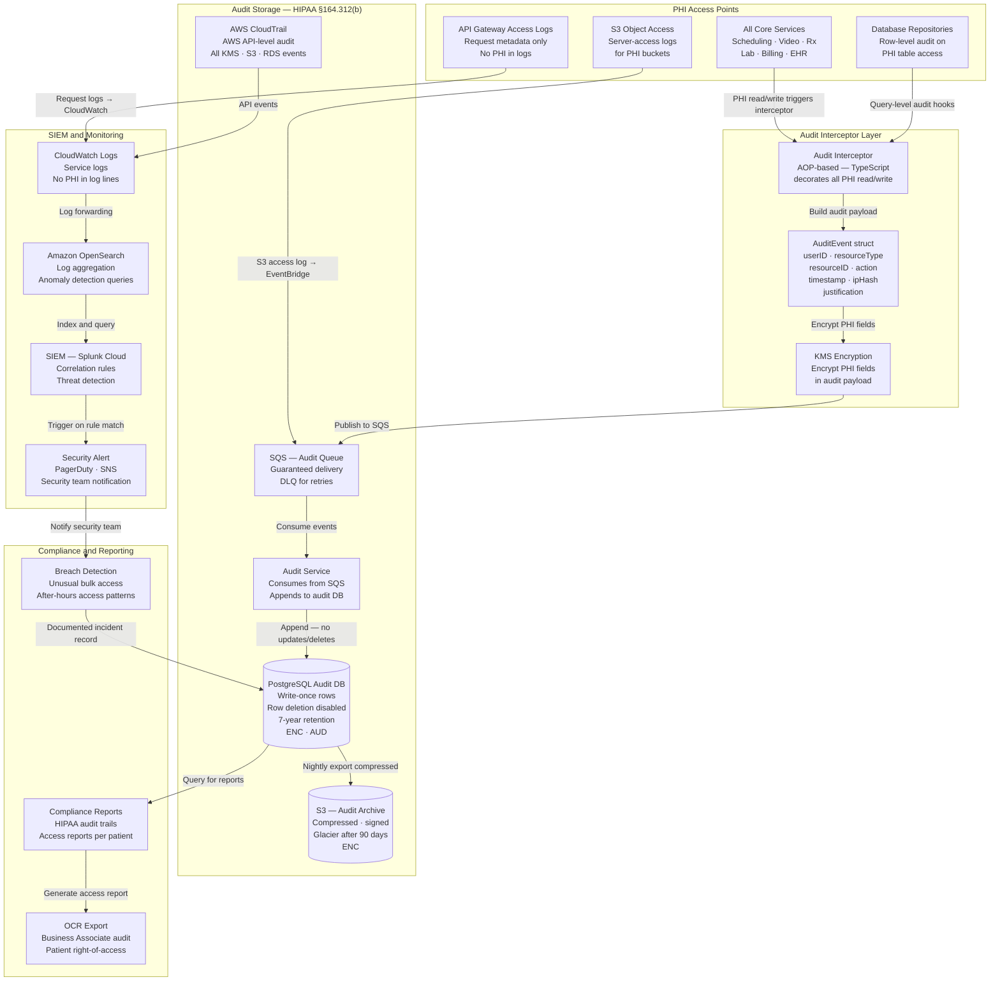

# Data Flow Diagrams — Telemedicine Platform

## Overview

These data flow diagrams (DFDs) document how information — particularly Protected Health Information (PHI) — moves through the Telemedicine Platform. Understanding data flows is a prerequisite for HIPAA Security Rule compliance (§164.308(a)(1)), enabling accurate risk analysis, gap assessment, and the correct placement of security controls.

### DFD Notation Used

| Shape | Meaning |
|---|---|
| Rectangle | External entity (actor or third-party system) |
| Rounded box | Process or service |
| Cylinder | Data store |
| Arrow | Data flow (direction = data movement direction) |
| `[PHI]` tag | Flow or store contains Protected Health Information |
| `[ENC]` tag | Data is encrypted at this point |
| `[AUD]` tag | Access is audited and logged |

All PHI flows cross HIPAA-covered boundaries only over TLS 1.3 with certificate pinning where mobile clients are involved. PHI at rest uses AES-256 with AWS KMS-managed keys. Every PHI store has row-level access controls enforced at the database role layer.

---

## PHI Data Flow

This diagram traces the complete lifecycle of PHI from initial patient input through storage, processing, and transmission to external covered entities.

```mermaid
flowchart TB
    subgraph Patients["External — Patients"]
        PT[Patient Browser / Mobile App]
        PT_INPUT[Patient-entered PHI\nname · DOB · SSN · symptoms]
    end

    subgraph IdP["Identity Layer"]
        AUTH0[Auth0 Identity Provider\nMFA enforced\nNo PHI stored]
        JWT_ISSUED[JWT with sub claim\nNo PHI in token payload]
    end

    subgraph API_Boundary["API Boundary — Public Subnet"]
        APIGW[AWS API Gateway\nWAF · Rate Limiting\nJWT Validation]
        KONG[Kong Gateway\nRequest Transformation\nRoute to Service]
    end

    subgraph CoreServices["Core Services — Private Subnet"]
        REGSVC[Registration Service\nPersonalInfo · InsuranceInfo\nPHI stored → encrypted]
        SCHSVC[Scheduling Service\nAppointment data\nCoverage info]
        CONSVC[Consultation Service\nSOAP Notes · Vitals\nDiagnoses · CPT codes]
        RXSVC[Prescription Service\nDrug · Dosage · Prescriber\nDEA Schedule]
        LABSVC[Lab Service\nTest orders · Results\nCritical value flags]
        EHRSVC[EHR Integration Service\nFHIR R4 adapter\nRecord sync]
        BILLSVC[Billing Service\nClaims · Coverage\nPayment records]
        AUDITSVC[Audit Service\nAccess logs · Events\nWrite-once store]
    end

    subgraph DataLayer["Data Layer — Private Subnet — All Encrypted AES-256"]
        PG_MAIN[(PostgreSQL RDS Multi-AZ\nPrimary PHI Store\nENC · AUD)]
        PG_AUDIT[(PostgreSQL Audit DB\nWrite-once rows\nENC · AUD)]
        S3_PHI[(S3 Bucket — PHI\nConsultation summaries\nLab reports · Recordings\nKMS SSE-C · ENC)]
        BACKUP[(RDS Automated Backups\nEncrypted snapshots\n35-day retention\nENC)]
        REDIS[(ElastiCache Redis\nSession state only\nNo persistent PHI\nTLS in-transit)]
    end

    subgraph ExternalCovered["External Covered Entities — BAA Required — TLS 1.3"]
        EHR_SYS[Epic / Cerner EHR\nHL7 FHIR R4\nPHI sync]
        PHARMACY[Surescripts Pharmacy Network\nNCPDP SCRIPT 2017071\nRx transmission]
        LAB_SYS[Quest / LabCorp LIS\nHL7 v2.5.1 / FHIR R4\nOrder + result]
        INSURER[Payer / Clearinghouse\nEDI 270/271 · 837P/835\nCoverage + claims]
    end

    PT -->|HTTPS — enter PHI| PT_INPUT
    PT_INPUT -->|HTTPS POST — register / update| APIGW
    PT -->|HTTPS — authenticate| AUTH0
    AUTH0 -->|OAuth 2.0 OIDC callback| JWT_ISSUED
    JWT_ISSUED -->|Bearer token| PT

    APIGW -->|Validated request — no raw PHI in logs| KONG
    KONG -->|Route to service| REGSVC
    KONG -->|Route to service| SCHSVC
    KONG -->|Route to service| CONSVC
    KONG -->|Route to service| RXSVC
    KONG -->|Route to service| LABSVC
    KONG -->|Route to service| BILLSVC

    REGSVC -->|Write PHI — TLS — field-level encryption| PG_MAIN
    SCHSVC -->|Read/Write appointment + coverage| PG_MAIN
    CONSVC -->|Write SOAP notes, vitals, diagnoses| PG_MAIN
    CONSVC -->|Store consultation summary PDF| S3_PHI
    RXSVC -->|Write prescription records| PG_MAIN
    LABSVC -->|Write orders, store result files| PG_MAIN
    LABSVC -->|Store lab result PDFs| S3_PHI
    BILLSVC -->|Write claim records, EOBs| PG_MAIN

    PG_MAIN -->|Automated backup — encrypted| BACKUP
    PG_MAIN -->|All access events| AUDITSVC
    S3_PHI -->|All object access events| AUDITSVC
    AUDITSVC -->|Write immutable audit records| PG_AUDIT

    EHRSVC -->|HL7 FHIR R4 GET/POST — TLS 1.3 — PHI| EHR_SYS
    EHR_SYS -->|FHIR R4 PUT resources — PHI| EHRSVC
    EHRSVC -->|Persist synced FHIR resources| PG_MAIN

    RXSVC -->|NCPDP SCRIPT NewRx — TLS 1.3 — PHI| PHARMACY
    PHARMACY -->|RxFill acknowledgement| RXSVC

    LABSVC -->|HL7 ORM Order message — TLS 1.3 — PHI| LAB_SYS
    LAB_SYS -->|HL7 ORU Result message — PHI| LABSVC

    BILLSVC -->|EDI 270 eligibility request — TLS 1.3| INSURER
    INSURER -->|EDI 271 eligibility response| BILLSVC
    BILLSVC -->|EDI 837P claim — TLS 1.3 — PHI| INSURER
    INSURER -->|EDI 835 ERA remittance| BILLSVC
```

---

## Video Stream Data Flow

Video consultation data flows through a separate path from PHI records. By design, no PHI is embedded in the media stream path; clinical notes and diagnoses remain in the core services layer.

---

## Billing Data Flow

The billing data flow covers the complete revenue cycle from consultation completion through claim adjudication and patient payment collection.

---

## Audit and Compliance Data Flow

Every PHI access generates an audit event. This diagram shows how audit data flows from access points to long-term compliance archives and anomaly detection.

---

## Data Classification

| Data Type | Classification | Encryption at Rest | Encryption in Transit | Retention Period | Access Control |
|---|---|---|---|---|---|
| Patient demographics (name, DOB, address) | PHI — Restricted | AES-256, KMS | TLS 1.3 | Life of record + 7 years | RBAC + audit |
| Social Security Number | PHI — Highly Restricted | AES-256, field-level | TLS 1.3 | Life of record + 7 years | Need-to-know only |
| Clinical notes (SOAP) | PHI — Restricted | AES-256, KMS | TLS 1.3 | 7 years (10 years for minors) | Treating team only |
| Prescription records | PHI — Restricted | AES-256, KMS | TLS 1.3 | 7 years (controlled: 10 years) | Prescriber + pharmacist |
| Lab results | PHI — Restricted | AES-256, KMS | TLS 1.3 | 7 years | Ordering provider + patient |
| Insurance / billing | PHI — Restricted | AES-256, KMS | TLS 1.3 | 7 years | Billing staff + patient |
| Audit log records | Compliance — Restricted | AES-256, KMS | TLS 1.3 | 7 years (HIPAA minimum) | Compliance team only |
| Video recordings (consented) | PHI — Restricted | AES-256, SSE-C | TLS 1.3 | 90 days (configurable) | Patient + treating doctor |
| JWT access tokens | Security — Internal | N/A (short-lived) | TLS 1.3 | 15-minute TTL | Bearer only |
| De-identified analytics | Internal | AES-256 | TLS 1.3 | Indefinite | Analytics team |
| System logs (no PHI) | Internal | Standard | TLS 1.3 | 90 days | DevOps team |

---

## PHI Inventory

The following PHI fields are present in the platform. Each field is tagged with the services that process it and the stores where it persists.

| PHI Field | HIPAA Identifier | Services | Stores |
|---|---|---|---|
| Patient full name | Name | Registration, Billing, Rx | PostgreSQL (patients table) |
| Date of birth | DOB | Registration, Billing, Rx | PostgreSQL (patients table) |
| Address | Geographic | Registration, Billing, Emergency | PostgreSQL (patients table) |
| Phone number | Phone | Registration, Notification | PostgreSQL (patients table) |
| Email address | Email | Registration, Notification | PostgreSQL (patients table) |
| Social Security Number | SSN | Registration (optional), Billing | PostgreSQL (patients table) — field-encrypted |
| Medical Record Number | MRN | All clinical services | PostgreSQL (patients table) |
| Health plan beneficiary number | Health plan | Billing | PostgreSQL (billing_eligibility table) |
| ICD-10 diagnosis codes | Diagnosis | Consultation, Billing, EHR | PostgreSQL (consultations, claims tables) |
| CPT procedure codes | Treatment | Consultation, Billing | PostgreSQL (consultations, claims tables) |
| Prescription details (drug, dose) | Rx | PrescriptionService | PostgreSQL (prescriptions table) |
| Lab results | Lab | LabService | PostgreSQL + S3 |
| SOAP clinical notes | Notes | ConsultationService | PostgreSQL (consultations table) |
| Video recordings | Audio/Video | VideoService | S3 (encrypted, consent-gated) |
| GPS location (emergency) | Location | EmergencyService | PostgreSQL (escalations table) — ephemeral |
| Payment card tokens | Financial | BillingService | Stripe (never stored on platform) |

---

## Data Minimization Principles

HIPAA's Minimum Necessary Standard (§164.514(d)) is applied to each data flow:

- **API responses** return only the fields required for the requesting client's function. Patient list responses include name and appointment time; full demographics are only returned in the patient profile view.
- **Service-to-service calls** pass identifiers (UUIDs) rather than PHI; downstream services fetch PHI from their own data stores when needed.
- **Notification payloads** contain no PHI. SMS/email notifications say "Your appointment is confirmed" — not the doctor's diagnosis or prescription details.
- **Audit event payloads** encrypt PHI fields before persisting; the audit record schema uses a reference (resourceId + resourceType) rather than embedded PHI values.
- **External transmissions** (Surescripts, HL7, EDI) include only the minimum data elements required by the interoperability standard for that transaction.
- **Logging configuration** explicitly suppresses PHI fields at the logger middleware level; request/response bodies containing PHI are never written to CloudWatch Logs.
- **Analytics and reporting** use de-identified data (Safe Harbor de-identification per §164.514(b)) with all 18 HIPAA identifiers removed or generalized.
