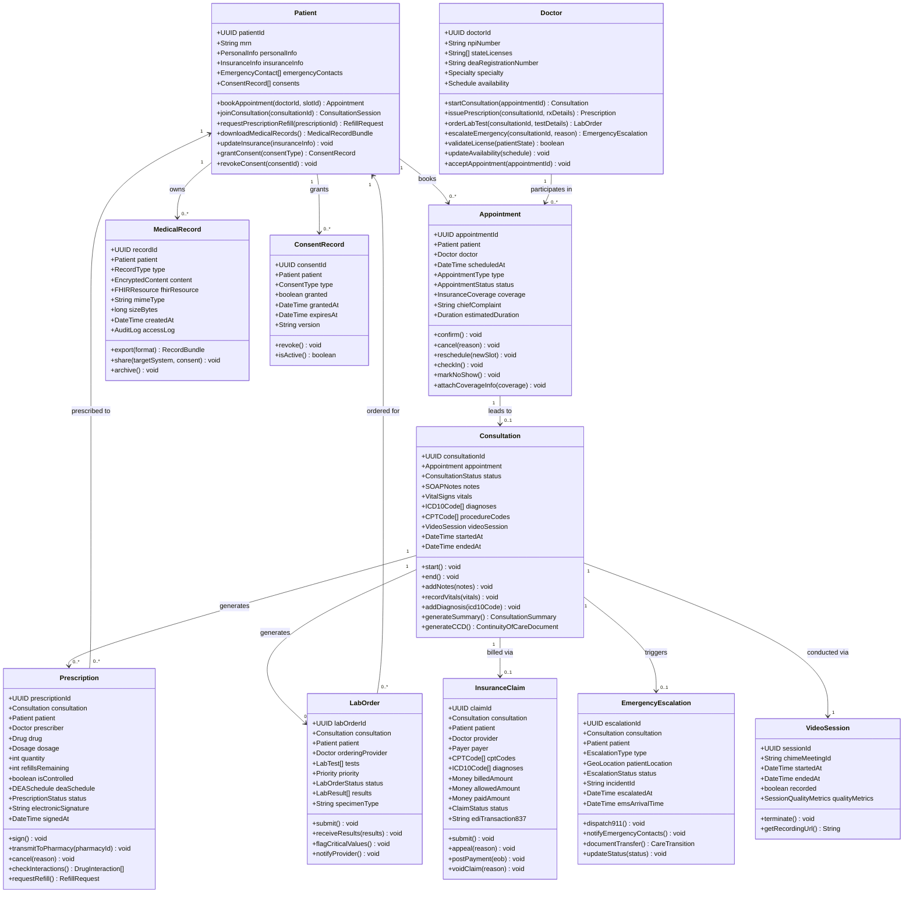

# Domain Model — Telemedicine Platform

## Overview

The domain model reflects a Domain-Driven Design (DDD) approach, where the Telemedicine Platform is decomposed into bounded contexts that align with clinical, operational, and regulatory realities. Each bounded context has its own ubiquitous language, its own persistence boundary, and communicates with peer contexts only through well-defined domain events or anti-corruption layers.

PHI is treated as a first-class concern throughout the model. Every aggregate root that contains PHI enforces access through repository interfaces that integrate transparently with the AuditService, ensuring all reads and writes comply with HIPAA §164.312(b).

---

## Bounded Contexts

| Bounded Context | Core Aggregates | Owns PHI | Integration Style |
|---|---|---|---|
| Patient Management | Patient, MedicalRecord, Consent | Yes | Domain events, FHIR API |
| Clinical Operations | Appointment, Consultation, LabOrder | Yes | Domain events, internal API |
| Pharmacy | Prescription, RefillRequest | Yes | Surescripts NCPDP SCRIPT |
| Billing | InsuranceClaim, EligibilityRecord, Payment | Yes (limited) | EDI 270/271/837/835 |
| Emergency Response | EmergencyEscalation, CareTransition | Yes | 911 CAD API, push |
| Compliance & Audit | AuditRecord, ConsentRecord, PolicyVersion | Yes (audit only) | Event consumer only |

Contexts communicate via events published to SNS/SQS. No direct database sharing occurs between contexts. Each context maintains its own read model for data it needs from peers.

---

## Domain Model Diagram



---

## Value Objects

Value objects are immutable; equality is based on value, not identity. They carry no domain behavior beyond validation and formatting.

### PersonalInfo
```
firstName: String
lastName: String
dateOfBirth: LocalDate
gender: GenderCode        // HL7 AdministrativeGender value set
ssn: EncryptedString      // AES-256, KMS-managed key
address: Address
phoneNumber: E164Phone
email: Email
preferredLanguage: BCP47LanguageTag
```

### Dosage
```
amount: Decimal
unit: DosageUnit           // mg, mcg, mL, units
frequency: FrequencyCode   // QD, BID, TID, QID, PRN
route: RouteCode           // PO, IV, IM, SQ, TOP
duration: Duration
instructions: String       // sig — patient-facing directions
```

### VitalSigns
```
systolicBP: int            // mmHg
diastolicBP: int           // mmHg
heartRate: int             // bpm
respiratoryRate: int       // breaths/min
temperature: Decimal       // Celsius
oxygenSaturation: Decimal  // %
weight: Decimal            // kg
height: Decimal            // cm
bmi: Decimal               // computed
recordedAt: DateTime
deviceSource: String       // self-reported, connected device ID
```

### GeoLocation
```
latitude: Decimal
longitude: Decimal
accuracy: int              // meters
address: Address
source: LocationSource     // GPS, IP, REGISTRATION_ADDRESS
capturedAt: DateTime
consentGiven: boolean
```

### Money
```
amount: BigDecimal
currency: ISO4217Code      // USD
```

### SOAPNotes
```
subjective: String         // patient-reported symptoms, history
objective: String          // exam findings, vitals, test results
assessment: String         // clinical impression, ICD-10 diagnoses
plan: String               // treatment plan, prescriptions, follow-up
authorId: UUID             // doctor or PA
signedAt: DateTime
signatureHash: String      // SHA-256 of note content at signing
```

---

## Domain Services

Domain services encapsulate operations that don't naturally belong to a single aggregate root.

### SchedulingService
**Responsibility:** Orchestrates appointment slot availability, conflict detection, and booking.

Key operations:
- `findAvailableSlots(doctorId, specialty, patientState, dateRange)` — returns open slots filtered by doctor licensure in the patient's state.
- `bookSlot(patientId, doctorId, slotId, appointmentType)` — atomic reservation with optimistic locking.
- `releaseExpiredHolds()` — scheduled job that releases unconfirmed slot holds after 15 minutes.
- `triggerEligibilityCheck(appointmentId)` — publishes `EligibilityCheckRequested` event to BillingService.

### PrescriptionValidationService
**Responsibility:** Coordinates drug interaction checks, PDMP queries, formulary lookups, and EPCS compliance before a prescription can be signed.

Key operations:
- `validatePrescription(prescription, patientMedications, patientInsurance)` — runs the full validation pipeline; returns `ValidationResult` with blocking errors and advisory warnings.
- `checkPDMP(patientId, state, drug)` — queries state PDMP via PMPInterConnect; caches results for 24 hours (non-PHI cache key).
- `verifyDEARegistration(doctorId, state, deaSchedule)` — validates DEA registration is active in the patient's state for the requested schedule.
- `lookupFormulary(ndc, pbmId, memberId)` — returns formulary tier, prior auth requirements, and step therapy alternatives.

### InsuranceBillingService
**Responsibility:** Manages the full revenue cycle from eligibility verification through claim submission and payment posting.

Key operations:
- `checkEligibility(patientId, insuranceId, appointmentDate)` — sends ASC X12 270; parses 271 response.
- `submitClaim(consultationId)` — builds and submits EDI 837P professional claim via Availity clearinghouse.
- `postRemittance(era835)` — parses ERA; posts payments and contractual adjustments to patient account.
- `generatePatientStatement(patientId, dateRange)` — produces itemized statement for patient portal.

### EmergencyResponseService
**Responsibility:** Detects clinical emergencies during consultations and coordinates immediate response.

Key operations:
- `initiateEscalation(consultationId, escalationType, reason)` — creates escalation record, dispatches 911, notifies contacts.
- `generateCareTransition(escalationId, receivingFacility)` — creates CCD containing active medications, allergies, and relevant history for EMS handoff.
- `updateEscalationStatus(escalationId, status)` — tracks EMS arrival and hospital transfer.

---

## Repository Interfaces

Repositories provide a collection-like interface to aggregate roots, abstracting persistence from the domain. All PHI-accessing repositories inject audit context automatically.

```
IPatientRepository
  findById(patientId: UUID): Patient
  findByMRN(mrn: String): Patient
  findByEmail(email: String): Patient       // returns minimal projection
  save(patient: Patient): void
  delete(patientId: UUID): void             // soft-delete, PHI retained per retention policy

IDoctorRepository
  findById(doctorId: UUID): Doctor
  findByNPI(npi: String): Doctor
  findBySpecialtyAndState(specialty, state): Doctor[]
  save(doctor: Doctor): void

IAppointmentRepository
  findById(appointmentId: UUID): Appointment
  findByPatient(patientId: UUID, dateRange): Appointment[]
  findByDoctor(doctorId: UUID, dateRange): Appointment[]
  findByStatus(status: AppointmentStatus): Appointment[]
  save(appointment: Appointment): void

IConsultationRepository
  findById(consultationId: UUID): Consultation
  findByAppointment(appointmentId: UUID): Consultation
  findActiveByDoctor(doctorId: UUID): Consultation[]
  save(consultation: Consultation): void

IPrescriptionRepository
  findById(prescriptionId: UUID): Prescription
  findByPatient(patientId: UUID): Prescription[]
  findControlledByPatient(patientId: UUID, dateRange): Prescription[]
  save(prescription: Prescription): void

ILabOrderRepository
  findById(labOrderId: UUID): LabOrder
  findByConsultation(consultationId: UUID): LabOrder[]
  findPendingResults(): LabOrder[]
  save(labOrder: LabOrder): void

IInsuranceClaimRepository
  findById(claimId: UUID): InsuranceClaim
  findByConsultation(consultationId: UUID): InsuranceClaim
  findByStatus(status: ClaimStatus, dateRange): InsuranceClaim[]
  save(claim: InsuranceClaim): void

IMedicalRecordRepository
  findById(recordId: UUID): MedicalRecord
  findByPatient(patientId: UUID, type): MedicalRecord[]
  save(record: MedicalRecord): void
  archive(recordId: UUID): void
```

---

## Domain Events

Domain events represent significant state changes that other bounded contexts may need to react to. All events are published to AWS SNS and consumed via SQS per-service subscriptions.

| Event | Raised By | Consumed By | PHI In Payload |
|---|---|---|---|
| `AppointmentBooked` | Appointment | BillingService, NotificationService | Minimal (appointmentId, type) |
| `AppointmentCancelled` | Appointment | NotificationService, BillingService | No |
| `AppointmentCheckedIn` | Appointment | VideoService, NotificationService | No |
| `ConsultationStarted` | Consultation | AuditService, BillingService | No |
| `ConsultationEnded` | Consultation | BillingService, AuditService, EHRService | No |
| `PrescriptionSigned` | Prescription | AuditService, NotificationService | No |
| `PrescriptionTransmitted` | Prescription | AuditService, NotificationService | Minimal (pharmacyName) |
| `LabOrderSubmitted` | LabOrder | AuditService, NotificationService | No |
| `LabResultsReceived` | LabOrder | NotificationService, AuditService | No |
| `CriticalLabResultFlagged` | LabOrder | NotificationService, AuditService | No |
| `EligibilityCheckCompleted` | BillingService | SchedulingService, NotificationService | No |
| `ClaimSubmitted` | InsuranceClaim | AuditService | No |
| `ClaimAdjudicated` | InsuranceClaim | BillingService, NotificationService | No |
| `PaymentPosted` | InsuranceClaim | NotificationService | No |
| `EmergencyEscalationInitiated` | EmergencyEscalation | AuditService, NotificationService | Location (encrypted) |
| `EMSDispatched` | EmergencyEscalation | AuditService, NotificationService | No |
| `PatientConsentGranted` | ConsentRecord | AuditService, EHRService | No |
| `PatientConsentRevoked` | ConsentRecord | AuditService, VideoService, EHRService | No |
| `MedicalRecordExported` | MedicalRecord | AuditService | No |
| `PHIAccessAnomalyDetected` | AuditService | SecurityTeam (PagerDuty) | No |
