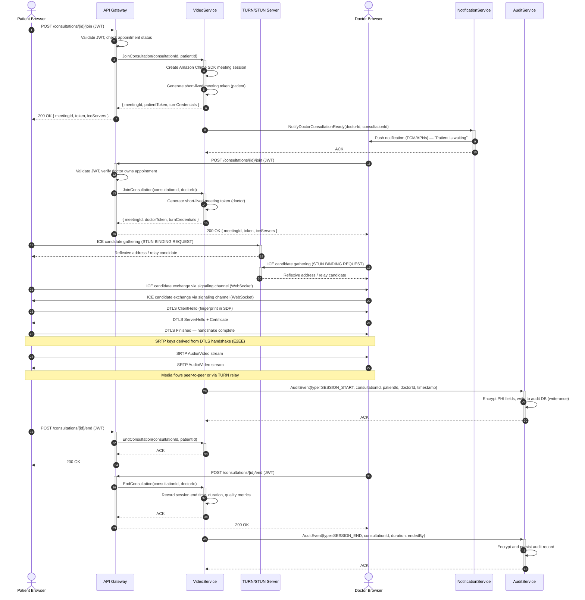
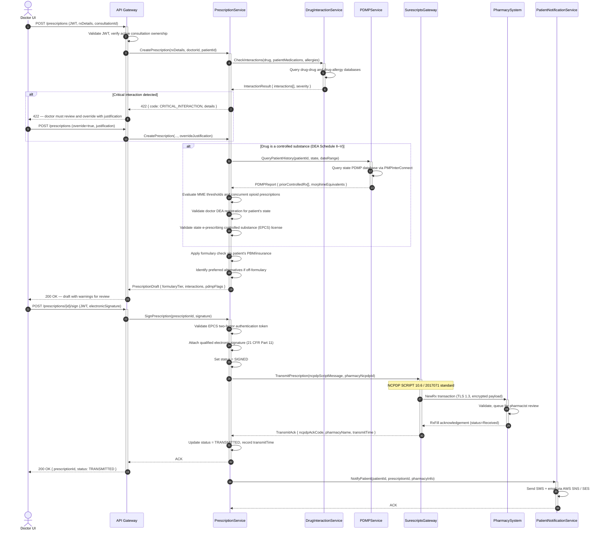
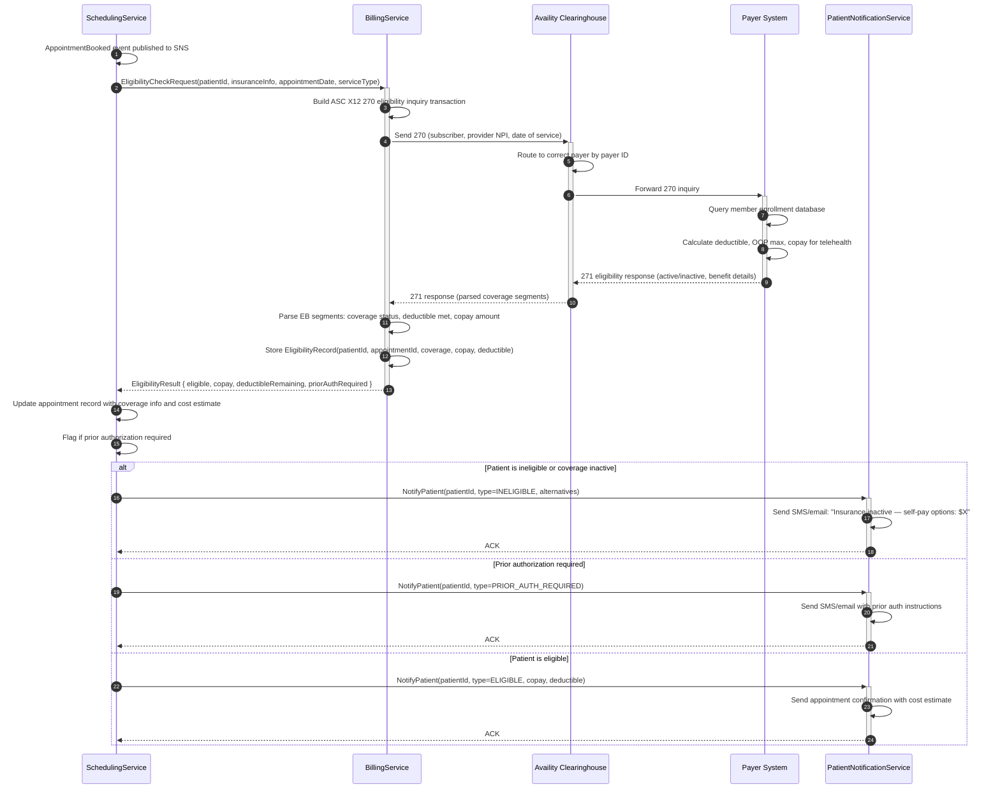
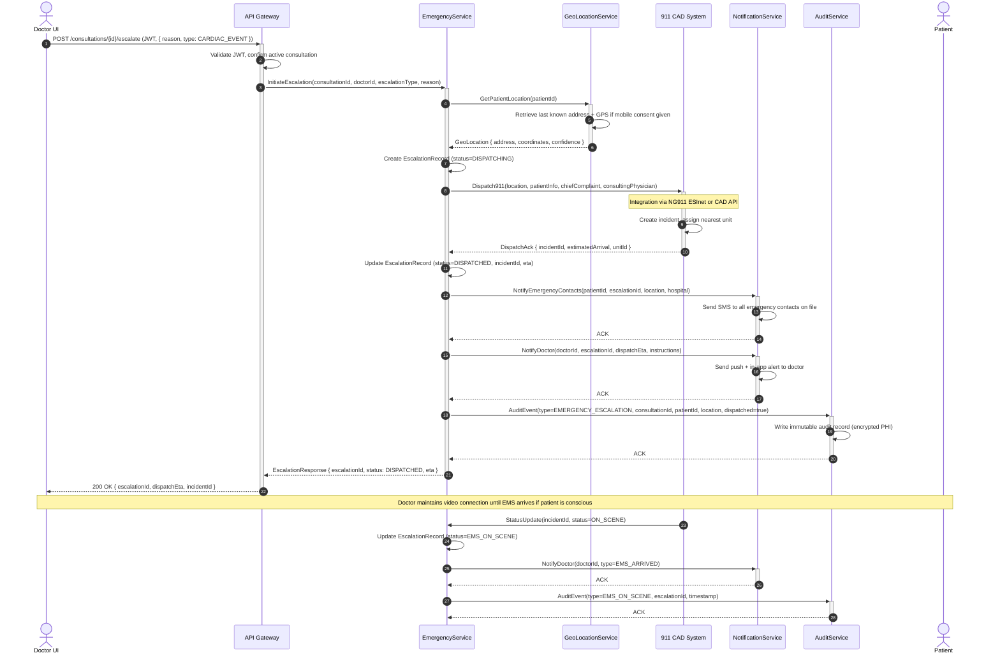

# System Sequence Diagrams — Telemedicine Platform

## Overview

These sequence diagrams capture the primary interaction flows across the Telemedicine Platform, illustrating how actors, services, and external systems collaborate to deliver HIPAA-compliant telehealth workflows. Each diagram traces the happy path alongside error and edge-case branches, making the temporal ordering of messages explicit for both design validation and developer implementation guidance.

The platform is built on an event-driven microservices architecture deployed on AWS. All inter-service communication over the public internet uses TLS 1.3. PHI is never logged in plaintext; every audit record references encrypted content stored in the audit database.

---

## Video Consultation Setup (WebRTC Signaling)

This sequence covers the full lifecycle of a real-time video consultation, from a patient entering the waiting room through WebRTC ICE negotiation to session teardown and HIPAA audit logging.

**Notes:**
- Amazon Chime SDK handles media server coordination; TURN relay is used only when peer-to-peer ICE fails.
- DTLS-SRTP ensures end-to-end encryption of all audio and video; the platform's media servers cannot decrypt streams.
- Meeting tokens expire after 30 minutes and are tied to the specific `consultationId`.
- AuditService writes are asynchronous but guaranteed via SQS dead-letter queue retry.

---

## E-Prescription Workflow

This sequence covers the full e-prescribing flow initiated during a consultation, including controlled substance checks, PDMP queries, formulary validation, and Surescripts transmission.

**Notes:**
- EPCS (Electronic Prescribing of Controlled Substances) requires two-factor authentication per DEA 21 CFR Part 1311.
- PDMP queries are mandatory for Schedule II drugs in all 50 states; Schedule III–V varies by state law.
- Surescripts connectivity uses HTTPS with mutual TLS; all PHI is encrypted in transit.
- Formulary data is sourced from the patient's PBM in real time via a separate formulary API.

---

## Insurance Eligibility Check

This sequence shows the automated 270/271 eligibility verification triggered by appointment booking, ensuring patients understand their coverage and cost obligations before consultation.

**Notes:**
- Eligibility checks run automatically at booking and again 24 hours before the appointment.
- The 270/271 transaction set is the HIPAA-mandated standard for eligibility verification.
- Copay amounts displayed to patients are estimates; final amounts depend on provider claim adjudication.
- All EDI transactions are logged to the AuditService with the payer response archived for 7 years.

---

## Emergency Escalation Sequence

This sequence covers the detection and handling of a medical emergency identified during a video consultation, including 911 dispatch and family notification.

**Notes:**
- Emergency escalation is a fire-and-forget pattern with guaranteed delivery via SQS; it does not block the doctor's UI.
- Patient location is obtained from the registration address; GPS coordinates require explicit mobile consent.
- The care transition document (CCD/CDA) is automatically generated and sent to the receiving hospital's EHR.
- All escalation actions are HIPAA-audited and cannot be deleted or modified (write-once audit database).

---

## Sequence Diagram Conventions

### Actor and Participant Notation

| Symbol | Meaning |
|---|---|
| `actor` | Human user or external organization |
| `participant` | Software service or system component |
| `autonumber` | Sequential step numbers for traceability |
| `+` / `-` on arrow | Activation box — service is processing |
| `Note over` | Contextual annotation for a group of participants |
| `alt / else / end` | Conditional branching (if/else logic) |
| `loop` | Repeated interaction (polling, retries) |
| `par` | Parallel execution blocks |

### Timing Assumptions

| Flow | SLA | Timeout |
|---|---|---|
| JWT validation at API Gateway | < 5 ms | 500 ms |
| WebRTC ICE gathering | < 2 s | 10 s |
| DTLS handshake | < 500 ms | 5 s |
| Drug interaction check | < 200 ms | 3 s |
| PDMP query | < 3 s | 10 s |
| Surescripts transmission | < 5 s | 30 s |
| 270/271 eligibility round-trip | < 10 s | 30 s |
| 911 dispatch acknowledgement | < 5 s | 15 s |

### HIPAA Audit Requirements

Every sequence that touches PHI triggers an audit event to the AuditService. Audit records include:
- `userId` of the accessor (encrypted)
- `resourceType` and `resourceId`
- `action` (READ, WRITE, TRANSMIT, DELETE)
- `timestamp` (UTC, millisecond precision)
- `ipAddress` (hashed)
- `justification` (for break-glass access)

Audit records are written to a PostgreSQL table with row-level deletion disabled at the database role level, satisfying HIPAA §164.312(b) audit control requirements.

### Error Handling Convention

All sequence diagrams show the happy path. Error branches follow these patterns:
- **4xx client errors** — returned synchronously to the calling actor with a structured error body.
- **5xx service errors** — retried via SQS with exponential backoff (max 3 retries); unresolved failures go to the DLQ and trigger a PagerDuty alert.
- **Timeout errors** — the calling service applies circuit-breaker logic (Resilience4j); degraded-mode responses are returned where clinically safe (e.g., eligibility check failure falls back to self-pay flow, never blocks care).
