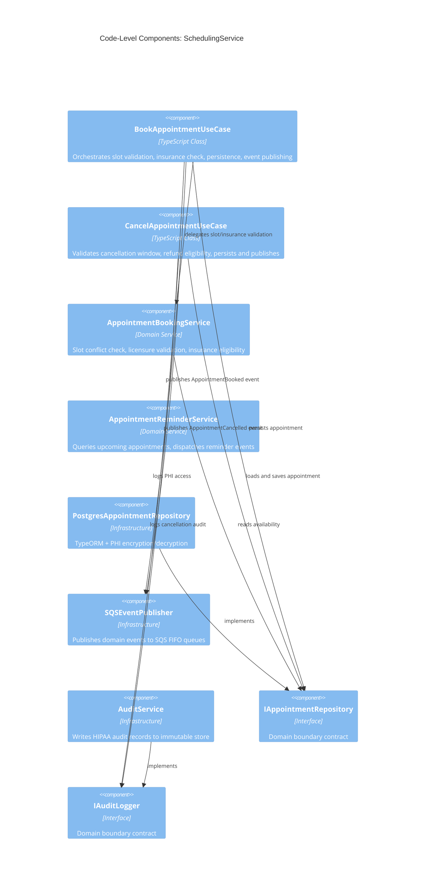
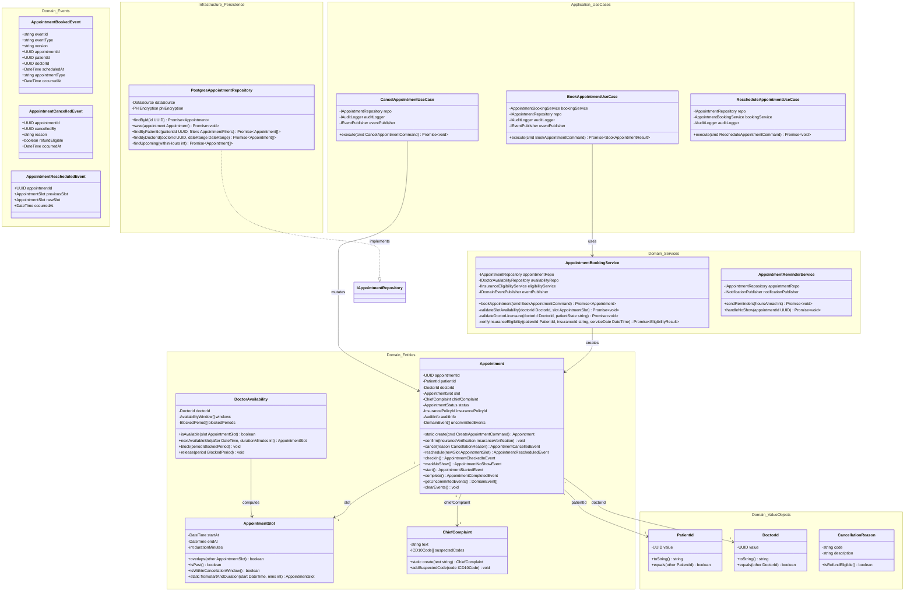
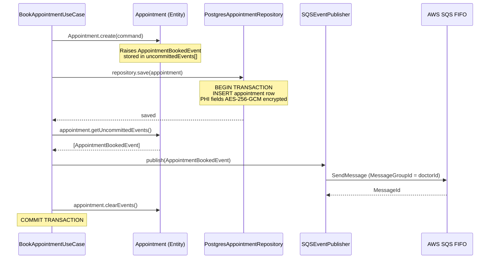
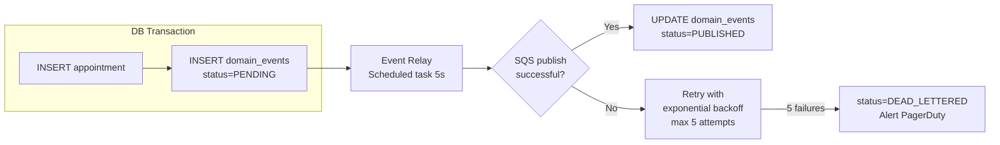
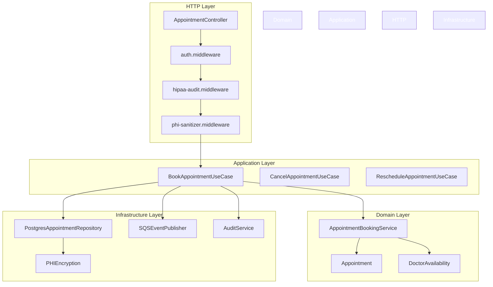

# C4 Code Diagram — SchedulingService

## Overview

This document describes the code-level (C4 Level 4) design of the `SchedulingService`. It covers the domain model, application use cases, infrastructure adapters, dependency injection wiring, and the flow of domain events from entity mutation through to SQS publication. All diagrams and code excerpts are production-representative — no placeholders.



---

## Domain Model — Class Diagram



---

## Domain Event Flow



The outbox pattern ensures events are not lost if SQS is temporarily unavailable: events are written to the `domain_events` table inside the same transaction as the aggregate, then a background relay process reads and publishes them.



---

## Dependency Injection Setup

The service uses `tsyringe` for IoC container wiring. All PHI-touching classes are registered as singletons to avoid key-cache churn.

```typescript
// src/infrastructure/di/container.ts
import { container } from 'tsyringe';
import { DataSource } from 'typeorm';
import { KMSClient } from '@aws-sdk/client-kms';
import { SQSClient } from '@aws-sdk/client-sqs';

export function bootstrapContainer(dataSource: DataSource): void {
  // AWS clients
  container.registerInstance('KMSClient', new KMSClient({ region: process.env.AWS_REGION }));
  container.registerInstance('SQSClient', new SQSClient({ region: process.env.AWS_REGION }));
  container.registerInstance('DataSource', dataSource);

  // Encryption — singleton to reuse cached data keys
  container.registerSingleton<PHIEncryption>('PHIEncryption', PHIEncryption);

  // Repositories
  container.register<IAppointmentRepository>('IAppointmentRepository', {
    useClass: PostgresAppointmentRepository,
  });
  container.register<IDoctorAvailabilityRepository>('IDoctorAvailabilityRepository', {
    useClass: PostgresDoctorAvailabilityRepository,
  });

  // Domain services
  container.registerSingleton<AppointmentBookingService>(AppointmentBookingService);
  container.registerSingleton<AppointmentReminderService>(AppointmentReminderService);

  // Application use cases
  container.register(BookAppointmentUseCase, { useClass: BookAppointmentUseCase });
  container.register(CancelAppointmentUseCase, { useClass: CancelAppointmentUseCase });

  // Infrastructure
  container.registerSingleton<SQSEventPublisher>('IEventPublisher', SQSEventPublisher);
  container.registerSingleton<AuditService>('IAuditLogger', AuditService);
}
```

---

## Application Layer — BookAppointmentUseCase

The use case is the transaction boundary. It commits the database record and publishes events atomically via the outbox pattern.

```typescript
// src/application/use-cases/BookAppointmentUseCase.ts
import { injectable, inject } from 'tsyringe';

@injectable()
export class BookAppointmentUseCase {
  constructor(
    @inject(AppointmentBookingService) private readonly bookingService: AppointmentBookingService,
    @inject('IAppointmentRepository') private readonly repo: IAppointmentRepository,
    @inject('IAuditLogger') private readonly audit: IAuditLogger,
    @inject('IEventPublisher') private readonly events: IEventPublisher,
  ) {}

  async execute(cmd: BookAppointmentCommand): Promise<BookAppointmentResult> {
    // Domain service handles all invariant checks
    const appointment = await this.bookingService.bookAppointment(cmd);

    // Persist inside a transaction (outbox written in same tx)
    await this.repo.save(appointment);

    // Publish uncommitted domain events after successful commit
    const domainEvents = appointment.getUncommittedEvents();
    await this.events.publishAll(domainEvents);
    appointment.clearEvents();

    // HIPAA audit record — actor, resource, PHI fields accessed
    await this.audit.record({
      action: 'CREATE',
      resourceType: 'Appointment',
      resourceId: appointment.appointmentId,
      phiAccessed: ['patientId', 'chiefComplaint', 'insurancePolicyId'],
      actorId: cmd.requestedBy,
      purpose: 'TREATMENT',
    });

    return {
      appointmentId: appointment.appointmentId,
      scheduledAt: appointment.slot.startAt,
      status: appointment.status,
    };
  }
}
```

---

## Repository Implementation — PHI Encrypt/Decrypt

```typescript
// src/infrastructure/database/repositories/PostgresAppointmentRepository.ts
@injectable()
export class PostgresAppointmentRepository implements IAppointmentRepository {
  constructor(
    @inject('DataSource') private readonly ds: DataSource,
    @inject('PHIEncryption') private readonly phi: PHIEncryption,
  ) {}

  async findById(id: UUID): Promise<Appointment | null> {
    const entity = await this.ds
      .getRepository(AppointmentEntity)
      .findOne({ where: { appointmentId: id } });

    if (!entity) return null;
    return this.toDomain(entity);
  }

  async save(appointment: Appointment): Promise<void> {
    const repo = this.ds.getRepository(AppointmentEntity);
    const entity = await this.toEntity(appointment);
    await repo.save(entity);
  }

  async findByPatientId(
    patientId: UUID,
    filters: AppointmentFilters,
  ): Promise<Appointment[]> {
    const entities = await this.ds
      .getRepository(AppointmentEntity)
      .createQueryBuilder('a')
      .where('a.patientId = :patientId', { patientId })
      .andWhere('a.status IN (:...statuses)', { statuses: filters.statuses })
      .andWhere('a.startAt >= :from', { from: filters.from })
      .orderBy('a.startAt', 'ASC')
      .getMany();

    return Promise.all(entities.map(e => this.toDomain(e)));
  }

  private async toDomain(entity: AppointmentEntity): Promise<Appointment> {
    const chiefComplaint = await this.phi.decrypt(entity.encryptedChiefComplaint);
    return Appointment.reconstitute({
      appointmentId: entity.appointmentId,
      patientId: new PatientId(entity.patientId),
      doctorId: new DoctorId(entity.doctorId),
      slot: AppointmentSlot.fromStartAndDuration(entity.startAt, entity.durationMinutes),
      chiefComplaint: ChiefComplaint.create(chiefComplaint),
      status: entity.status,
      insurancePolicyId: entity.insurancePolicyId,
      createdAt: entity.createdAt,
      updatedAt: entity.updatedAt,
    });
  }

  private async toEntity(appt: Appointment): Promise<AppointmentEntity> {
    return {
      appointmentId: appt.appointmentId,
      patientId: appt.patientId.toString(),
      doctorId: appt.doctorId.toString(),
      startAt: appt.slot.startAt,
      durationMinutes: appt.slot.durationMinutes,
      encryptedChiefComplaint: await this.phi.encrypt(appt.chiefComplaint.text),
      status: appt.status,
      insurancePolicyId: appt.insurancePolicyId ?? null,
    };
  }
}
```

---

## Module Boundary Summary


