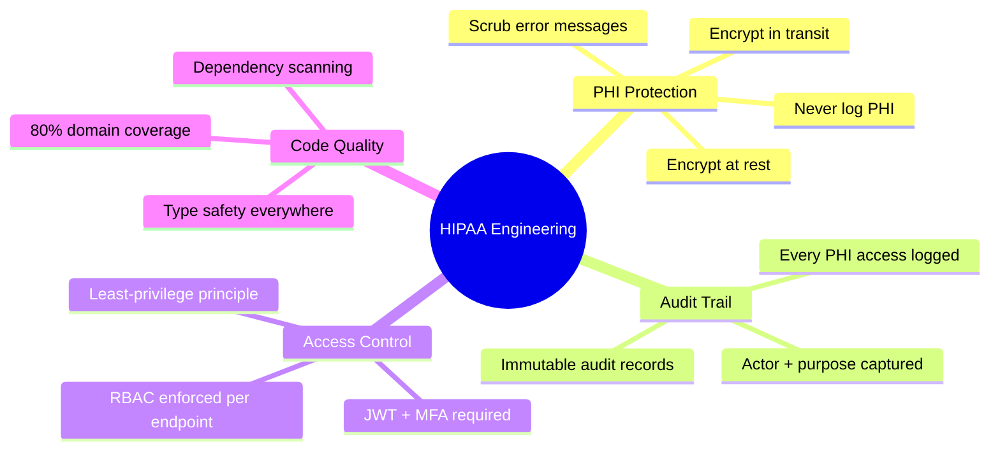
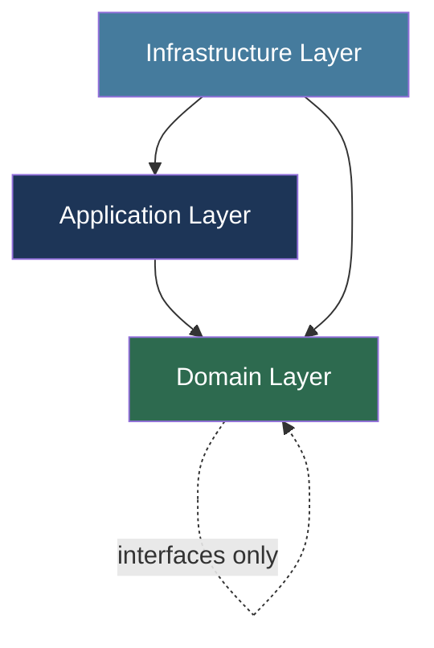
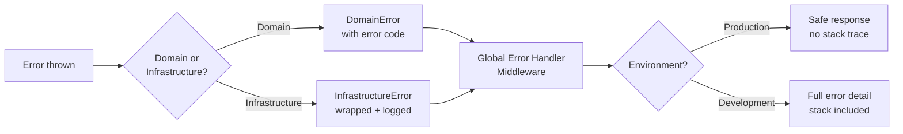
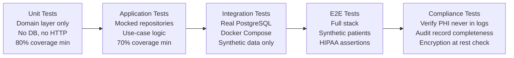

# Code Guidelines — Telemedicine Platform

## Overview

These guidelines encode HIPAA-driven engineering standards across every service in the Telemedicine Platform. Every engineer, regardless of team, is expected to follow them without exception. PHI (Protected Health Information) handling, audit logging, authentication, and testing practices are not optional — they are regulatory obligations.



---

## Technology Stack

| Component | Technology | Version | Justification |
|---|---|---|---|
| API Services | Node.js + TypeScript | 20 LTS + 5.x | Type safety for healthcare domain, large ecosystem |
| Web Frontend | React + TypeScript | 18.x + 5.x | Component architecture, accessibility libraries |
| Mobile | React Native + TypeScript | 0.73.x | Code sharing with web, HIPAA-compliant libraries |
| Database | PostgreSQL | 15.x | ACID compliance, row-level security, pg_audit |
| Cache | Redis | 7.x | Session management, ephemeral data |
| Video | Amazon Chime SDK | Latest | HIPAA BAA covered, managed WebRTC |
| ORM | TypeORM | 0.3.x | Type-safe queries, migration management |
| Message Queue | AWS SQS/SNS | Latest SDK | BAA covered, reliable delivery |
| API Documentation | OpenAPI 3.0 | — | Contract-first development |
| Testing | Jest + Supertest | 29.x + 6.x | Unit/integration testing |
| Container | Docker + Kubernetes | 24.x + 1.29 | Reproducible deployments |

---

## Project Structure

Each microservice follows a strict layered architecture based on Domain-Driven Design. The `SchedulingService` is the canonical reference:

```
scheduling-service/
├── src/
│   ├── domain/                        # Pure TypeScript — no frameworks
│   │   ├── entities/
│   │   │   ├── Appointment.ts
│   │   │   └── DoctorAvailability.ts
│   │   ├── value-objects/
│   │   │   ├── AppointmentSlot.ts
│   │   │   └── ChiefComplaint.ts
│   │   ├── repositories/              # Interfaces only — no implementations
│   │   │   ├── IAppointmentRepository.ts
│   │   │   └── IDoctorAvailabilityRepository.ts
│   │   └── services/
│   │       ├── AppointmentBookingService.ts
│   │       └── AppointmentReminderService.ts
│   ├── application/
│   │   ├── use-cases/
│   │   │   ├── BookAppointmentUseCase.ts
│   │   │   └── CancelAppointmentUseCase.ts
│   │   ├── dtos/
│   │   │   └── BookAppointmentCommand.ts
│   │   └── events/
│   │       └── AppointmentEventHandlers.ts
│   ├── infrastructure/
│   │   ├── database/
│   │   │   ├── entities/              # TypeORM entities
│   │   │   ├── migrations/
│   │   │   └── repositories/          # Concrete implementations
│   │   ├── http/
│   │   │   ├── controllers/
│   │   │   ├── middleware/
│   │   │   │   ├── auth.middleware.ts
│   │   │   │   ├── hipaa-audit.middleware.ts
│   │   │   │   └── phi-sanitizer.middleware.ts
│   │   │   └── routes/
│   │   ├── messaging/                 # SQS/SNS publishers/consumers
│   │   └── external/                  # External API clients
│   └── shared/
│       ├── encryption/                # AES-256-GCM PHI encryption
│       ├── logging/                   # PHI-safe structured logging
│       └── errors/
├── tests/
│   ├── unit/
│   ├── integration/
│   └── e2e/
├── Dockerfile
└── package.json
```

The dependency rule is strict: **domain** has no imports from application or infrastructure. **Application** imports domain only. **Infrastructure** imports both.



---

## HIPAA Coding Requirements

### PHI Handling Rules

PHI fields include: patient name, date of birth, address, phone, email, SSN, diagnosis codes, prescription data, lab results, and any combination that could identify a patient.

**Prohibited patterns — CI pipeline will reject these:**

```typescript
// NEVER — PHI in log output
logger.info(`Patient ${patient.name} booked appointment`);

// NEVER — PHI in error messages returned to client
throw new Error(`Patient SSN ${patient.ssn} not found`);

// NEVER — PHI in query string
GET /appointments?patientName=John+Doe&dob=1980-01-01

// NEVER — PHI in browser localStorage
localStorage.setItem('patient', JSON.stringify(patientRecord));
```

**PHI-safe logger wrapper:**

```typescript
// src/shared/logging/PhiSafeLogger.ts
const PHI_FIELDS = new Set([
  'name', 'firstName', 'lastName', 'dateOfBirth', 'dob',
  'ssn', 'address', 'phone', 'email', 'diagnosis',
  'prescription', 'insuranceId', 'memberId',
]);

export class PhiSafeLogger {
  private readonly logger: winston.Logger;

  info(message: string, meta?: Record<string, unknown>): void {
    this.logger.info(message, this.scrub(meta));
  }

  error(message: string, meta?: Record<string, unknown>): void {
    this.logger.error(message, this.scrub(meta));
  }

  private scrub(meta?: Record<string, unknown>): Record<string, unknown> {
    if (!meta) return {};
    return Object.fromEntries(
      Object.entries(meta).map(([k, v]) => [
        k,
        PHI_FIELDS.has(k.toLowerCase()) ? '[REDACTED]' : v,
      ])
    );
  }
}
```

### PHI Encryption Utility

All PHI written to the database is encrypted using AES-256-GCM. Keys are managed by AWS KMS. The data key is cached for 5 minutes in-process (encrypted at rest in Redis if distributed).

```typescript
// src/shared/encryption/PHIEncryption.ts
import { KMSClient, GenerateDataKeyCommand, DecryptCommand } from '@aws-sdk/client-kms';
import { createCipheriv, createDecipheriv, randomBytes } from 'crypto';

export interface EncryptedField {
  ciphertext: string;       // base64
  iv: string;               // base64
  encryptedDataKey: string; // base64 — KMS-wrapped
  keyVersion: string;
}

export class PHIEncryption {
  constructor(
    private readonly kms: KMSClient,
    private readonly keyArn: string,
  ) {}

  async encrypt(plaintext: string): Promise<EncryptedField> {
    const { CiphertextBlob, Plaintext, KeyId } =
      await this.kms.send(new GenerateDataKeyCommand({
        KeyId: this.keyArn,
        KeySpec: 'AES_256',
      }));

    const iv = randomBytes(12);
    const cipher = createCipheriv('aes-256-gcm', Buffer.from(Plaintext!), iv);
    const ciphertext = Buffer.concat([cipher.update(plaintext, 'utf8'), cipher.final()]);
    const authTag = cipher.getAuthTag();

    return {
      ciphertext: Buffer.concat([ciphertext, authTag]).toString('base64'),
      iv: iv.toString('base64'),
      encryptedDataKey: Buffer.from(CiphertextBlob!).toString('base64'),
      keyVersion: KeyId!,
    };
  }

  async decrypt(encrypted: EncryptedField): Promise<string> {
    const { Plaintext } = await this.kms.send(new DecryptCommand({
      CiphertextBlob: Buffer.from(encrypted.encryptedDataKey, 'base64'),
    }));

    const iv = Buffer.from(encrypted.iv, 'base64');
    const data = Buffer.from(encrypted.ciphertext, 'base64');
    const authTag = data.subarray(data.length - 16);
    const ciphertextOnly = data.subarray(0, data.length - 16);

    const decipher = createDecipheriv('aes-256-gcm', Buffer.from(Plaintext!), iv);
    decipher.setAuthTag(authTag);
    return decipher.update(ciphertextOnly) + decipher.final('utf8');
  }

  async rotateKey(encrypted: EncryptedField): Promise<EncryptedField> {
    const plaintext = await this.decrypt(encrypted);
    return this.encrypt(plaintext);
  }
}
```

### Audit Logging Pattern

Every HTTP request that touches PHI must produce an audit record. The middleware runs after authentication so `actorId` and `actorRole` are always populated.

```typescript
// src/infrastructure/http/middleware/hipaa-audit.middleware.ts
export interface AuditEvent {
  eventId: string;
  timestamp: string;           // ISO 8601
  actorId: string;             // userId performing action
  actorRole: string;           // PATIENT | PROVIDER | ADMIN | SYSTEM
  action: string;              // CREATE | READ | UPDATE | DELETE
  resourceType: string;        // Appointment | Prescription | LabResult
  resourceId: string;
  phiAccessed: string[];       // which PHI fields were touched
  purpose: string;             // TREATMENT | PAYMENT | OPERATIONS
  ipAddress: string;
  userAgent: string;
  outcome: 'SUCCESS' | 'FAILURE';
}

export function hipaaAuditMiddleware(auditService: IAuditService) {
  return async (req: Request, res: Response, next: NextFunction) => {
    const startedAt = Date.now();
    const originalJson = res.json.bind(res);

    res.json = function (body) {
      auditService.record({
        eventId: crypto.randomUUID(),
        timestamp: new Date().toISOString(),
        actorId: req.user!.sub,
        actorRole: req.user!.role,
        action: httpMethodToAction(req.method),
        resourceType: req.params.resource ?? extractResourceType(req.path),
        resourceId: req.params.id ?? 'batch',
        phiAccessed: req.phiFieldsAccessed ?? [],
        purpose: req.headers['x-purpose'] as string ?? 'TREATMENT',
        ipAddress: req.ip,
        userAgent: req.headers['user-agent'] ?? '',
        outcome: res.statusCode < 400 ? 'SUCCESS' : 'FAILURE',
      }).catch(err => logger.error('Audit write failed', { eventId: err }));

      return originalJson(body);
    };

    next();
  };
}
```

### Authentication Pattern

```typescript
// src/infrastructure/http/middleware/auth.middleware.ts
import { expressjwt } from 'express-jwt';
import { expressJwtSecret } from 'jwks-rsa';

export const jwtMiddleware = expressjwt({
  secret: expressJwtSecret({
    jwksUri: process.env.AUTH0_JWKS_URI!,
    cache: true,
    rateLimit: true,
  }),
  audience: process.env.AUTH0_AUDIENCE!,
  issuer: process.env.AUTH0_ISSUER!,
  algorithms: ['RS256'],
});

export function requireMfa(req: Request, res: Response, next: NextFunction) {
  if (!req.auth?.['https://telemedicine/mfa_verified']) {
    return res.status(403).json({ code: 'MFA_REQUIRED' });
  }
  next();
}

export function requireRole(...roles: UserRole[]) {
  return (req: Request, res: Response, next: NextFunction) => {
    const userRole = req.auth?.['https://telemedicine/role'] as UserRole;
    if (!roles.includes(userRole)) {
      return res.status(403).json({ code: 'INSUFFICIENT_ROLE' });
    }
    next();
  };
}
```

### Repository Pattern for PHI

```typescript
// src/infrastructure/database/repositories/PostgresPatientRepository.ts
export class PostgresPatientRepository implements IPatientRepository {
  constructor(
    private readonly ds: DataSource,
    private readonly phi: PHIEncryption,
  ) {}

  async findById(id: UUID): Promise<Patient | null> {
    const row = await this.ds.getRepository(PatientEntity).findOne({ where: { id } });
    if (!row) return null;
    return this.toDomain(row);
  }

  private async toDomain(row: PatientEntity): Promise<Patient> {
    return Patient.reconstitute({
      id: row.id,
      name: await this.phi.decrypt(row.encryptedName),
      dateOfBirth: await this.phi.decrypt(row.encryptedDob),
      contactEmail: await this.phi.decrypt(row.encryptedEmail),
      contactPhone: await this.phi.decrypt(row.encryptedPhone),
      createdAt: row.createdAt,
    });
  }

  async save(patient: Patient): Promise<void> {
    const repo = this.ds.getRepository(PatientEntity);
    await repo.save({
      id: patient.id,
      encryptedName: await this.phi.encrypt(patient.name),
      encryptedDob: await this.phi.encrypt(patient.dateOfBirth),
      encryptedEmail: await this.phi.encrypt(patient.contactEmail),
      encryptedPhone: await this.phi.encrypt(patient.contactPhone),
    });
  }
}
```

---

## Error Handling Standards



```typescript
export enum ErrorCode {
  // Domain errors
  SLOT_UNAVAILABLE          = 'SCHED_001',
  DOCTOR_NOT_LICENSED       = 'SCHED_002',
  INSURANCE_NOT_ELIGIBLE    = 'SCHED_003',
  APPOINTMENT_ALREADY_CANCELLED = 'SCHED_004',
  CANCELLATION_WINDOW_CLOSED = 'SCHED_005',
  // Auth errors
  UNAUTHORIZED              = 'AUTH_001',
  MFA_REQUIRED              = 'AUTH_002',
  INSUFFICIENT_ROLE         = 'AUTH_003',
  // Infrastructure errors
  DATABASE_UNAVAILABLE      = 'INFRA_001',
  ENCRYPTION_FAILED         = 'INFRA_002',
  EXTERNAL_SERVICE_TIMEOUT  = 'INFRA_003',
}

export class DomainError extends Error {
  constructor(
    public readonly code: ErrorCode,
    message: string,
  ) {
    super(message);
    this.name = 'DomainError';
  }
}

// Global handler — never leaks stack traces in production
export function globalErrorHandler(
  err: Error, req: Request, res: Response, _next: NextFunction
) {
  if (err instanceof DomainError) {
    return res.status(422).json({ code: err.code, message: err.message });
  }
  logger.error('Unhandled error', { errorName: err.name });
  return res.status(500).json({
    code: 'INTERNAL_ERROR',
    message: 'An unexpected error occurred.',
  });
}
```

---

## Testing Standards



**Synthetic patient data fixture (never use real PHI in tests):**

```typescript
// tests/fixtures/patients.ts
export const syntheticPatient = (): CreatePatientDto => ({
  name: `TestPatient-${crypto.randomUUID().slice(0, 8)}`,
  dateOfBirth: '1985-06-15',      // fictional date
  contactEmail: `test-${Date.now()}@telemedicine-test.invalid`,
  contactPhone: '+15550000000',    // non-dialable test number
  insuranceMemberId: `TEST-${crypto.randomUUID().slice(0, 6)}`,
});
```

**HIPAA compliance test assertion:**

```typescript
it('never writes PHI to application logs', async () => {
  const logSpy = jest.spyOn(logger, 'info');
  await bookAppointmentUseCase.execute(syntheticBookingCommand());
  const allLogArgs = logSpy.mock.calls.flatMap(c => JSON.stringify(c));
  expect(allLogArgs).not.toMatch(/TestPatient/);
  expect(allLogArgs).not.toMatch(/1985-06-15/);
});
```

---

## Security Coding Checklist

| Control | Implementation | Enforcement |
|---|---|---|
| Input validation | Zod schema on every request body | Middleware — rejects before controller |
| SQL injection | TypeORM parameterized queries only | TypeORM enforced; raw query ban in ESLint |
| XSS prevention | `helmet` + strict CSP; React escapes by default | CSP header audited in E2E tests |
| CSRF protection | `SameSite=Strict` cookies + CSRF token for mutations | Integration test suite |
| Dependency scanning | `npm audit --audit-level=high` in CI | Pipeline gate — blocks merge on high/critical |
| Secret scanning | `detect-secrets` pre-commit hook | Git hook + CI scan |
| PHI in logs | `PhiSafeLogger` wrapper; ESLint `no-restricted-syntax` rule | Lint gate + compliance test |

**Zod input validation example:**

```typescript
import { z } from 'zod';

export const BookAppointmentSchema = z.object({
  patientId: z.string().uuid(),
  doctorId: z.string().uuid(),
  startAt: z.string().datetime({ offset: true }),
  durationMinutes: z.number().int().min(15).max(60),
  chiefComplaint: z.string().min(10).max(500),
  insurancePolicyId: z.string().uuid().optional(),
  purpose: z.enum(['ROUTINE', 'URGENT', 'FOLLOW_UP']),
});

export type BookAppointmentDto = z.infer<typeof BookAppointmentSchema>;

// Validation middleware
export function validate<T>(schema: z.ZodSchema<T>) {
  return (req: Request, res: Response, next: NextFunction) => {
    const result = schema.safeParse(req.body);
    if (!result.success) {
      return res.status(400).json({
        code: 'VALIDATION_ERROR',
        errors: result.error.flatten().fieldErrors,
      });
    }
    req.body = result.data;
    next();
  };
}
```
