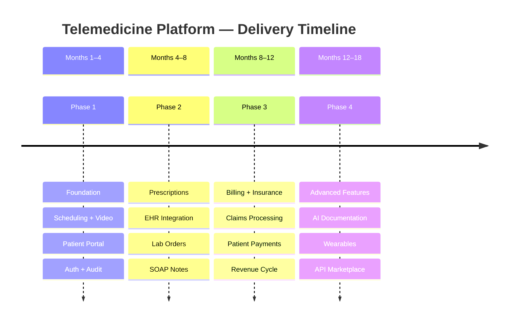
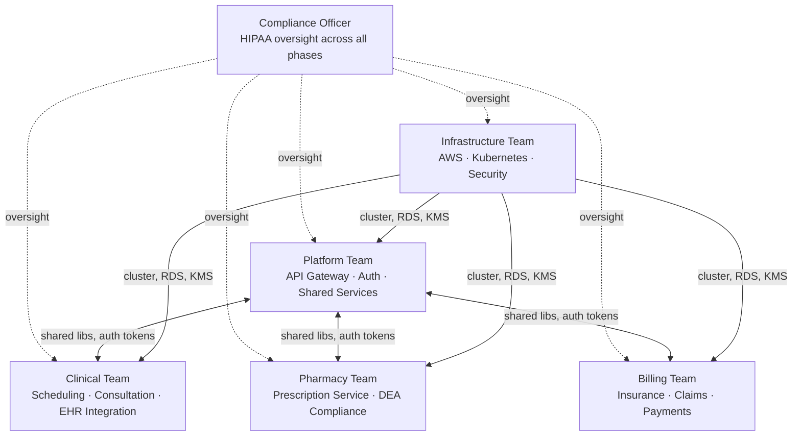
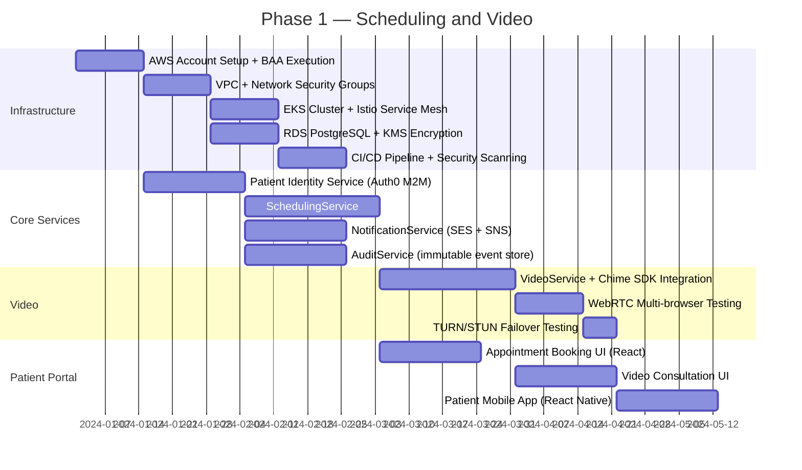
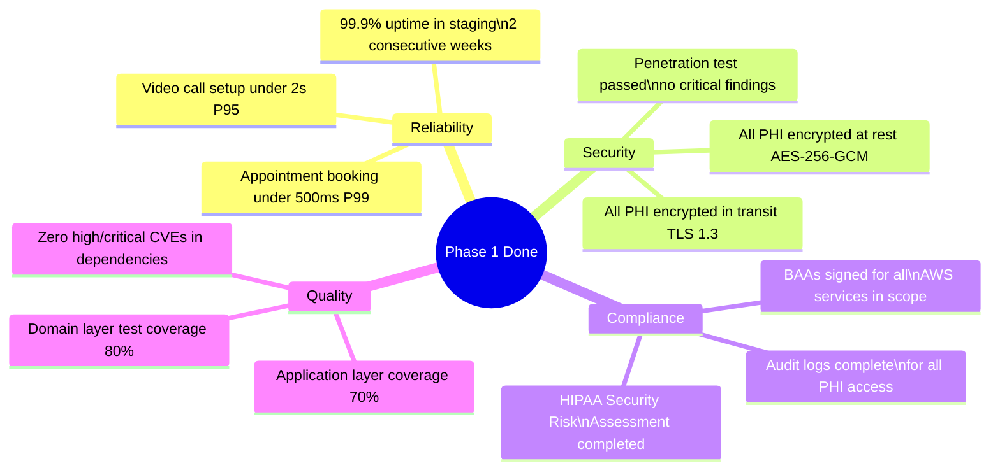
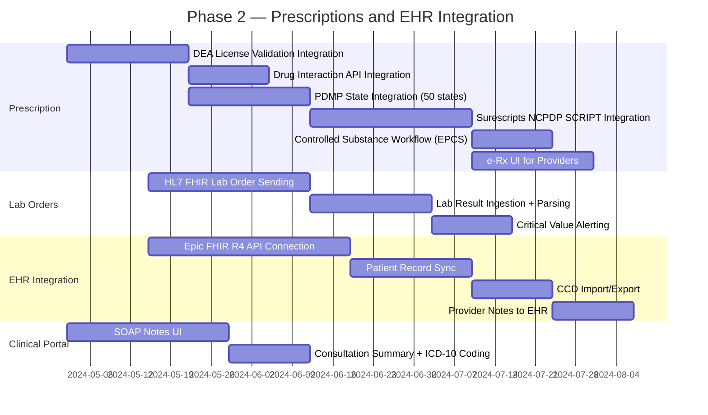
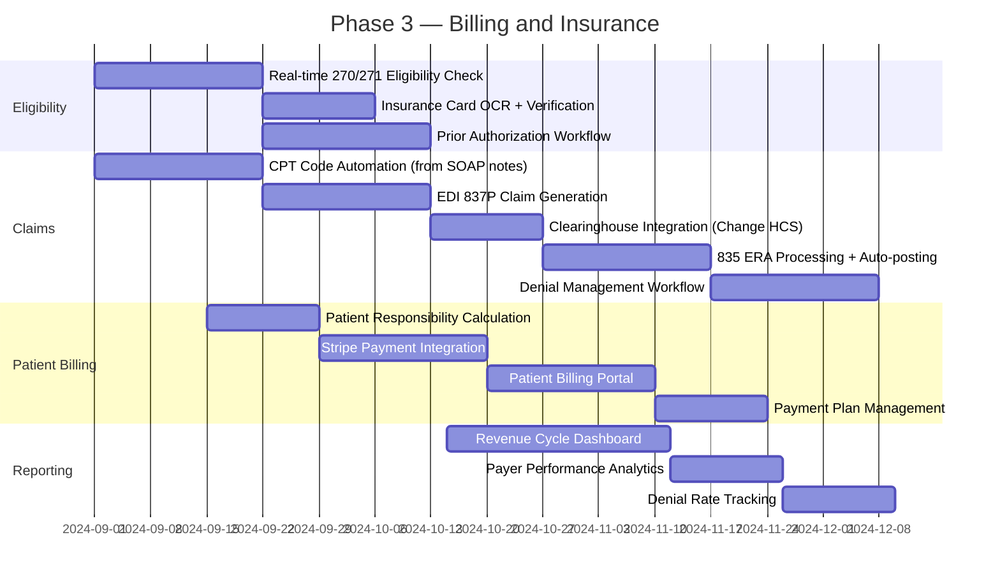
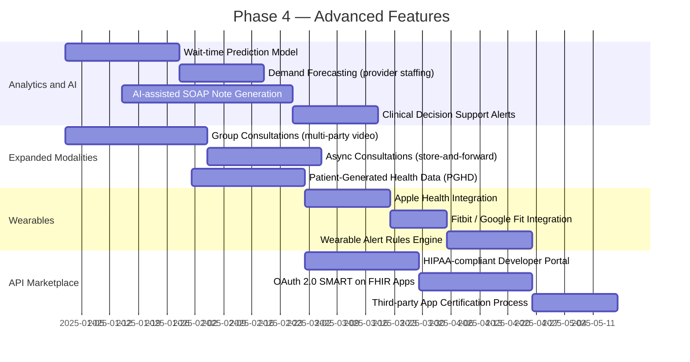
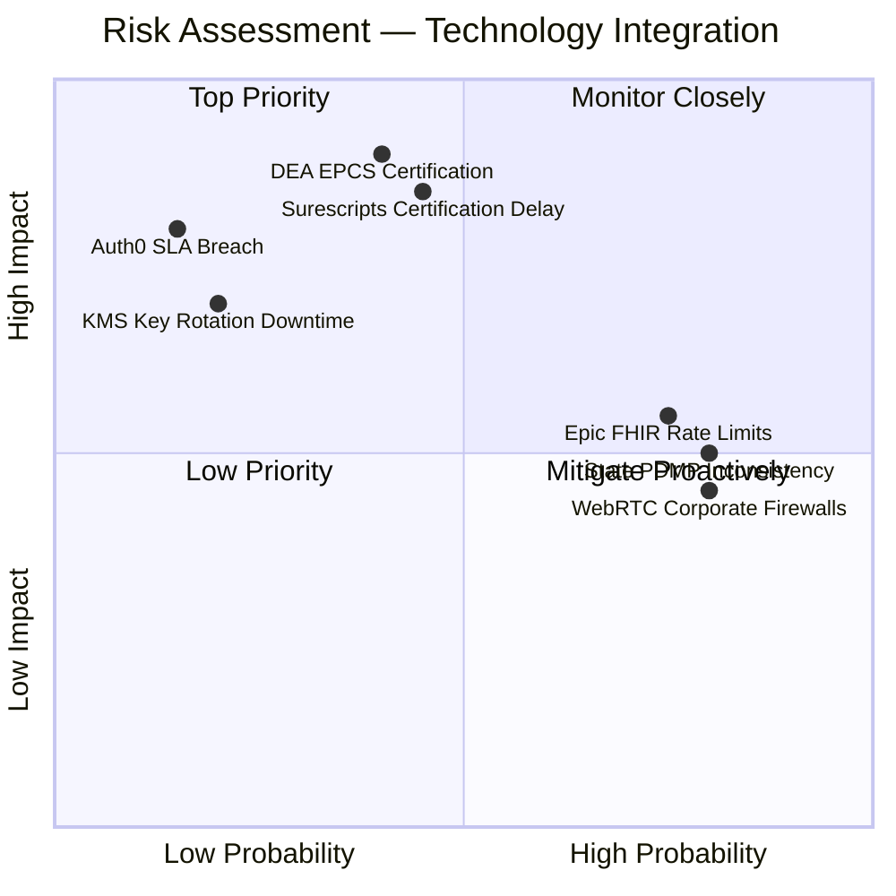
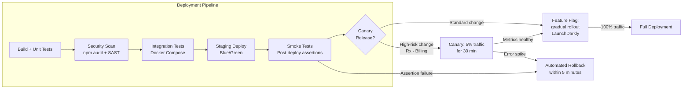
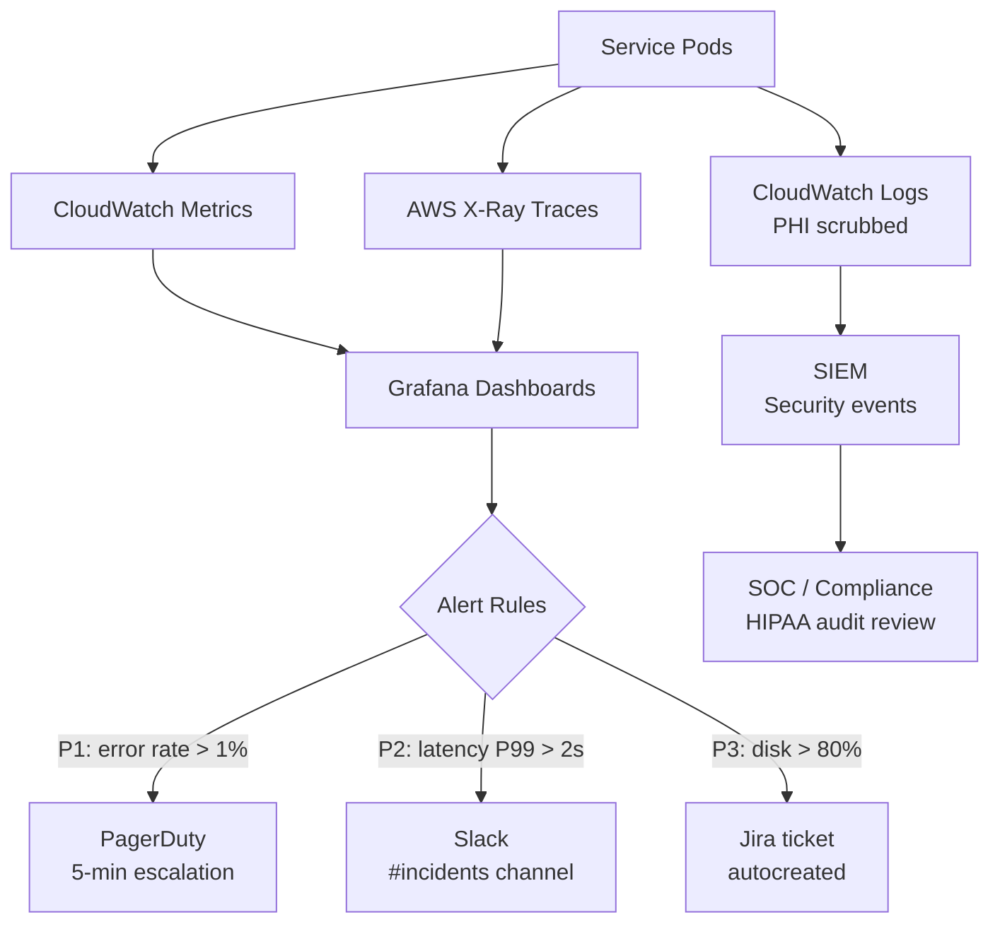

# Implementation Playbook — Telemedicine Platform

## Overview

This playbook defines the phased delivery strategy, team responsibilities, and risk management approach for building the Telemedicine Platform. The platform is HIPAA-regulated; every phase must satisfy compliance gates before clinical workloads go live. Phases are sequential by default but allow intra-phase parallelism across teams.

---

## Team Structure

| Team | Headcount | Key Responsibilities |
|---|---|---|
| Platform | 4 engineers | API Gateway, Auth0 integration, shared TypeScript libraries, service mesh (Istio) |
| Clinical | 6 engineers | SchedulingService, ConsultationService, EHR adapters, HL7 FHIR R4 |
| Pharmacy | 3 engineers | PrescriptionService, Surescripts NCPDP SCRIPT, PDMP adapters, DEA EPCS |
| Billing | 4 engineers | InsuranceService, EDI 837/835, ClaimsService, Stripe integration |
| Infrastructure | 3 engineers | EKS, RDS, KMS, WAF, GuardDuty, VPN, CI/CD pipelines |
| Compliance Officer | 1 | HIPAA Security Rule, risk assessments, BAA management, audit reviews |

---

## Phase 1: Foundation — Scheduling and Video (Months 1–4)

### Phase 1 Deliverables

- Patients can book appointments with verified, licensed providers
- Video consultations via WebRTC (Amazon Chime SDK) with TURN failover
- Provider availability management and calendar blocking
- Appointment reminders via SMS (SNS) and email (SES)
- Basic patient portal — web (React) and mobile (React Native)
- HIPAA audit trail for all PHI access events
- BAAs executed with: AWS, Auth0, any third-party sub-processors

### Phase 1 — Definition of Done

---

## Phase 2: Clinical Features — Prescriptions and EHR (Months 4–8)

### Phase 2 Deliverables

- E-prescriptions via Surescripts for non-controlled and Schedule II–V substances
- PDMP integration for all 50 states, adapter pattern for API inconsistencies
- Lab order creation (HL7 FHIR) and result retrieval with critical value alerting
- HL7 FHIR R4 EHR integration (Epic and Cerner)
- Clinical documentation — SOAP notes with ICD-10 coding assistance
- Drug-drug and drug-allergy interaction checking via clinical decision support API

### Phase 2 — Definition of Done

- DEA-compliant controlled substance workflow reviewed and approved by compliance officer
- Surescripts certification obtained (production network access)
- Epic FHIR integration certified for production access
- End-to-end prescription test completed with at least one pharmacy partner
- PDMP adapter validated for all states where platform operates at launch

---

## Phase 3: Billing and Insurance (Months 8–12)

### Phase 3 Deliverables

- Real-time insurance eligibility verification (ANSI X12 270/271)
- Automated CPT code suggestion derived from SOAP note content
- EDI 837P claim submission via clearinghouse (Change Healthcare or Waystar)
- 835 ERA auto-posting with exception queue for manual review
- Denial management workflow with appeal letter generation
- Patient-facing billing portal with Stripe payment processing
- Revenue cycle dashboards: collections rate, days in AR, denial rate by payer

### Phase 3 — Definition of Done

- End-to-end claim successfully adjudicated by at least two contracted payers
- 835 ERA auto-posting accuracy above 95% in staging with synthetic claims
- Stripe PCI DSS SAQ-A compliance confirmed
- Patient billing portal UAT completed with 20 pilot patients

---

## Phase 4: Advanced Features (Months 12–18)

### Phase 4 Deliverables

- Predictive analytics: wait-time prediction and provider demand forecasting
- AI-assisted clinical documentation — NLP generates SOAP note drafts from consultation transcript
- Group consultations supporting up to 8 participants (multi-party WebRTC)
- Asynchronous consultations with store-and-forward for dermatology and radiology review
- Patient-generated health data ingestion (PGHD) — wearables, home monitoring devices
- Apple Health and Fitbit integrations with configurable alert thresholds
- HIPAA-compliant API marketplace with SMART on FHIR app support and developer portal

---

## Technology Migration Risks

| Risk | Probability | Impact | Mitigation |
|---|---|---|---|
| Surescripts certification delay | Medium | High | Begin certification process in Month 1 of Phase 1; maintain paper prescription fallback workflow |
| DEA EPCS one-time password system | Medium | High | Allocate 6-month buffer; engage DEA auditor in Phase 1; use non-controlled e-Rx while awaiting approval |
| Epic FHIR API rate limits | High | Medium | Implement caching layer with 15-min TTL; negotiate higher limits via Epic App Orchard agreement |
| State PDMP API inconsistency | High | Medium | Build adapter pattern with state-specific implementations; support 50-state variation from day one |
| WebRTC traversal in corporate firewalls | High | Medium | TURN relay fallback via AWS Global Accelerator; publish firewall requirements doc for enterprise clients |
| KMS key rotation causing decrypt failures | Low | High | Dual-key window (old key valid 24h post-rotation); automated rotation test in staging monthly |
| Auth0 SLA breach during peak hours | Low | High | Circuit breaker with token caching; secondary Auth0 tenant on standby in EU region |

---

## Rollout Strategy

| Strategy | Applies To | Mechanism |
|---|---|---|
| Blue/green deployment | All services | EKS with two identical environments; DNS flip after smoke tests pass |
| Feature flags | All user-visible features | LaunchDarkly; flags default off in production, enabled per cohort |
| Canary releases | Prescription, Billing, Auth changes | 5% traffic for 30 minutes; auto-promote if error rate below 0.1% |
| Rollback SLA | All services | 30-minute hard SLA; automated via Argo Rollouts on metric breach |
| Smoke tests | Every deployment | Synthetic transaction per critical path: book → video → prescribe → bill |

### Monitoring and Alerting

Key SLOs:
- Appointment booking API: 99.9% availability, P99 latency < 500 ms
- Video session establishment: P95 < 2 seconds
- Prescription submission: 99.5% availability, P99 latency < 3 seconds
- Audit event write: 99.99% durability (no audit records may be lost)
- PHI decryption (KMS): P99 < 50 ms (cached data key path)
