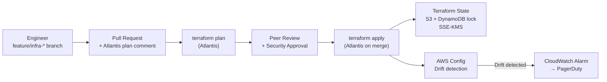
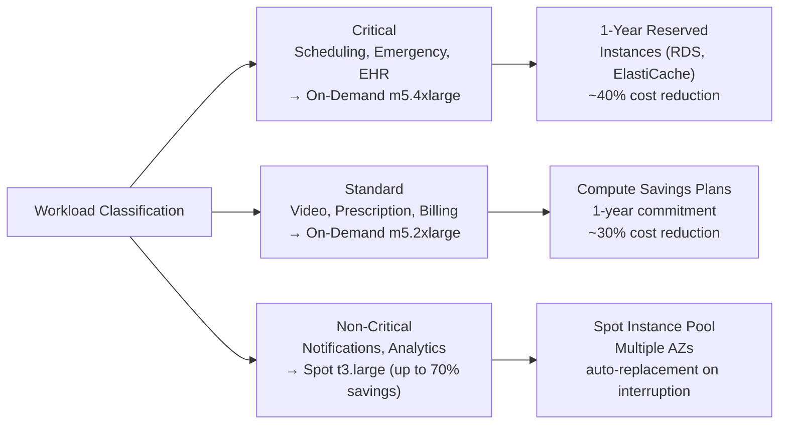
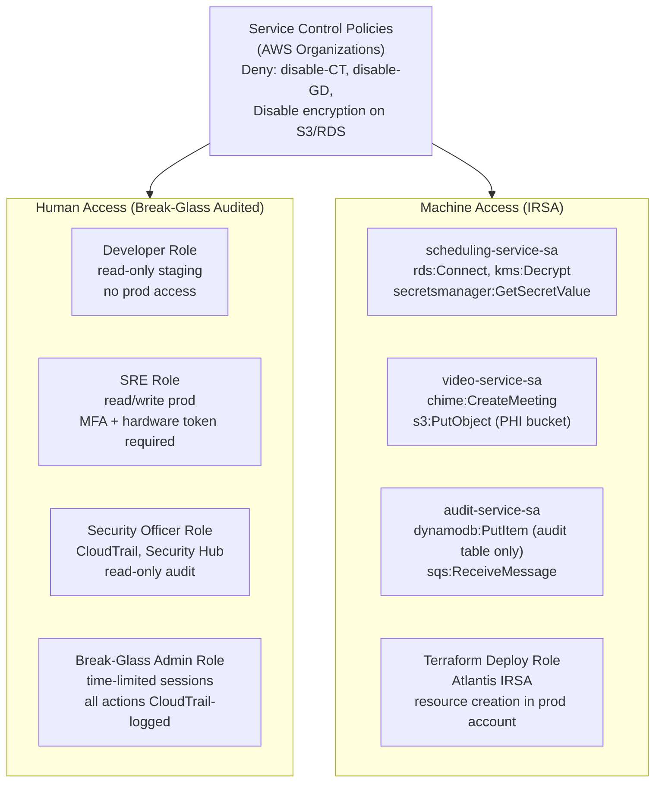

# Cloud Architecture — Telemedicine Platform (AWS HIPAA-Eligible)

## Overview — AWS HIPAA-eligible services, BAA coverage, shared responsibility model

The Telemedicine Platform is built entirely on AWS HIPAA-eligible services covered under the AWS Business Associate Agreement (BAA). The shared responsibility model is applied explicitly: AWS manages the security **of** the cloud (physical hardware, hypervisor, managed service infrastructure), while the platform team manages security **in** the cloud (data classification, encryption key policies, IAM, application security, audit logging, and incident response). Every service that may contact PHI — directly or indirectly — is enrolled under the BAA before being provisioned.

---

## AWS Service Inventory

| Service | Use Case | HIPAA BAA | PHI Contact | Encryption | HA Config | Notes |
|---|---|---|---|---|---|---|
| Amazon EKS | Container orchestration for all microservices | BAA covered | Running PHI processes | EBS volumes encrypted (KMS CMK); etcd secrets encryption | Multi-AZ node groups; managed control plane (99.95% SLA) | IRSA for pod-level IAM; OPA/Gatekeeper for policy enforcement |
| Amazon RDS for PostgreSQL | Primary PHI data store | BAA covered | Direct PHI | AES-256 KMS CMK; pg_audit extension enabled | Multi-AZ automatic failover < 60 s; read replica in same region | Parameter group enforces `ssl=on`; no public endpoint; Secrets Manager password rotation |
| Amazon ElastiCache for Redis | Session state, real-time data cache | BAA covered | Ephemeral PHI | At-rest KMS CMK + in-transit TLS | Multi-AZ with Auto Failover; replica node per AZ | AUTH token required; `cluster-mode-disabled` for simplicity; `data-sg` isolation |
| Amazon S3 | Documents, consented recordings, audit archives | BAA covered | Yes (consented) | SSE-KMS with per-bucket CMK; Bucket Key enabled | Cross-region replication to us-west-2; Versioning enabled | Object Lock (GOVERNANCE, 7 years) on audit log bucket; lifecycle to Glacier after 90 days |
| Amazon Chime SDK | Managed WebRTC video infrastructure | BAA covered | Live video/audio streams | DTLS/SRTP end-to-end for media; TLS 1.3 for signaling | Multi-region media infrastructure; automatic TURN fallback | Meeting tokens scoped per session; no persistent server-side recording without consent |
| AWS KMS | Encryption key management | BAA covered | Indirect (wraps PHI keys) | Hardware HSM (FIPS 140-2 Level 3) | Multi-region keys for DR | Customer-managed CMKs per service; annual automatic rotation; MFA on key admin actions |
| AWS Secrets Manager | Credentials, API keys, DB passwords | BAA covered | Credential PHI-adjacent | KMS-encrypted at rest | Multi-region secret replication to us-west-2 | Automatic rotation every 90 days via Lambda; no plaintext in environment variables |
| Amazon SQS | Async messaging between services | BAA covered | Encrypted PHI payloads | SSE-KMS on queue; application-level AES-256-GCM | Multi-AZ (fully managed) | Dead-letter queues with 14-day retention; visibility timeout tuned per service |
| Amazon SNS | Event fan-out for notifications | BAA covered | Encrypted payloads | SSE-KMS on topic | Multi-AZ (fully managed) | Topic-level encryption; filter policies to avoid over-delivery |
| AWS CloudTrail | AWS API audit logging | BAA covered | Indirect (resource ARNs) | S3 SSE-KMS delivery; log file validation enabled | Multi-region trail; CloudTrail Insights | Immutable via S3 Object Lock; digest files auto-verified every 6 hours |
| Amazon CloudWatch | Metrics, logs, alarms | BAA covered | Log data (PHI-scrubbed) | KMS-encrypted log groups | Multi-AZ (fully managed) | 7-year log retention (2,557 days); metric alarms page on-call via PagerDuty |
| AWS WAF | Application-layer firewall | BAA covered | No direct PHI | N/A (inspection only) | Managed, global | OWASP Top 10 + custom HIPAA rules; rate limiting on auth endpoints |
| AWS Shield Advanced | DDoS protection | BAA covered | No | N/A | Global Anycast | 24/7 DDoS Response Team; proactive engagement enabled |
| Amazon GuardDuty | Threat detection and anomaly detection | BAA covered | Log metadata | N/A | Multi-region | ML-based anomaly detection; findings exported to Security Hub |
| AWS Security Hub | Security posture management and compliance | BAA covered | No | N/A | Multi-region | CIS AWS Foundations benchmark; HIPAA findings standard enabled |
| Amazon Cognito | Patient and provider identity management | BAA covered (Cognito) | User identifiers (not clinical PHI) | KMS-encrypted user pools | Multi-AZ; managed | MFA enforced (TOTP + SMS backup); advanced security mode enabled |
| AWS Direct Connect | Dedicated EHR connectivity (Epic/Cerner) | BAA covered | In-transit PHI | MACsec (802.1AE) Layer-2 | Redundant virtual interfaces; VPN backup | 1 Gbps dedicated circuit; failover to Site-to-Site VPN in < 30 s |
| AWS Certificate Manager | TLS certificate provisioning and renewal | BAA covered | No | N/A | Multi-region | Auto-renewal 60 days before expiry; all certificates use 2048-bit RSA or P-256 ECDSA |
| Amazon Route 53 | DNS with health-check-based failover | BAA covered | No | N/A | Global Anycast | Health checks every 10 s; failover to DR region in < 60 s |
| AWS Lambda | Audit event processing; secret rotation | BAA covered | PHI in audit event payloads | KMS-encrypted environment variables | Multi-AZ (fully managed) | VPC-attached for network isolation; IRSA execution role; reserved concurrency for audit lambda |
| Amazon DynamoDB | Immutable audit trail table | BAA covered | PHI in audit records | AES-256 KMS CMK at rest | Multi-AZ; PITR enabled | No `UpdateItem`/`DeleteItem` on audit table IAM role; Global Table for DR region |
| AWS Config | Infrastructure drift detection | BAA covered | No | N/A | Multi-region | Managed rules aligned to HIPAA controls; deviation triggers Security Hub finding |
| Amazon MSK (Kafka) | Event streaming between services | BAA covered | PHI in event payloads | EBS encryption (KMS CMK); in-transit TLS | Multi-AZ broker replication | SASL/SCRAM authentication; no unauthenticated access |

---

## Infrastructure as Code Strategy



- **Terraform** manages all AWS resources. No manual console changes are permitted in production; `SCPDenyConsoleResourceCreation` Service Control Policy enforces this.
- **Terragrunt** provides environment-level configuration (`dev`, `staging`, `prod`, `dr`) by injecting `inputs` from `terragrunt.hcl` files, keeping root module code DRY.
- **Modules used:** `vpc`, `eks`, `rds`, `elasticache`, `msk`, `s3-phi`, `kms`, `iam-roles`, `waf`, `cloudtrail`, `guardduty`, `secrets-manager`.
- **State:** S3 bucket with versioning + Object Lock (COMPLIANCE mode, 1 year); DynamoDB table for state locking; SSE-KMS encryption.
- **Drift detection:** AWS Config evaluates every resource against its expected configuration every 24 hours. A Terraform plan is also scheduled weekly via GitHub Actions to surface any drift.

---

## Multi-Environment Setup

| Environment | AWS Account | Purpose | Data Classification | PHI Present | KMS Keys | Notes |
|---|---|---|---|---|---|---|
| Production | Dedicated account (`prod`) | Live patient care | Highly Sensitive — PHI | Yes — real patient data | Production CMKs (per-service) | SCPs enforce encryption everywhere; no developer IAM access |
| Staging | Dedicated account (`staging`) | Pre-production validation, performance testing | Sensitive — Synthetic | No — synthetic PHI only | Staging CMKs | Synthetic data generated by Faker + clinical data patterns; production-like infrastructure size |
| Development | Shared account (`dev`) | Active development and integration testing | Internal | No PHI | Dev CMKs | Reduced instance sizes; spot instances; no Direct Connect |
| Disaster Recovery | Dedicated account (`dr`) | Warm standby for RTO < 1 hour | Highly Sensitive — PHI replica | Yes — RDS replica | Production CMKs (cross-region) | EKS cluster at minimum scale; scales out on failover activation |

---

## Disaster Recovery Architecture

```mermaid
flowchart TB
  subgraph Primary["Primary Region  us-east-1"]
    EKS_P["EKS Cluster\n(full scale)"]
    RDS_P[("RDS PostgreSQL\nMulti-AZ Primary")]
    S3_P["S3 PHI Bucket\n(primary)"]
    DDB_P[("DynamoDB\nAudit Table\nGlobal Table)"]
    R53_P["Route 53\nHealth Check"]
  end

  subgraph DR["DR Region  us-west-2"]
    EKS_DR["EKS Cluster\n(warm standby\nminimum scale)"]
    RDS_DR[("RDS Cross-Region\nRead Replica\nRPO < 1 min")]
    S3_DR["S3 PHI Bucket\n(replicated\nSSE-KMS)"]
    DDB_DR[("DynamoDB\nGlobal Table Replica")]
    ALB_DR["ALB DR\n(Route 53 failover target)"]
  end

  RDS_P -->|"Async replication\n< 1 min lag"| RDS_DR
  S3_P -->|"Cross-region replication\n(all objects)"| S3_DR
  DDB_P -->|"Global Table sync\n(< 1 s)"| DDB_DR
  R53_P -->|"Health check fails\n3 × in 30 s"| ALB_DR
  ALB_DR --> EKS_DR
  EKS_DR -->|"On failover activation:\nRDS replica promoted"| RDS_DR
```

### Recovery Procedures

| Step | Action | Owner | Target Time |
|---|---|---|---|
| 1 | Route 53 health check detects ALB failure (3 consecutive) | Automated | T + 0 s |
| 2 | DNS TTL expires; traffic routes to DR ALB | Automated | T + 30 s |
| 3 | PagerDuty alert wakes on-call SRE | Automated | T + 30 s |
| 4 | SRE confirms failover; scales up EKS DR node groups | SRE (runbook) | T + 10 min |
| 5 | RDS read replica promoted to standalone primary | SRE (Terraform apply or AWS console) | T + 15 min |
| 6 | Secrets Manager DR secrets updated with new RDS endpoint | SRE | T + 20 min |
| 7 | Full smoke test suite runs against DR endpoints | Automated (CI) | T + 30 min |
| 8 | Incident declared resolved; post-mortem scheduled | SRE + Engineering Lead | T + 60 min |

**DR Drill Schedule:** Full DR failover drills are conducted quarterly. Drills include simulating RDS primary failure, EKS node group termination, and S3 bucket unavailability. Results are documented in the DR runbook and reviewed by the HIPAA Security Officer.

---

## Cost Optimization



| Resource | Optimization Strategy | Estimated Savings |
|---|---|---|
| EKS non-critical nodes | Spot instances (t3.large, t3.xlarge pool) | ~60–70% vs on-demand |
| RDS PostgreSQL | 1-year Reserved Instance | ~40% vs on-demand |
| ElastiCache Redis | 1-year Reserved Node | ~35% vs on-demand |
| S3 recordings / archives | S3 Intelligent-Tiering + Glacier after 90 days | ~55% vs standard storage |
| Compute (standard nodes) | EC2 Compute Savings Plan (1-year) | ~30% vs on-demand |
| Static assets (CDN) | CloudFront distribution reduces ALB + origin traffic | ~30% ALB data transfer reduction |
| Dev/Staging | Nightly shutdown via Lambda + EventBridge | ~60% reduction in non-prod costs |

---

## AWS Well-Architected HIPAA Review

### Operational Excellence

- [x] All infrastructure defined as code (Terraform + Terragrunt); no manual resource creation
- [x] Runbooks stored in Confluence for every incident type (RDS failover, pod crashloop, KMS key rotation failure)
- [x] PagerDuty integration for all CloudWatch metric alarms and GuardDuty findings
- [x] Automated incident response: GuardDuty finding → EventBridge → Lambda → isolate EC2/pod + notify
- [x] Post-mortem process: all P1/P2 incidents require written post-mortem within 5 business days
- [x] Feature flags (AWS AppConfig) for gradual rollout without full deployments

### Security

- [x] Zero-trust model: no implicit trust based on network location
- [x] Encryption at rest for all services storing PHI (AES-256, KMS CMKs)
- [x] TLS 1.3 enforced everywhere; TLS 1.0/1.1 disabled at ALB and Direct Connect
- [x] Least-privilege IAM: all roles scoped to minimum required actions and resources
- [x] AWS CloudTrail enabled in all regions; log file validation active
- [x] GuardDuty + Security Hub with HIPAA findings standard
- [x] MFA enforced for all human IAM users (hardware token for production)
- [x] SCPs prevent disabling CloudTrail, GuardDuty, or encryption on S3 buckets
- [x] Penetration testing performed annually by HIPAA-experienced third party

### Reliability

- [x] Multi-AZ deployments for all stateful services
- [x] RDS automatic failover tested quarterly
- [x] EKS Pod Disruption Budgets prevent unsafe node drains
- [x] Circuit breakers (Resilience4j) in all services to prevent cascade failures
- [x] Chaos engineering drills (quarterly): random pod termination and AZ simulation
- [x] DR failover tested quarterly with documented RTO/RPO validation

### Performance Efficiency

- [x] EKS Horizontal Pod Autoscaler on all stateless services
- [x] ElastiCache Redis caching for patient session state and frequently read PHI lookups
- [x] RDS read replicas for reporting and analytics queries (off primary)
- [x] CloudFront CDN for static web assets (React app bundle, images)
- [x] MSK Kafka for async workload decoupling under load spikes
- [x] Load testing (k6) run on staging before every major release

### Cost Optimization

- [x] Reserved Instances for predictable production workloads (RDS, ElastiCache)
- [x] Compute Savings Plans for EKS standard node groups
- [x] Spot instances for non-critical workloads with graceful interruption handling
- [x] S3 Intelligent-Tiering for PHI documents and recordings
- [x] AWS Cost Anomaly Detection with email + PagerDuty alerts for > 20% week-over-week increase
- [x] Monthly Well-Architected review with cost optimization as standing agenda item

### Sustainability

- [x] Graviton3 (m7g / r7g) instances used for notification and analytics workloads (lower energy per compute unit)
- [x] Auto-scaling configured with scale-down policies to terminate idle capacity within 5 minutes
- [x] Dev and staging environments shut down automatically from 22:00–06:00 EST (EventBridge + Lambda)
- [x] S3 lifecycle policies move cold data to Glacier, reducing active storage energy footprint
- [x] AWS Customer Carbon Footprint Tool reviewed monthly; goal to reduce compute carbon intensity year-over-year

---

## IAM Architecture



All machine identities use **IRSA (IAM Roles for Service Accounts)** — no long-lived access keys exist in the cluster. Each service account is bound to the minimum IAM role required. Human roles require MFA for production access; the break-glass role generates a CloudWatch alarm on every assumption.
