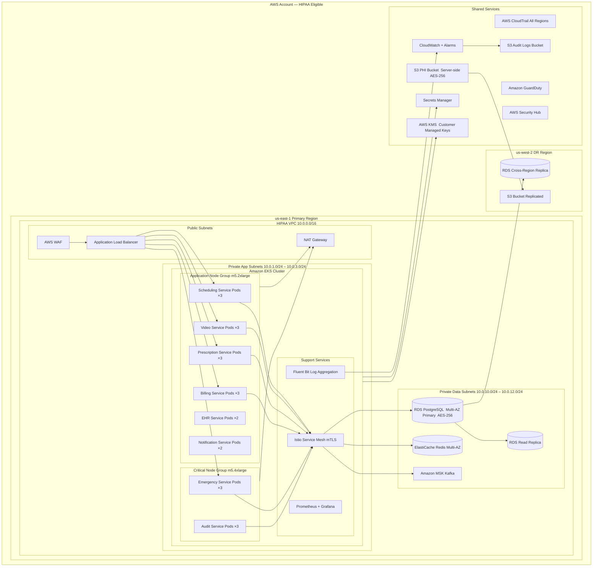
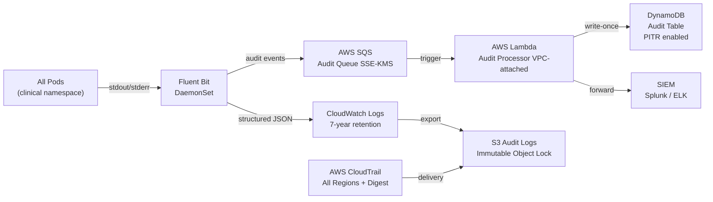
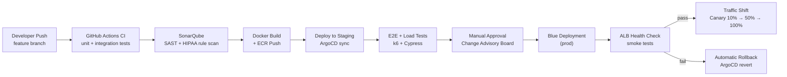

# Deployment Diagram — Telemedicine Platform

## Overview — HIPAA-compliant Kubernetes deployment on AWS EKS

The Telemedicine Platform runs on Amazon EKS within a dedicated HIPAA-eligible AWS account. All workloads handling Protected Health Information (PHI) are isolated in private subnets, encrypted at rest and in transit, and governed by strict network policies. A secondary disaster-recovery region (us-west-2) maintains replicated data with automated Route 53 failover.

---

## Deployment Architecture



---

## Kubernetes Deployment Specifications

### SchedulingService Deployment

```yaml
apiVersion: apps/v1
kind: Deployment
metadata:
  name: scheduling-service
  namespace: clinical
  annotations:
    hipaa.telemedicine.io/phi-handler: "true"
    hipaa.telemedicine.io/data-classification: "phi"
    hipaa.telemedicine.io/audit-level: "full"
spec:
  replicas: 3
  selector:
    matchLabels:
      app: scheduling-service
  strategy:
    type: RollingUpdate
    rollingUpdate:
      maxUnavailable: 1
      maxSurge: 1
  template:
    metadata:
      labels:
        app: scheduling-service
        version: "1.0"
        hipaa-scope: "true"
    spec:
      serviceAccountName: scheduling-service-sa   # IRSA — bound to narrow IAM role
      automountServiceAccountToken: true
      securityContext:
        runAsNonRoot: true
        runAsUser: 1000
        fsGroup: 2000
        seccompProfile:
          type: RuntimeDefault
      containers:
        - name: scheduling-service
          image: 123456789.dkr.ecr.us-east-1.amazonaws.com/scheduling-service:1.0.0
          ports:
            - containerPort: 8080
          resources:
            requests:
              cpu: "500m"
              memory: "512Mi"
            limits:
              cpu: "1000m"
              memory: "1Gi"
          livenessProbe:
            httpGet:
              path: /health/live
              port: 8080
            initialDelaySeconds: 30
            periodSeconds: 15
            failureThreshold: 3
          readinessProbe:
            httpGet:
              path: /health/ready
              port: 8080
            initialDelaySeconds: 10
            periodSeconds: 10
            failureThreshold: 3
          env:
            - name: DB_PASSWORD
              valueFrom:
                secretKeyRef:
                  name: scheduling-db-secret    # Synced from AWS Secrets Manager via ESO
                  key: password
            - name: PHI_ENCRYPTION_KEY_ARN
              valueFrom:
                secretKeyRef:
                  name: scheduling-kms-secret
                  key: key_arn
            - name: APP_ENV
              value: "production"
          volumeMounts:
            - name: tmp-dir
              mountPath: /tmp
      volumes:
        - name: tmp-dir
          emptyDir: {}
      affinity:
        podAntiAffinity:
          requiredDuringSchedulingIgnoredDuringExecution:
            - labelSelector:
                matchLabels:
                  app: scheduling-service
              topologyKey: topology.kubernetes.io/zone
```

### VideoService HorizontalPodAutoscaler

```yaml
apiVersion: autoscaling/v2
kind: HorizontalPodAutoscaler
metadata:
  name: video-service-hpa
  namespace: clinical
spec:
  scaleTargetRef:
    apiVersion: apps/v1
    kind: Deployment
    name: video-service
  minReplicas: 3
  maxReplicas: 20
  metrics:
    - type: Resource
      resource:
        name: cpu
        target:
          type: Utilization
          averageUtilization: 70
    - type: Resource
      resource:
        name: memory
        target:
          type: Utilization
          averageUtilization: 80
  behavior:
    scaleUp:
      stabilizationWindowSeconds: 60
      policies:
        - type: Pods
          value: 4
          periodSeconds: 60
    scaleDown:
      stabilizationWindowSeconds: 300
      policies:
        - type: Pods
          value: 1
          periodSeconds: 120
```

### EmergencyService PriorityClass

```yaml
apiVersion: scheduling.k8s.io/v1
kind: PriorityClass
metadata:
  name: emergency-critical
value: 1000000
globalDefault: false
preemptionPolicy: PreemptLowerPriority
description: "Highest scheduling priority for emergency service pods. Preempts all lower-priority workloads."
---
apiVersion: apps/v1
kind: Deployment
metadata:
  name: emergency-service
  namespace: clinical
spec:
  replicas: 3
  template:
    spec:
      priorityClassName: emergency-critical
      tolerations:
        - key: "dedicated"
          operator: "Equal"
          value: "critical"
          effect: "NoSchedule"
      nodeSelector:
        node-group: critical
```

### NetworkPolicy — Clinical Namespace

```yaml
apiVersion: networking.k8s.io/v1
kind: NetworkPolicy
metadata:
  name: clinical-namespace-policy
  namespace: clinical
spec:
  podSelector: {}          # Applies to all pods in the clinical namespace
  policyTypes:
    - Ingress
    - Egress
  ingress:
    - from:
        - namespaceSelector:
            matchLabels:
              kubernetes.io/metadata.name: istio-system
        - podSelector:
            matchLabels:
              hipaa-scope: "true"
      ports:
        - protocol: TCP
          port: 8080
        - protocol: TCP
          port: 15010    # Istio pilot
  egress:
    - to:
        - namespaceSelector:
            matchLabels:
              kubernetes.io/metadata.name: clinical
      ports:
        - protocol: TCP
          port: 5432     # PostgreSQL
        - protocol: TCP
          port: 6379     # Redis
        - protocol: TCP
          port: 443      # AWS service endpoints (KMS, Secrets Manager)
    - to:
        - namespaceSelector:
            matchLabels:
              kubernetes.io/metadata.name: monitoring
      ports:
        - protocol: TCP
          port: 9090
```

### PodDisruptionBudgets — Critical Services

```yaml
apiVersion: policy/v1
kind: PodDisruptionBudget
metadata:
  name: scheduling-service-pdb
  namespace: clinical
spec:
  minAvailable: 2
  selector:
    matchLabels:
      app: scheduling-service
---
apiVersion: policy/v1
kind: PodDisruptionBudget
metadata:
  name: emergency-service-pdb
  namespace: clinical
spec:
  minAvailable: 2
  selector:
    matchLabels:
      app: emergency-service
---
apiVersion: policy/v1
kind: PodDisruptionBudget
metadata:
  name: video-service-pdb
  namespace: clinical
spec:
  minAvailable: 2
  selector:
    matchLabels:
      app: video-service
---
apiVersion: policy/v1
kind: PodDisruptionBudget
metadata:
  name: audit-service-pdb
  namespace: clinical
spec:
  minAvailable: 2
  selector:
    matchLabels:
      app: audit-service
```

---

## PHI Encryption at Rest

| Layer | Mechanism | Key Management |
|---|---|---|
| RDS PostgreSQL | AES-256 via AWS KMS CMK | Separate CMK per service, annual rotation |
| S3 PHI Bucket | SSE-KMS with S3 Bucket Key | Bucket Key enabled to reduce KMS API calls |
| EBS Node Volumes | EBS encryption enabled at account level | KMS CMK attached to EKS node launch template |
| ElastiCache Redis | At-rest encryption enabled on cluster creation | KMS CMK for Redis |
| Application Layer | AES-256-GCM applied to PHI fields before DB write | Key from KMS Data Key; envelope encryption |
| MSK Kafka | Broker-level EBS encryption | KMS CMK per MSK cluster |

All KMS CMKs are customer-managed, not AWS-managed, to ensure the platform retains full key policy control. Key policies enforce separation of duty: the EKS IRSA role may only call `kms:Decrypt` and `kms:GenerateDataKey`; no human IAM user may call `kms:Decrypt` without MFA.

---

## PHI Encryption in Transit

- **TLS 1.3** enforced on all ALB HTTPS listeners; TLS 1.0 and 1.1 policies are explicitly disabled.
- **Istio mTLS** in `STRICT` mode applied across the entire `clinical` namespace; sidecar certificates rotate every 24 hours via Istio's built-in cert-manager.
- **Log scrubbing middleware** runs in every service before emitting structured logs; regex patterns strip SSN, DOB, MRN, phone, and email fields.
- **Secrets Manager exclusively** stores credentials and PHI-adjacent config; environment variables contain only non-sensitive references (ARNs, region names).
- **MSK TLS** enforced between producers/consumers and brokers; plaintext transport disabled at cluster level.

---

## Audit Logging Infrastructure



- CloudWatch Log Groups are set to `COMPLIANCE_SUMMARY` retention class with a minimum 7-year (2,557-day) retention policy, satisfying 45 CFR §164.530(j).
- DynamoDB audit table uses `PAY_PER_REQUEST` billing with Point-in-Time Recovery (PITR) enabled; table items are immutable (no `UpdateItem` IAM permission on the writer role).
- CloudTrail log file validation enabled; digest files stored in a separate S3 prefix protected by Object Lock (GOVERNANCE mode, 7 years).

---

## High Availability Configuration

| Service | Replicas | AZs Covered | RTO | RPO | Failover Type |
|---|---|---|---|---|---|
| Scheduling Service | 3 | 3 (us-east-1a/b/c) | < 30 s | 0 | Kubernetes rolling update |
| Video Service | 3–20 (HPA) | 3 | < 30 s | 0 | HPA scale-out + pod anti-affinity |
| Emergency Service | 3 | 3 | < 15 s | 0 | PriorityClass preemption |
| Prescription Service | 3 | 3 | < 30 s | 0 | Rolling update |
| Billing Service | 3 | 3 | < 30 s | 0 | Rolling update |
| EHR Service | 2 | 2 | < 60 s | 0 | Rolling update |
| Audit Service | 3 | 3 | < 30 s | 0 | Rolling update |
| RDS PostgreSQL | Multi-AZ | 2 | < 60 s | < 1 min | Automatic RDS failover |
| ElastiCache Redis | Multi-AZ | 2 | < 30 s | < 5 s | Automatic Redis failover |
| EKS Control Plane | Managed by AWS | 3 | N/A | N/A | 99.95% SLA |
| Full DR (us-west-2) | Warm standby | Cross-region | < 1 hr | < 1 min | Route 53 health-check failover |

---

## Release and Rollout Strategy



Canary releases use Istio `VirtualService` weight-based routing, shifting 10 % of traffic to the new version, waiting 5 minutes per increment while monitoring error rate and P99 latency in Grafana before advancing.
