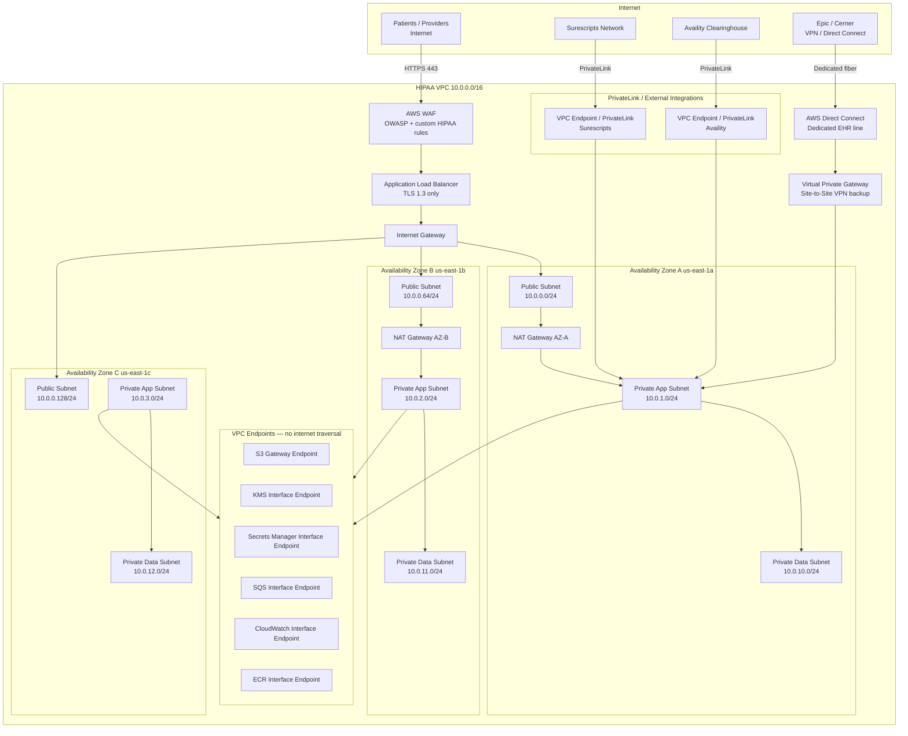
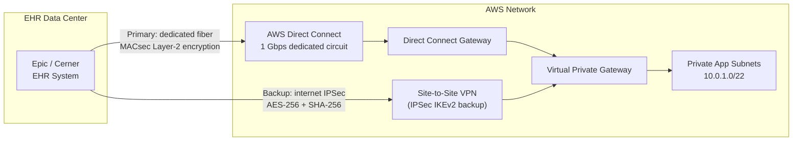
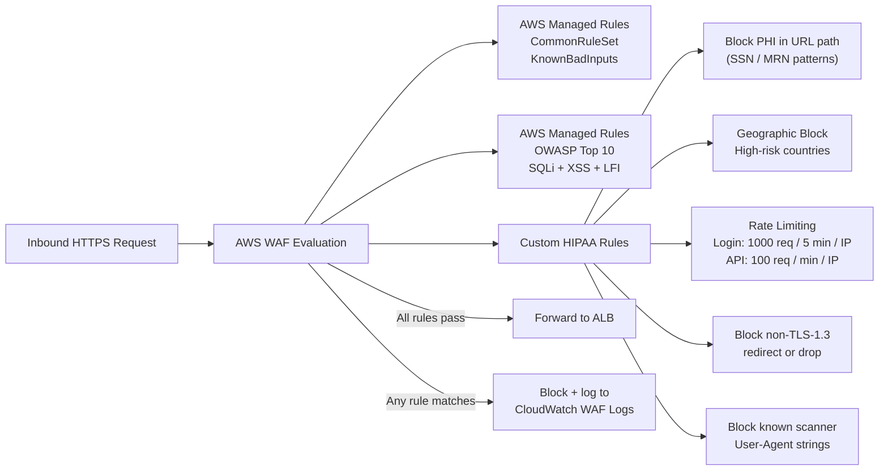
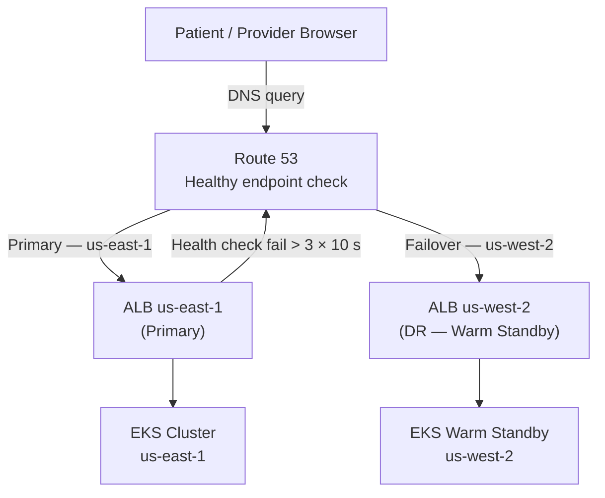

# Network Infrastructure — Telemedicine Platform

## Overview — HIPAA-eligible VPC design, zero-trust network model

The Telemedicine Platform adopts a zero-trust network architecture inside a dedicated HIPAA-eligible AWS VPC. No workload is trusted by default based on network location alone; every connection is verified by security groups, network ACLs, Istio mTLS, and IAM. PHI never traverses the public internet — all third-party integrations use AWS PrivateLink or AWS Direct Connect.

---

## VPC Architecture

---

## CIDR Allocation Table

| Subnet | CIDR | AZ | Tier | Route Table |
|---|---|---|---|---|
| Public A | 10.0.0.0/24 | us-east-1a | Public | rtb-public (IGW) |
| Public B | 10.0.0.64/24 | us-east-1b | Public | rtb-public (IGW) |
| Public C | 10.0.0.128/24 | us-east-1c | Public | rtb-public (IGW) |
| Private App A | 10.0.1.0/24 | us-east-1a | Application | rtb-app-a (NAT-A) |
| Private App B | 10.0.2.0/24 | us-east-1b | Application | rtb-app-b (NAT-B) |
| Private App C | 10.0.3.0/24 | us-east-1c | Application | rtb-app-c (NAT-B) |
| Private Data A | 10.0.10.0/24 | us-east-1a | Data | rtb-data (no internet) |
| Private Data B | 10.0.11.0/24 | us-east-1b | Data | rtb-data (no internet) |
| Private Data C | 10.0.12.0/24 | us-east-1c | Data | rtb-data (no internet) |
| Management | 10.0.20.0/24 | us-east-1a | Admin | rtb-mgmt (restricted) |

---

## Security Groups

| Security Group | Inbound Rules | Outbound Rules | Attached To |
|---|---|---|---|
| `alb-sg` | TCP 443 from `0.0.0.0/0` (WAF-fronted) | TCP 8080 to `app-sg` | Application Load Balancer |
| `app-sg` | TCP 8080 from `alb-sg`; TCP 15000–15010 from `app-sg` (Istio) | TCP 5432 to `data-sg`; TCP 6379 to `data-sg`; TCP 443 to `vpc-endpoints-sg` | EKS worker nodes (application node group) |
| `critical-sg` | TCP 8080 from `app-sg`; TCP 15000–15010 from `app-sg` (Istio) | TCP 5432 to `data-sg`; TCP 6379 to `data-sg`; TCP 443 to `0.0.0.0/0` (911 CAD API) | EKS worker nodes (critical node group) |
| `data-sg` | TCP 5432 from `app-sg` and `critical-sg`; TCP 6379 from `app-sg` | None (no outbound to internet) | RDS, ElastiCache, MSK |
| `vpc-endpoints-sg` | TCP 443 from `app-sg` and `critical-sg` | None | KMS, Secrets Manager, SQS, CloudWatch endpoints |
| `bastion-sg` | TCP 22 from `10.0.20.0/24` (management subnet) only | TCP 22 to `app-sg`; TCP 5432 to `data-sg` | Bastion host (SSM preferred) |
| `directconnect-sg` | TCP 443, 8080 from `10.1.0.0/16` (EHR CIDR) | TCP 443 to `app-sg` | Direct Connect VIF attachment |

> **Note:** The `emergency-sg` (`critical-sg` above) permits outbound TCP 443 to `0.0.0.0/0` exclusively for integration with 911 Computer-Aided Dispatch (CAD) APIs, which lack PrivateLink. All other data-plane outbound traffic is blocked.

---

## Network ACLs

Network ACLs provide stateless defense-in-depth in addition to stateful security groups.

| Subnet Tier | Rule # | Direction | Protocol | Port Range | Source / Dest | Action |
|---|---|---|---|---|---|---|
| **Public** | 100 | Inbound | TCP | 443 | 0.0.0.0/0 | ALLOW |
| Public | 110 | Inbound | TCP | 1024–65535 | 0.0.0.0/0 | ALLOW (ephemeral) |
| Public | 32766 | Inbound | All | All | 0.0.0.0/0 | DENY |
| Public | 100 | Outbound | TCP | 8080 | 10.0.1.0/22 | ALLOW |
| Public | 110 | Outbound | TCP | 1024–65535 | 0.0.0.0/0 | ALLOW (ephemeral) |
| Public | 32766 | Outbound | All | All | 0.0.0.0/0 | DENY |
| **Private App** | 100 | Inbound | TCP | 8080 | 10.0.0.0/22 | ALLOW (from public) |
| Private App | 110 | Inbound | TCP | 1024–65535 | 10.0.0.0/16 | ALLOW (ephemeral) |
| Private App | 32766 | Inbound | All | All | 0.0.0.0/0 | DENY |
| Private App | 100 | Outbound | TCP | 5432 | 10.0.10.0/22 | ALLOW |
| Private App | 110 | Outbound | TCP | 6379 | 10.0.10.0/22 | ALLOW |
| Private App | 120 | Outbound | TCP | 443 | 10.0.0.0/16 | ALLOW (endpoints) |
| Private App | 130 | Outbound | TCP | 1024–65535 | 10.0.0.0/16 | ALLOW (ephemeral) |
| Private App | 32766 | Outbound | All | All | 0.0.0.0/0 | DENY |
| **Private Data** | 100 | Inbound | TCP | 5432 | 10.0.1.0/22 | ALLOW |
| Private Data | 110 | Inbound | TCP | 6379 | 10.0.1.0/22 | ALLOW |
| Private Data | 120 | Inbound | TCP | 9092 | 10.0.1.0/22 | ALLOW (Kafka) |
| Private Data | 32766 | Inbound | All | All | 0.0.0.0/0 | DENY |
| Private Data | 100 | Outbound | TCP | 1024–65535 | 10.0.1.0/22 | ALLOW (ephemeral) |
| Private Data | 32766 | Outbound | All | All | 0.0.0.0/0 | DENY |

---

## VPN and Direct Connect

- **AWS Direct Connect** provides a dedicated 1 Gbps circuit between the EHR data center and the VPC. MACsec (802.1AE) encryption is enabled on the connection for Layer-2 encryption of in-transit PHI.
- **Site-to-Site VPN** (IKEv2, AES-256-GCM, SHA-384 HMAC) acts as automatic failover. Route 53 health checks detect Direct Connect failures within 30 seconds and update DNS to route through VPN.
- **Surescripts PrivateLink** connects the Prescription Service to the Surescripts network without exposing ePrescription data to the public internet. No NAT gateway traversal occurs for this traffic.
- **Availity PrivateLink** provides the Billing Service a private path to the Availity clearinghouse for eligibility checks and claims submission.

---

## BAA-Covered Service Configuration

| AWS Service | PHI Stored | BAA Coverage | Encryption Config | Access Controls |
|---|---|---|---|---|
| RDS for PostgreSQL | Yes — primary PHI data store | AWS BAA | AES-256 KMS CMK; TDE at storage layer | IAM authentication + DB password via Secrets Manager; no public endpoint |
| Amazon S3 | Yes — consented recordings, documents, archives | AWS BAA | SSE-KMS with per-bucket CMK; Bucket Key enabled | Bucket policy denying non-TLS; IAM IRSA roles; no ACLs |
| ElastiCache for Redis | Yes — session state, real-time PHI cache | AWS BAA | At-rest encryption (KMS CMK) + in-transit TLS | AUTH token required; no public endpoint; `data-sg` isolation |
| Amazon SQS | Yes — encrypted PHI payloads in messages | AWS BAA | SSE-KMS on queue; message-level AES-256-GCM in application | IAM resource policies; IRSA per queue; DLQ for failed deliveries |
| AWS CloudTrail | Indirect — API audit logs with resource ARNs | AWS BAA | Log delivery to S3 SSE-KMS; log file validation enabled | Immutable via S3 Object Lock; CloudTrail integrity digests |
| Amazon Chime SDK | Yes — live video/audio streams | AWS BAA | DTLS/SRTP end-to-end for media; TLS for signaling | Meeting tokens scoped per session; no persistent media storage |
| Amazon EKS | Yes — PHI in running processes | AWS BAA | EBS encryption for nodes; etcd secrets encryption at rest | RBAC with namespace isolation; IRSA; OPA/Gatekeeper policy enforcement |
| AWS KMS | Indirect — wraps PHI encryption keys | AWS BAA | Hardware HSM (FIPS 140-2 Level 3) | Key policy: least-privilege; MFA required for admin; no shared CMKs |
| AWS Secrets Manager | Credential PHI-adjacent | AWS BAA | KMS-encrypted secrets | IRSA access; automatic rotation every 90 days; no cross-account sharing |
| Amazon CloudWatch | Indirect — scrubbed log data | AWS BAA | KMS-encrypted log groups | Log group resource policies; no public export |
| Amazon GuardDuty | Log metadata | AWS BAA | N/A (analysis only) | Read-only findings output to Security Hub |
| AWS Lambda | PHI in event payloads (audit events) | AWS BAA | KMS encryption for environment variables | VPC-attached; IRSA; execution role with least privilege |

---

## WAF Rules

- AWS WAF logs are delivered to CloudWatch Logs with a retention of 365 days; sampled request logs capture headers (excluding `Authorization` and `Cookie` values) for forensic review.
- WAF is placed in front of the ALB; CloudFront (if deployed for static assets) has a second, identical WAF Web ACL association.
- Custom rule for PHI-in-URL uses regex matching: patterns `\b\d{3}-\d{2}-\d{4}\b` (SSN) and `MRN[:\s]\d+` are blocked with a 400 response and an alert to the Security Hub custom findings integration.

---

## DDoS Protection

| Layer | Protection Mechanism | Coverage | Notes |
|---|---|---|---|
| Network (L3/L4) | AWS Shield Standard | All public endpoints | Automatic, no configuration required |
| Network + Application (L3–L7) | AWS Shield Advanced | ALB, Route 53 | 24/7 DDoS Response Team; cost protection for scaling |
| Application (L7) | AWS WAF rate limiting | ALB | Per-IP and per-session thresholds |
| DNS | Route 53 + Shield Advanced | Global | Anycast DNS network; Shuffle Sharding |
| Emergency Endpoints | AWS Shield Advanced + dedicated WAF ACL | `/api/emergency/*` | Stricter rate limits; geo-restriction to domestic IPs |

Shield Advanced is enrolled on the ALB and Route 53 hosted zone. The 24/7 DDoS Response Team (DRT) has proactive engagement enabled, allowing AWS to apply custom mitigations during an active attack without requiring a support ticket.

---

## DNS and Traffic Routing

- Route 53 health checks poll `/health/live` on the ALB every 10 seconds; three consecutive failures trigger automatic DNS failover to us-west-2 (TTL 30 seconds).
- Latency-based routing is disabled in production to ensure consistent data sovereignty; all production traffic routes to us-east-1 unless a failover event occurs.
