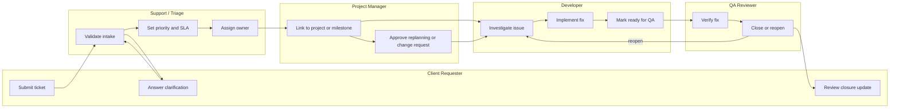
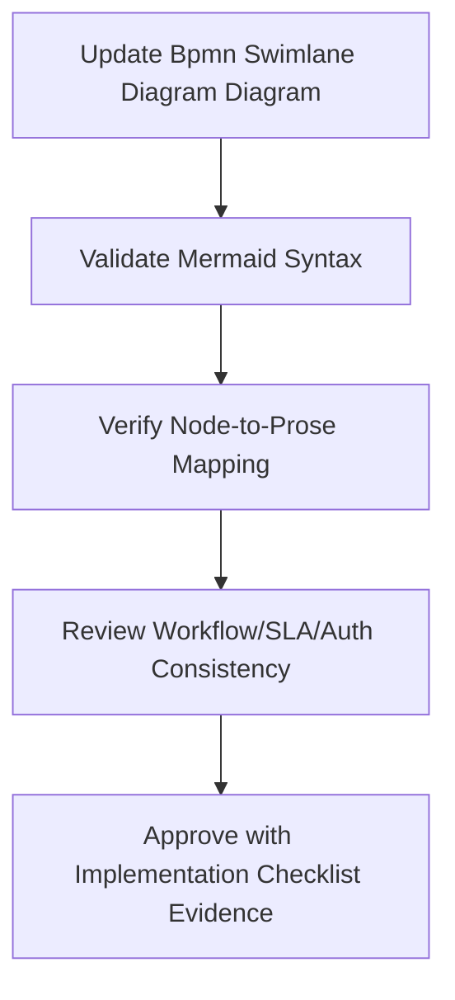

# BPMN Swimlane Diagram - Ticketing and Project Management System

## Swimlane Interpretation

- The client lane is intentionally narrow: submit evidence, answer questions, and review updates.
- Internal delivery governance lives across triage, project management, engineering, and QA lanes.
- Replanning is explicit so milestone risk is visible before resolution dates are missed.

## Cross-Cutting Workflow and Operational Governance

### Bpmn Swimlane Diagram: Document-Specific Scope
- Primary focus for this artifact: **handoff accountability across client/support/engineering swimlanes**.
- Implementation handoff expectation: this document must be sufficient for an engineer/architect/operator to implement without hidden assumptions.
- Traceability anchor: `ANALYSIS_BPMN_SWIMLANE_DIAGRAM` should be referenced in backlog items, design reviews, and release checklists when this artifact changes.

### Workflow and State Machine Semantics (ANALYSIS_BPMN_SWIMLANE_DIAGRAM)
- For this document, workflow guidance must **bind business scenarios to evented state transitions including negative paths**.
- Transition definitions must include trigger, actor, guard, failure code, side effects, and audit payload contract.
- Any asynchronous transition path must define idempotency key strategy and replay safety behavior.

### SLA and Escalation Rules (ANALYSIS_BPMN_SWIMLANE_DIAGRAM)
- For this document, SLA guidance must **model pause/resume/escalate behaviors and ownership transfers**.
- Escalation must explicitly identify owner, dwell-time threshold, notification channel, and acknowledgement requirement.
- Breach and near-breach states must be queryable in reporting without recomputing from free-form notes.

### Permission Boundaries (ANALYSIS_BPMN_SWIMLANE_DIAGRAM)
- For this document, permission guidance must **map actor boundaries and authorization failures in primary/alternate flows**.
- Privileged actions require reason codes, actor identity, and immutable audit entries.
- Client-visible payloads must be explicitly redacted from internal-only and regulated fields.

### Reporting and Metrics (ANALYSIS_BPMN_SWIMLANE_DIAGRAM)
- For this document, reporting guidance must **trace KPI source events and decision points for operational governance**.
- Metric definitions must include numerator/denominator, time window, dimensional keys, and null/missing-data behavior.
- Each metric should map to raw events/tables so results are reproducible during audits.

### Operational Edge-Case Handling (ANALYSIS_BPMN_SWIMLANE_DIAGRAM)
- For this document, operational guidance must **cover compensation behavior for partial success and temporal inconsistency**.
- Partial failure handling must identify what is rolled back, compensated, or deferred.
- Recovery completion criteria must be measurable (not subjective) and tied to dashboard/alert signals.

### Implementation Readiness Checklist (ANALYSIS_BPMN_SWIMLANE_DIAGRAM)
| Checklist Item | This Document Must Provide | Validation Evidence |
|---|---|---|
| Workflow Contract Completeness | All relevant states, transitions, and invalid paths for `analysis/bpmn-swimlane-diagram.md` | Scenario walkthrough + transition test mapping |
| SLA/ Escalation Determinism | Timer, pause, escalation, and override semantics | Policy table review + simulated timer run |
| Authorization Correctness | Role scope, tenant scope, and field visibility boundaries | Auth matrix review + API/UI parity checks |
| Reporting Reproducibility | KPI formulas, dimensions, and source lineage | Recompute KPI from event data sample |
| Operations Recoverability | Degraded-mode and compensation runbook steps | Tabletop/game-day evidence and postmortem template |

### Mermaid Diagram Contract (ANALYSIS_BPMN_SWIMLANE_DIAGRAM)
- Diagram syntax must remain Mermaid JS compatible and parse in standard Markdown renderers.
- Every node/edge must map to a term defined in this file to avoid orphaned visual semantics.
- Update both diagram and prose together whenever adding/removing workflow states, actors, services, or data stores.

