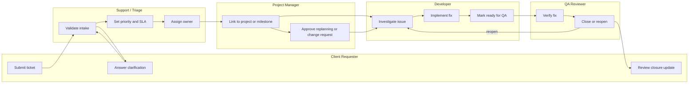

# BPMN Swimlane Diagram - Ticketing and Project Management System

## Swimlane Interpretation

- The client lane is intentionally narrow: submit evidence, answer questions, and review updates.
- Internal delivery governance lives across triage, project management, engineering, and QA lanes.
- Replanning is explicit so milestone risk is visible before resolution dates are missed.
