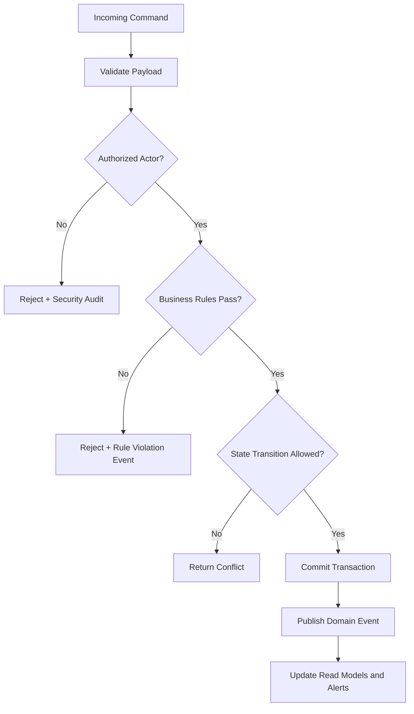

# Business Rules

This document defines enforceable policy rules for **Ticketing and Project Management System** so command processing, asynchronous jobs, and operational actions behave consistently under normal and exceptional conditions.

## Context
- Domain focus: ticketing and project management workflows.
- Rule categories: lifecycle transitions, authorization, compliance, and resilience.
- Enforcement points: APIs, workflow/state engines, background processors, and administrative consoles.

## Enforceable Rules
1. Every state-changing command must pass authentication, authorization, and schema validation before processing.
2. Lifecycle transitions must follow the configured state graph; invalid transitions are rejected with explicit reason codes.
3. High-impact operations (financial, security, or regulated data actions) require additional approval evidence.
4. Manual overrides must include approver identity, rationale, and expiration timestamp.
5. Retries and compensations must be idempotent and must not create duplicate business effects.

## Rule Evaluation Pipeline

## Exception and Override Handling
- Overrides are restricted to approved exception classes and require dual logging (business + security audit).
- Override windows automatically expire and trigger follow-up verification tasks.
- Repeated override patterns are reviewed for policy redesign and automation improvements.

## Cross-Cutting Workflow and Operational Governance

### Business Rules: Document-Specific Scope
- Primary focus for this artifact: **decision rules, policy constraints, and enforcement order**.
- Implementation handoff expectation: this document must be sufficient for an engineer/architect/operator to implement without hidden assumptions.
- Traceability anchor: `ANALYSIS_BUSINESS_RULES` should be referenced in backlog items, design reviews, and release checklists when this artifact changes.

### Workflow and State Machine Semantics (ANALYSIS_BUSINESS_RULES)
- For this document, workflow guidance must **bind business scenarios to evented state transitions including negative paths**.
- Transition definitions must include trigger, actor, guard, failure code, side effects, and audit payload contract.
- Any asynchronous transition path must define idempotency key strategy and replay safety behavior.

### SLA and Escalation Rules (ANALYSIS_BUSINESS_RULES)
- For this document, SLA guidance must **model pause/resume/escalate behaviors and ownership transfers**.
- Escalation must explicitly identify owner, dwell-time threshold, notification channel, and acknowledgement requirement.
- Breach and near-breach states must be queryable in reporting without recomputing from free-form notes.

### Permission Boundaries (ANALYSIS_BUSINESS_RULES)
- For this document, permission guidance must **map actor boundaries and authorization failures in primary/alternate flows**.
- Privileged actions require reason codes, actor identity, and immutable audit entries.
- Client-visible payloads must be explicitly redacted from internal-only and regulated fields.

### Reporting and Metrics (ANALYSIS_BUSINESS_RULES)
- For this document, reporting guidance must **trace KPI source events and decision points for operational governance**.
- Metric definitions must include numerator/denominator, time window, dimensional keys, and null/missing-data behavior.
- Each metric should map to raw events/tables so results are reproducible during audits.

### Operational Edge-Case Handling (ANALYSIS_BUSINESS_RULES)
- For this document, operational guidance must **cover compensation behavior for partial success and temporal inconsistency**.
- Partial failure handling must identify what is rolled back, compensated, or deferred.
- Recovery completion criteria must be measurable (not subjective) and tied to dashboard/alert signals.

### Implementation Readiness Checklist (ANALYSIS_BUSINESS_RULES)
| Checklist Item | This Document Must Provide | Validation Evidence |
|---|---|---|
| Workflow Contract Completeness | All relevant states, transitions, and invalid paths for `analysis/business-rules.md` | Scenario walkthrough + transition test mapping |
| SLA/ Escalation Determinism | Timer, pause, escalation, and override semantics | Policy table review + simulated timer run |
| Authorization Correctness | Role scope, tenant scope, and field visibility boundaries | Auth matrix review + API/UI parity checks |
| Reporting Reproducibility | KPI formulas, dimensions, and source lineage | Recompute KPI from event data sample |
| Operations Recoverability | Degraded-mode and compensation runbook steps | Tabletop/game-day evidence and postmortem template |

