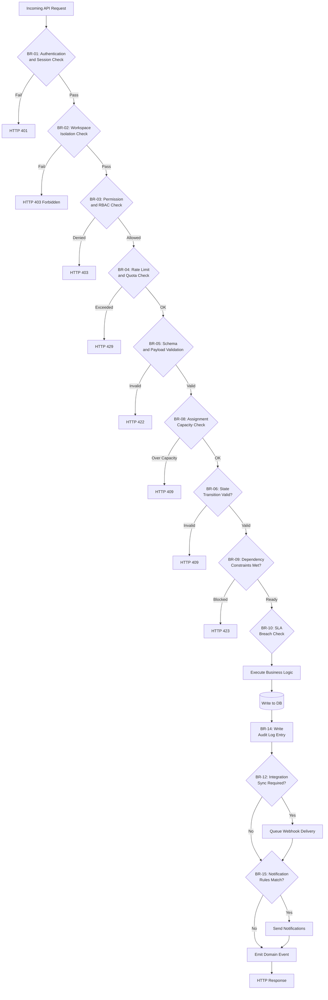

# Business Rules — Ticketing and Project Management System

**Version:** 1.0  
**Status:** Approved  
**Last Updated:** 2025-01-15  

---

## Table of Contents

1. [Overview](#1-overview)
2. [Rule Evaluation Pipeline](#2-rule-evaluation-pipeline)
3. [Enforceable Rules](#3-enforceable-rules)
4. [Exception and Override Handling](#4-exception-and-override-handling)
5. [Traceability Table](#5-traceability-table)

---

## 1. Overview

This document defines the enforceable business rules governing the Ticketing and Project Management System's behavior. These rules are platform-level invariants that apply across all workspaces, projects, and boards. Rules are evaluated at specific pipeline stages (request validation, pre-write authorization check, state transition validation, post-write event emission) and are enforced by designated services.

Business rules in this system cover six primary domains:
- **Ticket Lifecycle Management**: State transitions, workflow enforcement, automation triggers
- **Project Planning**: Sprint management, backlog grooming, release planning
- **Resource Management**: Assignment policies, capacity planning, time tracking
- **Access Control**: Role-based permissions, workspace isolation, guest access
- **Integration Integrity**: External system synchronization, webhook delivery, API rate limiting
- **SLA and Escalation**: Response time enforcement, auto-escalation, on-call routing

These rules ensure data consistency, enforce organizational policies, prevent unauthorized operations, and maintain audit trails for compliance.

---

## 2. Rule Evaluation Pipeline



---

## 3. Enforceable Rules

---

### BR-01 — Authentication and Session Validation

**Category:** Security / Authentication  
**Enforcer:** API Gateway / Auth Middleware  

Every API request MUST present a valid authentication credential: either a session cookie (for web UI), a JWT access token (for API clients), or an API key (for integrations). Session tokens MUST be validated against the active session store (Redis) and MUST NOT be expired. JWT tokens MUST be verified using the platform's public signing key and MUST contain valid `workspace_id`, `user_id`, and `exp` claims. API keys MUST be scoped to specific capabilities (read-only, write, admin) and MUST match the requested operation type.

**Rule Logic:**
```
ALLOW if:
  (session_cookie.exists AND session_store.is_active(session_id) AND session.not_expired)
  OR (jwt.signature_valid AND jwt.exp > now() AND jwt.workspace_id == request.workspace_id)
  OR (api_key.valid AND api_key.scope includes request.operation_type)
DENY with HTTP 401 otherwise
```

**Exceptions:** Platform operators with `platform:admin` scope bypass workspace-level checks but are still logged in audit trail.

**Audit:** Failed authentication attempts are logged with source IP, attempted user/key, and failure reason.

---

### BR-02 — Workspace Isolation

**Category:** Multi-Tenancy  
**Enforcer:** All Services  

No API response MUST include resources (projects, boards, tickets, comments, attachments, time logs) belonging to a different Workspace than the authenticated caller's Workspace. This applies to all read and write operations. Database queries, search operations, and report generation are all automatically scoped to the caller's Workspace before execution. Cross-workspace references (e.g., linking tickets across workspaces) are prohibited.

**Rule Logic:**
```
All database queries MUST include:
  WHERE workspace_id = :caller_workspace_id
  AND (project_id IN :caller_accessible_projects OR project_id IS NULL)
```

**Violation Response:** HTTP 403 if attempting to explicitly reference a foreign resource ID by URL manipulation.  
**Audit:** Any attempt to access cross-workspace resources is logged as an `UnauthorizedAccessAttempt` event with full request context.

---

### BR-03 — Role-Based Permission Enforcement

**Category:** Authorization  
**Enforcer:** Permission Service / RBAC Module  

Every operation MUST be authorized against the user's effective permissions within the target Project or Workspace. The platform supports hierarchical roles:
- **Workspace Admin**: Full control over workspace settings, projects, and members
- **Project Admin**: Full control over project configuration, boards, and sprints
- **Project Manager**: Manage tickets, sprints, reports; cannot delete project
- **Developer**: Create/update tickets, log time, comment; cannot manage sprints
- **Reporter**: Create tickets and comments; read-only on others' tickets
- **Guest**: Read-only access to specific tickets; no creation rights

Permissions are evaluated hierarchically: workspace-level permissions override project-level, and explicit denies override allows.

**Rule Logic:**
```
ALLOW if:
  user.has_workspace_permission(operation.permission, workspace_id)
  OR user.has_project_permission(operation.permission, project_id)
  OR operation.is_public_read
DENY with HTTP 403 otherwise
```

**Custom Permissions:** Projects can define custom roles with granular permissions (e.g., "can_delete_comments", "can_override_assignee", "can_export_data").

---

### BR-04 — Rate Limiting and Quota Enforcement

**Category:** Resource Management  
**Enforcer:** API Gateway / Rate Limiter  

API requests are rate-limited per user and per workspace to prevent abuse and ensure fair resource allocation. Rate limits are enforced using a sliding window algorithm with Redis-backed counters.

**Rate Limit Tiers:**
| Tier | Requests/Minute (per user) | Requests/Minute (per workspace) | Concurrent Uploads |
|------|---------------------------|--------------------------------|-------------------|
| Free | 60 | 300 | 5 |
| Pro | 300 | 1500 | 20 |
| Enterprise | 1000 | 5000 | 100 |

**Rule Logic:**
```
current_count = rate_limiter.get(user_id, window=60s)
if current_count >= tier.user_limit:
  REJECT with HTTP 429, Retry-After header
workspace_count = rate_limiter.get(workspace_id, window=60s)
if workspace_count >= tier.workspace_limit:
  REJECT with HTTP 429
ALLOW and increment counters
```

**Exceptions:** Internal service-to-service calls bypass rate limiting. Webhook deliveries have separate quotas.

---

### BR-05 — Request Payload Validation

**Category:** Data Integrity  
**Enforcer:** API Gateway / Input Validator  

All request payloads MUST conform to strict JSON schemas. Required fields MUST be present, field types MUST match schemas, and string lengths MUST not exceed limits. Enum fields (ticket type, priority, status) MUST contain only allowed values. Date/time fields MUST be ISO 8601 formatted.

**Validation Rules:**
- Ticket title: 1-500 characters, non-empty after trimming
- Ticket description: 0-50,000 characters (supports Markdown)
- Email addresses: RFC 5322 compliant
- URLs: Valid HTTP/HTTPS scheme
- Sprint dates: `start_date < end_date`, both in future or present
- Story points: 0-100, Fibonacci sequence preferred (1, 2, 3, 5, 8, 13, 21)
- Time log duration: 1 minute to 24 hours

**Rule Logic:**
```
VALIDATE payload against schema
if validation.errors.any?:
  REJECT with HTTP 422, errors: validation.errors
ALLOW
```

---

### BR-06 — State Transition Validation

**Category:** Workflow Management  
**Enforcer:** Workflow Engine  

Ticket state transitions MUST follow the configured workflow graph for the ticket's project. Each project defines allowed transitions between statuses (e.g., Open → In Progress → Code Review → Done). Transitions MUST satisfy preconditions:
- **Open → In Progress**: Requires assignee
- **In Progress → Code Review**: Requires linked Git branch or commit
- **Code Review → Done**: Requires approval from reviewer (if configured)
- **Done → Open**: Requires reopen reason (cannot be null)

**Workflow Graph Example:**
```
Open → [In Progress, Blocked]
In Progress → [Code Review, Testing, Blocked, Open]
Code Review → [In Progress, Testing, Done]
Testing → [In Progress, Done, Blocked]
Blocked → [Open, In Progress]
Done → [Open] (reopen only)
```

**Rule Logic:**
```
allowed_transitions = workflow.get_allowed_transitions(ticket.current_status)
if new_status NOT IN allowed_transitions:
  REJECT with HTTP 409, error: "Invalid transition from #{current_status} to #{new_status}"
if transition.requires_precondition? AND NOT precondition.met?:
  REJECT with HTTP 409, error: "Precondition not met: #{precondition.description}"
ALLOW
```

**Audit:** All state transitions are logged with timestamp, actor, previous state, new state, and transition reason.

---

### BR-07 — Sprint Management and Capacity Rules

**Category:** Project Planning  
**Enforcer:** Sprint Service  

Sprints MUST NOT overlap within the same project. A sprint's date range MUST be continuous (no gaps), and the end date MUST be at least 1 day after the start date (maximum 4 weeks). Tickets can only be assigned to one active sprint at a time. Sprint capacity (total story points) MUST NOT exceed 150% of team velocity (calculated from last 3 sprints).

**Rule Logic:**
```
existing_sprints = project.sprints.where(status: ['active', 'planned'])
if new_sprint.date_range.overlaps?(existing_sprints.any?.date_range):
  REJECT with HTTP 409, error: "Sprint dates overlap with existing sprint"
team_velocity = project.calculate_velocity(sprints: 3)
if new_sprint.total_story_points > (team_velocity * 1.5):
  WARN but ALLOW with warning: "Sprint capacity exceeds recommended 150% of velocity"
ALLOW
```

**Exceptions:** Project Admins can force-override the capacity warning with an explicit `force: true` flag.

---

### BR-08 — Assignment and Workload Capacity

**Category:** Resource Management  
**Enforcer:** Assignment Service  

A user MUST NOT be assigned more than their configured capacity limit of concurrent active tickets. Default capacity is 5 active tickets (status = In Progress or Code Review). Each user can set their own capacity limit (1-20). Attempting to assign beyond capacity requires override approval from Project Manager or Admin.

**Rule Logic:**
```
user_active_tickets = user.assigned_tickets.where(status: ['in_progress', 'code_review']).count
if user_active_tickets >= user.capacity_limit AND NOT override_approved?:
  REJECT with HTTP 409, error: "User at capacity (#{user_active_tickets}/#{user.capacity_limit})"
ALLOW
```

**Workload Balancing:** The system provides an auto-assignment algorithm that distributes new tickets based on current workload, skill tags, and historical velocity.

---

### BR-09 — Dependency and Blocking Relationship Validation

**Category:** Dependency Management  
**Enforcer:** Dependency Service  

Ticket dependencies MUST NOT form cycles. Dependency types include:
- **Blocks**: Ticket A blocks ticket B (B cannot be done until A is done)
- **Is Blocked By**: Inverse of blocks
- **Relates To**: Informational link, no enforcement
- **Duplicates**: One ticket is a duplicate of another
- **Is Duplicate Of**: Inverse of duplicates

**Rule Logic:**
```
if dependency_type IN ['blocks', 'is_blocked_by']:
  graph = project.build_dependency_graph()
  if graph.would_create_cycle?(source: ticket_a, target: ticket_b, type: dependency_type):
    REJECT with HTTP 409, error: "Dependency creates cycle in graph"
ALLOW and mark dependent ticket as 'blocked' if blocker is not 'done'
```

**Blocking Status:** A ticket automatically gets a `blocked` flag if any of its "is blocked by" dependencies are not in "Done" status. The flag is automatically removed when all blockers are resolved.

---

### BR-10 — SLA Response Time Enforcement

**Category:** Service Level Agreement  
**Enforcer:** SLA Monitor Service  

Tickets MUST be responded to within configured SLA windows based on priority:
- **Critical**: First response within 1 hour, resolution within 4 hours
- **High**: First response within 4 hours, resolution within 24 hours
- **Medium**: First response within 24 hours, resolution within 5 days
- **Low**: First response within 72 hours, resolution within 14 days

**Rule Logic:**
```
sla_config = project.sla_config_for_priority(ticket.priority)
time_since_creation = now() - ticket.created_at
if ticket.first_response_at.nil? AND time_since_creation > sla_config.first_response_sla:
  EMIT SlaBreachEvent(ticket_id, breach_type: 'first_response')
  auto_escalate_ticket(ticket, reason: 'first_response_sla_breach')
if ticket.resolved_at.nil? AND time_since_creation > sla_config.resolution_sla:
  EMIT SlaBreachEvent(ticket_id, breach_type: 'resolution')
  auto_escalate_ticket(ticket, reason: 'resolution_sla_breach')
```

**SLA Pause:** SLA timers pause when ticket status is "Waiting on Customer" or "Blocked" and resume when status changes back to active.

**Auto-Escalation:** On SLA breach, the ticket is automatically escalated to the next tier (e.g., from L1 support to L2, or from developer to team lead).

---

### BR-11 — Time Tracking and Billing Accuracy

**Category:** Time Management  
**Enforcer:** Time Tracking Service  

Time logs MUST NOT overlap for the same user. A user cannot log time on two different tickets simultaneously. Time logs MUST have a start time and end time (or duration), and the total daily logged time per user MUST NOT exceed 24 hours. Time logs can be edited within 7 days of creation; older logs require manager approval for changes.

**Rule Logic:**
```
user_time_logs = user.time_logs.where(date: log_date)
if user_time_logs.any? { |log| log.time_range.overlaps?(new_log.time_range) }:
  REJECT with HTTP 409, error: "Time log overlaps with existing entry"
daily_total = user_time_logs.sum(:duration) + new_log.duration
if daily_total > 24.hours:
  REJECT with HTTP 422, error: "Daily time limit exceeded"
if new_log.created_at < 7.days.ago AND NOT manager_approved?:
  REJECT with HTTP 403, error: "Historical time log requires manager approval"
ALLOW
```

**Billable Flag:** Each time log has a `billable` boolean flag. Billable time is aggregated for client invoicing reports.

---

### BR-12 — External Integration Sync Integrity

**Category:** Integration Management  
**Enforcer:** Integration Sync Service  

When a ticket is linked to an external system (GitHub, GitLab, Jira, Slack), state changes MUST be bidirectionally synchronized according to configured sync rules. If the external API is unavailable, the sync operation MUST be queued for retry (max 5 attempts over 24 hours). Sync conflicts (e.g., ticket closed locally but still open externally) MUST be surfaced to the user for manual resolution.

**Sync Rules:**
- **GitHub**: Ticket status changes when linked PR is merged (auto-close ticket)
- **Jira**: Bidirectional status sync every 5 minutes
- **Slack**: Post comment notifications to configured channels
- **GitLab**: Auto-link commits referencing ticket ID in commit message

**Rule Logic:**
```
if integration.enabled? AND ticket.has_external_link?(integration):
  sync_result = integration.sync(ticket)
  if sync_result.conflict?:
    CREATE ConflictResolutionTask(ticket, integration, conflict_details)
    NOTIFY project_manager
  elsif sync_result.failed?:
    QUEUE retry_job(ticket, integration, attempt: 1, max_attempts: 5)
ALLOW
```

**Idempotency:** All integration sync operations MUST be idempotent to handle duplicate webhook deliveries and retry scenarios.

---

### BR-13 — File Attachment Size and Type Restrictions

**Category:** Data Management  
**Enforcer:** Attachment Service  

File attachments MUST comply with size and type restrictions:
- **Max file size**: 100 MB per file (configurable per workspace tier)
- **Allowed types**: Images (jpg, png, gif, svg), Documents (pdf, docx, xlsx, txt, md), Archives (zip, tar.gz), Code files (common extensions)
- **Prohibited types**: Executables (.exe, .dll, .app, .sh scripts without review), suspicious archives
- **Virus scan**: All uploads MUST pass virus scanning before storage

**Rule Logic:**
```
if attachment.size > workspace.max_attachment_size:
  REJECT with HTTP 413, error: "File too large (max #{workspace.max_attachment_size})"
if attachment.extension NOT IN allowed_extensions:
  REJECT with HTTP 415, error: "File type not allowed"
scan_result = virus_scanner.scan(attachment.content)
if scan_result.infected?:
  REJECT with HTTP 422, error: "File failed virus scan"
  AUDIT SecurityEvent(type: 'infected_upload_blocked', user_id, filename)
ALLOW and store in object storage with signed URL expiry
```

---

### BR-14 — Audit Log Completeness and Immutability

**Category:** Compliance / Security  
**Enforcer:** Audit Service  

All state-changing operations MUST generate an audit log entry within 1 second of commit. Audit logs are append-only and MUST NOT be modified or deleted by application logic. Minimum retention period is 1 year (configurable per workspace for compliance needs). Audit entries MUST include: timestamp, actor (user/service), action type, resource ID, old value, new value, IP address, user agent.

**Rule Logic:**
```
on_successful_write:
  audit_entry = AuditLog.create!(
    timestamp: Time.now.utc,
    workspace_id: workspace.id,
    actor_id: current_user.id,
    actor_type: 'User',
    action: operation.action_type,
    resource_type: resource.class.name,
    resource_id: resource.id,
    changes: resource.previous_changes,
    ip_address: request.ip,
    user_agent: request.user_agent
  )
```

**Immutability:** The `audit_logs` table has no UPDATE or DELETE grants for application roles. Only SELECT and INSERT are permitted.

**Export:** Workspaces can export audit logs to external compliance systems (Splunk, AWS S3 Glacier) for long-term archival.

---

### BR-15 — Notification Delivery and User Preferences

**Category:** Notification Management  
**Enforcer:** Notification Service  

Notifications MUST respect user-configured preferences and delivery channels. Users can configure notification rules per event type (ticket assigned, comment added, status changed, mention, due date approaching) and per channel (email, Slack, in-app, mobile push). Notification batching is applied: multiple events within 15 minutes are grouped into a single digest notification.

**Channels:**
- **Email**: Immediate or daily digest
- **In-App**: Real-time via WebSocket
- **Slack**: Posted to user DM or configured project channel
- **Mobile Push**: Via Firebase Cloud Messaging (iOS/Android)

**Rule Logic:**
```
event_subscribers = notification_service.get_subscribers(event_type, resource)
for user in event_subscribers:
  user_prefs = user.notification_preferences.for_event(event_type)
  if user_prefs.enabled?:
    for channel in user_prefs.channels:
      if channel.should_batch?:
        QUEUE batched_notification(user, event, channel, batch_window: 15.minutes)
      else:
        SEND immediate_notification(user, event, channel)
```

**Unsubscribe:** Users can unsubscribe from specific tickets or projects. Unsubscribe links in emails MUST be honored immediately.

---

### BR-16 — Automation Rule Execution Safety

**Category:** Automation  
**Enforcer:** Automation Engine  

Automation rules (trigger → condition → action) MUST be executed in a sandboxed environment with timeout and rate limits. Each rule execution MUST complete within 10 seconds. Rules MUST NOT trigger recursive execution loops (max depth: 3 levels). Actions that modify tickets MUST respect the same authorization checks as manual operations.

**Automation Examples:**
- When ticket is created AND labels include "bug" → Set priority to "High", Assign to on-call engineer
- When ticket status changes to "Done" AND sprint is active → Add to sprint completion count
- When comment includes "@team-leads" → Notify all team leads via Slack

**Rule Logic:**
```
trigger_event = incoming_domain_event
matching_rules = automation_service.find_matching_rules(trigger_event)
for rule in matching_rules:
  if rule.execution_depth > 3:
    SKIP rule with warning: "Max recursion depth exceeded"
  if rule.conditions.evaluate(trigger_event):
    timeout_context = create_timeout_context(10.seconds)
    result = rule.execute_actions(trigger_event, current_user, timeout_context)
    if result.timeout?:
      LOG error: "Automation rule #{rule.id} timed out"
    AUDIT AutomationExecution(rule_id, trigger_event, result)
```

**Exceptions:** Platform-level automation rules (e.g., SLA breach escalation) bypass the 3-level recursion limit.

---

### BR-17 — Guest Access and External Sharing

**Category:** Access Control  
**Enforcer:** Guest Access Service  

Guest users (external stakeholders, clients) can be granted limited access to specific tickets without full project membership. Guest access MUST be time-limited (default 30 days, max 1 year) and MUST be revocable at any time. Guests can only view and comment on tickets they are explicitly invited to. Guests MUST NOT see internal comments (marked as `internal: true`).

**Rule Logic:**
```
if user.is_guest?:
  accessible_tickets = GuestAccess.where(user_id: user.id, expires_at: > now()).pluck(:ticket_id)
  if requested_ticket.id NOT IN accessible_tickets:
    REJECT with HTTP 403, error: "Guest access not granted for this ticket"
  if comment.internal? AND user.is_guest?:
    HIDE comment from response
ALLOW filtered response
```

**Audit:** All guest access grants and revocations are logged in audit trail.

---

### BR-18 — Custom Field Validation and Type Safety

**Category:** Data Integrity  
**Enforcer:** Custom Field Service  

Projects can define custom fields (text, number, date, dropdown, multi-select) for tickets. Custom field values MUST be validated according to field type constraints:
- **Text**: Max length 1000 characters
- **Number**: Integer or float, with optional min/max bounds
- **Date**: ISO 8601 format, optional min/max date range
- **Dropdown**: Value MUST be in predefined options list
- **Multi-Select**: All values MUST be in options list, max 10 selections

**Rule Logic:**
```
for field_id, value in ticket.custom_fields:
  field_definition = project.custom_fields.find(field_id)
  validation_result = field_definition.validate(value)
  if validation_result.invalid?:
    REJECT with HTTP 422, error: "Custom field '#{field_definition.name}': #{validation_result.error}"
ALLOW
```

---

### BR-19 — Release and Milestone Management

**Category:** Project Planning  
**Enforcer:** Release Service  

A Release MUST contain at least one completed ticket before it can be marked as "Released". Release version numbers MUST follow semantic versioning (MAJOR.MINOR.PATCH). Release dates MUST be set when status changes to "Released". Tickets associated with a release MUST all be in "Done" status before release can be finalized (optional warning override for Project Admins).

**Rule Logic:**
```
if release.status == 'released' AND release.released_at.nil?:
  release.released_at = now()
incomplete_tickets = release.tickets.where.not(status: 'done')
if incomplete_tickets.any? AND NOT force_release?:
  REJECT with HTTP 409, error: "Release contains incomplete tickets", ticket_ids: incomplete_tickets.pluck(:id)
ALLOW and generate_release_notes(release)
```

---

### BR-20 — Webhook Delivery and Retry Policy

**Category:** Integration  
**Enforcer:** Webhook Delivery Service  

Webhook delivery MUST follow a strict retry policy to ensure reliable event delivery to external systems:
- **Initial attempt**: Within 30 seconds of event occurrence
- **Retry schedule**: 1 min, 5 min, 15 min, 1 hour, 4 hours (5 total attempts)
- **Success condition**: Target endpoint returns HTTP 2xx within 10-second timeout
- **Suspension**: After 5 consecutive failures, the webhook subscription is marked `suspended` and requires manual re-enablement
- Each delivery includes `X-Webhook-Signature` HMAC-SHA256 header for verification
- Each retry includes `X-Delivery-Attempt` header (1-5)

**Rule Logic:**
```
webhook_subscriptions = project.webhooks.where(event_type: domain_event.type)
for webhook in webhook_subscriptions:
  if webhook.status == 'suspended':
    SKIP webhook
  delivery_attempt = 1
  loop do:
    result = http_post(webhook.url, body: domain_event.to_json, headers: {
      'X-Webhook-Signature': hmac_sha256(webhook.secret, domain_event.to_json),
      'X-Delivery-Attempt': delivery_attempt
    }, timeout: 10.seconds)
    if result.success?:
      AUDIT WebhookDeliverySuccess(webhook, domain_event)
      BREAK
    elsif delivery_attempt >= 5:
      webhook.update!(status: 'suspended')
      AUDIT WebhookDeliverySuspended(webhook, domain_event, failure_count: 5)
      NOTIFY project_admins
      BREAK
    else:
      wait_time = retry_schedule[delivery_attempt]
      QUEUE retry_delivery(webhook, domain_event, attempt: delivery_attempt + 1, wait: wait_time)
      BREAK
```

---

## 4. Exception and Override Handling

Certain business rules support controlled exceptions and overrides for operational flexibility:

### Override Types
1. **Capacity Override** (BR-08): Project Managers can assign beyond user capacity with explicit `force: true` flag and reason code
2. **Sprint Capacity Override** (BR-07): Admins can exceed recommended sprint capacity with warning acknowledgment
3. **Historical Time Log Edit** (BR-11): Managers can approve edits to time logs older than 7 days
4. **Release with Incomplete Tickets** (BR-19): Admins can force-release with incomplete tickets using `force_release: true`

### Override Logging
All overrides MUST be logged with:
- Override timestamp
- Authorizing user (must have sufficient role)
- Override type and affected resource
- Justification/reason code
- Automatic expiration timestamp (if applicable)

### Override Audit Trail
```
override_log = OverrideAudit.create!(
  workspace_id: workspace.id,
  override_type: 'capacity_override',
  authorized_by: current_user.id,
  target_resource_type: 'User',
  target_resource_id: assigned_user.id,
  justification: params[:override_reason],
  expires_at: 7.days.from_now
)
```

### Review and Policy Redesign
Repeated override patterns (>10 overrides of same type in 30 days) trigger an automatic review task for Product/Operations teams to consider policy adjustments or automation improvements.

---

## 5. Traceability Table

| Rule ID | Rule Name | Related Use Cases | Related Requirements | Enforcer Service |
|---------|-----------|-------------------|---------------------|------------------|
| BR-01 | Authentication and Session Validation | UC-001, UC-002 | FR-001, FR-002, FR-003 | API Gateway, Auth Service |
| BR-02 | Workspace Isolation | UC-001–UC-020 | FR-004, FR-005 | All Services |
| BR-03 | Role-Based Permission Enforcement | UC-001–UC-015 | FR-006, FR-007 | Permission Service |
| BR-04 | Rate Limiting and Quota | UC-001–UC-020 | NFR-001, NFR-002 | API Gateway |
| BR-05 | Request Payload Validation | UC-003–UC-010 | FR-020, FR-021 | Input Validator |
| BR-06 | State Transition Validation | UC-005, UC-011 | FR-025, FR-026 | Workflow Engine |
| BR-07 | Sprint Management Rules | UC-012, UC-013 | FR-030, FR-031 | Sprint Service |
| BR-08 | Assignment Capacity | UC-006, UC-014 | FR-027, FR-028 | Assignment Service |
| BR-09 | Dependency Validation | UC-008, UC-015 | FR-029 | Dependency Service |
| BR-10 | SLA Response Time | UC-007, UC-016 | FR-035, FR-036 | SLA Monitor |
| BR-11 | Time Tracking Accuracy | UC-009 | FR-040, FR-041 | Time Tracking Service |
| BR-12 | Integration Sync Integrity | UC-017, UC-018 | FR-050, FR-051 | Integration Sync |
| BR-13 | Attachment Restrictions | UC-004 | FR-022, NFR-010 | Attachment Service |
| BR-14 | Audit Log Immutability | UC-001–UC-020 | FR-060, NFR-020 | Audit Service |
| BR-15 | Notification Delivery | UC-010, UC-019 | FR-045, FR-046 | Notification Service |
| BR-16 | Automation Safety | UC-020 | FR-055 | Automation Engine |
| BR-17 | Guest Access Control | UC-002, UC-003 | FR-008, FR-009 | Guest Access Service |
| BR-18 | Custom Field Validation | UC-005 | FR-023, FR-024 | Custom Field Service |
| BR-19 | Release Management | UC-013 | FR-032, FR-033 | Release Service |
| BR-20 | Webhook Delivery Policy | UC-017, UC-018 | FR-052, FR-053 | Webhook Service |

---

**End of Document**
