# Data Dictionary — Ticketing and Project Management System

**Version:** 1.0  
**Status:** Approved  
**Last Updated:** 2025-01-15

---

## Table of Contents

1. [Overview](#1-overview)
2. [Core Entities](#2-core-entities)
3. [Canonical Relationship Diagram](#3-canonical-relationship-diagram)
4. [Entity Definitions](#4-entity-definitions)
5. [Data Quality Controls](#5-data-quality-controls)
6. [Enumeration Value Sets](#6-enumeration-value-sets)

---

## Overview

This data dictionary defines the canonical data model for the Ticketing and Project Management System. It serves as the authoritative reference for all entity definitions, attribute specifications, relationship cardinalities, and data quality rules. This dictionary is the foundation for database schema design, API contract definitions, and data migration scripts.

**Scope:** This document covers logical entities and relationships at the domain model layer. Physical database implementation details (indexes, partitioning, denormalization) are covered in the ERD/Database Schema document.

**Conventions:**
- Entity names use PascalCase singular form (e.g., `Ticket`, `ProjectMember`)
- Attributes use snake_case (e.g., `created_at`, `story_points`)
- Foreign keys use pattern `<entity>_id` (e.g., `workspace_id`, `assigned_user_id`)
- Timestamps follow ISO 8601 with UTC timezone
- All entities include standard audit fields: `created_at`, `updated_at`, `created_by_id`, `updated_by_id`

---

## Core Entities

| Entity | Type | Description |
|--------|------|-------------|
| Workspace | Aggregate Root | Top-level tenant container for all organizational data |
| User | Entity | Platform user account with authentication credentials and profile |
| Project | Aggregate Root | Container for boards, tickets, sprints, and project-specific configuration |
| ProjectMember | Association | User's membership and role within a specific project |
| Board | Entity | Visual workspace for organizing tickets (Kanban, Scrum, Roadmap views) |
| BoardColumn | Value Object | Configurable column within a board representing a workflow stage |
| Sprint | Entity | Time-boxed iteration for agile planning and execution |
| Epic | Entity | Large body of work that can be broken down into multiple user stories |
| UserStory | Entity | User-centric feature description with acceptance criteria |
| Ticket | Aggregate Root | Work item representing a task, bug, feature, or improvement |
| TicketType | Enumeration | Classification of ticket purpose (Bug, Feature, Task, Improvement, Incident) |
| TicketPriority | Enumeration | Urgency level (Critical, High, Medium, Low) |
| TicketStatus | Entity | Current state in workflow (Open, In Progress, Done, etc.) |
| StatusTransition | Entity | Allowed state change paths in workflow configuration |
| Label | Entity | Tag for categorizing and filtering tickets |
| TicketLabel | Association | Many-to-many link between tickets and labels |
| TicketAttachment | Entity | File uploaded and associated with a ticket |
| TicketComment | Entity | Timestamped discussion entry on a ticket |
| CommentMention | Association | User mentioned in a comment (@username) |
| TicketWatcher | Association | User subscribed to notifications for a ticket |
| TimeLog | Entity | Record of time spent working on a ticket |
| Estimate | Value Object | Story points or time estimate for ticket effort |
| DependencyLink | Association | Relationship between tickets (blocks, relates-to, duplicates) |
| Milestone | Entity | Significant checkpoint or goal with target date |
| Release | Entity | Named version containing a set of completed tickets |
| ReleaseNote | Value Object | User-facing description of changes in a release |
| AutomationRule | Entity | Trigger-condition-action workflow automation |
| CustomField | Entity | Project-specific metadata field for tickets |
| CustomFieldValue | Value Object | Actual value of a custom field for a specific ticket |
| Integration | Entity | Configuration for external system connection (GitHub, Jira, Slack) |
| IntegrationLink | Association | Mapping between ticket and external resource (PR, Jira issue) |
| Notification | Entity | User alert for system events |
| NotificationPreference | Value Object | User's channel and event subscription settings |
| Report | Entity | Saved report configuration (burndown, velocity, cycle time) |
| ReportSnapshot | Entity | Historical point-in-time capture of report data |
| Webhook | Entity | HTTP callback configuration for external system notifications |
| WebhookDelivery | Entity | Individual webhook delivery attempt with status |
| AuditLog | Entity | Immutable record of state-changing operations |
| WorkflowTemplate | Entity | Reusable workflow configuration for project initialization |
| Team | Entity | Group of users within a workspace for capacity planning |
| TeamMember | Association | User's membership in a team |

---

## Canonical Relationship Diagram

```mermaid
erDiagram
    Workspace ||--o{ User : "contains"
    Workspace ||--o{ Project : "owns"
    Workspace ||--o{ Team : "organizes"
    
    User ||--o{ ProjectMember : "joins"
    User ||--o{ Ticket : "creates"
    User ||--o{ Ticket : "is assigned"
    User ||--o{ TicketComment : "authors"
    User ||--o{ TimeLog : "logs"
    User ||--o{ TeamMember : "belongs to"
    User ||--o{ NotificationPreference : "configures"
    
    Project ||--o{ ProjectMember : "has members"
    Project ||--o{ Board : "contains"
    Project ||--o{ Sprint : "plans"
    Project ||--o{ Epic : "defines"
    Project ||--o{ Ticket : "organizes"
    Project ||--o{ Label : "defines"
    Project ||--o{ Milestone : "sets"
    Project ||--o{ Release : "ships"
    Project ||--o{ CustomField : "configures"
    Project ||--o{ AutomationRule : "automates with"
    Project ||--o{ Integration : "connects to"
    Project ||--o{ TicketStatus : "defines workflow"
    
    Board ||--o{ BoardColumn : "organizes into"
    BoardColumn ||--o{ Ticket : "contains"
    
    Sprint ||--o{ Ticket : "includes"
    Sprint ||--o{ Report : "generates"
    
    Epic ||--o{ UserStory : "contains"
    Epic ||--o{ Ticket : "tracks via"
    
    UserStory ||--o{ Ticket : "implements as"
    
    Ticket ||--o{ TicketComment : "has"
    Ticket ||--o{ TicketAttachment : "has"
    Ticket ||--o{ TicketLabel : "tagged with"
    Ticket ||--o{ TicketWatcher : "monitored by"
    Ticket ||--o{ TimeLog : "tracks effort via"
    Ticket ||--o{ DependencyLink : "depends on"
    Ticket ||--o{ IntegrationLink : "syncs to"
    Ticket ||--o{ CustomFieldValue : "extends with"
    Ticket }o--|| TicketType : "classified as"
    Ticket }o--|| TicketPriority : "prioritized as"
    Ticket }o--|| TicketStatus : "in state"
    Ticket }o--o| Milestone : "targets"
    Ticket }o--o| Release : "ships in"
    
    Label ||--o{ TicketLabel : "applies to"
    
    TicketComment ||--o{ CommentMention : "mentions"
    
    TicketStatus ||--o{ StatusTransition : "transitions to"
    
    AutomationRule ||--o{ Ticket : "triggers on"
    
    CustomField ||--o{ CustomFieldValue : "stores"
    
    Integration ||--o{ IntegrationLink : "creates"
    Integration ||--o{ Webhook : "delivers via"
    
    Webhook ||--o{ WebhookDelivery : "attempts"
    
    Release ||--o{ ReleaseNote : "documents"
    
    Team ||--o{ TeamMember : "includes"
```

---

## Entity Definitions

### 4.1 Workspace

**Description:** Top-level multi-tenant container. All data is scoped to a single workspace. Workspaces are completely isolated from each other.

**Attributes:**

| Attribute | Type | Constraints | Description |
|-----------|------|-------------|-------------|
| id | UUID | PK, NOT NULL | Unique identifier |
| name | VARCHAR(255) | NOT NULL, UNIQUE | Workspace display name |
| slug | VARCHAR(100) | NOT NULL, UNIQUE | URL-safe identifier (e.g., "acme-corp") |
| subdomain | VARCHAR(63) | NULLABLE, UNIQUE | Custom subdomain (e.g., "acme.ticketsystem.io") |
| plan_tier | ENUM | NOT NULL, DEFAULT 'free' | Subscription tier: free, pro, enterprise |
| max_projects | INTEGER | NOT NULL, DEFAULT 10 | Maximum allowed projects |
| max_members | INTEGER | NOT NULL, DEFAULT 50 | Maximum workspace members |
| max_storage_mb | INTEGER | NOT NULL, DEFAULT 10240 | Storage quota in MB (10 GB default) |
| settings | JSONB | NOT NULL, DEFAULT '{}' | Workspace-level configuration |
| active | BOOLEAN | NOT NULL, DEFAULT true | Workspace active/suspended status |
| trial_ends_at | TIMESTAMPTZ | NULLABLE | Trial period expiration |
| created_at | TIMESTAMPTZ | NOT NULL | Creation timestamp |
| updated_at | TIMESTAMPTZ | NOT NULL | Last modification timestamp |

**Indexes:**
- PRIMARY KEY: `id`
- UNIQUE: `slug`
- UNIQUE: `subdomain` WHERE `subdomain IS NOT NULL`
- INDEX: `plan_tier`, `active`

---

### 4.2 User

**Description:** Platform user account with authentication, profile, and preferences.

**Attributes:**

| Attribute | Type | Constraints | Description |
|-----------|------|-------------|-------------|
| id | UUID | PK, NOT NULL | Unique identifier |
| workspace_id | UUID | FK, NOT NULL | Owning workspace |
| email | VARCHAR(255) | NOT NULL | Email address (unique per workspace) |
| username | VARCHAR(100) | NOT NULL | Display username |
| full_name | VARCHAR(255) | NOT NULL | Full legal name |
| avatar_url | TEXT | NULLABLE | Profile image URL |
| password_hash | VARCHAR(255) | NOT NULL | Bcrypt hashed password |
| email_verified | BOOLEAN | NOT NULL, DEFAULT false | Email verification status |
| active | BOOLEAN | NOT NULL, DEFAULT true | Account active/suspended |
| role | ENUM | NOT NULL, DEFAULT 'member' | Workspace role: admin, member, guest |
| capacity_limit | INTEGER | NOT NULL, DEFAULT 5 | Max concurrent assigned tickets |
| timezone | VARCHAR(50) | NOT NULL, DEFAULT 'UTC' | User timezone (IANA tz database) |
| language | VARCHAR(10) | NOT NULL, DEFAULT 'en' | Preferred language (ISO 639-1) |
| last_active_at | TIMESTAMPTZ | NULLABLE | Last activity timestamp |
| invited_at | TIMESTAMPTZ | NULLABLE | Invitation sent timestamp |
| joined_at | TIMESTAMPTZ | NULLABLE | Account activation timestamp |
| created_at | TIMESTAMPTZ | NOT NULL | Creation timestamp |
| updated_at | TIMESTAMPTZ | NOT NULL | Last modification timestamp |

**Indexes:**
- PRIMARY KEY: `id`
- UNIQUE: `workspace_id`, `email`
- UNIQUE: `workspace_id`, `username`
- INDEX: `workspace_id`, `active`
- INDEX: `email`

---

### 4.3 Project

**Description:** Container for tickets, boards, sprints, and project-specific workflows.

**Attributes:**

| Attribute | Type | Constraints | Description |
|-----------|------|-------------|-------------|
| id | UUID | PK, NOT NULL | Unique identifier |
| workspace_id | UUID | FK, NOT NULL | Owning workspace |
| name | VARCHAR(255) | NOT NULL | Project display name |
| key | VARCHAR(10) | NOT NULL | Short project key (e.g., "JIRA", "PROJ") |
| description | TEXT | NULLABLE | Project purpose and goals |
| icon | VARCHAR(255) | NULLABLE | Project icon/emoji |
| visibility | ENUM | NOT NULL, DEFAULT 'private' | private, workspace, public |
| project_type | ENUM | NOT NULL | kanban, scrum, roadmap |
| default_assignee | ENUM | NOT NULL, DEFAULT 'unassigned' | unassigned, project_lead, auto |
| lead_user_id | UUID | FK, NULLABLE | Project lead/owner |
| archived | BOOLEAN | NOT NULL, DEFAULT false | Archival status |
| archived_at | TIMESTAMPTZ | NULLABLE | Archival timestamp |
| created_at | TIMESTAMPTZ | NOT NULL | Creation timestamp |
| updated_at | TIMESTAMPTZ | NOT NULL | Last modification timestamp |

**Indexes:**
- PRIMARY KEY: `id`
- UNIQUE: `workspace_id`, `key`
- INDEX: `workspace_id`, `archived`
- INDEX: `lead_user_id`

---

### 4.4 ProjectMember

**Description:** User membership and role assignment within a project.

**Attributes:**

| Attribute | Type | Constraints | Description |
|-----------|------|-------------|-------------|
| id | UUID | PK, NOT NULL | Unique identifier |
| project_id | UUID | FK, NOT NULL | Target project |
| user_id | UUID | FK, NOT NULL | Member user |
| role | ENUM | NOT NULL, DEFAULT 'developer' | admin, manager, developer, reporter, guest |
| permissions | JSONB | NOT NULL, DEFAULT '[]' | Custom permission overrides |
| joined_at | TIMESTAMPTZ | NOT NULL | Membership start timestamp |
| created_at | TIMESTAMPTZ | NOT NULL | Creation timestamp |
| updated_at | TIMESTAMPTZ | NOT NULL | Last modification timestamp |

**Indexes:**
- PRIMARY KEY: `id`
- UNIQUE: `project_id`, `user_id`
- INDEX: `user_id`

---

### 4.5 Board

**Description:** Visual workspace for organizing tickets (Kanban board, Scrum board, Roadmap).

**Attributes:**

| Attribute | Type | Constraints | Description |
|-----------|------|-------------|-------------|
| id | UUID | PK, NOT NULL | Unique identifier |
| project_id | UUID | FK, NOT NULL | Owning project |
| name | VARCHAR(255) | NOT NULL | Board display name |
| type | ENUM | NOT NULL | kanban, scrum, roadmap |
| filter_jql | TEXT | NULLABLE | JQL-like filter query for ticket inclusion |
| column_config | JSONB | NOT NULL, DEFAULT '[]' | Column definitions and order |
| default_board | BOOLEAN | NOT NULL, DEFAULT false | Default board for project |
| created_at | TIMESTAMPTZ | NOT NULL | Creation timestamp |
| updated_at | TIMESTAMPTZ | NOT NULL | Last modification timestamp |

**Indexes:**
- PRIMARY KEY: `id`
- INDEX: `project_id`

---

### 4.6 BoardColumn

**Description:** Configurable column representing a workflow stage on a board.

**Attributes:**

| Attribute | Type | Constraints | Description |
|-----------|------|-------------|-------------|
| id | UUID | PK, NOT NULL | Unique identifier |
| board_id | UUID | FK, NOT NULL | Parent board |
| name | VARCHAR(100) | NOT NULL | Column name (e.g., "To Do", "In Progress") |
| status_mappings | JSONB | NOT NULL, DEFAULT '[]' | Ticket statuses mapped to this column |
| position | INTEGER | NOT NULL | Display order (0-indexed) |
| wip_limit | INTEGER | NULLABLE | Work-in-progress limit (null = unlimited) |
| created_at | TIMESTAMPTZ | NOT NULL | Creation timestamp |
| updated_at | TIMESTAMPTZ | NOT NULL | Last modification timestamp |

**Indexes:**
- PRIMARY KEY: `id`
- INDEX: `board_id`, `position`

---

### 4.7 Sprint

**Description:** Time-boxed iteration for agile planning (typically 1-4 weeks).

**Attributes:**

| Attribute | Type | Constraints | Description |
|-----------|------|-------------|-------------|
| id | UUID | PK, NOT NULL | Unique identifier |
| project_id | UUID | FK, NOT NULL | Owning project |
| name | VARCHAR(255) | NOT NULL | Sprint name (e.g., "Sprint 42") |
| goal | TEXT | NULLABLE | Sprint objective statement |
| status | ENUM | NOT NULL, DEFAULT 'planned' | planned, active, completed, cancelled |
| start_date | DATE | NOT NULL | Sprint start date |
| end_date | DATE | NOT NULL | Sprint end date |
| capacity_story_points | INTEGER | NULLABLE | Planned capacity in story points |
| completed_story_points | INTEGER | NOT NULL, DEFAULT 0 | Actual completed points |
| started_at | TIMESTAMPTZ | NULLABLE | Sprint activation timestamp |
| completed_at | TIMESTAMPTZ | NULLABLE | Sprint completion timestamp |
| created_at | TIMESTAMPTZ | NOT NULL | Creation timestamp |
| updated_at | TIMESTAMPTZ | NOT NULL | Last modification timestamp |

**Indexes:**
- PRIMARY KEY: `id`
- INDEX: `project_id`, `status`
- INDEX: `start_date`, `end_date`

---

### 4.8 Epic

**Description:** Large initiative containing multiple user stories and tickets.

**Attributes:**

| Attribute | Type | Constraints | Description |
|-----------|------|-------------|-------------|
| id | UUID | PK, NOT NULL | Unique identifier |
| project_id | UUID | FK, NOT NULL | Owning project |
| name | VARCHAR(255) | NOT NULL | Epic name |
| description | TEXT | NULLABLE | Epic objective and scope |
| color | VARCHAR(7) | NOT NULL, DEFAULT '#6B7280' | Hex color code for visualization |
| status | ENUM | NOT NULL, DEFAULT 'open' | open, in_progress, done, cancelled |
| start_date | DATE | NULLABLE | Planned start date |
| target_date | DATE | NULLABLE | Target completion date |
| created_at | TIMESTAMPTZ | NOT NULL | Creation timestamp |
| updated_at | TIMESTAMPTZ | NOT NULL | Last modification timestamp |

**Indexes:**
- PRIMARY KEY: `id`
- INDEX: `project_id`, `status`

---

### 4.9 UserStory

**Description:** User-centric feature description with acceptance criteria.

**Attributes:**

| Attribute | Type | Constraints | Description |
|-----------|------|-------------|-------------|
| id | UUID | PK, NOT NULL | Unique identifier |
| project_id | UUID | FK, NOT NULL | Owning project |
| epic_id | UUID | FK, NULLABLE | Parent epic |
| title | VARCHAR(500) | NOT NULL | Story title ("As a X, I want Y, so that Z") |
| description | TEXT | NULLABLE | Detailed story context |
| acceptance_criteria | TEXT | NULLABLE | Definition of done criteria |
| story_points | INTEGER | NULLABLE | Effort estimate (Fibonacci scale) |
| status | ENUM | NOT NULL, DEFAULT 'draft' | draft, ready, in_progress, done |
| created_at | TIMESTAMPTZ | NOT NULL | Creation timestamp |
| updated_at | TIMESTAMPTZ | NOT NULL | Last modification timestamp |

**Indexes:**
- PRIMARY KEY: `id`
- INDEX: `project_id`, `epic_id`
- INDEX: `status`

---

### 4.10 Ticket

**Description:** Core work item (task, bug, feature, improvement).

**Attributes:**

| Attribute | Type | Constraints | Description |
|-----------|------|-------------|-------------|
| id | UUID | PK, NOT NULL | Unique identifier |
| workspace_id | UUID | FK, NOT NULL | Owning workspace (for isolation) |
| project_id | UUID | FK, NOT NULL | Owning project |
| sprint_id | UUID | FK, NULLABLE | Assigned sprint |
| epic_id | UUID | FK, NULLABLE | Parent epic |
| user_story_id | UUID | FK, NULLABLE | Implementing user story |
| board_column_id | UUID | FK, NULLABLE | Current board column position |
| ticket_number | INTEGER | NOT NULL | Auto-increment per project (e.g., PROJ-123) |
| title | VARCHAR(500) | NOT NULL | Ticket summary |
| description | TEXT | NULLABLE | Detailed description (Markdown supported) |
| type | ENUM | NOT NULL | bug, feature, task, improvement, incident |
| priority | ENUM | NOT NULL, DEFAULT 'medium' | critical, high, medium, low |
| status_id | UUID | FK, NOT NULL | Current workflow status |
| assignee_id | UUID | FK, NULLABLE | Assigned user |
| reporter_id | UUID | FK, NOT NULL | User who created ticket |
| story_points | INTEGER | NULLABLE | Effort estimate (1-100) |
| time_estimate_minutes | INTEGER | NULLABLE | Original time estimate |
| time_spent_minutes | INTEGER | NOT NULL, DEFAULT 0 | Actual time logged (aggregated) |
| due_date | DATE | NULLABLE | Target completion date |
| resolution | ENUM | NULLABLE | fixed, wont_fix, duplicate, cannot_reproduce |
| resolution_note | TEXT | NULLABLE | Reason for resolution |
| resolved_at | TIMESTAMPTZ | NULLABLE | Resolution timestamp |
| closed_at | TIMESTAMPTZ | NULLABLE | Closure timestamp |
| first_response_at | TIMESTAMPTZ | NULLABLE | First comment/status change timestamp (SLA) |
| blocked | BOOLEAN | NOT NULL, DEFAULT false | Auto-computed from dependencies |
| flagged | BOOLEAN | NOT NULL, DEFAULT false | Manual flag for attention |
| archived | BOOLEAN | NOT NULL, DEFAULT false | Archival status |
| created_at | TIMESTAMPTZ | NOT NULL | Creation timestamp |
| updated_at | TIMESTAMPTZ | NOT NULL | Last modification timestamp |

**Indexes:**
- PRIMARY KEY: `id`
- UNIQUE: `project_id`, `ticket_number`
- INDEX: `workspace_id`, `project_id`, `status_id`
- INDEX: `assignee_id`
- INDEX: `reporter_id`
- INDEX: `sprint_id`
- INDEX: `epic_id`
- INDEX: `due_date`
- INDEX: `created_at` (for time-series queries)
- FULLTEXT INDEX: `title`, `description` (for search)

---

### 4.11 TicketStatus

**Description:** Named workflow state (e.g., Open, In Progress, Done).

**Attributes:**

| Attribute | Type | Constraints | Description |
|-----------|------|-------------|-------------|
| id | UUID | PK, NOT NULL | Unique identifier |
| project_id | UUID | FK, NOT NULL | Owning project (status definitions are project-scoped) |
| name | VARCHAR(100) | NOT NULL | Status name |
| category | ENUM | NOT NULL | open, in_progress, done | Category for grouping |
| color | VARCHAR(7) | NOT NULL | Hex color code |
| position | INTEGER | NOT NULL | Display order |
| is_initial | BOOLEAN | NOT NULL, DEFAULT false | Default status for new tickets |
| is_final | BOOLEAN | NOT NULL, DEFAULT false | Indicates ticket completion |
| created_at | TIMESTAMPTZ | NOT NULL | Creation timestamp |
| updated_at | TIMESTAMPTZ | NOT NULL | Last modification timestamp |

**Indexes:**
- PRIMARY KEY: `id`
- UNIQUE: `project_id`, `name`
- INDEX: `project_id`, `position`

---

### 4.12 StatusTransition

**Description:** Allowed state change path in workflow.

**Attributes:**

| Attribute | Type | Constraints | Description |
|-----------|------|-------------|-------------|
| id | UUID | PK, NOT NULL | Unique identifier |
| project_id | UUID | FK, NOT NULL | Owning project |
| from_status_id | UUID | FK, NOT NULL | Source status |
| to_status_id | UUID | FK, NOT NULL | Target status |
| requires_comment | BOOLEAN | NOT NULL, DEFAULT false | Require comment on transition |
| requires_assignee | BOOLEAN | NOT NULL, DEFAULT false | Require assignee before transition |
| custom_conditions | JSONB | NOT NULL, DEFAULT '{}' | Additional validation rules |
| created_at | TIMESTAMPTZ | NOT NULL | Creation timestamp |

**Indexes:**
- PRIMARY KEY: `id`
- UNIQUE: `from_status_id`, `to_status_id`
- INDEX: `project_id`

---

### 4.13 Label

**Description:** Tag for categorizing tickets (e.g., "backend", "urgent", "customer-request").

**Attributes:**

| Attribute | Type | Constraints | Description |
|-----------|------|-------------|-------------|
| id | UUID | PK, NOT NULL | Unique identifier |
| project_id | UUID | FK, NOT NULL | Owning project |
| name | VARCHAR(100) | NOT NULL | Label name |
| description | TEXT | NULLABLE | Label purpose |
| color | VARCHAR(7) | NOT NULL | Hex color code |
| created_at | TIMESTAMPTZ | NOT NULL | Creation timestamp |
| updated_at | TIMESTAMPTZ | NOT NULL | Last modification timestamp |

**Indexes:**
- PRIMARY KEY: `id`
- UNIQUE: `project_id`, `name`
- INDEX: `project_id`

---

### 4.14 TicketLabel

**Description:** Many-to-many association between tickets and labels.

**Attributes:**

| Attribute | Type | Constraints | Description |
|-----------|------|-------------|-------------|
| id | UUID | PK, NOT NULL | Unique identifier |
| ticket_id | UUID | FK, NOT NULL | Tagged ticket |
| label_id | UUID | FK, NOT NULL | Applied label |
| created_at | TIMESTAMPTZ | NOT NULL | Creation timestamp |

**Indexes:**
- PRIMARY KEY: `id`
- UNIQUE: `ticket_id`, `label_id`
- INDEX: `label_id`

---

### 4.15 TicketAttachment

**Description:** File upload associated with a ticket.

**Attributes:**

| Attribute | Type | Constraints | Description |
|-----------|------|-------------|-------------|
| id | UUID | PK, NOT NULL | Unique identifier |
| ticket_id | UUID | FK, NOT NULL | Parent ticket |
| uploaded_by_id | UUID | FK, NOT NULL | Uploader user |
| filename | VARCHAR(255) | NOT NULL | Original filename |
| content_type | VARCHAR(100) | NOT NULL | MIME type |
| size_bytes | INTEGER | NOT NULL | File size |
| storage_key | TEXT | NOT NULL | Object storage path (S3/GCS key) |
| url | TEXT | NOT NULL | Signed URL for access (time-limited) |
| thumbnail_url | TEXT | NULLABLE | Image thumbnail URL |
| virus_scan_status | ENUM | NOT NULL, DEFAULT 'pending' | pending, clean, infected |
| virus_scan_at | TIMESTAMPTZ | NULLABLE | Scan completion timestamp |
| created_at | TIMESTAMPTZ | NOT NULL | Upload timestamp |

**Indexes:**
- PRIMARY KEY: `id`
- INDEX: `ticket_id`
- INDEX: `uploaded_by_id`

---

### 4.16 TicketComment

**Description:** Discussion entry on a ticket.

**Attributes:**

| Attribute | Type | Constraints | Description |
|-----------|------|-------------|-------------|
| id | UUID | PK, NOT NULL | Unique identifier |
| ticket_id | UUID | FK, NOT NULL | Parent ticket |
| author_id | UUID | FK, NOT NULL | Comment author |
| body | TEXT | NOT NULL | Comment content (Markdown supported) |
| internal | BOOLEAN | NOT NULL, DEFAULT false | Internal-only comment (hidden from guests) |
| edited | BOOLEAN | NOT NULL, DEFAULT false | Edit flag |
| edited_at | TIMESTAMPTZ | NULLABLE | Last edit timestamp |
| created_at | TIMESTAMPTZ | NOT NULL | Creation timestamp |
| updated_at | TIMESTAMPTZ | NOT NULL | Last modification timestamp |

**Indexes:**
- PRIMARY KEY: `id`
- INDEX: `ticket_id`, `created_at`
- INDEX: `author_id`

---

### 4.17 CommentMention

**Description:** User mentioned in a comment (@username).

**Attributes:**

| Attribute | Type | Constraints | Description |
|-----------|------|-------------|-------------|
| id | UUID | PK, NOT NULL | Unique identifier |
| comment_id | UUID | FK, NOT NULL | Parent comment |
| mentioned_user_id | UUID | FK, NOT NULL | Mentioned user |
| created_at | TIMESTAMPTZ | NOT NULL | Creation timestamp |

**Indexes:**
- PRIMARY KEY: `id`
- UNIQUE: `comment_id`, `mentioned_user_id`
- INDEX: `mentioned_user_id`

---

### 4.18 TicketWatcher

**Description:** User subscribed to ticket notifications.

**Attributes:**

| Attribute | Type | Constraints | Description |
|-----------|------|-------------|-------------|
| id | UUID | PK, NOT NULL | Unique identifier |
| ticket_id | UUID | FK, NOT NULL | Watched ticket |
| user_id | UUID | FK, NOT NULL | Watcher user |
| subscribed_at | TIMESTAMPTZ | NOT NULL | Subscription timestamp |

**Indexes:**
- PRIMARY KEY: `id`
- UNIQUE: `ticket_id`, `user_id`
- INDEX: `user_id`

---

### 4.19 TimeLog

**Description:** Time tracking entry for work performed on a ticket.

**Attributes:**

| Attribute | Type | Constraints | Description |
|-----------|------|-------------|-------------|
| id | UUID | PK, NOT NULL | Unique identifier |
| ticket_id | UUID | FK, NOT NULL | Associated ticket |
| user_id | UUID | FK, NOT NULL | User who logged time |
| started_at | TIMESTAMPTZ | NOT NULL | Work start timestamp |
| ended_at | TIMESTAMPTZ | NULLABLE | Work end timestamp (null if duration-based) |
| duration_minutes | INTEGER | NOT NULL | Duration in minutes |
| description | TEXT | NULLABLE | Work description |
| billable | BOOLEAN | NOT NULL, DEFAULT true | Billable flag for invoicing |
| approved | BOOLEAN | NOT NULL, DEFAULT false | Manager approval status |
| approved_by_id | UUID | FK, NULLABLE | Approver user |
| approved_at | TIMESTAMPTZ | NULLABLE | Approval timestamp |
| created_at | TIMESTAMPTZ | NOT NULL | Log entry creation timestamp |
| updated_at | TIMESTAMPTZ | NOT NULL | Last modification timestamp |

**Indexes:**
- PRIMARY KEY: `id`
- INDEX: `ticket_id`
- INDEX: `user_id`, `started_at`
- INDEX: `billable`, `approved`

---

### 4.20 DependencyLink

**Description:** Relationship between tickets (blocks, relates-to, duplicates).

**Attributes:**

| Attribute | Type | Constraints | Description |
|-----------|------|-------------|-------------|
| id | UUID | PK, NOT NULL | Unique identifier |
| source_ticket_id | UUID | FK, NOT NULL | Source ticket |
| target_ticket_id | UUID | FK, NOT NULL | Target ticket |
| dependency_type | ENUM | NOT NULL | blocks, is_blocked_by, relates_to, duplicates, is_duplicate_of |
| created_by_id | UUID | FK, NOT NULL | User who created link |
| created_at | TIMESTAMPTZ | NOT NULL | Creation timestamp |

**Indexes:**
- PRIMARY KEY: `id`
- UNIQUE: `source_ticket_id`, `target_ticket_id`, `dependency_type`
- INDEX: `target_ticket_id`
- INDEX: `dependency_type`

**Constraints:**
- CHECK: `source_ticket_id != target_ticket_id` (no self-references)

---

### 4.21 Milestone

**Description:** Significant project checkpoint with target date.

**Attributes:**

| Attribute | Type | Constraints | Description |
|-----------|------|-------------|-------------|
| id | UUID | PK, NOT NULL | Unique identifier |
| project_id | UUID | FK, NOT NULL | Owning project |
| name | VARCHAR(255) | NOT NULL | Milestone name |
| description | TEXT | NULLABLE | Milestone goals |
| due_date | DATE | NULLABLE | Target completion date |
| status | ENUM | NOT NULL, DEFAULT 'open' | open, in_progress, completed, cancelled |
| completed_at | TIMESTAMPTZ | NULLABLE | Completion timestamp |
| created_at | TIMESTAMPTZ | NOT NULL | Creation timestamp |
| updated_at | TIMESTAMPTZ | NOT NULL | Last modification timestamp |

**Indexes:**
- PRIMARY KEY: `id`
- INDEX: `project_id`, `status`
- INDEX: `due_date`

---

### 4.22 Release

**Description:** Named version containing completed tickets.

**Attributes:**

| Attribute | Type | Constraints | Description |
|-----------|------|-------------|-------------|
| id | UUID | PK, NOT NULL | Unique identifier |
| project_id | UUID | FK, NOT NULL | Owning project |
| name | VARCHAR(100) | NOT NULL | Release version (e.g., "v1.2.0") |
| description | TEXT | NULLABLE | Release summary |
| status | ENUM | NOT NULL, DEFAULT 'planned' | planned, in_progress, released, archived |
| release_date | DATE | NULLABLE | Planned release date |
| released_at | TIMESTAMPTZ | NULLABLE | Actual release timestamp |
| created_at | TIMESTAMPTZ | NOT NULL | Creation timestamp |
| updated_at | TIMESTAMPTZ | NOT NULL | Last modification timestamp |

**Indexes:**
- PRIMARY KEY: `id`
- UNIQUE: `project_id`, `name`
- INDEX: `project_id`, `status`
- INDEX: `release_date`

---

### 4.23 CustomField

**Description:** Project-specific metadata field definition.

**Attributes:**

| Attribute | Type | Constraints | Description |
|-----------|------|-------------|-------------|
| id | UUID | PK, NOT NULL | Unique identifier |
| project_id | UUID | FK, NOT NULL | Owning project |
| name | VARCHAR(255) | NOT NULL | Field name |
| field_type | ENUM | NOT NULL | text, number, date, dropdown, multiselect, checkbox |
| required | BOOLEAN | NOT NULL, DEFAULT false | Required field flag |
| options | JSONB | NULLABLE | Dropdown/multiselect options array |
| validation_rules | JSONB | NOT NULL, DEFAULT '{}' | Min/max, regex, etc. |
| position | INTEGER | NOT NULL | Display order |
| created_at | TIMESTAMPTZ | NOT NULL | Creation timestamp |
| updated_at | TIMESTAMPTZ | NOT NULL | Last modification timestamp |

**Indexes:**
- PRIMARY KEY: `id`
- INDEX: `project_id`, `position`

---

### 4.24 CustomFieldValue

**Description:** Actual value of custom field for a specific ticket.

**Attributes:**

| Attribute | Type | Constraints | Description |
|-----------|------|-------------|-------------|
| id | UUID | PK, NOT NULL | Unique identifier |
| ticket_id | UUID | FK, NOT NULL | Target ticket |
| custom_field_id | UUID | FK, NOT NULL | Field definition |
| value | JSONB | NOT NULL | Field value (type depends on field_type) |
| created_at | TIMESTAMPTZ | NOT NULL | Creation timestamp |
| updated_at | TIMESTAMPTZ | NOT NULL | Last modification timestamp |

**Indexes:**
- PRIMARY KEY: `id`
- UNIQUE: `ticket_id`, `custom_field_id`
- INDEX: `custom_field_id`

---

### 4.25 Integration

**Description:** External system connection configuration.

**Attributes:**

| Attribute | Type | Constraints | Description |
|-----------|------|-------------|-------------|
| id | UUID | PK, NOT NULL | Unique identifier |
| project_id | UUID | FK, NOT NULL | Owning project |
| integration_type | ENUM | NOT NULL | github, gitlab, bitbucket, jira, slack, teams |
| name | VARCHAR(255) | NOT NULL | Integration instance name |
| config | JSONB | NOT NULL | Type-specific configuration (repo URL, auth tokens, etc.) |
| active | BOOLEAN | NOT NULL, DEFAULT true | Enabled/disabled flag |
| last_sync_at | TIMESTAMPTZ | NULLABLE | Last successful sync timestamp |
| last_sync_error | TEXT | NULLABLE | Last sync error message |
| created_at | TIMESTAMPTZ | NOT NULL | Creation timestamp |
| updated_at | TIMESTAMPTZ | NOT NULL | Last modification timestamp |

**Indexes:**
- PRIMARY KEY: `id`
- INDEX: `project_id`, `integration_type`, `active`

---

### 4.26 AutomationRule

**Description:** Workflow automation (trigger → condition → action).

**Attributes:**

| Attribute | Type | Constraints | Description |
|-----------|------|-------------|-------------|
| id | UUID | PK, NOT NULL | Unique identifier |
| project_id | UUID | FK, NOT NULL | Owning project |
| name | VARCHAR(255) | NOT NULL | Rule name |
| trigger_event | ENUM | NOT NULL | ticket_created, ticket_updated, comment_added, status_changed |
| conditions | JSONB | NOT NULL | Condition expressions (e.g., labels include "bug") |
| actions | JSONB | NOT NULL | Action definitions (e.g., set priority, assign user) |
| active | BOOLEAN | NOT NULL, DEFAULT true | Enabled/disabled flag |
| execution_count | INTEGER | NOT NULL, DEFAULT 0 | Total execution counter |
| last_executed_at | TIMESTAMPTZ | NULLABLE | Last execution timestamp |
| created_at | TIMESTAMPTZ | NOT NULL | Creation timestamp |
| updated_at | TIMESTAMPTZ | NOT NULL | Last modification timestamp |

**Indexes:**
- PRIMARY KEY: `id`
- INDEX: `project_id`, `active`
- INDEX: `trigger_event`

---

### 4.27 Webhook

**Description:** HTTP callback configuration for external notifications.

**Attributes:**

| Attribute | Type | Constraints | Description |
|-----------|------|-------------|-------------|
| id | UUID | PK, NOT NULL | Unique identifier |
| project_id | UUID | FK, NOT NULL | Owning project |
| url | TEXT | NOT NULL | Target endpoint URL |
| secret | VARCHAR(255) | NOT NULL | HMAC signing secret |
| event_types | JSONB | NOT NULL | Subscribed event types array |
| active | BOOLEAN | NOT NULL, DEFAULT true | Enabled/suspended flag |
| retry_count | INTEGER | NOT NULL, DEFAULT 5 | Max retry attempts |
| timeout_seconds | INTEGER | NOT NULL, DEFAULT 10 | Request timeout |
| last_delivery_at | TIMESTAMPTZ | NULLABLE | Last successful delivery |
| created_at | TIMESTAMPTZ | NOT NULL | Creation timestamp |
| updated_at | TIMESTAMPTZ | NOT NULL | Last modification timestamp |

**Indexes:**
- PRIMARY KEY: `id`
- INDEX: `project_id`, `active`

---

### 4.28 AuditLog

**Description:** Immutable record of state-changing operations.

**Attributes:**

| Attribute | Type | Constraints | Description |
|-----------|------|-------------|-------------|
| id | UUID | PK, NOT NULL | Unique identifier |
| workspace_id | UUID | FK, NOT NULL | Workspace scope |
| actor_id | UUID | FK, NULLABLE | User who performed action (null for system) |
| actor_type | ENUM | NOT NULL | User, ApiKey, System |
| action | VARCHAR(100) | NOT NULL | Action type (created, updated, deleted, etc.) |
| resource_type | VARCHAR(100) | NOT NULL | Entity type (Ticket, Project, etc.) |
| resource_id | UUID | NOT NULL | Entity ID |
| changes | JSONB | NOT NULL | Before/after values |
| ip_address | INET | NULLABLE | Source IP address |
| user_agent | TEXT | NULLABLE | Client user agent |
| created_at | TIMESTAMPTZ | NOT NULL | Event timestamp |

**Indexes:**
- PRIMARY KEY: `id`
- INDEX: `workspace_id`, `created_at` (for time-series queries)
- INDEX: `resource_type`, `resource_id`
- INDEX: `actor_id`

**Immutability:** No UPDATE or DELETE permissions granted to application roles.

---

## Data Quality Controls

### 5.1 Referential Integrity

All foreign key relationships MUST be enforced at the database level using `FOREIGN KEY` constraints with appropriate `ON DELETE` cascades or restrictions:

- **CASCADE**: `ProjectMember.project_id` → `Project.id` (delete members when project deleted)
- **CASCADE**: `Ticket.sprint_id` → `Sprint.id` (clear sprint assignment when sprint deleted)
- **RESTRICT**: `Ticket.assignee_id` → `User.id` (prevent user deletion if assigned tickets exist)
- **SET NULL**: `Ticket.epic_id` → `Epic.id` (clear epic reference when epic deleted)

### 5.2 Unique Constraints

Business-level uniqueness rules:
- Workspace slug MUST be globally unique
- Project key MUST be unique within workspace
- Ticket number MUST be unique within project (auto-increment sequence per project)
- User email MUST be unique within workspace
- Label name MUST be unique within project

### 5.3 Check Constraints

Domain validation rules:
- `Sprint.end_date > Sprint.start_date`
- `Ticket.story_points BETWEEN 0 AND 100`
- `User.capacity_limit BETWEEN 1 AND 20`
- `TimeLog.duration_minutes > 0`
- `Workspace.max_members > 0`
- `Ticket.priority IN ('critical', 'high', 'medium', 'low')`

### 5.4 Not Null Enforcement

Critical attributes that MUST NOT be null:
- All `*_id` primary keys
- All `workspace_id` foreign keys (for tenant isolation)
- `Ticket.title`, `Ticket.type`, `Ticket.priority`, `Ticket.status_id`
- `User.email`, `User.password_hash`
- `Project.name`, `Project.key`
- All `created_at` timestamps

### 5.5 Soft Deletion Strategy

Entities supporting soft deletion (archived flag instead of physical DELETE):
- `Workspace`: `active = false`
- `Project`: `archived = true`
- `Ticket`: `archived = true`
- `User`: `active = false`

Hard deletion (physical DELETE) allowed:
- `TicketComment` (with permission check and audit log)
- `TicketAttachment` (with storage cleanup)
- `TimeLog` (within 24 hours of creation, otherwise requires approval)

### 5.6 Audit Trail Requirements

All entities MUST include:
- `created_at TIMESTAMPTZ NOT NULL`
- `updated_at TIMESTAMPTZ NOT NULL`

High-sensitivity entities additionally include:
- `created_by_id UUID REFERENCES users(id)`
- `updated_by_id UUID REFERENCES users(id)`

All state changes MUST generate corresponding `AuditLog` entries.

---

## Enumeration Value Sets

### 6.1 Ticket Type

| Value | Description | Icon |
|-------|-------------|------|
| bug | Defect or error in existing functionality | 🐛 |
| feature | New functionality request | ✨ |
| task | Generic work item | ✅ |
| improvement | Enhancement to existing feature | 🚀 |
| incident | Production issue or outage | 🚨 |

### 6.2 Ticket Priority

| Value | Description | SLA Response Time | SLA Resolution Time |
|-------|-------------|-------------------|---------------------|
| critical | System down, blocking all users | 1 hour | 4 hours |
| high | Major feature broken, impacting many users | 4 hours | 24 hours |
| medium | Moderate impact, workaround available | 24 hours | 5 days |
| low | Minor issue, cosmetic problem | 72 hours | 14 days |

### 6.3 Project Type

| Value | Description | Default Board Type |
|-------|-------------|-------------------|
| kanban | Continuous flow workflow | Kanban Board |
| scrum | Sprint-based iterative development | Scrum Board |
| roadmap | High-level strategic planning | Roadmap View |

### 6.4 User Role (Workspace)

| Value | Permissions |
|-------|-------------|
| admin | Full workspace control, billing, member management |
| member | Create projects, join as project member |
| guest | Read-only access to specifically granted tickets |

### 6.5 Project Member Role

| Value | Permissions |
|-------|-------------|
| admin | Full project control, delete project |
| manager | Manage sprints, releases, reports; assign tickets |
| developer | Create/update tickets, log time, comment |
| reporter | Create tickets and comments only |
| guest | Read-only on specifically granted tickets |

### 6.6 Integration Type

| Value | Description | Sync Capabilities |
|-------|-------------|-------------------|
| github | GitHub repositories | PR linking, auto-close on merge, commit tracking |
| gitlab | GitLab repositories | MR linking, pipeline status |
| bitbucket | Bitbucket repositories | PR linking, branch tracking |
| jira | Atlassian Jira | Bidirectional ticket sync |
| slack | Slack workspace | Notifications, slash commands |
| teams | Microsoft Teams | Notifications, bot integration |

### 6.7 Dependency Type

| Value | Description | Enforcement |
|-------|-------------|-------------|
| blocks | Source ticket blocks target ticket | Target cannot be done until source done |
| is_blocked_by | Inverse of blocks | Auto-computed |
| relates_to | Informational relationship | No enforcement |
| duplicates | Source is duplicate of target | No enforcement (informational) |
| is_duplicate_of | Inverse of duplicates | Auto-computed |

### 6.8 Custom Field Type

| Value | JSON Value Type | Validation |
|-------|----------------|------------|
| text | string | Max length 1000 |
| number | number | Integer or float with optional min/max |
| date | string (ISO 8601) | Valid date format |
| dropdown | string | Must be in options list |
| multiselect | array of strings | All values in options list, max 10 |
| checkbox | boolean | true/false |

---

**End of Document**
