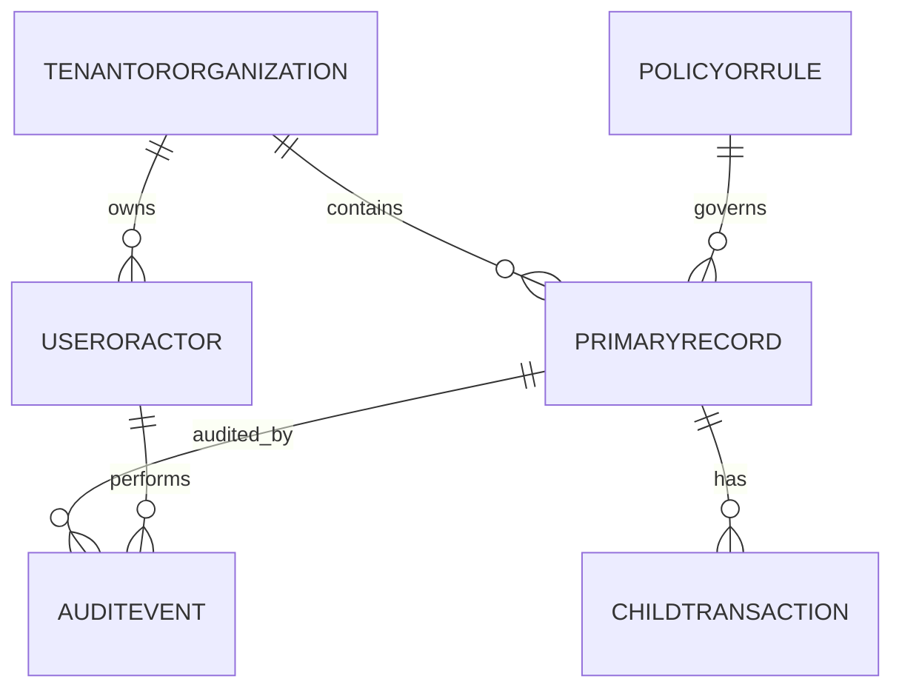

# Data Dictionary

This data dictionary is the canonical reference for **Ticketing and Project Management System**. It defines shared terminology, entity semantics, and governance controls required to keep ticketing and project management workflows consistent across teams and services.

## Scope and Goals
- Establish a stable vocabulary for architecture, API, analytics, and operations teams.
- Define minimum required fields for core entities and expected relationship boundaries.
- Document data quality and retention controls needed for production readiness.

## Core Entities
| Entity | Description | Required Attributes |
|---|---|---|
| TenantOrOrganization | Top-level ownership boundary for data segregation | `org_id, name, status, region, created_at` |
| UserOrActor | Human/system principal that performs actions | `actor_id, org_id, role, status, last_active_at` |
| PrimaryRecord | Main lifecycle object handled by the platform | `record_id, org_id, state, owner_id, created_at, updated_at` |
| ChildTransaction | Operational transaction or sub-step linked to primary record | `txn_id, record_id, txn_type, amount_or_value, occurred_at` |
| PolicyOrRule | Versioned policy configuration that influences decisions | `policy_id, scope, version, effective_from, effective_to` |
| AuditEvent | Append-only evidence for state changes and controls | `audit_id, record_id, actor_id, action, reason_code, occurred_at` |

## Canonical Relationship Diagram

## Data Quality Controls
1. All write paths enforce required-field validation and referential integrity for mandatory foreign keys.
2. External imports must include provenance metadata (`source_system`, `source_ref`, `ingested_at`).
3. Status/state fields use controlled vocabularies and reject unknown values.
4. Duplicate detection runs on natural keys where business identity collisions are likely.
5. Sensitive fields carry classification tags to drive masking, encryption, and export behavior.

## Retention and Audit
- Operational records remain online for active workflow windows and support forensic queries.
- Historical records move to archive tiers by policy without breaking traceability.
- Audit events are immutable and linked through correlation ids for incident analysis.

## Cross-Cutting Workflow and Operational Governance

### Data Dictionary: Document-Specific Scope
- Primary focus for this artifact: **field visibility classification, ownership, and lifecycle semantics**.
- Implementation handoff expectation: this document must be sufficient for an engineer/architect/operator to implement without hidden assumptions.
- Traceability anchor: `ANALYSIS_DATA_DICTIONARY` should be referenced in backlog items, design reviews, and release checklists when this artifact changes.

### Workflow and State Machine Semantics (ANALYSIS_DATA_DICTIONARY)
- For this document, workflow guidance must **bind business scenarios to evented state transitions including negative paths**.
- Transition definitions must include trigger, actor, guard, failure code, side effects, and audit payload contract.
- Any asynchronous transition path must define idempotency key strategy and replay safety behavior.

### SLA and Escalation Rules (ANALYSIS_DATA_DICTIONARY)
- For this document, SLA guidance must **model pause/resume/escalate behaviors and ownership transfers**.
- Escalation must explicitly identify owner, dwell-time threshold, notification channel, and acknowledgement requirement.
- Breach and near-breach states must be queryable in reporting without recomputing from free-form notes.

### Permission Boundaries (ANALYSIS_DATA_DICTIONARY)
- For this document, permission guidance must **map actor boundaries and authorization failures in primary/alternate flows**.
- Privileged actions require reason codes, actor identity, and immutable audit entries.
- Client-visible payloads must be explicitly redacted from internal-only and regulated fields.

### Reporting and Metrics (ANALYSIS_DATA_DICTIONARY)
- For this document, reporting guidance must **trace KPI source events and decision points for operational governance**.
- Metric definitions must include numerator/denominator, time window, dimensional keys, and null/missing-data behavior.
- Each metric should map to raw events/tables so results are reproducible during audits.

### Operational Edge-Case Handling (ANALYSIS_DATA_DICTIONARY)
- For this document, operational guidance must **cover compensation behavior for partial success and temporal inconsistency**.
- Partial failure handling must identify what is rolled back, compensated, or deferred.
- Recovery completion criteria must be measurable (not subjective) and tied to dashboard/alert signals.

### Implementation Readiness Checklist (ANALYSIS_DATA_DICTIONARY)
| Checklist Item | This Document Must Provide | Validation Evidence |
|---|---|---|
| Workflow Contract Completeness | All relevant states, transitions, and invalid paths for `analysis/data-dictionary.md` | Scenario walkthrough + transition test mapping |
| SLA/ Escalation Determinism | Timer, pause, escalation, and override semantics | Policy table review + simulated timer run |
| Authorization Correctness | Role scope, tenant scope, and field visibility boundaries | Auth matrix review + API/UI parity checks |
| Reporting Reproducibility | KPI formulas, dimensions, and source lineage | Recompute KPI from event data sample |
| Operations Recoverability | Degraded-mode and compensation runbook steps | Tabletop/game-day evidence and postmortem template |

