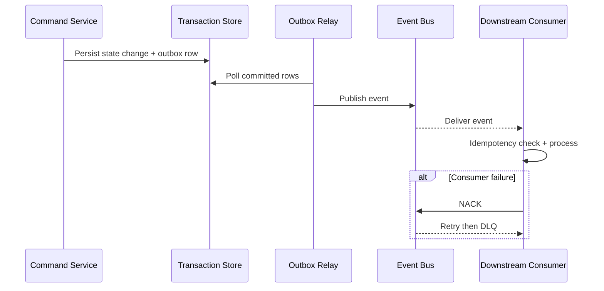

# Event Catalog

This catalog defines stable event contracts for **Ticketing and Project Management System** to support event-driven integrations, auditability, and analytics across ticketing and project management workflows.

## Contract Conventions
- Event naming: `<domain>.<aggregate>.<action>.v1`.
- Required metadata: `event_id`, `occurred_at`, `correlation_id`, `producer`, `schema_version`, `tenant_context`.
- Delivery mode: at-least-once with mandatory consumer idempotency.
- Ordering guarantee: per aggregate key; no global ordering assumption.

## Domain Events
| Event Name | Payload Highlights | Typical Consumers |
|---|---|---|
| `domain.record.created.v1` | record_id, actor_id, initial_state, occurred_at | orchestration, analytics |
| `domain.record.state_changed.v1` | record_id, old_state, new_state, reason_code | notifications, reporting |
| `domain.record.validation_failed.v1` | record_id, violated_rules, correlation_id | operations, quality dashboards |
| `domain.record.override_applied.v1` | record_id, override_type, approver_id, expires_at | compliance, audit |
| `domain.record.closed.v1` | record_id, terminal_state, closed_at | billing/settlement, archives |

## Publish and Consumption Sequence

## Operational SLOs
- P95 commit-to-publish latency below 5 seconds for tier-1 events.
- DLQ triage acknowledgement within 15 minutes for production incidents.
- Schema changes remain backward compatible within the same major version.

## Cross-Cutting Workflow and Operational Governance

### Event Catalog: Document-Specific Scope
- Primary focus for this artifact: **event contract versioning, causation/correlation, and replay semantics**.
- Implementation handoff expectation: this document must be sufficient for an engineer/architect/operator to implement without hidden assumptions.
- Traceability anchor: `ANALYSIS_EVENT_CATALOG` should be referenced in backlog items, design reviews, and release checklists when this artifact changes.

### Workflow and State Machine Semantics (ANALYSIS_EVENT_CATALOG)
- For this document, workflow guidance must **bind business scenarios to evented state transitions including negative paths**.
- Transition definitions must include trigger, actor, guard, failure code, side effects, and audit payload contract.
- Any asynchronous transition path must define idempotency key strategy and replay safety behavior.

### SLA and Escalation Rules (ANALYSIS_EVENT_CATALOG)
- For this document, SLA guidance must **model pause/resume/escalate behaviors and ownership transfers**.
- Escalation must explicitly identify owner, dwell-time threshold, notification channel, and acknowledgement requirement.
- Breach and near-breach states must be queryable in reporting without recomputing from free-form notes.

### Permission Boundaries (ANALYSIS_EVENT_CATALOG)
- For this document, permission guidance must **map actor boundaries and authorization failures in primary/alternate flows**.
- Privileged actions require reason codes, actor identity, and immutable audit entries.
- Client-visible payloads must be explicitly redacted from internal-only and regulated fields.

### Reporting and Metrics (ANALYSIS_EVENT_CATALOG)
- For this document, reporting guidance must **trace KPI source events and decision points for operational governance**.
- Metric definitions must include numerator/denominator, time window, dimensional keys, and null/missing-data behavior.
- Each metric should map to raw events/tables so results are reproducible during audits.

### Operational Edge-Case Handling (ANALYSIS_EVENT_CATALOG)
- For this document, operational guidance must **cover compensation behavior for partial success and temporal inconsistency**.
- Partial failure handling must identify what is rolled back, compensated, or deferred.
- Recovery completion criteria must be measurable (not subjective) and tied to dashboard/alert signals.

### Implementation Readiness Checklist (ANALYSIS_EVENT_CATALOG)
| Checklist Item | This Document Must Provide | Validation Evidence |
|---|---|---|
| Workflow Contract Completeness | All relevant states, transitions, and invalid paths for `analysis/event-catalog.md` | Scenario walkthrough + transition test mapping |
| SLA/ Escalation Determinism | Timer, pause, escalation, and override semantics | Policy table review + simulated timer run |
| Authorization Correctness | Role scope, tenant scope, and field visibility boundaries | Auth matrix review + API/UI parity checks |
| Reporting Reproducibility | KPI formulas, dimensions, and source lineage | Recompute KPI from event data sample |
| Operations Recoverability | Degraded-mode and compensation runbook steps | Tabletop/game-day evidence and postmortem template |

