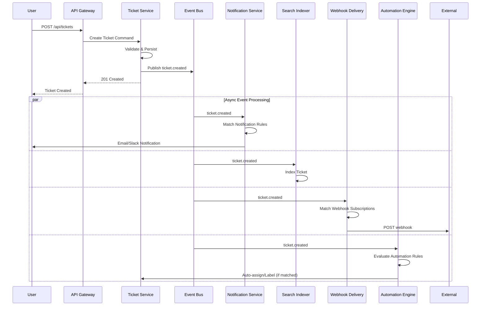
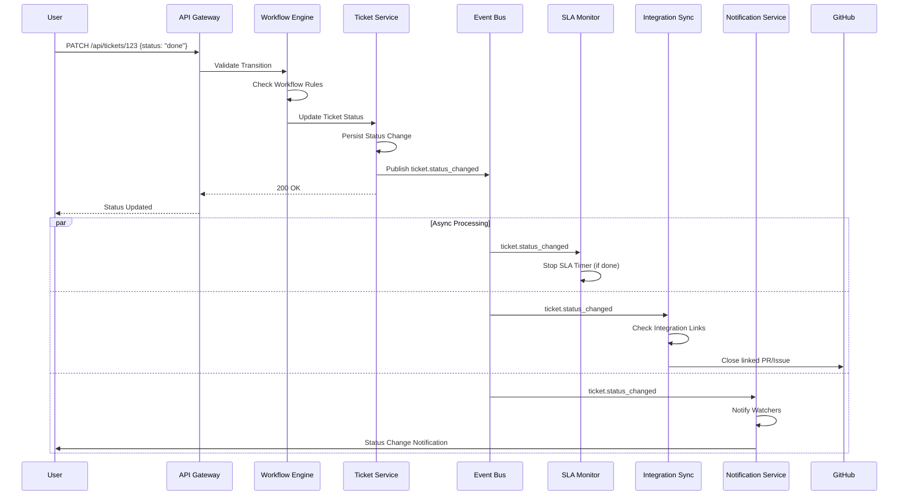
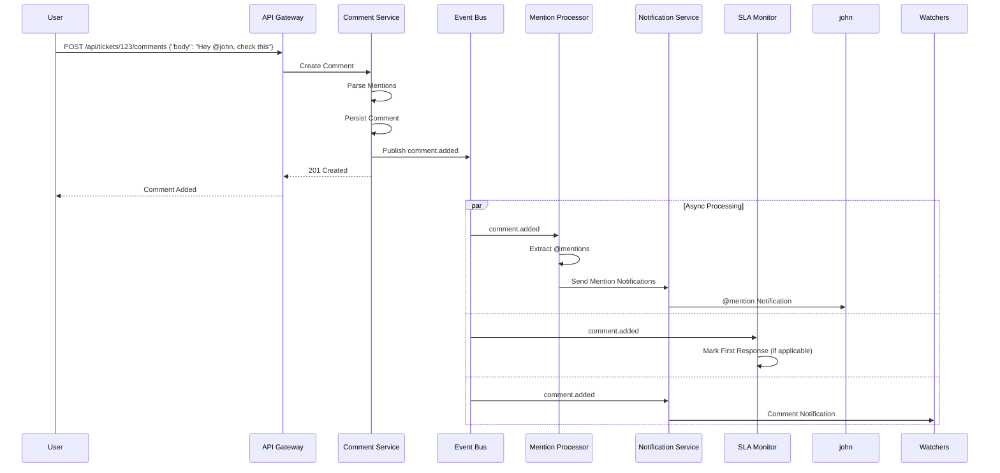
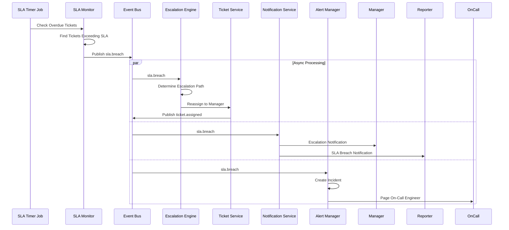
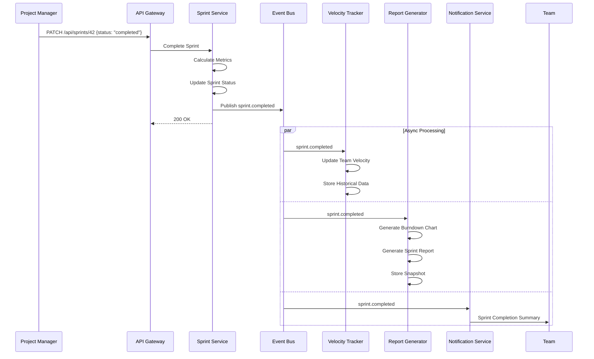
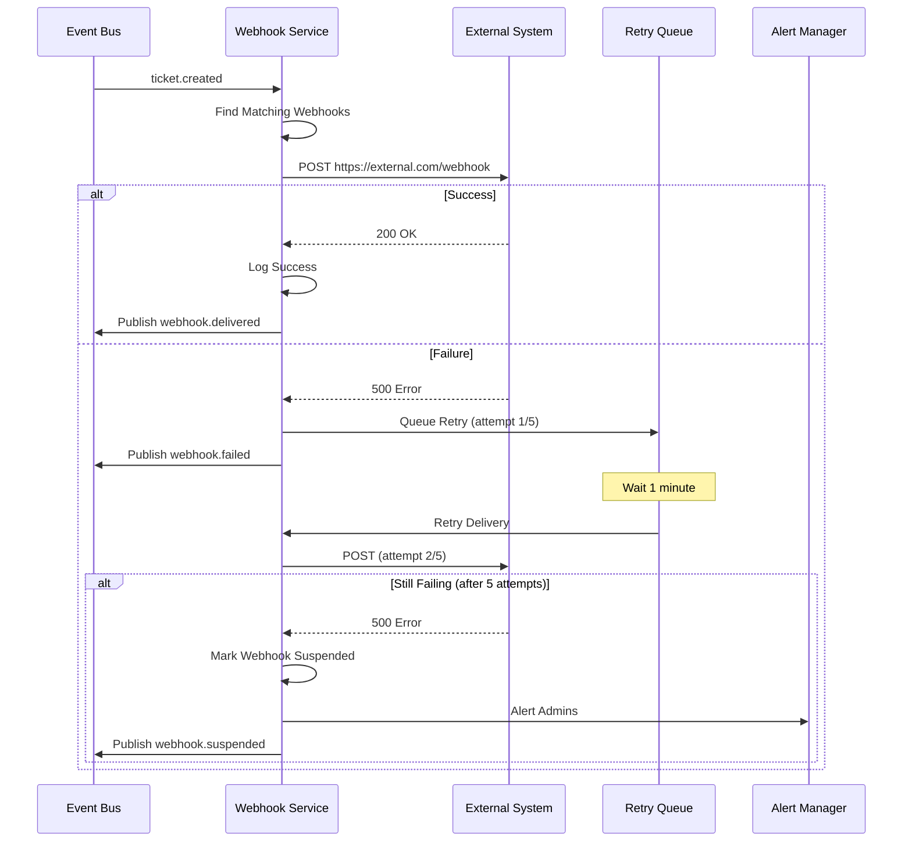

# Event Catalog — Ticketing and Project Management System

**Version:** 1.0  
**Status:** Approved  
**Last Updated:** 2025-01-15

---

## Table of Contents

1. [Overview](#1-overview)
2. [Contract Conventions](#2-contract-conventions)
3. [Domain Events](#3-domain-events)
4. [Publish and Consumption Sequence](#4-publish-and-consumption-sequence)
5. [Operational SLOs](#5-operational-slos)
6. [Event Schema Definitions](#6-event-schema-definitions)
7. [Consumer Service Matrix](#7-consumer-service-matrix)

---

## Overview

This event catalog defines all domain events published and consumed within the Ticketing and Project Management System. Events are the primary mechanism for asynchronous communication between bounded contexts, enabling loose coupling, audit trails, integration synchronization, and notification delivery.

**Event Architecture:**
- **Event Bus:** Apache Kafka (production), In-memory queue (development)
- **Message Format:** JSON with CloudEvents envelope
- **Partitioning Strategy:** Partition by `workspace_id` for ordering guarantees
- **Retention:** 7 days for operational events, 90 days for audit events
- **Delivery Guarantee:** At-least-once delivery semantics

**Event Categories:**
1. **Lifecycle Events:** Ticket/project creation, updates, deletions
2. **Workflow Events:** Status transitions, assignments, sprint movements
3. **Collaboration Events:** Comments, mentions, attachments
4. **Integration Events:** External system synchronization triggers
5. **Notification Events:** User alerts and escalations
6. **Audit Events:** Security and compliance logging

---

## Contract Conventions

### 2.1 CloudEvents Envelope

All events MUST conform to the CloudEvents v1.0 specification:

```json
{
  "specversion": "1.0",
  "type": "com.ticketsystem.ticket.created",
  "source": "/workspaces/ws-123/projects/proj-456",
  "id": "evt-7c9e6679-7425-40de-944b-e07fc1f90ae7",
  "time": "2025-01-15T14:30:00Z",
  "datacontenttype": "application/json",
  "subject": "ticket/PROJ-123",
  "data": {
    "workspace_id": "ws-123",
    "project_id": "proj-456",
    "ticket_id": "tkt-789",
    "ticket_number": 123,
    "title": "Implement user authentication",
    "type": "feature",
    "priority": "high",
    "status": "open",
    "reporter_id": "usr-001",
    "created_at": "2025-01-15T14:30:00Z"
  }
}
```

### 2.2 Naming Convention

Event type names follow the pattern: `com.ticketsystem.<aggregate>.<action>`

Examples:
- `com.ticketsystem.ticket.created`
- `com.ticketsystem.ticket.status_changed`
- `com.ticketsystem.comment.added`
- `com.ticketsystem.sprint.completed`

### 2.3 Versioning Strategy

Event schemas MUST be backward compatible. Breaking changes require a new event version:
- `com.ticketsystem.ticket.created.v1` (current)
- `com.ticketsystem.ticket.created.v2` (future breaking change)

Consumers MUST handle unknown fields gracefully (ignore unknown properties).

### 2.4 Idempotency

All event consumers MUST implement idempotent processing. Events MAY be delivered multiple times due to retries. Consumers MUST use the `id` field as an idempotency key.

### 2.5 Ordering Guarantees

Events partitioned by `workspace_id` maintain order within a workspace. Cross-workspace event ordering is NOT guaranteed.

### 2.6 Payload Size Limits

Event payload (data field) MUST NOT exceed 1 MB. Large payloads (e.g., full ticket descriptions) MUST use a reference pattern:

```json
{
  "ticket_id": "tkt-789",
  "description_ref": "s3://bucket/descriptions/tkt-789.md"
}
```

---

## Domain Events

### Event Summary Table

| Event Type | Publisher | Consumers | Retention | Critical Path |
|------------|-----------|-----------|-----------|---------------|
| ticket.created | Ticket Service | Notification, Search Index, Webhook Delivery | 7 days | Yes |
| ticket.updated | Ticket Service | Notification, Search Index, Webhook Delivery, Integration Sync | 7 days | Yes |
| ticket.status_changed | Workflow Engine | Notification, SLA Monitor, Analytics, Automation Engine | 7 days | Yes |
| ticket.assigned | Assignment Service | Notification, Capacity Planner, Analytics | 7 days | No |
| ticket.deleted | Ticket Service | Search Index, Audit Log, Webhook Delivery | 90 days | No |
| comment.added | Comment Service | Notification, Mention Processor, Webhook Delivery | 7 days | Yes |
| comment.updated | Comment Service | Notification, Audit Log | 7 days | No |
| comment.deleted | Comment Service | Audit Log | 90 days | No |
| attachment.uploaded | Attachment Service | Virus Scanner, Thumbnail Generator, Storage Metrics | 7 days | No |
| attachment.deleted | Attachment Service | Storage Cleanup, Audit Log | 90 days | No |
| sprint.started | Sprint Service | Notification, Velocity Tracker, Board Refresh | 7 days | No |
| sprint.completed | Sprint Service | Velocity Tracker, Report Generator, Analytics | 7 days | No |
| release.created | Release Service | Webhook Delivery, Notification | 7 days | No |
| release.published | Release Service | Notification, Release Notes Generator, Integration Sync | 7 days | No |
| time_log.created | Time Tracking Service | Billing Aggregator, Capacity Planner | 7 days | No |
| time_log.approved | Time Tracking Service | Billing Finalizer, Notification | 7 days | No |
| sla.breach | SLA Monitor | Notification, Escalation Engine, Analytics | 90 days | Yes |
| sla.warning | SLA Monitor | Notification | 7 days | Yes |
| automation.executed | Automation Engine | Audit Log, Analytics | 7 days | No |
| integration.sync_completed | Integration Sync Service | Notification, Audit Log | 7 days | No |
| integration.sync_failed | Integration Sync Service | Alert Manager, Notification | 7 days | Yes |
| webhook.delivered | Webhook Delivery Service | Audit Log | 7 days | No |
| webhook.failed | Webhook Delivery Service | Alert Manager, Retry Queue | 7 days | Yes |
| user.invited | User Service | Email Service, Notification | 7 days | Yes |
| user.activated | User Service | Analytics, Audit Log | 90 days | No |
| project.created | Project Service | Notification, Analytics, Audit Log | 90 days | No |
| project.archived | Project Service | Notification, Search Index, Audit Log | 90 days | No |
| dependency.created | Dependency Service | Notification, Blocking Status Calculator | 7 days | No |
| dependency.resolved | Dependency Service | Notification, Blocking Status Calculator | 7 days | No |

---

## Publish and Consumption Sequence

### 4.1 Ticket Creation Flow



### 4.2 Status Transition Flow



### 4.3 Comment with Mention Flow



### 4.4 SLA Breach and Escalation Flow



### 4.5 Sprint Completion Flow



### 4.6 Webhook Delivery with Retry Flow



---

## Operational SLOs

### 5.1 Event Publishing SLOs

| Metric | Target | Measurement |
|--------|--------|-------------|
| Event publish latency (p99) | < 100ms | Time from service commit to event bus ack |
| Event publish success rate | > 99.9% | Successful publishes / total attempts |
| Event bus availability | > 99.95% | Uptime of Kafka cluster |

### 5.2 Event Processing SLOs

| Consumer Service | Processing Latency (p95) | Error Rate Target |
|------------------|-------------------------|-------------------|
| Notification Service | < 2 seconds | < 0.1% |
| Search Indexer | < 5 seconds | < 0.5% |
| Webhook Delivery | < 10 seconds | < 1% (excludes external failures) |
| Integration Sync | < 30 seconds | < 2% (external API dependent) |
| SLA Monitor | < 1 second | < 0.01% |
| Automation Engine | < 5 seconds | < 0.5% |

### 5.3 Consumer Lag Monitoring

All consumers MUST expose consumer lag metrics:
- **Warning Threshold:** Lag > 1000 messages
- **Critical Threshold:** Lag > 10000 messages
- **Alert:** If lag exceeds threshold for > 5 minutes

### 5.4 Dead Letter Queue (DLQ) Policy

Failed events (after max retries) are routed to DLQ:
- **Retention:** 30 days
- **Monitoring:** DLQ size alerts when > 100 messages
- **Manual Review:** Weekly review of DLQ for pattern analysis
- **Replay:** Manual replay capability via admin console

---

## Event Schema Definitions

### 6.1 ticket.created

**Publisher:** Ticket Service  
**Trigger:** New ticket created via API or UI  

**Schema:**
```json
{
  "workspace_id": "uuid",
  "project_id": "uuid",
  "ticket_id": "uuid",
  "ticket_number": 123,
  "title": "string (max 500 chars)",
  "description": "string (max 50000 chars)",
  "type": "enum: bug|feature|task|improvement|incident",
  "priority": "enum: critical|high|medium|low",
  "status": "string",
  "reporter_id": "uuid",
  "assignee_id": "uuid | null",
  "sprint_id": "uuid | null",
  "epic_id": "uuid | null",
  "labels": ["string"],
  "due_date": "ISO 8601 date | null",
  "created_at": "ISO 8601 timestamp"
}
```

**Consumers:**
- Notification Service → Notify project members
- Search Indexer → Index ticket for search
- Webhook Delivery → Trigger external webhooks
- Automation Engine → Evaluate auto-assignment rules

---

### 6.2 ticket.updated

**Publisher:** Ticket Service  
**Trigger:** Ticket fields modified  

**Schema:**
```json
{
  "workspace_id": "uuid",
  "project_id": "uuid",
  "ticket_id": "uuid",
  "ticket_number": 123,
  "updated_by_id": "uuid",
  "updated_at": "ISO 8601 timestamp",
  "changes": {
    "field_name": {
      "old_value": "any",
      "new_value": "any"
    }
  }
}
```

**Example changes:**
```json
{
  "changes": {
    "title": {"old_value": "Fix bug", "new_value": "Fix login bug"},
    "priority": {"old_value": "medium", "new_value": "high"},
    "assignee_id": {"old_value": null, "new_value": "usr-123"}
  }
}
```

**Consumers:**
- Notification Service → Notify based on changed fields
- Search Indexer → Re-index ticket
- Webhook Delivery → Send update webhook
- Integration Sync → Sync changes to external systems

---

### 6.3 ticket.status_changed

**Publisher:** Workflow Engine  
**Trigger:** Ticket status transition  

**Schema:**
```json
{
  "workspace_id": "uuid",
  "project_id": "uuid",
  "ticket_id": "uuid",
  "ticket_number": 123,
  "old_status": "string",
  "new_status": "string",
  "changed_by_id": "uuid",
  "transition_comment": "string | null",
  "changed_at": "ISO 8601 timestamp",
  "is_final_status": "boolean"
}
```

**Consumers:**
- SLA Monitor → Update SLA timers, detect breaches
- Notification Service → Notify watchers of status change
- Integration Sync → Update external issue trackers
- Analytics → Track cycle time, throughput

---

### 6.4 ticket.assigned

**Publisher:** Assignment Service  
**Trigger:** Assignee changed  

**Schema:**
```json
{
  "workspace_id": "uuid",
  "project_id": "uuid",
  "ticket_id": "uuid",
  "ticket_number": 123,
  "old_assignee_id": "uuid | null",
  "new_assignee_id": "uuid | null",
  "assigned_by_id": "uuid",
  "assigned_at": "ISO 8601 timestamp"
}
```

**Consumers:**
- Notification Service → Notify new assignee
- Capacity Planner → Update user workload metrics
- Analytics → Track assignment patterns

---

### 6.5 comment.added

**Publisher:** Comment Service  
**Trigger:** New comment posted  

**Schema:**
```json
{
  "workspace_id": "uuid",
  "project_id": "uuid",
  "ticket_id": "uuid",
  "comment_id": "uuid",
  "author_id": "uuid",
  "body": "string (max 10000 chars)",
  "mentions": ["uuid"],
  "internal": "boolean",
  "created_at": "ISO 8601 timestamp"
}
```

**Consumers:**
- Mention Processor → Notify mentioned users
- Notification Service → Notify watchers
- SLA Monitor → Mark first response if applicable
- Webhook Delivery → Send comment webhook

---

### 6.6 attachment.uploaded

**Publisher:** Attachment Service  
**Trigger:** File upload completed  

**Schema:**
```json
{
  "workspace_id": "uuid",
  "project_id": "uuid",
  "ticket_id": "uuid",
  "attachment_id": "uuid",
  "uploaded_by_id": "uuid",
  "filename": "string",
  "content_type": "string",
  "size_bytes": 123456,
  "storage_key": "string",
  "url": "string (signed URL)",
  "uploaded_at": "ISO 8601 timestamp"
}
```

**Consumers:**
- Virus Scanner → Scan file for malware
- Thumbnail Generator → Generate image preview (if image)
- Storage Metrics → Update workspace storage usage
- Notification Service → Notify watchers

---

### 6.7 sprint.started

**Publisher:** Sprint Service  
**Trigger:** Sprint status changed to "active"  

**Schema:**
```json
{
  "workspace_id": "uuid",
  "project_id": "uuid",
  "sprint_id": "uuid",
  "sprint_name": "string",
  "start_date": "ISO 8601 date",
  "end_date": "ISO 8601 date",
  "capacity_story_points": 100,
  "ticket_count": 25,
  "started_by_id": "uuid",
  "started_at": "ISO 8601 timestamp"
}
```

**Consumers:**
- Notification Service → Notify team members
- Velocity Tracker → Initialize sprint tracking
- Board Refresh → Update board filters

---

### 6.8 sprint.completed

**Publisher:** Sprint Service  
**Trigger:** Sprint status changed to "completed"  

**Schema:**
```json
{
  "workspace_id": "uuid",
  "project_id": "uuid",
  "sprint_id": "uuid",
  "sprint_name": "string",
  "start_date": "ISO 8601 date",
  "end_date": "ISO 8601 date",
  "planned_story_points": 100,
  "completed_story_points": 85,
  "completed_ticket_count": 22,
  "incomplete_ticket_count": 3,
  "velocity": 85,
  "completed_by_id": "uuid",
  "completed_at": "ISO 8601 timestamp"
}
```

**Consumers:**
- Velocity Tracker → Update team velocity average
- Report Generator → Generate sprint retrospective report
- Analytics → Store historical sprint data

---

### 6.9 release.published

**Publisher:** Release Service  
**Trigger:** Release marked as published  

**Schema:**
```json
{
  "workspace_id": "uuid",
  "project_id": "uuid",
  "release_id": "uuid",
  "release_name": "string (e.g., v1.2.0)",
  "description": "string",
  "ticket_ids": ["uuid"],
  "ticket_count": 35,
  "published_by_id": "uuid",
  "published_at": "ISO 8601 timestamp"
}
```

**Consumers:**
- Notification Service → Announce release to stakeholders
- Release Notes Generator → Generate formatted release notes
- Integration Sync → Create GitHub/GitLab release tag
- Webhook Delivery → Trigger deployment webhooks

---

### 6.10 sla.breach

**Publisher:** SLA Monitor  
**Trigger:** Ticket exceeds SLA threshold  

**Schema:**
```json
{
  "workspace_id": "uuid",
  "project_id": "uuid",
  "ticket_id": "uuid",
  "ticket_number": 123,
  "breach_type": "enum: first_response|resolution",
  "priority": "enum: critical|high|medium|low",
  "sla_threshold_minutes": 240,
  "actual_minutes_elapsed": 305,
  "assignee_id": "uuid | null",
  "detected_at": "ISO 8601 timestamp"
}
```

**Consumers:**
- Escalation Engine → Auto-escalate to manager
- Notification Service → Alert assignee and manager
- Analytics → Track SLA breach metrics
- Alert Manager → Create incident ticket

---

### 6.11 sla.warning

**Publisher:** SLA Monitor  
**Trigger:** Ticket approaching SLA threshold (80% elapsed)  

**Schema:**
```json
{
  "workspace_id": "uuid",
  "project_id": "uuid",
  "ticket_id": "uuid",
  "ticket_number": 123,
  "warning_type": "enum: first_response|resolution",
  "priority": "enum: critical|high|medium|low",
  "sla_threshold_minutes": 240,
  "minutes_remaining": 48,
  "percent_elapsed": 80,
  "assignee_id": "uuid | null",
  "detected_at": "ISO 8601 timestamp"
}
```

**Consumers:**
- Notification Service → Warn assignee of approaching SLA

---

### 6.12 automation.executed

**Publisher:** Automation Engine  
**Trigger:** Automation rule triggered and actions executed  

**Schema:**
```json
{
  "workspace_id": "uuid",
  "project_id": "uuid",
  "automation_rule_id": "uuid",
  "rule_name": "string",
  "trigger_event_type": "string",
  "trigger_event_id": "uuid",
  "actions_executed": [
    {
      "action_type": "enum: assign|set_priority|add_label|comment",
      "action_params": {},
      "success": "boolean",
      "error_message": "string | null"
    }
  ],
  "executed_at": "ISO 8601 timestamp"
}
```

**Consumers:**
- Audit Log → Record automation execution
- Analytics → Track automation effectiveness

---

### 6.13 integration.sync_failed

**Publisher:** Integration Sync Service  
**Trigger:** External integration sync failure  

**Schema:**
```json
{
  "workspace_id": "uuid",
  "project_id": "uuid",
  "integration_id": "uuid",
  "integration_type": "enum: github|gitlab|jira|slack",
  "ticket_id": "uuid | null",
  "error_type": "enum: auth_failed|api_error|network_timeout|rate_limited",
  "error_message": "string",
  "retry_count": 3,
  "will_retry": "boolean",
  "failed_at": "ISO 8601 timestamp"
}
```

**Consumers:**
- Alert Manager → Notify admins of sync failures
- Notification Service → Alert project managers
- Retry Queue → Schedule retry if applicable

---

### 6.14 webhook.failed

**Publisher:** Webhook Delivery Service  
**Trigger:** Webhook delivery failure after all retries  

**Schema:**
```json
{
  "workspace_id": "uuid",
  "project_id": "uuid",
  "webhook_id": "uuid",
  "webhook_url": "string",
  "event_type": "string",
  "event_id": "uuid",
  "delivery_attempts": 5,
  "last_error": "string",
  "last_http_status": 500,
  "suspended": "boolean",
  "failed_at": "ISO 8601 timestamp"
}
```

**Consumers:**
- Alert Manager → Notify admins of webhook failures
- Notification Service → Alert project admins

---

### 6.15 user.invited

**Publisher:** User Service  
**Trigger:** User invitation sent  

**Schema:**
```json
{
  "workspace_id": "uuid",
  "user_id": "uuid",
  "email": "string",
  "invited_by_id": "uuid",
  "role": "enum: admin|member|guest",
  "invitation_token": "string (hashed)",
  "expires_at": "ISO 8601 timestamp",
  "invited_at": "ISO 8601 timestamp"
}
```

**Consumers:**
- Email Service → Send invitation email
- Notification Service → Log invitation event

---

## Consumer Service Matrix

| Consumer Service | Subscribed Events | Processing Pattern | Retry Strategy | DLQ Enabled |
|------------------|-------------------|-------------------|----------------|-------------|
| Notification Service | ticket.*, comment.*, sprint.*, sla.*, user.* | Fan-out per user preference | 3 retries, exponential backoff | Yes |
| Search Indexer | ticket.created, ticket.updated, ticket.deleted, project.* | Batch indexing (100 events/batch) | 5 retries, 1min intervals | Yes |
| Webhook Delivery | ticket.*, comment.*, release.*, sprint.* | Per-webhook delivery | Custom per webhook config | Yes |
| Integration Sync | ticket.status_changed, comment.added, release.published | External API rate-limited | 5 retries, backoff with jitter | Yes |
| SLA Monitor | ticket.created, ticket.status_changed, comment.added | Real-time timer management | No retries (critical path) | No |
| Automation Engine | ticket.created, ticket.updated, comment.added | Rule evaluation pipeline | 3 retries | Yes |
| Velocity Tracker | sprint.completed, ticket.status_changed | Aggregation and metrics | 5 retries | Yes |
| Analytics | All events | Event stream to data warehouse | Infinite retries (eventually consistent) | No |
| Audit Log | All events | Append-only logging | No retries (duplicate detection) | No |

---

**End of Document**
