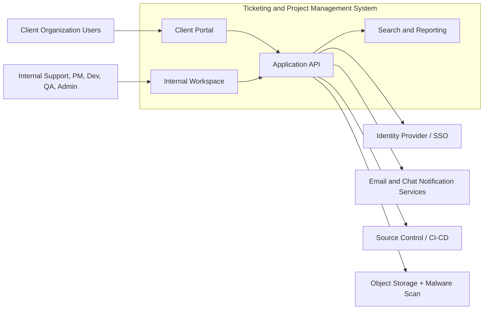

# System Context Diagram - Ticketing and Project Management System

## Context Notes

- Client users only access the client portal and records scoped to their organization.
- Internal teams use the internal workspace for triage, planning, delivery, verification, and administration.
- The platform integrates with SSO, notifications, source control, and secure object storage.
