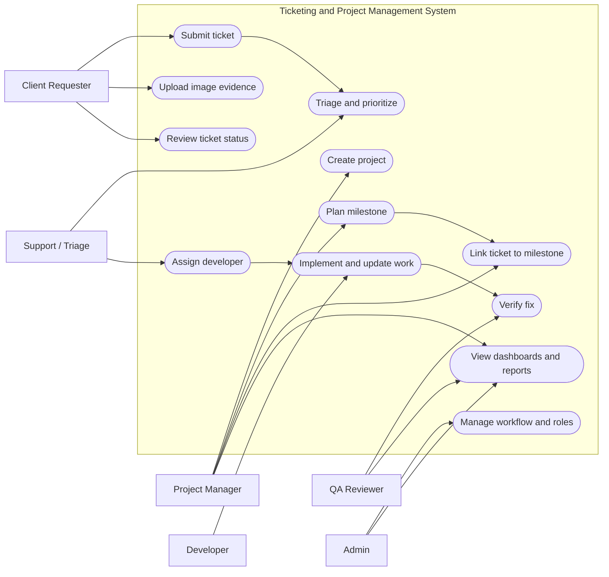

# Use Case Diagram - Ticketing and Project Management System

```mermaid
flowchart LR
    client[Client Requester]
    support[Support / Triage]
    pm[Project Manager]
    dev[Developer]
    qa[QA Reviewer]
    admin[Admin]

    subgraph system[Ticketing and Project Management System]
        uc1([Submit ticket])
        uc2([Upload image evidence])
        uc3([Review ticket status])
        uc4([Triage and prioritize])
        uc5([Assign developer])
        uc6([Create project])
        uc7([Plan milestone])
        uc8([Link ticket to milestone])
        uc9([Implement and update work])
        uc10([Verify fix])
        uc11([Manage workflow and roles])
        uc12([View dashboards and reports])
    end

    client --> uc1
    client --> uc2
    client --> uc3
    support --> uc4
    support --> uc5
    pm --> uc6
    pm --> uc7
    pm --> uc8
    pm --> uc12
    dev --> uc9
    qa --> uc10
    qa --> uc12
    admin --> uc11
    admin --> uc12
    uc1 --> uc4
    uc5 --> uc9
    uc7 --> uc8
    uc9 --> uc10
```
