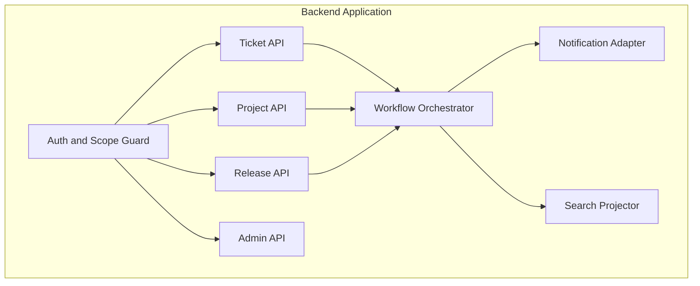

# C4 Component Diagram - Ticketing and Project Management System

```mermaid
flowchart TB
    subgraph backend[Backend Application]
        auth[Auth and Scope Guard]
        ticketApi[Ticket API]
        projectApi[Project API]
        releaseApi[Release API]
        adminApi[Admin API]
        workflow[Workflow Orchestrator]
        notify[Notification Adapter]
        search[Search Projector]
    end

    auth --> ticketApi
    auth --> projectApi
    auth --> releaseApi
    auth --> adminApi
    ticketApi --> workflow
    projectApi --> workflow
    releaseApi --> workflow
    workflow --> notify
    workflow --> search
```
