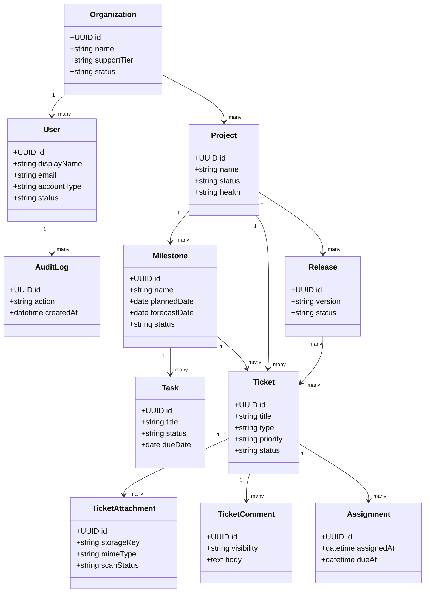

# Class Diagram - Ticketing and Project Management System

```mermaid
classDiagram
    class Organization {
      +UUID id
      +string name
      +string supportTier
      +string status
    }
    class User {
      +UUID id
      +string displayName
      +string email
      +string accountType
      +string status
    }
    class Project {
      +UUID id
      +string name
      +string status
      +string health
    }
    class Milestone {
      +UUID id
      +string name
      +date plannedDate
      +date forecastDate
      +string status
    }
    class Task {
      +UUID id
      +string title
      +string status
      +date dueDate
    }
    class Ticket {
      +UUID id
      +string title
      +string type
      +string priority
      +string status
    }
    class TicketAttachment {
      +UUID id
      +string storageKey
      +string mimeType
      +string scanStatus
    }
    class TicketComment {
      +UUID id
      +string visibility
      +text body
    }
    class Assignment {
      +UUID id
      +datetime assignedAt
      +datetime dueAt
    }
    class Release {
      +UUID id
      +string version
      +string status
    }
    class AuditLog {
      +UUID id
      +string action
      +datetime createdAt
    }

    Organization "1" --> "many" User
    Organization "1" --> "many" Project
    Project "1" --> "many" Milestone
    Milestone "1" --> "many" Task
    Project "1" --> "many" Ticket
    Ticket "1" --> "many" TicketAttachment
    Ticket "1" --> "many" TicketComment
    Ticket "1" --> "many" Assignment
    Milestone "0..1" --> "many" Ticket
    Project "1" --> "many" Release
    Release "many" --> "many" Ticket
    User "1" --> "many" AuditLog
```
