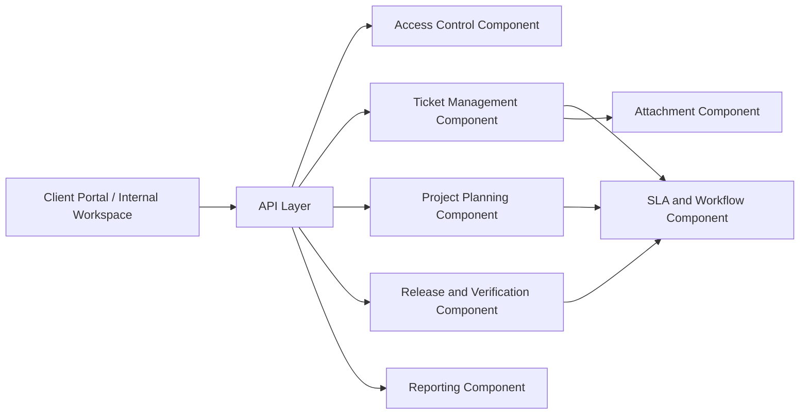

# Component Diagram - Ticketing and Project Management System

## Component Responsibilities

| Component | Responsibility |
|-----------|----------------|
| Access Control | Authentication, scope checks, role evaluation |
| Ticket Management | Ticket CRUD, comments, history, duplicate detection |
| Attachment | Upload validation, scanning, secure retrieval |
| Project Planning | Projects, milestones, tasks, dependency tracking |
| SLA and Workflow | Timers, escalations, status transitions |
| Release and Verification | Release grouping, QA outcomes, hotfix support |
| Reporting | Dashboards, metrics, filters, exports |
