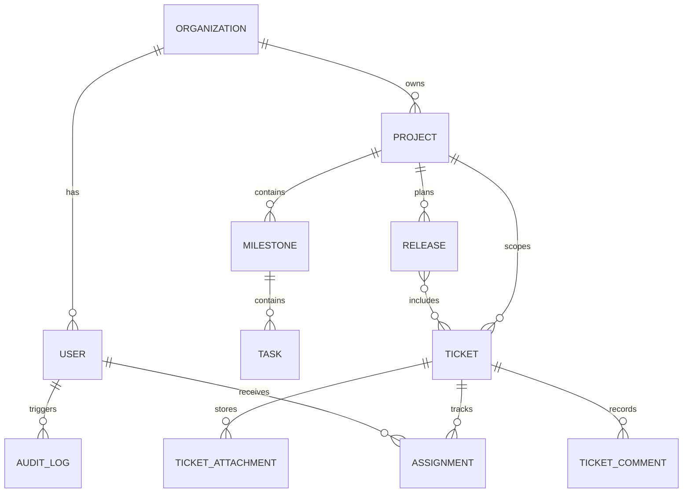
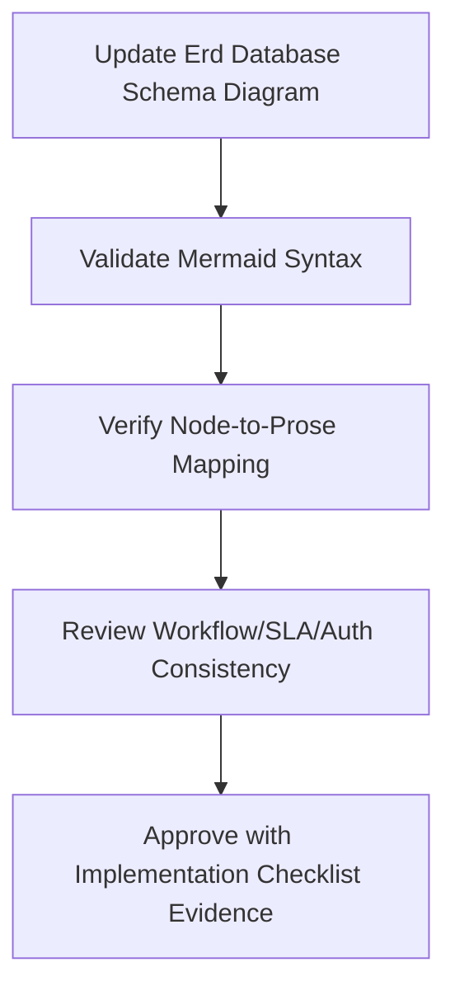

# ERD and Database Schema - Ticketing and Project Management System

## Table Notes

| Table | Notes |
|-------|-------|
| organizations | Tenant boundary for external clients |
| users | Mixed internal and client identities |
| projects | Delivery initiatives and ownership |
| milestones | Planned checkpoints with baseline and forecast dates |
| tasks | Granular work items under milestones |
| tickets | Incidents, bugs, requests, or change requests |
| ticket_attachments | Attachment metadata referencing object storage |
| assignments | Ownership history and due date tracking |
| releases | Planned or emergency delivery bundles |
| audit_logs | Immutable operational history |

## Cross-Cutting Workflow and Operational Governance

### Erd Database Schema: Document-Specific Scope
- Primary focus for this artifact: **storage constraints, tenant keys, and audit/event persistence patterns**.
- Implementation handoff expectation: this document must be sufficient for an engineer/architect/operator to implement without hidden assumptions.
- Traceability anchor: `DETAILED_DESIGN_ERD_DATABASE_SCHEMA` should be referenced in backlog items, design reviews, and release checklists when this artifact changes.

### Workflow and State Machine Semantics (DETAILED_DESIGN_ERD_DATABASE_SCHEMA)
- For this document, workflow guidance must **specify transition APIs, optimistic concurrency, and deterministic error contracts**.
- Transition definitions must include trigger, actor, guard, failure code, side effects, and audit payload contract.
- Any asynchronous transition path must define idempotency key strategy and replay safety behavior.

### SLA and Escalation Rules (DETAILED_DESIGN_ERD_DATABASE_SCHEMA)
- For this document, SLA guidance must **formalize calendar/timezone logic and immutable timer checkpoints**.
- Escalation must explicitly identify owner, dwell-time threshold, notification channel, and acknowledgement requirement.
- Breach and near-breach states must be queryable in reporting without recomputing from free-form notes.

### Permission Boundaries (DETAILED_DESIGN_ERD_DATABASE_SCHEMA)
- For this document, permission guidance must **specify endpoint scopes, row-level filters, and redaction rules**.
- Privileged actions require reason codes, actor identity, and immutable audit entries.
- Client-visible payloads must be explicitly redacted from internal-only and regulated fields.

### Reporting and Metrics (DETAILED_DESIGN_ERD_DATABASE_SCHEMA)
- For this document, reporting guidance must **define schema-level correctness rules and backfill/replay semantics**.
- Metric definitions must include numerator/denominator, time window, dimensional keys, and null/missing-data behavior.
- Each metric should map to raw events/tables so results are reproducible during audits.

### Operational Edge-Case Handling (DETAILED_DESIGN_ERD_DATABASE_SCHEMA)
- For this document, operational guidance must **define retryability, DLQ handling, and compensation command contracts**.
- Partial failure handling must identify what is rolled back, compensated, or deferred.
- Recovery completion criteria must be measurable (not subjective) and tied to dashboard/alert signals.

### Implementation Readiness Checklist (DETAILED_DESIGN_ERD_DATABASE_SCHEMA)
| Checklist Item | This Document Must Provide | Validation Evidence |
|---|---|---|
| Workflow Contract Completeness | All relevant states, transitions, and invalid paths for `detailed-design/erd-database-schema.md` | Scenario walkthrough + transition test mapping |
| SLA/ Escalation Determinism | Timer, pause, escalation, and override semantics | Policy table review + simulated timer run |
| Authorization Correctness | Role scope, tenant scope, and field visibility boundaries | Auth matrix review + API/UI parity checks |
| Reporting Reproducibility | KPI formulas, dimensions, and source lineage | Recompute KPI from event data sample |
| Operations Recoverability | Degraded-mode and compensation runbook steps | Tabletop/game-day evidence and postmortem template |

### Mermaid Diagram Contract (DETAILED_DESIGN_ERD_DATABASE_SCHEMA)
- Diagram syntax must remain Mermaid JS compatible and parse in standard Markdown renderers.
- Every node/edge must map to a term defined in this file to avoid orphaned visual semantics.
- Update both diagram and prose together whenever adding/removing workflow states, actors, services, or data stores.

