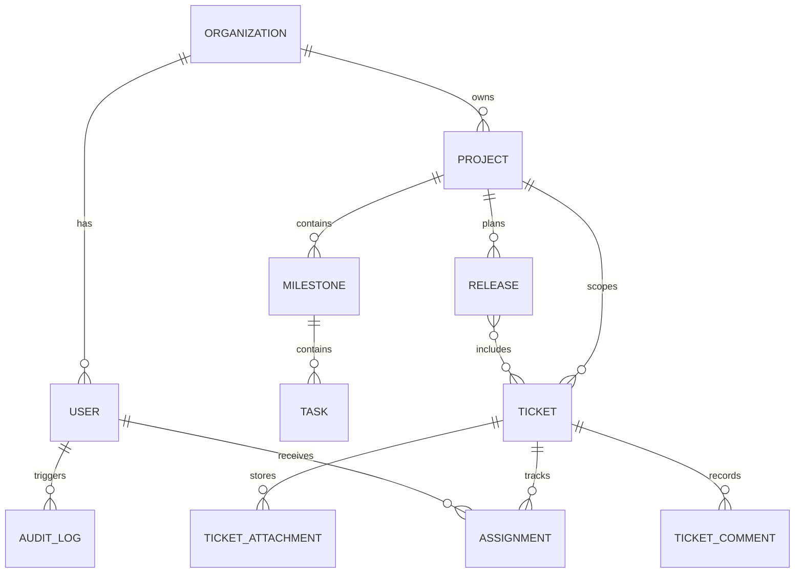

# ERD and Database Schema - Ticketing and Project Management System

## Table Notes

| Table | Notes |
|-------|-------|
| organizations | Tenant boundary for external clients |
| users | Mixed internal and client identities |
| projects | Delivery initiatives and ownership |
| milestones | Planned checkpoints with baseline and forecast dates |
| tasks | Granular work items under milestones |
| tickets | Incidents, bugs, requests, or change requests |
| ticket_attachments | Attachment metadata referencing object storage |
| assignments | Ownership history and due date tracking |
| releases | Planned or emergency delivery bundles |
| audit_logs | Immutable operational history |
