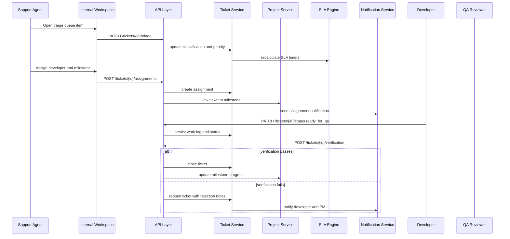

# Sequence Diagram - Ticketing and Project Management System

```mermaid
sequenceDiagram
    participant Support as Support Agent
    participant UI as Internal Workspace
    participant API as API Layer
    participant Ticket as Ticket Service
    participant Project as Project Service
    participant Workflow as SLA Engine
    participant Notify as Notification Service
    participant Dev as Developer
    participant QA as QA Reviewer

    Support->>UI: Open triage queue item
    UI->>API: PATCH /tickets/{id}/triage
    API->>Ticket: update classification and priority
    Ticket->>Workflow: recalculate SLA timers
    Support->>UI: Assign developer and milestone
    UI->>API: POST /tickets/{id}/assignments
    API->>Ticket: create assignment
    API->>Project: link ticket to milestone
    Ticket->>Notify: send assignment notification
    Dev->>API: PATCH /tickets/{id}/status ready_for_qa
    API->>Ticket: persist work log and status
    QA->>API: POST /tickets/{id}/verification
    alt verification passes
        API->>Ticket: close ticket
        API->>Project: update milestone progress
    else verification fails
        API->>Ticket: reopen ticket with rejection notes
        Ticket->>Notify: notify developer and PM
    end
```
