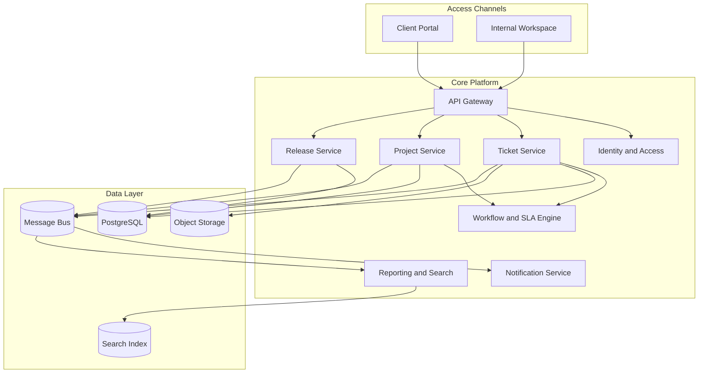

# Architecture Diagram - Ticketing and Project Management System

## Responsibilities

| Component | Responsibility |
|-----------|----------------|
| Client Portal | External ticket creation and status tracking |
| Internal Workspace | Full operational and project management experience |
| Ticket Service | Ticket lifecycle, comments, attachments, assignment |
| Project Service | Projects, milestones, tasks, change control, health |
| Workflow and SLA Engine | Timers, escalations, status transitions, policy checks |
| Release Service | Planned releases, hotfixes, verification rollups |
| Notification Service | Email, in-app, and chat notifications |
| Reporting and Search | Dashboards, trend analysis, fast filtering |
