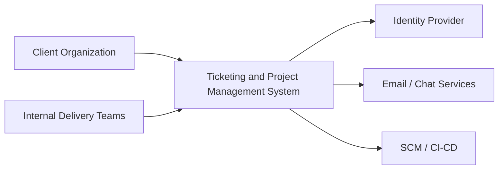
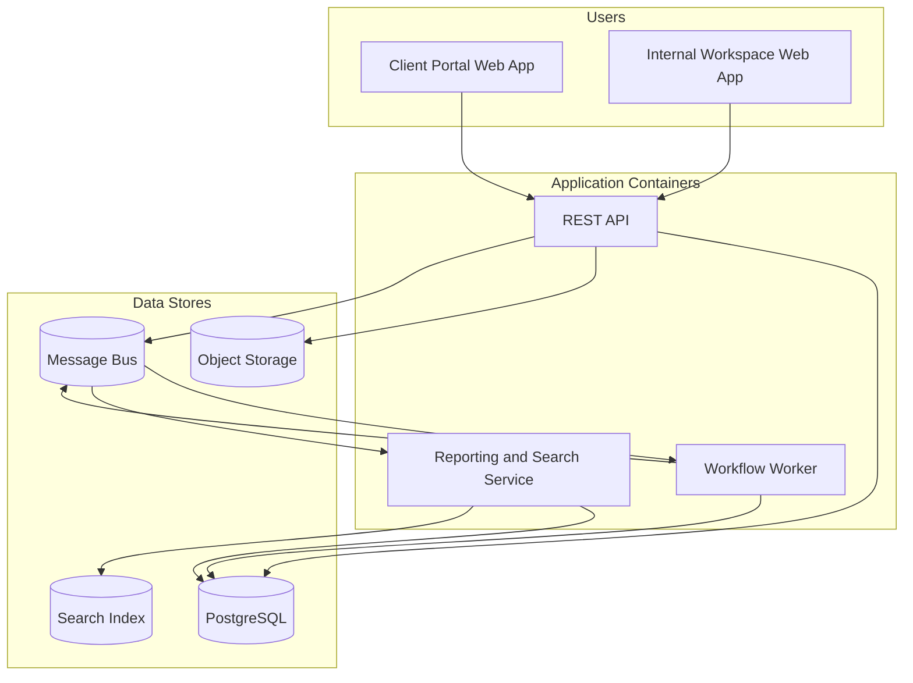
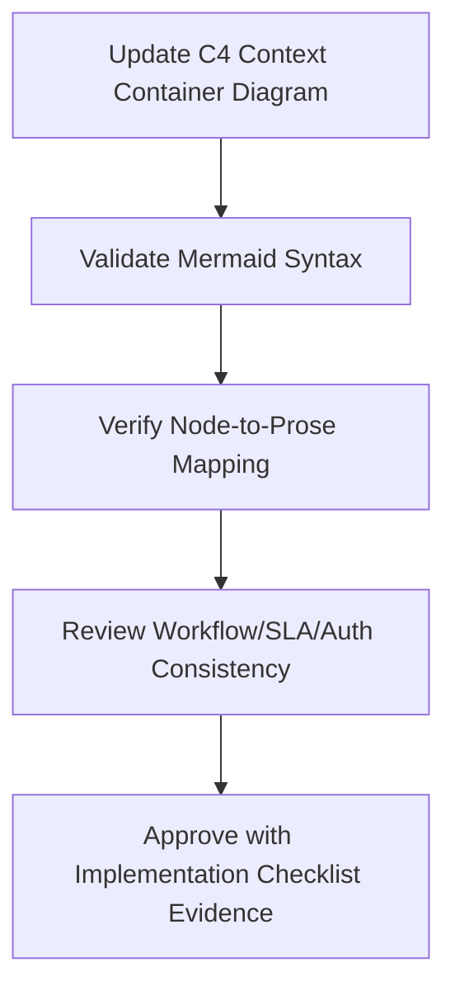

# C4 Context and Container Diagrams - Ticketing and Project Management System

## C4 Context

## C4 Container

## Cross-Cutting Workflow and Operational Governance

### C4 Context Container: Document-Specific Scope
- Primary focus for this artifact: **container responsibilities, integration contracts, and tenancy isolation**.
- Implementation handoff expectation: this document must be sufficient for an engineer/architect/operator to implement without hidden assumptions.
- Traceability anchor: `HIGH_LEVEL_DESIGN_C4_CONTEXT_CONTAINER` should be referenced in backlog items, design reviews, and release checklists when this artifact changes.

### Workflow and State Machine Semantics (HIGH_LEVEL_DESIGN_C4_CONTEXT_CONTAINER)
- For this document, workflow guidance must **declare orchestration boundaries and transaction scopes for state changes**.
- Transition definitions must include trigger, actor, guard, failure code, side effects, and audit payload contract.
- Any asynchronous transition path must define idempotency key strategy and replay safety behavior.

### SLA and Escalation Rules (HIGH_LEVEL_DESIGN_C4_CONTEXT_CONTAINER)
- For this document, SLA guidance must **assign timer/escalation service responsibilities and anti-storm controls**.
- Escalation must explicitly identify owner, dwell-time threshold, notification channel, and acknowledgement requirement.
- Breach and near-breach states must be queryable in reporting without recomputing from free-form notes.

### Permission Boundaries (HIGH_LEVEL_DESIGN_C4_CONTEXT_CONTAINER)
- For this document, permission guidance must **document trust boundaries and identity propagation across services**.
- Privileged actions require reason codes, actor identity, and immutable audit entries.
- Client-visible payloads must be explicitly redacted from internal-only and regulated fields.

### Reporting and Metrics (HIGH_LEVEL_DESIGN_C4_CONTEXT_CONTAINER)
- For this document, reporting guidance must **identify analytics pipeline ownership and reproducibility guarantees**.
- Metric definitions must include numerator/denominator, time window, dimensional keys, and null/missing-data behavior.
- Each metric should map to raw events/tables so results are reproducible during audits.

### Operational Edge-Case Handling (HIGH_LEVEL_DESIGN_C4_CONTEXT_CONTAINER)
- For this document, operational guidance must **declare degraded-mode capabilities and restoration decision criteria**.
- Partial failure handling must identify what is rolled back, compensated, or deferred.
- Recovery completion criteria must be measurable (not subjective) and tied to dashboard/alert signals.

### Implementation Readiness Checklist (HIGH_LEVEL_DESIGN_C4_CONTEXT_CONTAINER)
| Checklist Item | This Document Must Provide | Validation Evidence |
|---|---|---|
| Workflow Contract Completeness | All relevant states, transitions, and invalid paths for `high-level-design/c4-context-container.md` | Scenario walkthrough + transition test mapping |
| SLA/ Escalation Determinism | Timer, pause, escalation, and override semantics | Policy table review + simulated timer run |
| Authorization Correctness | Role scope, tenant scope, and field visibility boundaries | Auth matrix review + API/UI parity checks |
| Reporting Reproducibility | KPI formulas, dimensions, and source lineage | Recompute KPI from event data sample |
| Operations Recoverability | Degraded-mode and compensation runbook steps | Tabletop/game-day evidence and postmortem template |

### Mermaid Diagram Contract (HIGH_LEVEL_DESIGN_C4_CONTEXT_CONTAINER)
- Diagram syntax must remain Mermaid JS compatible and parse in standard Markdown renderers.
- Every node/edge must map to a term defined in this file to avoid orphaned visual semantics.
- Update both diagram and prose together whenever adding/removing workflow states, actors, services, or data stores.

