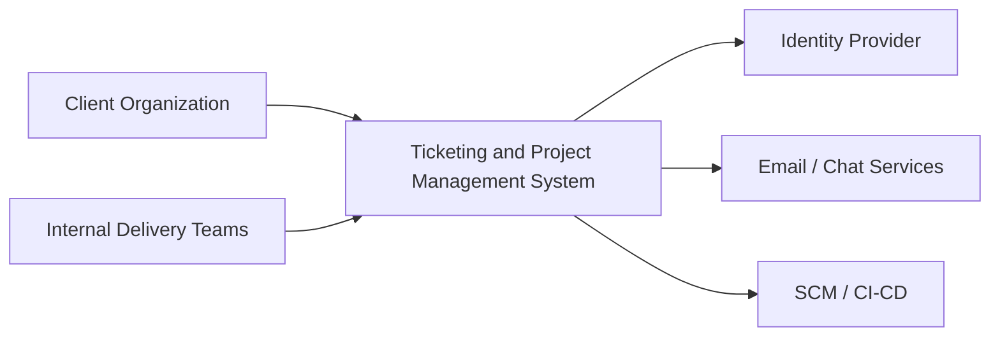
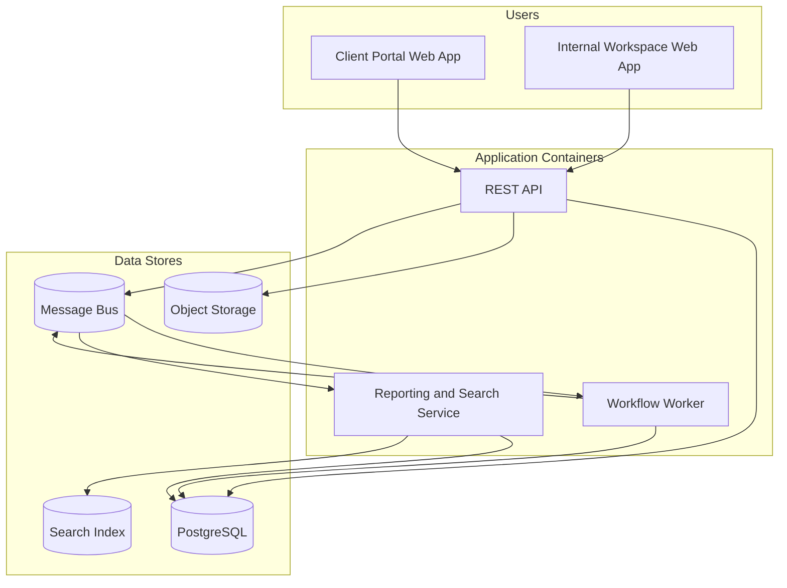

# C4 Context and Container Diagrams - Ticketing and Project Management System

## C4 Context

```mermaid
flowchart LR
    client[Client Organization]
    employee[Internal Delivery Teams]
    idp[Identity Provider]
    mail[Email / Chat Services]
    scm[SCM / CI-CD]

    system[Ticketing and Project Management System]

    client --> system
    employee --> system
    system --> idp
    system --> mail
    system --> scm
```

## C4 Container

```mermaid
flowchart TB
    subgraph users[Users]
        clientPortal[Client Portal Web App]
        internalApp[Internal Workspace Web App]
    end

    subgraph app[Application Containers]
        api[REST API]
        worker[Workflow Worker]
        search[Reporting and Search Service]
    end

    subgraph stores[Data Stores]
        db[(PostgreSQL)]
        blob[(Object Storage)]
        bus[(Message Bus)]
        idx[(Search Index)]
    end

    clientPortal --> api
    internalApp --> api
    api --> db
    api --> blob
    api --> bus
    worker --> db
    worker --> bus
    search --> db
    search --> idx
    bus --> worker
    bus --> search
```
