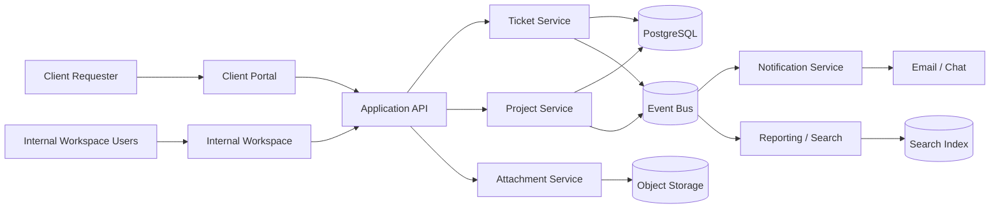

# Data Flow Diagram - Ticketing and Project Management System

## Data Flow Notes

1. Client and internal entry points use different interfaces but the same application API.
2. Ticket and project services publish events for dashboards, notifications, and search indexing.
3. Attachments are stored outside the transactional database and referenced through metadata records.
