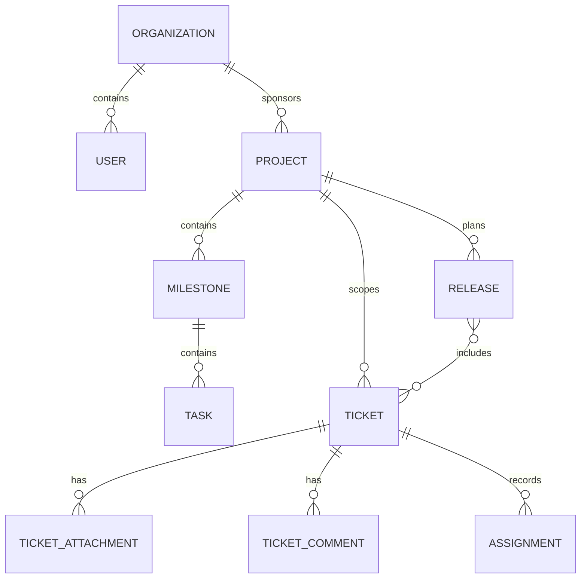

# Domain Model - Ticketing and Project Management System

## Core Domain Areas

| Domain Area | Key Concepts |
|-------------|--------------|
| Identity and Access | Organization, User, RoleAssignment |
| Ticketing | Ticket, Assignment, TicketComment, TicketAttachment |
| Project Delivery | Project, Milestone, Task, Risk, ChangeRequest |
| Release and Verification | Release, VerificationRun, AcceptanceResult |
| Platform Operations | Notification, AuditLog, SLA Rule, Category |

## Relationship Summary
- An **organization** owns many client users, projects, and tickets.
- A **project** contains milestones and tasks and may aggregate many tickets.
- A **ticket** can optionally link to one milestone, one current assignee, and many comments and attachments.
- A **release** groups tickets and tasks that ship together.
- **Audit logs** and **notifications** cut across every domain area.

