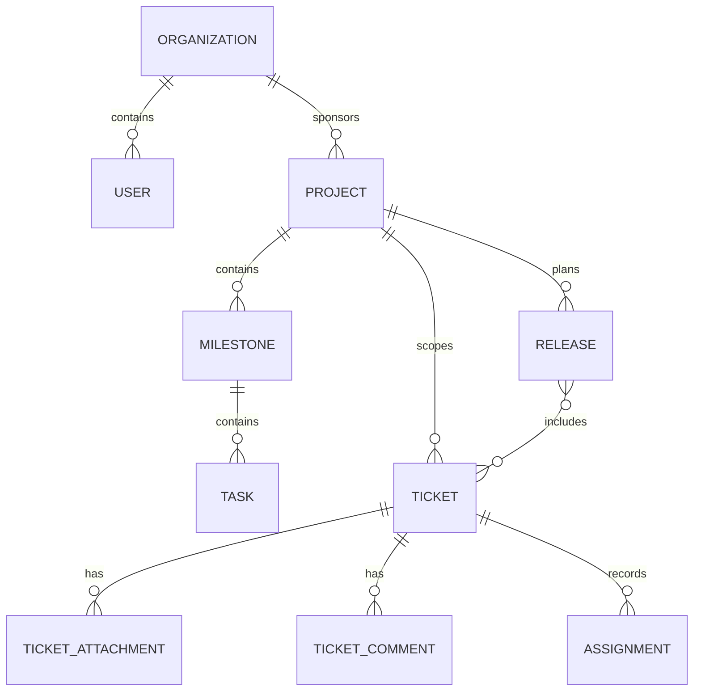

# Domain Model - Ticketing and Project Management System

## Core Domain Areas

| Domain Area | Key Concepts |
|-------------|--------------|
| Identity and Access | Organization, User, RoleAssignment |
| Ticketing | Ticket, Assignment, TicketComment, TicketAttachment |
| Project Delivery | Project, Milestone, Task, Risk, ChangeRequest |
| Release and Verification | Release, VerificationRun, AcceptanceResult |
| Platform Operations | Notification, AuditLog, SLA Rule, Category |

## Relationship Summary
- An **organization** owns many client users, projects, and tickets.
- A **project** contains milestones and tasks and may aggregate many tickets.
- A **ticket** can optionally link to one milestone, one current assignee, and many comments and attachments.
- A **release** groups tickets and tasks that ship together.
- **Audit logs** and **notifications** cut across every domain area.

## Cross-Cutting Workflow and Operational Governance

### Domain Model: Document-Specific Scope
- Primary focus for this artifact: **aggregate invariants, ownership boundaries, and lifecycle consistency**.
- Implementation handoff expectation: this document must be sufficient for an engineer/architect/operator to implement without hidden assumptions.
- Traceability anchor: `HIGH_LEVEL_DESIGN_DOMAIN_MODEL` should be referenced in backlog items, design reviews, and release checklists when this artifact changes.

### Workflow and State Machine Semantics (HIGH_LEVEL_DESIGN_DOMAIN_MODEL)
- For this document, workflow guidance must **declare orchestration boundaries and transaction scopes for state changes**.
- Transition definitions must include trigger, actor, guard, failure code, side effects, and audit payload contract.
- Any asynchronous transition path must define idempotency key strategy and replay safety behavior.

### SLA and Escalation Rules (HIGH_LEVEL_DESIGN_DOMAIN_MODEL)
- For this document, SLA guidance must **assign timer/escalation service responsibilities and anti-storm controls**.
- Escalation must explicitly identify owner, dwell-time threshold, notification channel, and acknowledgement requirement.
- Breach and near-breach states must be queryable in reporting without recomputing from free-form notes.

### Permission Boundaries (HIGH_LEVEL_DESIGN_DOMAIN_MODEL)
- For this document, permission guidance must **document trust boundaries and identity propagation across services**.
- Privileged actions require reason codes, actor identity, and immutable audit entries.
- Client-visible payloads must be explicitly redacted from internal-only and regulated fields.

### Reporting and Metrics (HIGH_LEVEL_DESIGN_DOMAIN_MODEL)
- For this document, reporting guidance must **identify analytics pipeline ownership and reproducibility guarantees**.
- Metric definitions must include numerator/denominator, time window, dimensional keys, and null/missing-data behavior.
- Each metric should map to raw events/tables so results are reproducible during audits.

### Operational Edge-Case Handling (HIGH_LEVEL_DESIGN_DOMAIN_MODEL)
- For this document, operational guidance must **declare degraded-mode capabilities and restoration decision criteria**.
- Partial failure handling must identify what is rolled back, compensated, or deferred.
- Recovery completion criteria must be measurable (not subjective) and tied to dashboard/alert signals.

### Implementation Readiness Checklist (HIGH_LEVEL_DESIGN_DOMAIN_MODEL)
| Checklist Item | This Document Must Provide | Validation Evidence |
|---|---|---|
| Workflow Contract Completeness | All relevant states, transitions, and invalid paths for `high-level-design/domain-model.md` | Scenario walkthrough + transition test mapping |
| SLA/ Escalation Determinism | Timer, pause, escalation, and override semantics | Policy table review + simulated timer run |
| Authorization Correctness | Role scope, tenant scope, and field visibility boundaries | Auth matrix review + API/UI parity checks |
| Reporting Reproducibility | KPI formulas, dimensions, and source lineage | Recompute KPI from event data sample |
| Operations Recoverability | Degraded-mode and compensation runbook steps | Tabletop/game-day evidence and postmortem template |

