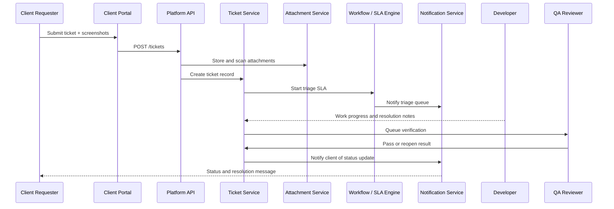
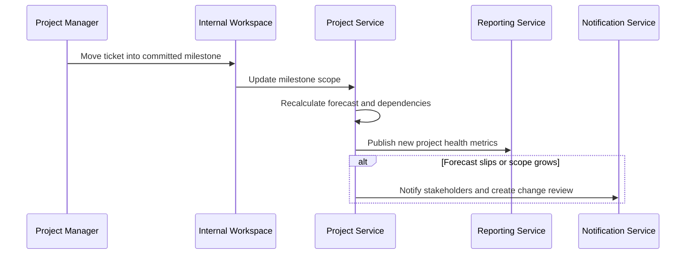

# System Sequence Diagram - Ticketing and Project Management System

## Ticket Intake to Closure

```mermaid
sequenceDiagram
    participant C as Client Requester
    participant P as Client Portal
    participant API as Platform API
    participant T as Ticket Service
    participant A as Attachment Service
    participant W as Workflow / SLA Engine
    participant N as Notification Service
    participant D as Developer
    participant Q as QA Reviewer

    C->>P: Submit ticket + screenshots
    P->>API: POST /tickets
    API->>A: Store and scan attachments
    API->>T: Create ticket record
    T->>W: Start triage SLA
    W->>N: Notify triage queue
    D-->>T: Work progress and resolution notes
    T->>Q: Queue verification
    Q->>T: Pass or reopen result
    T->>N: Notify client of status update
    N-->>C: Status and resolution message
```

## Milestone Change Sequence

```mermaid
sequenceDiagram
    participant PM as Project Manager
    participant UI as Internal Workspace
    participant PS as Project Service
    participant RS as Reporting Service
    participant NS as Notification Service

    PM->>UI: Move ticket into committed milestone
    UI->>PS: Update milestone scope
    PS->>PS: Recalculate forecast and dependencies
    PS->>RS: Publish new project health metrics
    alt Forecast slips or scope grows
        PS->>NS: Notify stakeholders and create change review
    end
```
