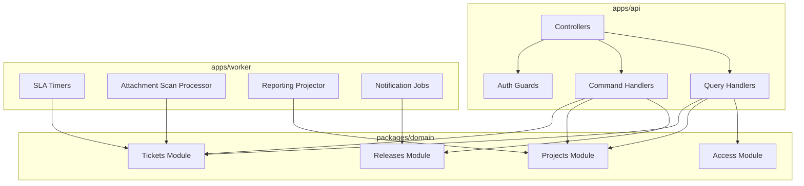

# C4 Code Diagram - Ticketing and Project Management System

```mermaid
flowchart TB
    subgraph api[apps/api]
        controllers[Controllers]
        guards[Auth Guards]
        commands[Command Handlers]
        queries[Query Handlers]
    end

    subgraph domain[packages/domain]
        tickets[Tickets Module]
        projects[Projects Module]
        releases[Releases Module]
        access[Access Module]
    end

    subgraph worker[apps/worker]
        timers[SLA Timers]
        scans[Attachment Scan Processor]
        projections[Reporting Projector]
        notifications[Notification Jobs]
    end

    controllers --> guards
    controllers --> commands
    controllers --> queries
    commands --> tickets
    commands --> projects
    commands --> releases
    queries --> tickets
    queries --> projects
    queries --> access
    timers --> tickets
    scans --> tickets
    projections --> projects
    notifications --> releases
```
