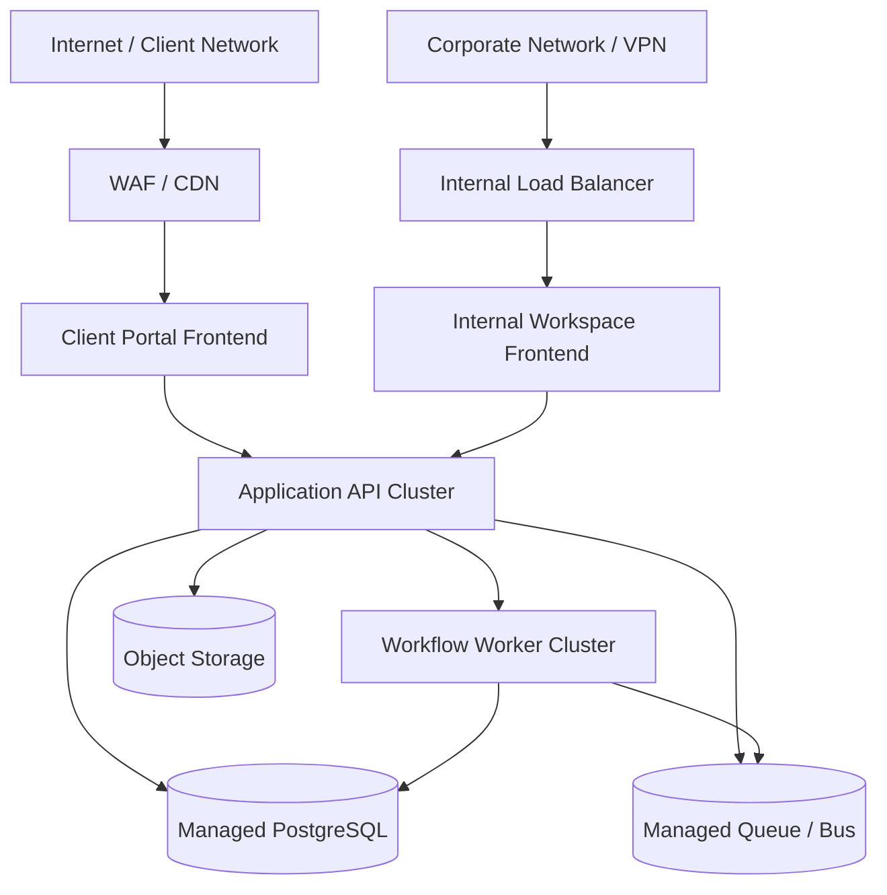

# Deployment Diagram - Ticketing and Project Management System

## Deployment Notes
- Client-facing and internal frontends are separated at the edge even when they share backend services.
- Workers handle asynchronous scanning, notifications, SLA timers, and report projection.
- Object storage is required for evidence files and exported reports.
