# Kubernetes Deployment Diagram — Ticketing and Project Management System

## Overview

This document describes the complete Kubernetes deployment topology for the Ticketing and Project Management System. The platform runs on Amazon EKS across three availability zones, with dedicated node groups for application workloads, stateful data services, and monitoring infrastructure. All microservices are deployed as Kubernetes Deployments with Horizontal Pod Autoscalers, backed by managed AWS data services.

---

## Kubernetes Cluster Architecture

```mermaid
graph TB
    subgraph EKS["Amazon EKS Cluster — ticketing-prod-cluster"]
        subgraph NG_APP["Node Group: application (m6i.2xlarge, 6–30 nodes, spot mix)"]
            subgraph NS_PROD["Namespace: ticketing-prod"]
                TICKET["ticket-service\nDeploy: 3→20 pods\nHPA: CPU 60%"]
                PROJECT["project-service\nDeploy: 2→10 pods\nHPA: CPU 60%"]
                SPRINT["sprint-service\nDeploy: 2→10 pods\nHPA: CPU 60%"]
                SLA["sla-service\nDeploy: 3→15 pods\nHPA: CPU 50%"]
                AUTOMATION["automation-engine\nDeploy: 2→10 pods\nHPA: CPU 70%"]
                NOTIFICATION["notification-service\nDeploy: 2→8 pods\nHPA: CPU 70%"]
                SEARCH["search-service\nDeploy: 2→10 pods\nHPA: CPU 60%"]
                INTEGRATION["integration-hub\nDeploy: 2→8 pods\nHPA: CPU 70%"]
                REPORTING["reporting-service\nDeploy: 2→6 pods\nHPA: CPU 60%"]
                ATTACHMENT["attachment-service\nDeploy: 2→8 pods\nHPA: CPU 60%"]
            end
            subgraph NS_INGRESS["Namespace: ingress-nginx"]
                KONG["Kong API Gateway\nDeploy: 3→10 pods\nHPA: CPU 60%"]
                NGINX["nginx-ingress-controller\nDeploy: 3 pods (fixed)"]
            end
        end

        subgraph NG_DATA["Node Group: data (r6i.2xlarge, 3–9 nodes, on-demand)"]
            subgraph NS_DATA["Namespace: ticketing-data"]
                KAFKA_SS["kafka\nStatefulSet: 3 brokers\n(self-managed fallback only)"]
                REDIS_SS["redis-cluster\nStatefulSet: 6 pods\n(self-managed fallback only)"]
            end
        end

        subgraph NG_MON["Node Group: monitoring (m6i.xlarge, 3–6 nodes, on-demand)"]
            subgraph NS_MON["Namespace: ticketing-monitoring"]
                PROM["prometheus\nStatefulSet: 2 pods\n50Gi PVC each"]
                GRAFANA["grafana\nDeploy: 2 pods"]
                JAEGER["jaeger-collector\nDeploy: 2 pods"]
                JAEGER_Q["jaeger-query\nDeploy: 1 pod"]
                ALERTMGR["alertmanager\nStatefulSet: 3 pods"]
            end
        end
    end

    subgraph AWS_MANAGED["AWS Managed Services"]
        RDS["RDS Aurora PostgreSQL\nMulti-AZ Cluster\nr6g.2xlarge × 3"]
        ELASTICACHE["ElastiCache Redis\nCluster Mode\n3 shards × 2 replicas"]
        OPENSEARCH["Amazon OpenSearch\n3 master + 6 data nodes\nm6g.2xlarge"]
        MSK["Amazon MSK Kafka\n3 brokers\nkafka.m5.xlarge"]
        S3["Amazon S3\nticketing-attachments\nticketing-exports"]
        ECR["Amazon ECR\nContainer Registry"]
    end

    subgraph EDGE["Edge / Ingress Layer"]
        ALB["Application Load Balancer\nALB (HTTPS/443)"]
        CF["CloudFront CDN\n+ WAF + Shield Standard"]
        R53["Route 53\napi.ticketing.io\n*.ticketing.io"]
    end

    R53 --> CF
    CF --> ALB
    ALB --> KONG
    KONG --> TICKET & PROJECT & SPRINT & SLA
    KONG --> AUTOMATION & NOTIFICATION & SEARCH & INTEGRATION
    KONG --> REPORTING & ATTACHMENT

    TICKET & PROJECT & SPRINT --> RDS
    SLA --> ELASTICACHE
    SLA --> RDS
    SEARCH --> OPENSEARCH
    AUTOMATION & NOTIFICATION --> MSK
    ATTACHMENT --> S3
    REPORTING --> RDS

    TICKET & PROJECT & SPRINT & SLA & AUTOMATION --> MSK
    NOTIFICATION --> MSK

    PROM -.->|scrape| TICKET & PROJECT & SPRINT & SLA
    PROM -.->|scrape| AUTOMATION & NOTIFICATION & SEARCH & INTEGRATION
    JAEGER -.->|trace| TICKET & PROJECT & SPRINT
```



---

## Resource Specifications

| Service | Min Replicas | Max Replicas | CPU Request | CPU Limit | Mem Request | Mem Limit | Storage |
|---|---|---|---|---|---|---|---|
| ticket-service | 3 | 20 | 250m | 1000m | 512Mi | 1Gi | — |
| project-service | 2 | 10 | 200m | 800m | 384Mi | 768Mi | — |
| sprint-service | 2 | 10 | 200m | 800m | 384Mi | 768Mi | — |
| sla-service | 3 | 15 | 300m | 1000m | 512Mi | 1Gi | — |
| automation-engine | 2 | 10 | 200m | 1000m | 512Mi | 1Gi | — |
| notification-service | 2 | 8 | 150m | 500m | 256Mi | 512Mi | — |
| search-service | 2 | 10 | 200m | 800m | 512Mi | 1Gi | — |
| integration-hub | 2 | 8 | 200m | 800m | 384Mi | 768Mi | — |
| reporting-service | 2 | 6 | 500m | 2000m | 1Gi | 2Gi | — |
| attachment-service | 2 | 8 | 200m | 800m | 384Mi | 768Mi | — |
| prometheus | 2 | 2 | 500m | 2000m | 2Gi | 4Gi | 50Gi |
| grafana | 2 | 4 | 100m | 500m | 256Mi | 512Mi | 10Gi |
| jaeger-collector | 2 | 6 | 200m | 1000m | 512Mi | 1Gi | — |
| kong-gateway | 3 | 10 | 300m | 1000m | 512Mi | 1Gi | — |
| nginx-ingress | 3 | 3 | 200m | 500m | 256Mi | 512Mi | — |

---

## Kubernetes Manifest Patterns

### Deployment — ticket-service

```yaml
apiVersion: apps/v1
kind: Deployment
metadata:
  name: ticket-service
  namespace: ticketing-prod
  labels:
    app: ticket-service
    version: "1.0.0"
    component: backend
spec:
  replicas: 3
  selector:
    matchLabels:
      app: ticket-service
  strategy:
    type: RollingUpdate
    rollingUpdate:
      maxSurge: 2
      maxUnavailable: 0
  template:
    metadata:
      labels:
        app: ticket-service
        version: "1.0.0"
      annotations:
        prometheus.io/scrape: "true"
        prometheus.io/port: "9090"
        prometheus.io/path: "/metrics"
    spec:
      serviceAccountName: ticket-service-sa
      terminationGracePeriodSeconds: 60
      affinity:
        podAntiAffinity:
          requiredDuringSchedulingIgnoredDuringExecution:
            - labelSelector:
                matchExpressions:
                  - key: app
                    operator: In
                    values: ["ticket-service"]
              topologyKey: "kubernetes.io/hostname"
      containers:
        - name: ticket-service
          image: 123456789.dkr.ecr.us-east-1.amazonaws.com/ticket-service:1.0.0
          ports:
            - containerPort: 8080
              name: http
            - containerPort: 9090
              name: metrics
          envFrom:
            - configMapRef:
                name: ticket-service-config
            - secretRef:
                name: ticket-service-secrets
          resources:
            requests:
              cpu: "250m"
              memory: "512Mi"
            limits:
              cpu: "1000m"
              memory: "1Gi"
          readinessProbe:
            httpGet:
              path: /health/ready
              port: 8080
            initialDelaySeconds: 10
            periodSeconds: 5
            failureThreshold: 3
          livenessProbe:
            httpGet:
              path: /health/live
              port: 8080
            initialDelaySeconds: 30
            periodSeconds: 10
            failureThreshold: 3
          lifecycle:
            preStop:
              exec:
                command: ["/bin/sh", "-c", "sleep 5"]
```

### Service

```yaml
apiVersion: v1
kind: Service
metadata:
  name: ticket-service
  namespace: ticketing-prod
  labels:
    app: ticket-service
spec:
  selector:
    app: ticket-service
  ports:
    - name: http
      port: 80
      targetPort: 8080
    - name: metrics
      port: 9090
      targetPort: 9090
  type: ClusterIP
```

### HorizontalPodAutoscaler

```yaml
apiVersion: autoscaling/v2
kind: HorizontalPodAutoscaler
metadata:
  name: ticket-service-hpa
  namespace: ticketing-prod
spec:
  scaleTargetRef:
    apiVersion: apps/v1
    kind: Deployment
    name: ticket-service
  minReplicas: 3
  maxReplicas: 20
  metrics:
    - type: Resource
      resource:
        name: cpu
        target:
          type: Utilization
          averageUtilization: 60
    - type: Resource
      resource:
        name: memory
        target:
          type: Utilization
          averageUtilization: 75
  behavior:
    scaleDown:
      stabilizationWindowSeconds: 300
      policies:
        - type: Percent
          value: 10
          periodSeconds: 60
    scaleUp:
      stabilizationWindowSeconds: 30
      policies:
        - type: Percent
          value: 50
          periodSeconds: 30
```

### ConfigMap

```yaml
apiVersion: v1
kind: ConfigMap
metadata:
  name: ticket-service-config
  namespace: ticketing-prod
data:
  APP_PORT: "8080"
  METRICS_PORT: "9090"
  DB_POOL_SIZE: "20"
  DB_POOL_TIMEOUT: "5000"
  KAFKA_BROKERS: "b-1.msk.ticketing.io:9092,b-2.msk.ticketing.io:9092,b-3.msk.ticketing.io:9092"
  KAFKA_CONSUMER_GROUP: "ticket-service-v1"
  S3_BUCKET: "ticketing-attachments-prod"
  REDIS_CLUSTER_MODE: "true"
  LOG_LEVEL: "info"
  LOG_FORMAT: "json"
  TRACING_ENABLED: "true"
  OTEL_ENDPOINT: "http://jaeger-collector.ticketing-monitoring:4317"
```

---

## Health Check Configuration

| Service | Readiness Path | Liveness Path | Initial Delay | Period | Failure Threshold |
|---|---|---|---|---|---|
| ticket-service | /health/ready | /health/live | 10s / 30s | 5s / 10s | 3 / 3 |
| project-service | /health/ready | /health/live | 10s / 30s | 5s / 10s | 3 / 3 |
| sprint-service | /health/ready | /health/live | 10s / 30s | 5s / 10s | 3 / 3 |
| sla-service | /health/ready | /health/live | 15s / 45s | 5s / 10s | 3 / 3 |
| automation-engine | /health/ready | /health/live | 20s / 60s | 10s / 15s | 3 / 3 |
| notification-service | /health/ready | /health/live | 10s / 30s | 5s / 10s | 3 / 3 |
| search-service | /health/ready | /health/live | 15s / 30s | 5s / 10s | 3 / 3 |
| integration-hub | /health/ready | /health/live | 10s / 30s | 5s / 10s | 3 / 3 |
| reporting-service | /health/ready | /health/live | 20s / 60s | 10s / 20s | 3 / 3 |
| attachment-service | /health/ready | /health/live | 10s / 30s | 5s / 10s | 3 / 3 |

**Readiness probe** checks database connectivity, Kafka connectivity, and Redis connectivity before accepting traffic. **Liveness probe** checks that the process is not deadlocked (heap, goroutine/thread health).

All services expose a `/health/detailed` endpoint (protected by cluster-internal auth) returning component-level health status for operational tooling.

---

## Rolling Update Strategy

All production deployments use `RollingUpdate` with:

- `maxSurge: 2` — allow 2 extra pods above desired count during rollout
- `maxUnavailable: 0` — zero traffic disruption; new pods must be ready before old ones terminate
- `terminationGracePeriodSeconds: 60` — in-flight requests complete before shutdown
- `preStop` sleep of 5 seconds — allows load balancer to drain connections before SIGTERM

**Rollback procedure:**

```bash
# Automatic rollback if readiness probe fails within 2 minutes
kubectl rollout status deployment/ticket-service -n ticketing-prod --timeout=5m

# Manual rollback
kubectl rollout undo deployment/ticket-service -n ticketing-prod

# Roll back to specific revision
kubectl rollout undo deployment/ticket-service -n ticketing-prod --to-revision=3
```

**Canary releases** for high-risk changes are implemented via Argo Rollouts with weighted traffic splitting (10% → 30% → 100%) gated on Prometheus error rate metrics.

**Image pull policy:** `Always` in production — images are immutable, tagged by Git SHA, never by `latest`.
