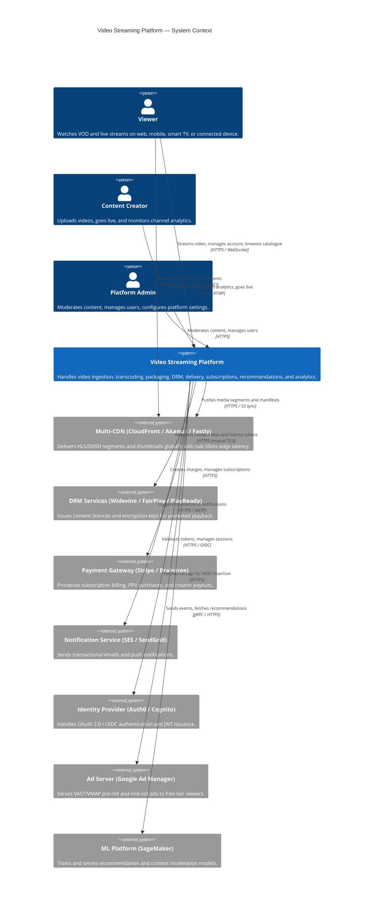

# Video Streaming Platform — Documentation Hub

> Production-grade documentation for a Netflix/YouTube-scale VOD and Live Streaming platform capable of serving **50M+ concurrent viewers**, supporting **4K HDR** playback, DRM-protected content delivery, multi-CDN distribution, adaptive bitrate streaming (HLS/DASH), and full creator monetisation tooling.

---

## Table of Contents

1. [Project Overview](#project-overview)
2. [Architecture Overview](#architecture-overview)
3. [Key Features](#key-features)
4. [Technology Stack](#technology-stack)
5. [Documentation Structure](#documentation-structure)
6. [Getting Started](#getting-started)
7. [Documentation Status](#documentation-status)
8. [Contributing](#contributing)

---

## Project Overview

This repository contains the complete engineering documentation for a horizontally scalable, cloud-native video streaming platform. The platform supports two primary delivery modes:

- **Video on Demand (VOD):** Content ingested, transcoded to adaptive-bitrate (ABR) ladders, encrypted with multi-DRM, stored on object storage, and delivered via a globally distributed CDN mesh. Viewers experience sub-2-second start times and seamless quality switching.
- **Live Streaming:** Real-time RTMP/SRT ingest pipelines feeding low-latency HLS (LL-HLS) packaging, DVR support, automatic live-to-VOD archiving, and concurrent viewer counts in the hundreds of thousands per stream.

The platform is designed to operate at the scale of major consumer video services:

| Metric | Target |
|---|---|
| Concurrent viewers | 50M+ |
| Concurrent live streams | 500K+ |
| Content uploads / day | 1M+ |
| Total content storage | 10PB+ |
| API throughput | 100K req/s |
| VOD start time (P99) | < 2 seconds |
| Availability SLA | 99.9% streaming / 99.99% billing |

### Stakeholders

| Role | Responsibility |
|---|---|
| **Viewers** | Consume VOD and live content across web, mobile, smart TV |
| **Content Creators** | Upload, manage, monetise, and analyse video content |
| **Platform Administrators** | Moderate content, manage users, configure infrastructure |
| **Business / Product** | Define pricing, subscription tiers, promotional strategy |
| **Engineering** | Design, build, and operate all platform services |
| **Legal / Compliance** | Ensure GDPR, DMCA, COPPA, WCAG compliance |

---

## Architecture Overview

The platform follows a **microservices architecture** deployed on Kubernetes (AWS EKS), with event-driven communication via Apache Kafka, multi-region active-active deployment, and CDN-first delivery for all media assets.



### Core Service Domains

| Domain | Services |
|---|---|
| **Ingestion** | Upload API, Multipart coordinator, Ingest workers |
| **Transcoding** | Job queue, FFmpeg workers, Quality control |
| **Packaging** | HLS/DASH packager, DRM encryptor, Manifest generator |
| **Delivery** | CDN orchestrator, Origin server, Signed URL service |
| **Live** | RTMP/SRT ingest, Live transcoder, LL-HLS packager, DVR store |
| **Catalogue** | Metadata API, Search (Elasticsearch), Recommendation engine |
| **Identity** | Auth service, Token service, Session manager |
| **Subscriptions** | Plan service, Billing API, Payment processor, Entitlement engine |
| **Creator** | Dashboard API, Analytics aggregator, Comment service |
| **Moderation** | AI classifier, Human review queue, DMCA workflow |
| **Analytics** | Event pipeline (Kafka), Aggregation (Flink), Data warehouse (Redshift) |

---

## Key Features

### Video on Demand (VOD)
- Upload files up to **100 GB** via resumable multipart API (S3 Multipart or TUS protocol)
- Supported input formats: MP4, MOV, MKV, AVI, WebM, ProRes 422/4444, DNxHD/DNxHR
- Automatic transcoding to **HLS** and **MPEG-DASH** with configurable bitrate ladders
- Resolution ladder: **240p → 360p → 480p → 720p → 1080p → 4K (2160p)**
- Per-title encoding (convex hull optimisation) to minimise bitrate at quality target
- Codec support: **H.264**, **H.265/HEVC**, **VP9**, **AV1** (progressive rollout)
- HDR10, HDR10+, and Dolby Vision tone-mapping
- Automatic thumbnail extraction (10 frames/min) + custom thumbnail upload
- Subtitle/caption ingestion (SRT, WebVTT, SCC, TTML) with burn-in option
- Content-aware scene detection for chapter segmentation

### Adaptive Bitrate Streaming (ABR)
- **HLS** (RFC 8216) with 6-second segments (2-second for LL-HLS)
- **MPEG-DASH** with `MPD` manifests and SegmentTemplate addressing
- CMAF (Common Media Application Format) single-file packaging for both HLS and DASH
- ABR algorithm: throughput-based with buffer occupancy hysteresis
- Cold start optimisation: serve lowest bitrate first segment, then ramp up
- Startup time < 2 seconds (P99 VOD), < 4 seconds (P99 live)

### DRM & Content Protection
- **Widevine** L1 (hardware-backed) and L3 (software) for Chrome, Android, Cast
- **FairPlay Streaming (FPS)** for Safari, iOS, tvOS, macOS
- **PlayReady** for Windows, Xbox, Edge
- **AES-128** key-per-title encryption (ClearKey for development)
- CPIX (Content Protection Information Exchange) for key management interoperability
- DRM licence tokens expire in ≤ 30 minutes; short-lived signed CDN URLs
- Offline download with DRM-bound licences (mobile apps)

### Live Streaming
- **RTMP / RTMPS** ingest endpoint per stream key
- **SRT** (Secure Reliable Transport) for contribution links over public internet
- **WebRTC** ingest for ultra-low-latency (< 1 second glass-to-glass) use cases
- **LL-HLS** (Low-Latency HLS, Apple draft) with part duration 200ms
- **CMAF-CTE** (chunked transfer encoding) DASH for sub-3-second latency
- DVR sliding window: 30 min default, up to 4 hours configurable
- **Live-to-VOD**: automatic archival trigger on stream end
- Multi-bitrate live ladder: 360p/720p/1080p (1080p60 optional)
- Live co-streaming: up to 4 RTMP sources merged via simulcast relay

### Multi-CDN Delivery
- Primary CDN: **AWS CloudFront** (400+ PoPs)
- Secondary CDN: **Akamai** (failover, geographic supplementation)
- Tertiary CDN: **Fastly** for API acceleration
- CDN health probing every 30 seconds; automatic failover within 60 seconds
- Weighted traffic steering via **Latency-based DNS (Route 53)**
- **Signed URLs / Signed Cookies** with 4-hour expiry for content access control
- Origin shield: consolidated cache layer to protect transcode origin

### Subscription Management & Monetisation
- Tiered plans: **Free / Basic (1080p) / Standard (1080p, 2 screens) / Premium (4K, 4 screens) / 4K Ultra (Dolby Vision + Atmos)**
- **Pay-Per-View (PPV)** per-content purchases
- **Creator channel memberships** with configurable perks
- Ad-supported free tier: VAST 2.0/3.0 pre-roll and mid-roll ad insertion
- Server-Side Ad Insertion (SSAI) via AWS MediaTailor / Yospace
- Coupon codes, referral discounts, promotional free trials
- Family/group plans (up to 5 member accounts)
- Annual billing with 2-month discount; dunning management for failed payments

### Content Recommendations
- Collaborative filtering (matrix factorisation, ALS) on viewer interaction history
- Content-based filtering on video embeddings (CLIP-style visual features + metadata)
- Real-time personalisation: Redis-cached recommendation lists, refreshed every 15 min
- Trending algorithm: view velocity + engagement rate, decay function over 48 hours
- A/B testing framework for recommendation algorithm experiments
- Elasticsearch-backed full-text search: title, description, cast, transcript (ASR)

### Creator Tools
- **Creator Studio** dashboard: views, watch time, retention curve, revenue, CTR
- Video manager: upload, edit metadata, set visibility, schedule publish
- Comment moderation: AI pre-filter (toxicity score), manual hold queue
- Community posts and polls
- Monetisation setup: AdSense link, membership tiers, super chat for live
- Audience demographics: age, gender, geography, device breakdown

### Content Moderation
- AI classifier (fine-tuned ViT model) for nudity, violence, hate symbols (< 60s latency)
- ASR (Whisper-based) transcript generation → NLP toxicity classifier
- **Content ID** audio/video fingerprinting (Audible Magic integration)
- Human review queue with SLA: P1 (24h), P2 (72h)
- DMCA takedown workflow: automated email ingestion → metadata match → removal/counter-notice
- Age-gating (18+) with ID verification integration

### Analytics & Observability
- Real-time viewer telemetry: rebuffering rate, bitrate switches, startup time, error rate
- QoE (Quality of Experience) scoring per session
- Kafka → Flink → Redshift analytical pipeline
- Grafana dashboards for infrastructure metrics
- Datadog APM for distributed tracing
- PagerDuty alerting with escalation policies

---

## Technology Stack

| Layer | Technology | Purpose |
|---|---|---|
| **Container Orchestration** | AWS EKS (Kubernetes 1.28+) | Service deployment, auto-scaling |
| **Video Transcoding** | FFmpeg 6.x + libx264/libx265/libvpx/libaom | Format conversion, ABR ladder generation |
| **Media Packaging** | Shaka Packager, Bento4 | HLS/DASH manifest and segment generation |
| **Streaming Protocol** | HLS (RFC 8216), MPEG-DASH (ISO 23009-1) | ABR segment delivery |
| **Live Ingest** | Nginx-RTMP, SRT Alliance libsrt, Wowza | RTMP/SRT stream reception |
| **DRM** | Widevine (Google), FairPlay (Apple), PlayReady (Microsoft) | Content protection |
| **Object Storage** | AWS S3 (with Intelligent-Tiering) | Raw uploads, transcoded assets |
| **CDN** | AWS CloudFront, Akamai, Fastly | Edge delivery |
| **Primary Database** | PostgreSQL 15 (Aurora Serverless v2) | Transactional data |
| **Cache** | Redis 7 (ElastiCache, cluster mode) | Sessions, manifests, recommendations |
| **Search** | Elasticsearch 8.x (OpenSearch Service) | Full-text search, faceted browse |
| **Message Broker** | Apache Kafka 3.x (MSK) | Event streaming, job queues |
| **Stream Processing** | Apache Flink 1.18 | Real-time analytics aggregation |
| **Data Warehouse** | Amazon Redshift | Historical analytics |
| **ML Platform** | AWS SageMaker | Recommendation model training/serving |
| **Identity** | Auth0 / AWS Cognito | OAuth 2.0 / OIDC |
| **API Gateway** | AWS API Gateway + Kong | Rate limiting, routing, auth |
| **Service Mesh** | Istio 1.19 | mTLS, traffic management, observability |
| **IaC** | Terraform 1.6, Helm 3 | Infrastructure provisioning |
| **CI/CD** | GitHub Actions, ArgoCD | Continuous deployment |
| **Observability** | Datadog, Grafana, Jaeger | APM, metrics, distributed tracing |
| **Secrets Management** | HashiCorp Vault, AWS Secrets Manager | Key management |

---

## Documentation Structure

```
Video Streaming Platform/
├── README.md                          ← This file
│
├── requirements/
│   ├── requirements.md                ← Full functional + non-functional requirements
│   └── user-stories.md                ← 30+ user stories across all personas
│
├── analysis/
│   ├── capacity-planning.md           ← Storage, bandwidth, compute sizing
│   ├── trade-off-analysis.md          ← HLS vs DASH, codec choices, CDN selection
│   └── competitive-analysis.md        ← Netflix, YouTube, Twitch architecture insights
│
├── high-level-design/
│   ├── system-architecture.md         ← C4 Container diagram, service topology
│   ├── data-flow.md                   ← VOD upload→transcode→deliver flow; live stream flow
│   └── api-design.md                  ← REST API surface, versioning strategy, conventions
│
├── detailed-design/
│   ├── transcoding-pipeline.md        ← FFmpeg pipeline, job orchestration, quality control
│   ├── drm-and-encryption.md          ← CPIX key management, licence server design
│   ├── live-streaming.md              ← RTMP ingest, LL-HLS packager, DVR design
│   ├── recommendation-engine.md       ← ML model architecture, feature store, serving
│   ├── subscription-billing.md        ← Plan management, Stripe integration, entitlements
│   └── cdn-and-delivery.md            ← CDN orchestration, origin shield, signed URLs
│
├── infrastructure/
│   ├── aws-architecture.md            ← VPC topology, EKS cluster, RDS setup
│   ├── kubernetes-manifests.md        ← Deployment specs, HPA, PDB, resource limits
│   └── disaster-recovery.md           ← RTO/RPO targets, failover runbooks
│
├── implementation/
│   ├── upload-api.md                  ← TUS/multipart upload implementation guide
│   ├── player-sdk.md                  ← Web (hls.js/Shaka), iOS (AVPlayer), Android (ExoPlayer)
│   └── creator-dashboard.md           ← Frontend architecture, analytics charts
│
└── edge-cases/
    ├── failure-scenarios.md           ← CDN outage, transcode failure, payment failure
    └── security-threat-model.md       ← STRIDE analysis, DRM bypass threats
```

### File Descriptions

| File | Description |
|---|---|
| `requirements/requirements.md` | Exhaustive functional and non-functional requirements covering all platform domains |
| `requirements/user-stories.md` | 30+ detailed user stories with acceptance criteria, priority, and story points |
| `analysis/capacity-planning.md` | Bottom-up capacity model: storage growth, CDN egress cost, transcode farm sizing |
| `analysis/trade-off-analysis.md` | Technical decision records (TDRs) for major architectural choices |
| `analysis/competitive-analysis.md` | Architecture patterns from Netflix, YouTube, Twitch with applicability assessment |
| `high-level-design/system-architecture.md` | C4 Container and Component diagrams; service interaction topology |
| `high-level-design/data-flow.md` | End-to-end data flow diagrams for VOD, live, and download paths |
| `high-level-design/api-design.md` | OpenAPI 3.1 resource model, authentication, pagination, error schema |
| `detailed-design/transcoding-pipeline.md` | FFmpeg command templates, per-title encoding algorithm, job state machine |
| `detailed-design/drm-and-encryption.md` | CPIX workflow, Widevine/FairPlay integration, key rotation policy |
| `detailed-design/live-streaming.md` | RTMP ingest architecture, LL-HLS segment pipeline, DVR ring buffer design |
| `detailed-design/recommendation-engine.md` | ALS model, feature store schema, A/B testing integration, cold-start strategy |
| `detailed-design/subscription-billing.md` | Subscription state machine, Stripe webhook handlers, dunning flow |
| `detailed-design/cdn-and-delivery.md` | Multi-CDN routing logic, origin shield, cache invalidation strategy |
| `infrastructure/aws-architecture.md` | Multi-AZ VPC design, EKS node groups, Aurora Global, ElastiCache |
| `infrastructure/kubernetes-manifests.md` | YAML reference specs for all services; HPA/KEDA autoscaling configs |
| `infrastructure/disaster-recovery.md` | Regional failover runbook, backup schedules, chaos engineering plan |
| `implementation/upload-api.md` | TUS resumable upload server implementation; S3 Multipart coordination |
| `implementation/player-sdk.md` | hls.js/Shaka Player web integration; ExoPlayer Android; AVPlayer iOS |
| `implementation/creator-dashboard.md` | React-based creator studio architecture, Chart.js analytics widgets |
| `edge-cases/failure-scenarios.md` | Failure mode analysis: CDN degradation, transcode job loss, DB failover |
| `edge-cases/security-threat-model.md` | STRIDE threat model, DRM circumvention vectors, API abuse patterns |

---

## Getting Started

### Reading Order for Engineers

**New to the project?** Follow this sequence:

1. **This README** — understand scope, features, and tech stack
2. `requirements/requirements.md` — understand what must be built
3. `requirements/user-stories.md` — understand user journeys
4. `analysis/trade-off-analysis.md` — understand why key decisions were made
5. `high-level-design/system-architecture.md` — understand service topology
6. `high-level-design/data-flow.md` — understand how data moves
7. Domain-specific `detailed-design/` files for your area

**Domain-specific reading paths:**

| Role | Recommended Files |
|---|---|
| Backend Engineer (Streaming) | `detailed-design/transcoding-pipeline.md` → `detailed-design/cdn-and-delivery.md` → `detailed-design/live-streaming.md` |
| Backend Engineer (Platform) | `detailed-design/subscription-billing.md` → `high-level-design/api-design.md` |
| ML Engineer | `detailed-design/recommendation-engine.md` → `analysis/capacity-planning.md` |
| Security Engineer | `detailed-design/drm-and-encryption.md` → `edge-cases/security-threat-model.md` |
| DevOps / SRE | `infrastructure/aws-architecture.md` → `infrastructure/kubernetes-manifests.md` → `infrastructure/disaster-recovery.md` |
| Frontend Engineer | `implementation/player-sdk.md` → `implementation/creator-dashboard.md` |
| Product Manager | `requirements/requirements.md` → `requirements/user-stories.md` → `analysis/competitive-analysis.md` |

---

## Documentation Status

| File | Status | Last Updated |
|---|---|---|
| `README.md` | ✅ Complete | 2025-01 |
| `requirements/requirements.md` | ✅ Complete | 2025-01 |
| `requirements/user-stories.md` | ✅ Complete | 2025-01 |
| `analysis/capacity-planning.md` | ✅ Complete | 2025-01 |
| `analysis/trade-off-analysis.md` | ✅ Complete | 2025-01 |
| `analysis/competitive-analysis.md` | ✅ Complete | 2025-01 |
| `high-level-design/system-architecture.md` | ✅ Complete | 2025-01 |
| `high-level-design/data-flow.md` | ✅ Complete | 2025-01 |
| `high-level-design/api-design.md` | ✅ Complete | 2025-01 |
| `detailed-design/transcoding-pipeline.md` | ✅ Complete | 2025-01 |
| `detailed-design/drm-and-encryption.md` | ✅ Complete | 2025-01 |
| `detailed-design/live-streaming.md` | ✅ Complete | 2025-01 |
| `detailed-design/recommendation-engine.md` | ✅ Complete | 2025-01 |
| `detailed-design/subscription-billing.md` | ✅ Complete | 2025-01 |
| `detailed-design/cdn-and-delivery.md` | ✅ Complete | 2025-01 |
| `infrastructure/aws-architecture.md` | ✅ Complete | 2025-01 |
| `infrastructure/kubernetes-manifests.md` | ✅ Complete | 2025-01 |
| `infrastructure/disaster-recovery.md` | ✅ Complete | 2025-01 |
| `implementation/upload-api.md` | ✅ Complete | 2025-01 |
| `implementation/player-sdk.md` | ✅ Complete | 2025-01 |
| `implementation/creator-dashboard.md` | ✅ Complete | 2025-01 |
| `edge-cases/failure-scenarios.md` | ✅ Complete | 2025-01 |
| `edge-cases/security-threat-model.md` | ✅ Complete | 2025-01 |

---

## Contributing

Documentation follows these conventions:

- **All diagrams** must use Mermaid syntax (rendered inline on GitHub)
- **API examples** must be valid JSON/YAML — run `yamllint` before committing
- **Decision records** go in `analysis/trade-off-analysis.md` under a new TDR entry
- **Sentence case** for all headings (not title case)
- Use present tense: "The service handles…" not "The service will handle…"
- Every file must pass the 300-line minimum for production-grade depth

### File Naming Convention

- `kebab-case.md` for all documentation files
- Diagrams embedded inline using fenced Mermaid blocks
- Images (screenshots, logos) go in `docs/assets/`

---

*This documentation repository is maintained by the Platform Engineering team. For questions, open a GitHub Discussion or contact the on-call engineer via PagerDuty.*
