# Activity Diagrams — Video Streaming Platform

This document presents activity diagrams for the four most operationally significant flows in the Video Streaming Platform. Each diagram uses Mermaid `flowchart TD` notation with decision diamonds, parallel branches, and subgraph-based actor groupings that approximate UML swimlane semantics. Explanatory sections following each diagram describe the design rationale, key decision points, and failure-handling strategies.

---

## Video Upload and Transcoding Pipeline

```mermaid
flowchart TD
    subgraph CreatorBrowser["Creator — Browser / App"]
        A([Start]) --> B[Select Source Video File]
        B --> C{Format Supported?\nMP4 MOV MKV AVI ProRes}
        C -- No --> D[Display Format Error]
        D --> B
        C -- Yes --> E{File Size ≤ 50 GB\nand Resolution ≤ 4K?}
        E -- No --> F[Display Size or Resolution Error]
        F --> B
        E -- Yes --> G[Fill Metadata\nTitle · Description · Rating · Tags]
        G --> H[Initiate Upload Session Request]
    end

    subgraph UploadService["Upload Service"]
        H --> I[Verify Creator JWT]
        I --> J{Token Valid?}
        J -- No --> K[Return 401 – Redirect to Login]
        J -- Yes --> L[Generate Presigned Multipart S3 URL]
        L --> M[Return Upload Token to Client]
        M --> N[Receive Chunk Stream from Creator]
        N --> O{All Parts Received?}
        O -- No --> P[Persist Chunk Offset as Checkpoint]
        P --> N
        O -- Yes --> Q[Complete Multipart Assembly in S3]
        Q --> R[Compute SHA-256 Checksum]
        R --> S{Hash Matches Client-Supplied Digest?}
        S -- No --> T[Signal Re-upload – Return to N]
        S -- Yes --> U[Move Object to Raw-Ingest Bucket]
        U --> V[Publish VideoUploaded Event\nvsp.video.uploaded]
    end

    subgraph TranscodingService["Transcoding Service"]
        V --> W[Consume VideoUploaded from Kafka]
        W --> X[Create Transcoding Job Record\nStatus = Queued]
        X --> Y[Download Source from Raw-Ingest Bucket]
        Y --> Z{Codec Decodable?}
        Z -- No --> AA[Set Job Status = Failed\nPublish TranscodingFailed Event]
        Z -- Yes --> AB[Extract Duration · FPS · Resolution · Audio Tracks]
        AB --> AC[Generate Thumbnail Sprites\n10 frames per minute]
        AC --> AD[Transcode 240p – 400 kbps]
        AD --> AE[Transcode 480p – 800 kbps]
        AE --> AF[Transcode 720p – 2.5 Mbps]
        AF --> AG[Transcode 1080p – 5 Mbps]
        AG --> AH{Source Resolution ≥ 4K?}
        AH -- Yes --> AI[Transcode 2160p – 15 Mbps]
        AH -- No --> AJ
        AI --> AJ[Package HLS and DASH Manifests\nwith Segment Duration = 6 s]
        AJ --> AK[Apply CENC AES-128 Encryption\nStore CEK in KMS]
        AK --> AL[Upload Encrypted Segments to CDN Origin Bucket]
        AL --> AM[Set Job Status = Complete\nPublish TranscodingCompleted Event\nvsp.transcoding.completed]
    end

    subgraph CDNPublishing["CDN and Publishing"]
        AM --> AN[Update Content Record to Status = Published]
        AN --> AO[Ingest Master Manifests to CDN Origin]
        AO --> AP[Pre-warm Edge Caches at Top-10 PoPs]
        AP --> AQ[Index Title in Search and Recommendations Engine]
        AQ --> AR[Send Creator Email: Content is Live]
        AR --> AS([End])
    end
```

### Flow Description

The Video Upload and Transcoding Pipeline is the foundational ingestion workflow that transforms a creator-supplied media file into a globally distributed, DRM-encrypted, multi-bitrate asset. The pipeline is designed to be fault-tolerant at every stage. Multi-part upload with SHA-256 checksum verification ensures that network interruptions do not require restarting from byte zero — the upload service stores a chunk offset after each received part, and the client resumes from the last confirmed checkpoint. By separating upload completion from the transcoding trigger via the event bus (`VideoUploaded` on `vsp.video.uploaded`), the two subsystems scale independently; transcoding workers consume jobs from a durable Kafka partition rather than being synchronously coupled to an HTTP request cycle.

The transcoding stage produces up to six video renditions depending on source resolution, plus corresponding HLS and DASH manifests, ensuring compatibility with all major adaptive bitrate players. Thumbnail sprites are generated concurrently alongside the lowest-resolution rendition to minimise total pipeline latency. CENC (Common Encryption) is applied to all packaged segments before they reach the CDN origin bucket, so content is encrypted from the moment it leaves the transcoding worker. The content encryption key (CEK) is stored exclusively in the HSM-backed KMS and is never persisted on the transcoding host. This design ensures that a compromised worker cannot expose cleartext media to an attacker.

Once the `TranscodingCompleted` event is published, the CDN origin ingest and cache pre-warming steps execute in rapid succession, so that when the creator receives their completion email the content is already playable with low latency from the platform's top points of presence. The search index update is deliberately the last step — content becomes discoverable only after it is confirmed playable. Any failure between upload completion and search indexing is handled through idempotent event replay on the `vsp.transcoding.*` Kafka topics, ensuring eventual consistency across all downstream systems without manual intervention.

---

## Viewer Playback — DRM Check and ABR Selection

```mermaid
flowchart TD
    subgraph ViewerLayer["Viewer — Browser / App"]
        A([Start]) --> B[Browse Content Catalogue]
        B --> C[Select Title – Press Play]
        C --> D{Session JWT Present\nin Local Storage?}
        D -- No --> E[Redirect to Login Page]
        E --> F[Authenticate – Receive New JWT]
        F --> C
        D -- Yes --> G[Send Playback Request\nTitle ID · Device ID · DRM System]
    end

    subgraph EntitlementService["Entitlement and Geo Service"]
        G --> H[Validate JWT Signature via JWKS Endpoint]
        H --> I{Signature Valid\nand Not Expired?}
        I -- No --> J[Return 401 – Prompt Re-login]
        I -- Yes --> K[Load Subscription Record from Cache\nFallback to DB on Miss]
        K --> L{Subscription Active?}
        L -- No --> M{Is Content Free-Tier?}
        M -- No --> N[Return 403 – Show Subscription Upgrade Prompt]
        M -- Yes --> O[Mark Request as Free-Tier Path]
        L -- Yes --> P{Content Tier ≤ Subscriber Tier?}
        P -- No --> N
        P -- Yes --> O
        O --> Q[Resolve Client IP to ISO 3166-1 Country Code]
        Q --> R{Country in Content Geo-Block List?}
        R -- Yes --> S[Return 451 – Show Geo-Blocked Message]
        R -- No --> T[Count Active Playback Sessions for User]
        T --> U{Active Sessions < Tier Concurrent Limit?\nFree=1 · Basic=2 · Premium=4}
        U -- Yes --> V[Register New Playback Session\nSet Heartbeat TTL = SegmentDuration + 60s]
        U -- No --> W[Return 429 – Show Active Sessions UI]
        W --> X{User Terminates a Session?}
        X -- No --> Y([End – Access Denied])
        X -- Yes --> Z[Invalidate Selected Session in Cache]
        Z --> V
    end

    subgraph DRMService["DRM Licence Service"]
        V --> AA{Content Has DRM Policy?}
        AA -- No --> AE[Deliver Unencrypted Manifest URL]
        AA -- Yes --> AB[Check Licence Cache by Device Fingerprint Hash]
        AB --> AC{Valid Cached Licence Found?}
        AC -- Yes --> AD[Return Cached Licence Token]
        AD --> AE
        AC -- No --> AF[Request CEK from HSM-Backed KMS]
        AF --> AG[Build Licence with Entitlement Claims\nExpiry · Device Limit · Output Restrictions]
        AG --> AH[Sign Licence with Platform Private Key]
        AH --> AI[Cache Licence Token with TTL]
        AI --> AE
    end

    subgraph PlayerABR["Player and ABR Engine"]
        AE --> AJ[Load DASH or HLS Master Manifest]
        AJ --> AK[Probe Initial Network Bandwidth\nDownload 2-Second Probe Segment]
        AK --> AL[Select Starting Bitrate Variant]
        AL --> AM[Buffer 10-Second Startup Window]
        AM --> AN[Begin Video Rendering]
        AN --> AO{Buffer Level < 4 Seconds?}
        AO -- Yes --> AP[Switch Down One Bitrate Tier]
        AP --> AQ[Fetch Lower-Quality Segments]
        AQ --> AO
        AO -- No --> AR{Throughput > 130% of Current Bitrate\nfor 3 Consecutive Measurements?}
        AR -- Yes --> AS[Switch Up One Bitrate Tier]
        AS --> AN
        AR -- No --> AT[Continue Current Variant]
        AT --> AU{Playback Complete or User Stopped?}
        AU -- No --> AO
        AU -- Yes --> AV[Flush Position to Server via Heartbeat API]
        AV --> AW[Emit PlaybackCompleted or PlaybackAbandoned Event]
        AW --> AX([End])
    end
```

### Flow Description

The Viewer Playback flow is the most performance-critical and most frequently executed path on the platform. It is structured as a linear sequence of fail-fast access-control checks followed by a closed-loop ABR engine. The ordering of checks is deliberate and cost-optimised: JWT signature validation and subscription cache lookup complete in under 5 ms on a cache hit, whereas DRM licence issuance via the KMS can take up to 200 ms. Positioning the expensive operation last means that the vast majority of requests — where authentication and entitlement pass and no KMS call is needed due to the licence cache — return a playback authorisation in under 20 ms total.

DRM licence issuance is protected by a per-device cache keyed on the device fingerprint hash. On first access, the licence service generates the content encryption key from the HSM-backed KMS and issues a signed licence embedding entitlement claims (subscription tier, output restrictions, maximum device count); on all subsequent requests within the licence's TTL, the cached token is returned immediately without a KMS round-trip. Licences are short-lived by design: Basic licences carry a 7-day TTL for online streaming, ensuring that a revoked subscription promptly prevents continued playback without requiring aggressive online re-validation during every session.

The ABR engine in the player operates as an independent feedback loop with hysteresis built in on the upward switch: it demands that throughput exceeds 130 % of the current bitrate for three consecutive 500 ms measurement windows before promoting to a higher quality tier, preventing quality thrashing on noisy networks. Downward switches, however, are immediate when the buffer depth drops below 4 seconds, prioritising uninterrupted playback over visual quality. The final step of emitting a `PlaybackCompleted` or `PlaybackAbandoned` event feeds the recommendation model update pipeline, which uses watch completion rates and abandonment timestamps as implicit quality signals for content scoring.

---

## Live Streaming Setup and Broadcast

```mermaid
flowchart TD
    subgraph CreatorSetup["Creator — Setup Phase"]
        A([Start]) --> B[Log In to Creator Dashboard]
        B --> C[Navigate to Live Streaming Section]
        C --> D[Create New Live Event]
        D --> E[Set Title · Description · Scheduled Start Time]
        E --> F[Select Latency Mode\nStandard ≤30s · Low ≤8s · Ultra-low ≤2s]
        F --> G[Platform Generates RTMP and SRT Ingest Endpoints\nwith Unique Stream Key]
        G --> H[Creator Configures External Encoder\ne.g. OBS · Wirecast · vMix]
        H --> I[Activate Test Broadcast Mode]
        I --> J[Start Test Ingest Connection]
    end

    subgraph IngestLayer["Ingest and Transcoding Layer"]
        J --> K[Receive RTMP or SRT Signal at Ingest Edge]
        K --> L{Stream Key Authenticated?}
        L -- No --> M[Reject Connection – Log Invalid Key]
        M --> N([End – Ingest Refused])
        L -- Yes --> O[Verify Creator Live-Stream Quota]
        O --> P{Quota Available?}
        P -- No --> Q[Return 429 – Notify Creator of Quota Exhaustion]
        Q --> N
        P -- Yes --> R{Test Mode Active?}
        R -- Yes --> S[Transcode and Render Preview\nNot Distributed to Viewers]
        S --> T{Creator Approves Preview Quality?}
        T -- No --> H
        T -- Yes --> U[Deactivate Test Mode]
        U --> V[Creator Initiates Public Broadcast]
        V --> W[Publish LiveStreamStarted Event\nvsp.livestream.started]
        R -- No --> W
        W --> X[Segment Ingest into HLS Chunks\n2-Second Segment Duration]
        X --> Y[Transcode Each Chunk to ABR Renditions\n360p · 720p · 1080p per Latency Mode]
        Y --> Z[Package Segments and Write to Origin Storage]
    end

    subgraph EdgeMonitoring["CDN Edge and Health Monitor"]
        Z --> AA[CDN Origin Picks Up New Segments via Polling]
        AA --> AB[Propagate Segments to Edge PoPs]
        AB --> AC[Serve Live Manifest and Segments to Connected Viewers]
        AC --> AD[Aggregate Viewer QoE Metrics\nBuffer Ratio · Bitrate · Join Time]
        AD --> AE{Ingest Bitrate Drop > 30%\nfor 10 Consecutive Seconds?}
        AE -- Yes --> AF[Send Health Alert to Creator Dashboard and Email]
        AF --> AG[Continue Serving Last Valid Buffered Segments]
        AG --> AE
        AE -- No --> AH{Creator Signals End of Broadcast?}
        AH -- No --> AC
        AH -- Yes --> AI[Transmit EOS Signal to Ingest Receiver]
    end

    subgraph PostBroadcast["Post-Broadcast Processing"]
        AI --> AJ[Flush and Finalise Last Segment]
        AJ --> AK[Concatenate All Chunks into Continuous MP4]
        AK --> AL[Run Full VOD Transcoding Pipeline\nAll Bitrate Renditions + DRM Encryption]
        AL --> AM[Detect Chapter Markers from Chat Timestamp Events]
        AM --> AN[Publish VOD Recording – Available Within 30 Minutes]
        AN --> AO[Archive Raw Ingest to Cold Storage with 90-Day Retention]
        AO --> AP[Notify Subscribers – New Recording Available]
        AP --> AQ([End])
    end
```

### Flow Description

The Live Streaming flow is distinguished from the VOD upload flow by its real-time latency requirement: content must be ingested, transcoded, packaged, and distributed within the budget of the selected latency mode — ≤ 30 s for Standard HLS, ≤ 8 s for Low-latency HLS (LHLS), or ≤ 2 s for WebRTC-based Ultra-low latency delivery. The test broadcast mode is a critical quality gate for creator confidence: it establishes a full ingest-to-transcode-to-preview loop against a sandboxed non-public stream, allowing creators to verify audio levels, video quality, and encoding parameters before any viewer is exposed to the live feed. Stream keys used during a test session are cryptographically fresh — the production key is issued only after the creator approves the test preview.

The health monitoring loop runs continuously throughout a broadcast, sampling the ingest bitrate every 10 seconds. A sustained drop of more than 30 % triggers both a creator dashboard alert and a CDN-side "hold" strategy where the manifest's `EXT-X-DISCONTINUITY` tag is suppressed and the last known-good segment is repeated, preventing viewers from hitting a hard stall. This approach maintains a watchable but visually degraded stream during transient encoder issues rather than forcing all viewers to restart playback. The monitoring loop also surfaces viewer-side QoE telemetry — buffer ratio, average bitrate, and join time — to the creator dashboard so they can correlate encoder events with viewer impact in real time.

After the broadcast concludes, the post-broadcast processing pipeline reuses the standard VOD transcoding workflow to produce a high-quality multi-bitrate archive. Chapter markers are inferred from timestamped chat events (e.g., high message-rate bursts indicating audience reaction peaks) and injected into the VOD manifest, providing an enhanced viewing experience for the replay audience. The raw ingest is archived to cold storage for 90 days to satisfy potential DMCA review and creator download requests before being purged.

---

## Subscription and DRM Access Control

```mermaid
flowchart TD
    subgraph RequestEntry["Request Entry — API Gateway"]
        A([Viewer Initiates Playback Request]) --> B[API Gateway Extracts Bearer Token]
        B --> C{Token Present and\nParseable as JWT?}
        C -- No --> D[Return 401 Unauthorised]
        D --> E([End – Access Denied])
        C -- Yes --> F[Verify Signature Against JWKS Endpoint]
        F --> G{Signature Valid\nand Token Not Expired?}
        G -- No --> D
        G -- Yes --> H[Extract userId · profileId · deviceId · ipAddress]
    end

    subgraph SubscriptionEvaluation["Subscription Evaluation — BR-001 · BR-005"]
        H --> I[Load Subscription from Redis Cache\nFallback to PostgreSQL on Miss]
        I --> J{Record Found?}
        J -- No --> K[Treat Request as Free-Tier Viewer]
        J -- Yes --> L{Subscription Status = Active?}
        L -- No --> M{Within 3-Day Payment Grace Period?}
        M -- Yes --> N[Grant Degraded Access\nSD Quality · No Downloads · No Offline]
        M -- No --> O[Return 403 – Subscription Expired\nPresent Renewal Call-to-Action]
        O --> E
        L -- Yes --> P{Content Minimum Tier\n≤ Subscriber Tier?}
        P -- No --> O
        P -- Yes --> Q[Proceed to Geo Check]
        K --> Q
        N --> Q
    end

    subgraph GeoRestriction["Geo-Restriction Enforcement — BR-004"]
        Q --> R[Resolve ipAddress to ISO 3166-1 Country\nUsing MaxMind GeoIP2]
        R --> S{VPN or Proxy Detected\nvia IP Reputation Score?}
        S -- Yes --> T[Enforce Content Licensing Jurisdiction\nLog VPN Detection Event]
        T --> U
        S -- No --> U{Country in Content Geo-Block List?}
        U -- Yes --> V[Return 451 – Unavailable for Legal Reasons]
        V --> E
        U -- No --> W{Country in Allowlist or\nNo Restriction Configured?}
        W -- No --> V
        W -- Yes --> X[Proceed to Concurrency Check]
    end

    subgraph ConcurrencyCheck["Concurrent Stream Enforcement — BR-005"]
        X --> Y[Fetch Active Session Count for userId\nfrom Distributed Session Store]
        Y --> Z{Active Sessions < Tier Limit?\nFree=1 · Basic=2 · Premium=4}
        Z -- No --> AA[Return 429 – Concurrent Limit Reached\nReturn Active Session List]
        AA --> E
        Z -- Yes --> AB[Register New Session\nSet Heartbeat TTL = SegmentDuration + 60s]
    end

    subgraph DRMIssuance["DRM Licence Issuance — BR-001"]
        AB --> AC{Content Has DRM Encryption Policy?}
        AC -- No --> AH[Return Manifest URL – Unencrypted Path]
        AH --> AI([Playback Authorised])
        AC -- Yes --> AD[Verify Device Fingerprint Against\nRegistered-Device List – Max 10 Devices]
        AD --> AE{Device Registered?}
        AE -- No --> AF[Return 403 – Unrecognised Device\nPrompt Device Registration]
        AF --> E
        AE -- Yes --> AG[Retrieve CEK from HSM KMS\nby Content ID]
        AG --> AJ[Construct Licence Payload\nExpiry · DeviceLimit · OutputRestrictions · PSSH]
        AJ --> AK[Sign Payload with RSA-2048 Private Key]
        AK --> AL[Cache Signed Licence Token with TTL\nKey = userId:contentId:deviceHash]
        AL --> AH2[Return Encrypted Manifest URL\nand Signed Licence Token]
        AH2 --> AI
    end
```

### Flow Description

The Subscription and DRM Access Control flow defines the complete authorisation chain that must complete successfully before a DRM licence is issued or an unencrypted manifest URL is returned. Each gate in the chain maps directly to an enforceable business rule: JWT validation (authentication), subscription status and tier comparison (BR-001), geo-restriction (BR-004), concurrent stream counting (BR-005), and device registration verification (BR-001 device binding). The chain is ordered from least to most expensive in terms of external service calls — JWT validation completes in microseconds, Redis cache lookups in under 5 ms, GeoIP resolution in under 10 ms, and KMS key retrieval in up to 200 ms — so the costly tail is only reached for requests that have already cleared all simpler checks.

Two special-case paths handle common real-world edge cases without hard failures. The payment grace period (3 days post-failed payment) allows subscribers to continue viewing at a degraded quality tier while the payment retry mechanism works through its schedule, preventing subscriber churn from transient payment failures. Free-tier content bypasses the subscription tier comparison entirely but still traverses the geo-restriction and concurrency checks, ensuring that even free viewers cannot circumvent territorial rights or exceed their 1-stream allowance by authenticating via a premium account.

All authorisation decisions — whether granted or denied — are written synchronously to an immutable audit log before the response is returned to the client. The log record captures: user ID, content ID, device fingerprint, subscription tier at time of request, decision outcome, denying rule (if applicable), and the resolved country code. This log forms the evidentiary basis for DRM compliance audits, DMCA defence, and fraud investigations. Log writes are fire-and-forget to a Kafka topic consumed by the audit persistence service, ensuring that logging overhead does not add to the request latency on the critical playback path.
