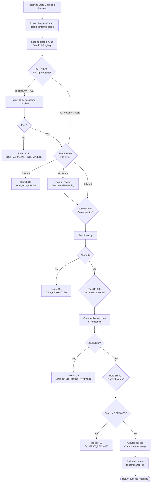

# Business Rules

Business rules define the enforceable constraints and policies that govern platform behaviour. Each rule is given a unique identifier (BR-NNN), a plain-English statement, the enforcement mechanism, and documented exception pathways. Rules are evaluated in the Rule Evaluation Pipeline before any state-changing operation is committed.

---

## Enforceable Rules

### BR-001 — DRM Packaging Required for All Premium-Tier Content Before Publication

**Statement:** Any content item where `isPremium = TRUE` must have DRM packaging (Widevine + FairPlay + PlayReady) completed and verified before the content status can transition to `PUBLISHED`.

**Rationale:** Studio licensing agreements mandate content protection. Unencrypted premium content constitutes a material breach of licensing contracts.

**Enforcement:**
- ContentService.publish() calls DRMPackager.verifyPackaging(contentId) synchronously.
- If packaging is incomplete or failed, publish is rejected with HTTP 422 and error code `DRM_PACKAGING_INCOMPLETE`.
- DB trigger on `content.status` prevents direct SQL update to `PUBLISHED` when `isPremium = TRUE` and no valid DRM record exists.

**Verification:** All `ContentVariant` records for the content must have `isEncrypted = TRUE` and a corresponding `DRMLicense` key record in the key management store.

**Audit:** Every publish attempt is logged to the compliance audit trail with outcome.

**Exception Handling:**
- Studio pre-clearance: A content moderator with `MODERATOR` role can set a `drmExceptionApproved = TRUE` flag (e.g. for trailers that studios have cleared as DRM-free). This requires a two-person approval.
- Free preview clips: If `contentType = CLIP` and duration ≤ 180 seconds and the clip is tagged `is_preview`, DRM requirement is waived with explicit creator opt-in.

---

### BR-002 — 1080p Transcoding Variant Must Be Ready Within 30 Minutes of Upload

**Statement:** For any video file successfully uploaded and queued for transcoding, the 1080p `ContentVariant` (H.264, AAC) must reach `READY` status within 30 minutes of the `VideoUploaded` event timestamp.

**Rationale:** Creator and viewer SLA expectation. Content that takes longer to process degrades creator experience and delays monetisation.

**Enforcement:**
- TranscodingService sets a DynamoDB TTL-based deadline on each job at `videoUploadedAt + 30 min`.
- A CloudWatch alarm fires when any job exceeds 25 minutes (5-minute warning).
- At 30 minutes, if 1080p variant is not `READY`, the job is marked `SLA_BREACHED` and a PagerDuty P2 alert fires.
- A compensating job is immediately queued with elevated priority on the `priority` SQS queue.

**Exception Handling:**
- Files > 20 GB (soft limit): SLA extended to 60 minutes automatically; creator is notified via email.
- Files > 50 GB (hard limit): Requires manual operator approval; SLA is 120 minutes.
- Transcoding farm capacity exhaustion: Circuit breaker opens; all new jobs queued with extended SLA + creator notification.
- Force majeure (AWS AZ outage): SLA suspended; incident declared; content team notifies affected creators manually.

---

### BR-003 — Maximum Upload File Size 50 GB Per Video

**Statement:** Video uploads are subject to a soft limit of 20 GB and a hard limit of 50 GB per file.

- **Soft limit (20 GB):** Upload proceeds but creator receives a warning email and the content is flagged for operations review.
- **Hard limit (50 GB):** Upload is rejected at the UploadService presigned-URL generation step with HTTP 413.

**Enforcement:**
- UploadService reads `Content-Length` from the request at URL generation time and enforces hard limit.
- S3 bucket policy enforces maximum object size via condition key `s3:content-length-range`.
- For multipart uploads, UploadService checks the declared total size against the limit before issuing the uploadId.

**Exception Handling:**
- Professional/Studio tier accounts: Hard limit raised to 200 GB by adding `upload_quota_override` flag to the User record. Requires account manager approval.
- Internal content ingestion (batch pipeline): Limit bypassed via service-to-service API key with `ROLE_INTERNAL_INGEST`.

---

### BR-004 — Geo-Restriction Enforced Per Content License Territory Agreement

**Statement:** Content access must be denied to viewers whose IP geolocation resolves to a country not included in the content's `geo_restrictions.allow` list, or included in the `geo_restrictions.deny` list.

**Enforcement:**
- ContentService resolves viewer IP using MaxMind GeoIP2 database (updated weekly).
- Geo check is performed at playback-token request time; result cached in Redis for 5 minutes per `(userId, contentId)` pair.
- Denied requests return HTTP 451 (Unavailable For Legal Reasons) with body `{"error": "GEO_RESTRICTED", "region": "CN"}`.
- VPN/proxy detection runs in parallel; if confidence > 0.85, the request is treated as the VPN exit country, not the true IP.

**Exception Handling:**
- `geo_restrictions = NULL`: Content is globally unrestricted.
- Travellers with active subscription: No exception — geo restriction follows the request origin, not the subscription billing address.
- GeoIP lookup failure: Fail-closed; deny access and return 451 with error `GEO_LOOKUP_UNAVAILABLE`.
- Content licence update (territory added): Re-evaluation is near-real-time via cache TTL expiry; no active sessions are terminated.

---

### BR-005 — Maximum 3 Concurrent Streams Per Subscription (Household Enforcement)

**Statement:** A single subscription may not stream content on more than `Subscription.maxConcurrentStreams` devices simultaneously. For FAMILY tier this is 4; for PREMIUM it is 3; for STANDARD it is 2; for FREE it is 1.

**Enforcement:**
- DRMService maintains a Redis sorted set `streams:{householdId}` where each member is a `sessionId` with the last heartbeat timestamp as score.
- On each playback-token request, stale sessions (heartbeat > 60 seconds ago) are pruned.
- If live session count ≥ plan limit, request is rejected with HTTP 429 and `MAX_CONCURRENT_STREAMS`.
- Player sends a session keepalive heartbeat to `POST /playback-sessions/{id}/heartbeat` every 30 seconds.

**Exception Handling:**
- Crash/orphan detection: If a device crashes without sending a session end, the session is considered expired after 90 seconds of missed heartbeats (3 missed × 30-second intervals).
- Preview plays (≤ 30 seconds, unauthenticated): Not counted against stream limit.
- Administrative override: Support agents can revoke a specific session via the admin API `DELETE /admin/playback-sessions/{id}`.

---

### BR-006 — Live Stream End-to-End Latency ≤ 10s (Standard) / ≤ 2s (LL-HLS Mode)

**Statement:** For standard HLS live streams the end-to-end glass-to-glass latency must not exceed 10 seconds at the 95th percentile. For Low-Latency HLS (LL-HLS) streams the target is ≤ 2 seconds at the 95th percentile.

**Enforcement:**
- LiveStreamService publishes a `latency_probe` segment every 5 seconds; MediaPackage measures delivery latency.
- CloudWatch metric `LiveStreamLatencyP95` is monitored; alarm triggers at 12 seconds (standard) or 3 seconds (LL-HLS).
- If latency exceeds threshold for 2 consecutive measurements, LL-HLS mode is automatically demoted to standard HLS and the broadcaster is notified via webhook.
- Segment duration targets: standard HLS = 6 seconds, LL-HLS = 0.5 seconds (partial segment delivery).

**Exception Handling:**
- Broadcaster network degradation: Automatic bitrate reduction via adaptive ingest; latency SLO suspended for duration of degraded ingest.
- CDN PoP failure: Traffic re-routed to alternate PoP; 30-second grace period before SLO alert fires.
- Transcode pipeline overload: LL-HLS gracefully degrades to standard HLS; viewer notification banner displayed.

---

### BR-007 — DMCA Takedown Must Be Actioned Within 24 Hours of Valid Notice

**Statement:** Upon receipt of a valid DMCA takedown notice, the identified content must be either removed (set to `REMOVED` status) or a counter-notice workflow must be initiated within 24 hours.

**Enforcement:**
- DmcaService creates a `TakedownRequest` record on receipt; sets deadline = `receivedAt + 24h`.
- A scheduled job (every 15 minutes) checks for `TakedownRequest` records where `status = PENDING` and `deadline < NOW() + 1h`; escalates to L2 trust-and-safety on-call.
- Content moderators receive PagerDuty alert at T-2h if not actioned.
- If deadline passes without action, ContentService automatically sets content `status = REMOVED` (fail-safe) and moderator is notified.

**Exception Handling:**
- Disputed notice: Legal team can set `status = UNDER_REVIEW` which pauses auto-removal for up to 10 business days.
- Counter-notice filed: Content remains removed during 10-business-day waiting period per DMCA § 512(g).
- Repeat infringer: After 3 DMCA strikes, creator account is suspended pending review per BR-007.1.
- Holiday/weekend: 24-hour clock runs continuously; on-call rotation covers weekends.

---

### BR-008 — Pre-Roll Advertisement Maximum 15 Seconds, Skippable After 5 Seconds

**Statement:** Pre-roll video advertisements must not exceed 15 seconds in duration. All pre-roll ads must become skippable by the viewer after 5 seconds of playback.

**Enforcement:**
- AdServer validates ad creative duration at upload time; rejects ads > 15 seconds.
- PlayerSDK starts a skip timer at `adStart + 5s`; skip button becomes interactive and visible.
- If ad server returns an ad > 15 seconds, the PlayerSDK truncates playback at 15 seconds and fires `AdTruncated` event.
- AdServer logs `skipAt` timestamp for billing — advertisers pay per-second if skipped, full CPM if watched to completion.

**Exception Handling:**
- Ad server timeout: If AdServer does not respond within 800 ms, ad is skipped and content plays immediately (no pre-roll blank).
- Ad creative validation failure: Rejected creatives are quarantined; fallback to house ad or no pre-roll.
- Subscriber (PREMIUM tier): Pre-roll ads are not shown; this rule does not apply.
- Kids content (age-rating G/PG): Pre-roll ads are suppressed entirely irrespective of tier.

---

## Rule Evaluation Pipeline

### Pipeline Performance Budget

The rule evaluation pipeline must complete within 150 ms at p99. Individual rule budgets:

| Rule | Budget | Implementation |
|---|---|---|
| BR-001 DRM check | 20 ms | Redis cache lookup |
| BR-003 File size | 1 ms | In-memory check |
| BR-004 Geo check | 30 ms | Redis-cached GeoIP |
| BR-005 Stream count | 20 ms | Redis sorted set |
| BR-007 Content status | 10 ms | Redis cache |
| Audit log write | 5 ms | Async Kafka emit |

---

## Exception and Override Handling

### Override Authority Matrix

| Rule | L1 Override | L2 Override | L3 Override | Audit Required |
|---|---|---|---|---|
| BR-001 DRM exempt | Moderator (2-person) | Trust & Safety Lead | CTO | Yes |
| BR-002 SLA extension | Operations on-call | — | — | Yes |
| BR-003 File size increase | Account Manager | — | — | Yes |
| BR-004 Geo whitelist | Legal Team | — | — | Yes |
| BR-005 Stream limit | Support Agent (temp) | — | — | Yes |
| BR-006 Latency demotion | Automated | Ops on-call | — | Yes |
| BR-007 DMCA counter-notice | Legal Team | — | — | Yes |
| BR-008 Ad suppression | Product Manager | — | — | No |

### Override Audit Trail

Every override is recorded in the `rule_override_log` table:

| Field | Type | Description |
|---|---|---|
| id | UUID | Surrogate key |
| ruleId | VARCHAR(10) | e.g. 'BR-001' |
| entityId | UUID | Affected content/user/stream ID |
| overriddenBy | UUID | User who granted override |
| approvedBy | UUID | Second approver if required |
| reason | TEXT | Justification (required) |
| expiresAt | TIMESTAMPTZ | Override expiry (max 90 days) |
| createdAt | TIMESTAMPTZ | Override granted timestamp |

### Rule Conflict Resolution

When two rules produce conflicting outcomes (e.g. BR-004 allows content but a manual moderation hold blocks it), the most restrictive outcome wins. The evaluation pipeline collects all `REJECT` outcomes and returns the first rejection encountered in priority order: BR-007 > BR-001 > BR-004 > BR-005 > BR-003 > BR-008.

## Enforced Rule Summary

1. DRM packaging is mandatory for all premium-tier content before publication; DRM failure blocks content release.
2. 1080p transcoding variant must be ready within 30 minutes of upload; SLA breach triggers engineering alert.
3. Maximum upload file size is 50GB; files between 20GB and 50GB require explicit creator approval to proceed.
4. Geo-restrictions are enforced per content license territory agreement at CDN edge; VPN bypass triggers access revocation.
5. Maximum 3 concurrent streams per subscription account; additional streams trigger household enforcement challenge.
6. Live stream end-to-end latency must not exceed 10 seconds (standard) or 2 seconds (LL-HLS mode).
7. DMCA takedown notices must be actioned within 24 hours; failure to comply triggers content suspension.
8. Pre-roll advertisements cannot exceed 15 seconds total; must be skippable after 5 seconds per platform policy.
