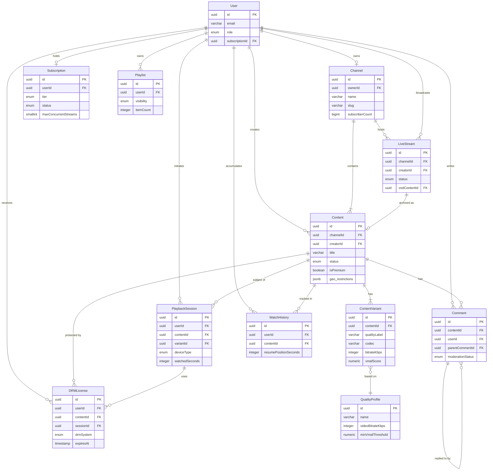

# Data Dictionary

This document defines every persistent entity in the Video Streaming Platform, their fields, types, constraints, and inter-entity relationships. It is the authoritative reference for database schema design, API contract validation, and data quality enforcement.

---

## Core Entities

### Content

Represents a single piece of video content — a movie, episode, short, or clip — regardless of its processing state.

| Field | Type | Constraints | Description | Notes |
|---|---|---|---|---|
| id | UUID | PK, NOT NULL | Surrogate primary key | ULID preferred for sortability |
| title | VARCHAR(500) | NOT NULL | Human-readable content title | Indexed for full-text search |
| description | TEXT | NULLABLE | Long-form synopsis | Max 10,000 characters |
| channelId | UUID | FK → Channel.id, NOT NULL | Owning channel | Indexed |
| creatorId | UUID | FK → User.id, NOT NULL | Uploader / creator account | Indexed |
| contentType | ENUM | NOT NULL | MOVIE, EPISODE, SHORT, CLIP, TRAILER | Drives player behaviour |
| status | ENUM | NOT NULL | DRAFT, UPLOADING, TRANSCODING_QUEUED, TRANSCODING, PUBLISHED, UNLISTED, REMOVED | State machine enforced |
| durationSeconds | INTEGER | NULLABLE, ≥ 0 | Runtime in seconds; populated after transcoding | NULL while transcoding |
| fileSizeBytes | BIGINT | NULLABLE, ≥ 0 | Raw source file size | Populated at upload completion |
| s3RawKey | VARCHAR(1024) | NULLABLE | S3 object key for original upload | Nullified after retention window |
| thumbnailUrl | VARCHAR(2048) | NULLABLE | Default thumbnail CDN URL | |
| ageRating | ENUM | NOT NULL, default G | G, PG, PG-13, R, NC-17, UNRATED | Drives age-gate enforcement |
| isPremium | BOOLEAN | NOT NULL, default FALSE | Whether DRM and subscription required | |
| publishedAt | TIMESTAMPTZ | NULLABLE | When content transitioned to PUBLISHED | Set by system, not creator |
| geo_restrictions | JSONB | NULLABLE | `{allow: ["US","GB"], deny: ["CN"]}` | ISO 3166-1 alpha-2 codes |
| tags | TEXT[] | NULLABLE | Searchable tags array | GIN indexed |
| language | VARCHAR(10) | NOT NULL, default 'en' | Primary audio language (BCP 47) | |
| subtitleLanguages | TEXT[] | NULLABLE | Available subtitle tracks (BCP 47) | |
| viewCount | BIGINT | NOT NULL, default 0 | Denormalised total play count | Async incremented |
| likeCount | INTEGER | NOT NULL, default 0 | Denormalised like count | Async incremented |
| genre | VARCHAR(100)[] | NULLABLE | Genre tags e.g. ['drama','thriller'] | |
| releaseYear | SMALLINT | NULLABLE | Original release year | |
| seriesId | UUID | FK → Series.id, NULLABLE | Parent series if episodic | |
| episodeNumber | SMALLINT | NULLABLE | Episode number within season | |
| seasonNumber | SMALLINT | NULLABLE | Season number | |
| createdAt | TIMESTAMPTZ | NOT NULL, default NOW() | Record creation timestamp | |
| updatedAt | TIMESTAMPTZ | NOT NULL, default NOW() | Last modification timestamp | Trigger-maintained |
| deletedAt | TIMESTAMPTZ | NULLABLE | Soft-delete timestamp | NULL means active |

### ContentVariant

Each Content has multiple transcoded variants representing different quality levels and formats.

| Field | Type | Constraints | Description | Notes |
|---|---|---|---|---|
| id | UUID | PK, NOT NULL | Surrogate key | |
| contentId | UUID | FK → Content.id, NOT NULL, ON DELETE CASCADE | Parent content | Indexed |
| qualityLabel | VARCHAR(20) | NOT NULL | 2160p, 1080p, 720p, 480p, 360p, 240p | |
| codec | VARCHAR(50) | NOT NULL | H.264, H.265/HEVC, AV1, VP9 | |
| container | VARCHAR(20) | NOT NULL | mp4, webm | |
| bitrateKbps | INTEGER | NOT NULL, > 0 | Target video bitrate in kbps | |
| audioBitrateKbps | INTEGER | NOT NULL, > 0 | Audio bitrate in kbps | |
| widthPx | SMALLINT | NOT NULL, > 0 | Frame width in pixels | |
| heightPx | SMALLINT | NOT NULL, > 0 | Frame height in pixels | |
| frameRate | NUMERIC(5,2) | NOT NULL | Frames per second (e.g. 23.976, 29.97, 60) | |
| hlsManifestUrl | VARCHAR(2048) | NULLABLE | CDN URL to variant-specific HLS playlist | |
| dashManifestUrl | VARCHAR(2048) | NULLABLE | CDN URL to DASH representation | |
| s3ProcessedKey | VARCHAR(1024) | NOT NULL | S3 prefix for HLS segments | |
| vmafScore | NUMERIC(5,2) | NULLABLE | VMAF quality score 0–100 | Threshold ≥ 85 for publication |
| hdrFormat | ENUM | NULLABLE | SDR, HDR10, HLG, Dolby_Vision | NULL means SDR |
| isEncrypted | BOOLEAN | NOT NULL, default FALSE | DRM-encrypted segments | TRUE for premium content |
| transcodingJobId | UUID | FK → TranscodingJob.id | Originating job reference | |
| segmentDurationSec | NUMERIC(4,1) | NOT NULL, default 6.0 | HLS segment duration target | |
| totalSegments | INTEGER | NULLABLE | Segment count after packaging | |
| createdAt | TIMESTAMPTZ | NOT NULL, default NOW() | Record creation | |
| updatedAt | TIMESTAMPTZ | NOT NULL, default NOW() | Last update | |

### Channel

A Channel is a branded content collection owned by a creator or organisation.

| Field | Type | Constraints | Description | Notes |
|---|---|---|---|---|
| id | UUID | PK, NOT NULL | Surrogate key | |
| ownerId | UUID | FK → User.id, NOT NULL | Owning user account | |
| name | VARCHAR(255) | NOT NULL, UNIQUE | Channel display name | Slugified for URLs |
| slug | VARCHAR(255) | NOT NULL, UNIQUE | URL-safe identifier | e.g. 'tech-with-tim' |
| description | TEXT | NULLABLE | Channel about text | Max 5,000 characters |
| avatarUrl | VARCHAR(2048) | NULLABLE | Profile image CDN URL | |
| bannerUrl | VARCHAR(2048) | NULLABLE | Channel banner CDN URL | |
| subscriberCount | BIGINT | NOT NULL, default 0 | Denormalised subscriber count | |
| contentCount | INTEGER | NOT NULL, default 0 | Published content count | |
| isVerified | BOOLEAN | NOT NULL, default FALSE | Creator verification badge | |
| monetisationEnabled | BOOLEAN | NOT NULL, default FALSE | Whether ads/revenue enabled | |
| contactEmail | VARCHAR(320) | NULLABLE | Creator contact email | Encrypted at rest |
| country | VARCHAR(2) | NULLABLE | Creator country (ISO 3166-1) | |
| createdAt | TIMESTAMPTZ | NOT NULL, default NOW() | Account creation | |
| updatedAt | TIMESTAMPTZ | NOT NULL, default NOW() | Last modification | |
| deletedAt | TIMESTAMPTZ | NULLABLE | Soft-delete (channel removed) | |

### User

Platform user account covering viewers, creators, and administrators.

| Field | Type | Constraints | Description | Notes |
|---|---|---|---|---|
| id | UUID | PK, NOT NULL | Surrogate key (ULID) | |
| email | VARCHAR(320) | NOT NULL, UNIQUE | Login email address | Encrypted at rest |
| emailVerifiedAt | TIMESTAMPTZ | NULLABLE | Email verification timestamp | NULL = unverified |
| passwordHash | VARCHAR(255) | NOT NULL | bcrypt hash (cost 12) | Never exposed in API |
| displayName | VARCHAR(100) | NOT NULL | Public display name | |
| avatarUrl | VARCHAR(2048) | NULLABLE | Profile avatar CDN URL | |
| role | ENUM | NOT NULL, default VIEWER | VIEWER, CREATOR, MODERATOR, ADMIN | |
| dateOfBirth | DATE | NULLABLE | For age-gate enforcement | Stored encrypted |
| countryCode | VARCHAR(2) | NULLABLE | Detected/declared country | ISO 3166-1 alpha-2 |
| preferredLanguage | VARCHAR(10) | NOT NULL, default 'en' | UI and content language preference | BCP 47 |
| subscriptionId | UUID | FK → Subscription.id, NULLABLE | Active subscription reference | NULL = free tier |
| mfaEnabled | BOOLEAN | NOT NULL, default FALSE | Multi-factor auth enabled | |
| mfaSecret | VARCHAR(255) | NULLABLE | TOTP secret (encrypted) | |
| lastLoginAt | TIMESTAMPTZ | NULLABLE | Last successful login | |
| failedLoginCount | SMALLINT | NOT NULL, default 0 | Consecutive failed logins | Reset on success |
| lockedUntil | TIMESTAMPTZ | NULLABLE | Account lockout expiry | |
| gdprDeletedAt | TIMESTAMPTZ | NULLABLE | GDPR erasure timestamp | PII scrubbed when set |
| createdAt | TIMESTAMPTZ | NOT NULL, default NOW() | Registration timestamp | |
| updatedAt | TIMESTAMPTZ | NOT NULL, default NOW() | Last profile update | |

### Subscription

A Subscription records a user's entitlement to a paid tier.

| Field | Type | Constraints | Description | Notes |
|---|---|---|---|---|
| id | UUID | PK, NOT NULL | Surrogate key | |
| userId | UUID | FK → User.id, NOT NULL, UNIQUE | Subscribing user | One active sub per user |
| planId | VARCHAR(50) | NOT NULL | Plan identifier e.g. 'premium-monthly' | References plan catalogue |
| tier | ENUM | NOT NULL | FREE, STANDARD, PREMIUM, FAMILY | Drives DRM and quality caps |
| status | ENUM | NOT NULL | ACTIVE, PAST_DUE, CANCELLED, EXPIRED | |
| currentPeriodStart | TIMESTAMPTZ | NOT NULL | Current billing period start | |
| currentPeriodEnd | TIMESTAMPTZ | NOT NULL | Current billing period end | |
| cancelAtPeriodEnd | BOOLEAN | NOT NULL, default FALSE | Scheduled cancellation | |
| maxConcurrentStreams | SMALLINT | NOT NULL, default 1 | Stream count limit for this plan | |
| maxQuality | ENUM | NOT NULL, default 1080p | 480p, 720p, 1080p, 2160p | |
| stripeCustomerId | VARCHAR(255) | NULLABLE | Stripe customer identifier | |
| stripeSubscriptionId | VARCHAR(255) | NULLABLE | Stripe subscription identifier | |
| trialEndAt | TIMESTAMPTZ | NULLABLE | Free trial expiry timestamp | |
| householdId | UUID | NULLABLE | Household grouping for family plans | |
| createdAt | TIMESTAMPTZ | NOT NULL, default NOW() | Subscription creation | |
| updatedAt | TIMESTAMPTZ | NOT NULL, default NOW() | Last status change | |

### PlaybackSession

Records an individual viewing session for analytics, concurrency enforcement, and billing.

| Field | Type | Constraints | Description | Notes |
|---|---|---|---|---|
| id | UUID | PK, NOT NULL | Surrogate key (ULID) | |
| userId | UUID | FK → User.id, NOT NULL | Viewing user | Indexed |
| contentId | UUID | FK → Content.id, NOT NULL | Content being watched | Indexed |
| variantId | UUID | FK → ContentVariant.id, NULLABLE | Initial quality variant | May change via ABR |
| deviceId | VARCHAR(255) | NOT NULL | Hashed device fingerprint | |
| deviceType | ENUM | NOT NULL | WEB, IOS, ANDROID, SMART_TV, CHROMECAST, ROKU | |
| ipAddress | INET | NOT NULL | Client IP at session start | Masked after 30 days |
| startedAt | TIMESTAMPTZ | NOT NULL | Session start timestamp | |
| endedAt | TIMESTAMPTZ | NULLABLE | Session end timestamp | NULL = still active |
| lastHeartbeatAt | TIMESTAMPTZ | NULLABLE | Last keepalive from player | Used for orphan detection |
| watchedSeconds | INTEGER | NOT NULL, default 0 | Total seconds of actual play | Excludes buffering |
| bufferingEvents | INTEGER | NOT NULL, default 0 | Count of buffering interruptions | |
| totalBufferingMs | INTEGER | NOT NULL, default 0 | Total buffering duration | |
| peakBitrateKbps | INTEGER | NULLABLE | Peak bitrate observed | |
| avgBitrateKbps | INTEGER | NULLABLE | Average bitrate during session | |
| qualitySwitches | INTEGER | NOT NULL, default 0 | Number of ABR quality changes | |
| completionPercent | NUMERIC(5,2) | NULLABLE | Percentage of content watched | Computed on end |
| errorCode | VARCHAR(50) | NULLABLE | Last player error code if any | |
| drmSessionId | VARCHAR(255) | NULLABLE | Associated DRM license session | |
| sessionToken | VARCHAR(512) | NOT NULL | Signed session token for CDN auth | |
| createdAt | TIMESTAMPTZ | NOT NULL, default NOW() | Record creation | |

### LiveStream

Represents an active or archived live broadcast.

| Field | Type | Constraints | Description | Notes |
|---|---|---|---|---|
| id | UUID | PK, NOT NULL | Surrogate key | |
| channelId | UUID | FK → Channel.id, NOT NULL | Broadcasting channel | Indexed |
| creatorId | UUID | FK → User.id, NOT NULL | Broadcaster | |
| title | VARCHAR(500) | NOT NULL | Stream title | |
| description | TEXT | NULLABLE | Stream description | |
| status | ENUM | NOT NULL | SCHEDULED, LIVE, ENDED, FAILED | |
| rtmpIngestUrl | VARCHAR(2048) | NOT NULL | RTMP ingest endpoint (server) | Returned only to creator |
| streamKey | VARCHAR(255) | NOT NULL | Secret stream key | Encrypted at rest |
| playbackUrl | VARCHAR(2048) | NULLABLE | HLS playback URL for viewers | Set when LIVE |
| scheduledStartAt | TIMESTAMPTZ | NULLABLE | Pre-announced start time | |
| actualStartAt | TIMESTAMPTZ | NULLABLE | When RTMP ingest began | |
| endedAt | TIMESTAMPTZ | NULLABLE | When stream ended | |
| peakViewerCount | INTEGER | NOT NULL, default 0 | Maximum concurrent viewers | |
| totalViewerMinutes | BIGINT | NOT NULL, default 0 | Aggregate viewer-minutes | For analytics |
| dvrEnabled | BOOLEAN | NOT NULL, default TRUE | DVR window available | |
| dvrWindowSeconds | INTEGER | NOT NULL, default 10800 | DVR lookback limit (3 hours default) | |
| llHlsEnabled | BOOLEAN | NOT NULL, default FALSE | Low-latency HLS mode | |
| vodContentId | UUID | FK → Content.id, NULLABLE | VOD content created after stream ends | |
| ingestBitrateKbps | INTEGER | NULLABLE | Detected ingest bitrate | |
| createdAt | TIMESTAMPTZ | NOT NULL, default NOW() | Record creation | |
| updatedAt | TIMESTAMPTZ | NOT NULL, default NOW() | Last update | |

### DRMLicense

Audit record of every DRM license issued.

| Field | Type | Constraints | Description | Notes |
|---|---|---|---|---|
| id | UUID | PK, NOT NULL | Surrogate key | |
| userId | UUID | FK → User.id, NOT NULL | License recipient | Indexed |
| contentId | UUID | FK → Content.id, NOT NULL | Protected content | Indexed |
| sessionId | UUID | FK → PlaybackSession.id, NULLABLE | Associated playback session | |
| drmSystem | ENUM | NOT NULL | WIDEVINE, FAIRPLAY, PLAYREADY, CLEARKEY | |
| deviceId | VARCHAR(255) | NOT NULL | Requesting device fingerprint | |
| keyId | VARCHAR(255) | NOT NULL | Content encryption key ID | |
| licenseToken | VARCHAR(2048) | NOT NULL | Signed license token (opaque) | |
| issuedAt | TIMESTAMPTZ | NOT NULL, default NOW() | License issue time | |
| expiresAt | TIMESTAMPTZ | NOT NULL | License expiry | Default issuedAt + 4h |
| renewedAt | TIMESTAMPTZ | NULLABLE | Last renewal timestamp | |
| revokedAt | TIMESTAMPTZ | NULLABLE | Revocation timestamp if any | |
| revocationReason | VARCHAR(255) | NULLABLE | Reason for revocation | |
| ipAddress | INET | NOT NULL | Client IP at issuance | |
| offlineAllowed | BOOLEAN | NOT NULL, default FALSE | Whether offline download permitted | |
| offlineExpiresAt | TIMESTAMPTZ | NULLABLE | Offline license expiry | |
| persistenceAllowed | BOOLEAN | NOT NULL, default FALSE | Whether license can be cached | |

### Comment

User comment on a Content item.

| Field | Type | Constraints | Description | Notes |
|---|---|---|---|---|
| id | UUID | PK, NOT NULL | Surrogate key | |
| contentId | UUID | FK → Content.id, NOT NULL | Content being commented on | Indexed |
| userId | UUID | FK → User.id, NOT NULL | Comment author | Indexed |
| parentCommentId | UUID | FK → Comment.id, NULLABLE | Parent for threaded replies | |
| body | TEXT | NOT NULL | Comment text | Max 10,000 chars |
| likeCount | INTEGER | NOT NULL, default 0 | Denormalised like count | |
| isPinned | BOOLEAN | NOT NULL, default FALSE | Creator-pinned comment | |
| moderationStatus | ENUM | NOT NULL, default APPROVED | PENDING, APPROVED, REJECTED, DELETED | |
| moderationReason | VARCHAR(500) | NULLABLE | Reason for rejection/deletion | |
| editedAt | TIMESTAMPTZ | NULLABLE | Last edit timestamp | |
| createdAt | TIMESTAMPTZ | NOT NULL, default NOW() | Comment creation | |
| deletedAt | TIMESTAMPTZ | NULLABLE | Soft-delete | |

### Playlist

An ordered, user-curated collection of Content items.

| Field | Type | Constraints | Description | Notes |
|---|---|---|---|---|
| id | UUID | PK, NOT NULL | Surrogate key | |
| userId | UUID | FK → User.id, NOT NULL | Playlist owner | Indexed |
| title | VARCHAR(500) | NOT NULL | Playlist name | |
| description | TEXT | NULLABLE | Playlist description | |
| visibility | ENUM | NOT NULL, default PRIVATE | PRIVATE, UNLISTED, PUBLIC | |
| thumbnailUrl | VARCHAR(2048) | NULLABLE | Auto-generated or custom thumbnail | |
| itemCount | INTEGER | NOT NULL, default 0 | Denormalised item count | |
| totalDurationSeconds | INTEGER | NOT NULL, default 0 | Denormalised total runtime | |
| isSystemPlaylist | BOOLEAN | NOT NULL, default FALSE | Watch Later, Liked Videos etc | |
| createdAt | TIMESTAMPTZ | NOT NULL, default NOW() | Creation timestamp | |
| updatedAt | TIMESTAMPTZ | NOT NULL, default NOW() | Last modification | |

### WatchHistory

Records every content view event for a user, enabling resume playback and history browsing.

| Field | Type | Constraints | Description | Notes |
|---|---|---|---|---|
| id | UUID | PK, NOT NULL | Surrogate key | |
| userId | UUID | FK → User.id, NOT NULL | Viewing user | Composite index with contentId |
| contentId | UUID | FK → Content.id, NOT NULL | Watched content | |
| sessionId | UUID | FK → PlaybackSession.id, NULLABLE | Associated session | |
| resumePositionSeconds | INTEGER | NOT NULL, default 0 | Playback position for resume | |
| completionPercent | NUMERIC(5,2) | NULLABLE | Percentage viewed | |
| watchedAt | TIMESTAMPTZ | NOT NULL, default NOW() | When watch event occurred | |
| isCompleted | BOOLEAN | NOT NULL, default FALSE | Whether viewer reached ≥ 90% | |
| deviceType | ENUM | NULLABLE | WEB, IOS, ANDROID, SMART_TV, etc | |
| deletedAt | TIMESTAMPTZ | NULLABLE | GDPR erasure marker | PII scrubbed when set |

### QualityProfile

Defines transcoding parameters for each quality tier — referenced by TranscodingService.

| Field | Type | Constraints | Description | Notes |
|---|---|---|---|---|
| id | UUID | PK, NOT NULL | Surrogate key | |
| name | VARCHAR(100) | NOT NULL, UNIQUE | Profile name e.g. 'premium-4k' | |
| label | VARCHAR(20) | NOT NULL | Display label e.g. '2160p' | |
| widthPx | SMALLINT | NOT NULL | Target output width | |
| heightPx | SMALLINT | NOT NULL | Target output height | |
| videoBitrateKbps | INTEGER | NOT NULL | Target video bitrate | |
| audioBitrateKbps | INTEGER | NOT NULL | Target audio bitrate | |
| videoCodec | VARCHAR(50) | NOT NULL | e.g. libx264, libx265, libaom-av1 | |
| audioCodec | VARCHAR(50) | NOT NULL | e.g. aac, opus | |
| frameRate | NUMERIC(5,2) | NOT NULL | Target frame rate | |
| segmentDurationSec | NUMERIC(4,1) | NOT NULL, default 6.0 | HLS segment duration | |
| minVmafThreshold | NUMERIC(5,2) | NOT NULL, default 85.0 | Minimum acceptable VMAF score | |
| hdrSupported | BOOLEAN | NOT NULL, default FALSE | Whether HDR output configured | |
| isActive | BOOLEAN | NOT NULL, default TRUE | Whether profile is in use | |
| createdAt | TIMESTAMPTZ | NOT NULL, default NOW() | Profile creation | |
| updatedAt | TIMESTAMPTZ | NOT NULL, default NOW() | Last modification | |

---

## Canonical Relationship Diagram

---

## Data Quality Controls

### Validation Rules

| Entity | Field | Rule | Enforcement Level |
|---|---|---|---|
| Content | status | Transitions must follow state machine | Application |
| Content | publishedAt | Only set when status → PUBLISHED | Application + DB trigger |
| Content | durationSeconds | Must match transcoded variant duration ± 5 s | Application |
| ContentVariant | vmafScore | Must be ≥ 85.0 before contentVariant is publishable | Application |
| ContentVariant | hlsManifestUrl | Must be a valid HTTPS URL | DB CHECK constraint |
| User | email | Must match RFC 5322 regex | DB CHECK constraint |
| User | passwordHash | Must be bcrypt (starts with `$2b$`) | Application |
| Subscription | currentPeriodEnd | Must be > currentPeriodStart | DB CHECK constraint |
| Subscription | maxConcurrentStreams | Must be between 1 and 10 | DB CHECK constraint |
| PlaybackSession | completionPercent | Must be 0.00 – 100.00 | DB CHECK constraint |
| DRMLicense | expiresAt | Must be > issuedAt | DB CHECK constraint |
| LiveStream | streamKey | Must be unique globally | DB UNIQUE constraint |
| WatchHistory | resumePositionSeconds | Must be ≥ 0 | DB CHECK constraint |
| Comment | body | Must not be empty after trim | Application |
| QualityProfile | minVmafThreshold | Must be 0.00 – 100.00 | DB CHECK constraint |

### Indexing Strategy

| Table | Index | Type | Purpose |
|---|---|---|---|
| content | (channelId, status, publishedAt DESC) | B-Tree | Channel content listing |
| content | title GIN tsvector | GIN | Full-text search |
| content | tags | GIN | Tag filtering |
| content_variant | (contentId, qualityLabel) | B-Tree UNIQUE | Variant lookup |
| playback_session | (userId, startedAt DESC) | B-Tree | User history |
| playback_session | (contentId, startedAt DESC) | B-Tree | Content analytics |
| drm_license | (userId, contentId, expiresAt) | B-Tree | Active license check |
| watch_history | (userId, contentId) | B-Tree UNIQUE | Resume position lookup |
| live_stream | (channelId, status) | B-Tree | Active stream lookup |

### Retention Policies

| Data | Retention | Action on Expiry |
|---|---|---|
| Raw S3 uploads | 7 days after PUBLISHED | Lifecycle delete |
| PlaybackSession rows | 2 years | Archive to S3 Parquet, delete from DB |
| DRMLicense rows | 5 years (audit) | Archive, anonymise userId |
| WatchHistory | Until GDPR delete request | Soft-delete + scrub PII |
| Comment soft-deleted | 30 days | Hard delete from DB |
| IP addresses in sessions | 30 days | Masking to /24 CIDR |
