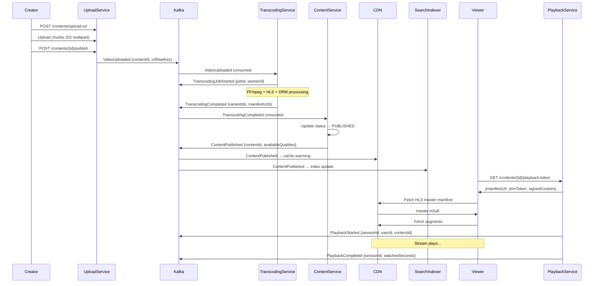

# Event Catalog

The Event Catalog is the authoritative registry of all domain events produced and consumed by the Video Streaming Platform. Every event represents an immutable fact about something that happened within the system boundary. Consumers subscribe to events via Kafka topics; event schemas are governed by an Avro schema registry with backward-compatibility enforcement.

---

## Contract Conventions

### Envelope Schema

All events share a common envelope regardless of domain:

```json
{
  "eventId": "01HXYZ...",
  "eventType": "VideoUploaded",
  "eventVersion": "1.0",
  "producedAt": "2025-01-15T14:23:00.123Z",
  "producer": "upload-service",
  "correlationId": "req_01HXYZ...",
  "traceId": "4bf92f3577b34da6",
  "spanId": "00f067aa0ba902b7",
  "partitionKey": "contentId:01HCONTENT...",
  "payload": { }
}
```

### Naming Convention

Events are named in past-tense PascalCase: `EntityVerb`. Examples: `VideoUploaded`, `ContentPublished`, `PlaybackStarted`. The `eventType` field is used as the Kafka message key for log compaction on state-event topics.

### Versioning

- Minor schema additions (new optional fields) increment the minor version; consumers must ignore unknown fields.
- Breaking changes (renamed/removed fields, type changes) require a new major version and a parallel topic rollout with a migration window.
- Schema registry enforces `BACKWARD` compatibility by default.

### Ordering Guarantee

Events within the same `partitionKey` are strictly ordered within a partition. Cross-entity ordering is not guaranteed. Consumers that require causal ordering must use the `correlationId` to reconstruct event chains.

### Dead Letter Queue

Events that fail consumer processing after 3 retries are written to `{topic}.dlq` with the original payload plus a `dlqReason` header. DLQ events trigger a PagerDuty alert when the lag exceeds 100 messages.

---

## Domain Events

### VideoUploaded

| Field | Type | Required | Description |
|---|---|---|---|
| contentId | UUID | Yes | Newly created content record ID |
| channelId | UUID | Yes | Owning channel |
| creatorId | UUID | Yes | Uploader user ID |
| s3RawKey | String | Yes | S3 object key of raw upload |
| fileSizeBytes | Long | Yes | Upload size in bytes |
| mimeType | String | Yes | e.g. `video/mp4` |
| uploadCompletedAt | ISO8601 | Yes | S3 CompleteMultipartUpload timestamp |
| durationHint | Integer | No | Creator-declared duration hint in seconds |
| isPremium | Boolean | Yes | Whether DRM packaging required |

**Topic:** `video-content.uploads`  
**Retention:** 7 days  
**Partitioning:** `contentId`  
**Consumers:** TranscodingService, NotificationService, AnalyticsService

---

### TranscodingJobStarted

| Field | Type | Required | Description |
|---|---|---|---|
| jobId | UUID | Yes | TranscodingJob record ID |
| contentId | UUID | Yes | Content being transcoded |
| workerId | String | Yes | FFmpegWorker instance ID |
| qualityProfiles | String[] | Yes | List of quality labels to produce |
| estimatedDurationMs | Long | No | Estimated processing time |
| jobPriority | String | Yes | NORMAL, HIGH, URGENT |
| startedAt | ISO8601 | Yes | Job pickup timestamp |

**Topic:** `video-content.transcoding`  
**Retention:** 3 days  
**Partitioning:** `contentId`  
**Consumers:** AnalyticsService, ContentService (status update)

---

### TranscodingCompleted

| Field | Type | Required | Description |
|---|---|---|---|
| jobId | UUID | Yes | TranscodingJob record ID |
| contentId | UUID | Yes | Content ID |
| variantIds | UUID[] | Yes | Created ContentVariant IDs |
| manifestUrls | Object | Yes | `{1080p: url, 720p: url, ...}` |
| thumbnailUrl | String | Yes | Default thumbnail CDN URL |
| totalDurationSeconds | Integer | Yes | Actual media duration |
| processingDurationMs | Long | Yes | Wall-clock processing time |
| vmafScores | Object | Yes | `{1080p: 91.2, 720p: 93.1, ...}` |
| drmPackaged | Boolean | Yes | Whether DRM encryption applied |
| completedAt | ISO8601 | Yes | Completion timestamp |

**Topic:** `video-content.transcoding`  
**Retention:** 7 days  
**Partitioning:** `contentId`  
**Consumers:** ContentService, CDNPusher, NotificationService, SearchIndexer

---

### TranscodingFailed

| Field | Type | Required | Description |
|---|---|---|---|
| jobId | UUID | Yes | TranscodingJob record ID |
| contentId | UUID | Yes | Content ID |
| errorCode | String | Yes | CORRUPT_SOURCE, UNSUPPORTED_CODEC, VMAF_BELOW_THRESHOLD, DRM_PACKAGING_FAILURE, WORKER_CRASH, TIMEOUT |
| errorMessage | String | Yes | Human-readable error detail |
| attemptNumber | Integer | Yes | Which attempt this was (1-based) |
| willRetry | Boolean | Yes | Whether system will auto-retry |
| failedAt | ISO8601 | Yes | Failure timestamp |
| workerLog | String | No | Last 2KB of FFmpeg stderr |

**Topic:** `video-content.transcoding`  
**Retention:** 14 days  
**Partitioning:** `contentId`  
**Consumers:** ContentService, NotificationService, AlertingService, AnalyticsService

---

### ContentPublished

| Field | Type | Required | Description |
|---|---|---|---|
| contentId | UUID | Yes | Published content ID |
| channelId | UUID | Yes | Channel ID |
| creatorId | UUID | Yes | Creator ID |
| title | String | Yes | Content title |
| contentType | String | Yes | MOVIE, EPISODE, SHORT, CLIP |
| isPremium | Boolean | Yes | Whether subscription required |
| availableQualities | String[] | Yes | e.g. `[2160p, 1080p, 720p, 480p]` |
| thumbnailUrl | String | Yes | Default thumbnail |
| durationSeconds | Integer | Yes | Media runtime |
| geoRestrictions | Object | No | `{allow: [], deny: []}` |
| publishedAt | ISO8601 | Yes | Publication timestamp |

**Topic:** `video-content.lifecycle`  
**Retention:** 30 days  
**Partitioning:** `channelId`  
**Consumers:** SearchIndexer, RecommendationEngine, NotificationService, AnalyticsService, FeedService

---

### PlaybackStarted

| Field | Type | Required | Description |
|---|---|---|---|
| sessionId | UUID | Yes | PlaybackSession ID |
| userId | UUID | Yes | Viewer user ID |
| contentId | UUID | Yes | Content being watched |
| variantId | UUID | Yes | Initial quality variant |
| deviceType | String | Yes | WEB, IOS, ANDROID, SMART_TV, etc |
| deviceId | String | Yes | Hashed device identifier |
| ipHash | String | Yes | Hashed IP (for geo analytics) |
| subscriptionTier | String | Yes | FREE, STANDARD, PREMIUM, FAMILY |
| drmSystem | String | No | WIDEVINE, FAIRPLAY, PLAYREADY |
| startedAt | ISO8601 | Yes | Session start timestamp |
| referrer | String | No | Where viewer navigated from |

**Topic:** `playback.sessions`  
**Retention:** 30 days  
**Partitioning:** `contentId`  
**Consumers:** AnalyticsService, RecommendationEngine, DRMService, BillingService, QoEMonitor

---

### PlaybackAbandoned

| Field | Type | Required | Description |
|---|---|---|---|
| sessionId | UUID | Yes | PlaybackSession ID |
| userId | UUID | Yes | Viewer user ID |
| contentId | UUID | Yes | Content ID |
| abandonedAtSeconds | Integer | Yes | Position in content when viewer left |
| completionPercent | Numeric | Yes | Percentage of content watched |
| reason | String | Yes | USER_EXIT, BUFFERING_TIMEOUT, ERROR, INACTIVITY |
| errorCode | String | No | Player error code if reason = ERROR |
| totalBufferingMs | Integer | Yes | Accumulated buffering time |
| qualitySwitches | Integer | Yes | Number of ABR level changes |
| abandonedAt | ISO8601 | Yes | Abandonment timestamp |

**Topic:** `playback.sessions`  
**Retention:** 30 days  
**Partitioning:** `contentId`  
**Consumers:** AnalyticsService, RecommendationEngine, QoEMonitor

---

### PlaybackCompleted

| Field | Type | Required | Description |
|---|---|---|---|
| sessionId | UUID | Yes | PlaybackSession ID |
| userId | UUID | Yes | Viewer user ID |
| contentId | UUID | Yes | Content ID |
| watchedSeconds | Integer | Yes | Actual seconds of content played |
| totalDurationSeconds | Integer | Yes | Content total duration |
| avgBitrateKbps | Integer | Yes | Average playback bitrate |
| bufferingEvents | Integer | Yes | Count of buffering interruptions |
| completedAt | ISO8601 | Yes | Completion timestamp |

**Topic:** `playback.sessions`  
**Retention:** 30 days  
**Partitioning:** `contentId`  
**Consumers:** AnalyticsService, RecommendationEngine, WatchHistoryService

---

### LiveStreamStarted

| Field | Type | Required | Description |
|---|---|---|---|
| streamId | UUID | Yes | LiveStream ID |
| channelId | UUID | Yes | Broadcasting channel |
| creatorId | UUID | Yes | Broadcaster user ID |
| title | String | Yes | Stream title |
| llHlsEnabled | Boolean | Yes | Whether LL-HLS mode active |
| rtmpIngestUrl | String | Yes | Active ingest endpoint |
| playbackUrl | String | Yes | Viewer HLS URL |
| ingestBitrateKbps | Integer | No | Detected ingest bitrate |
| startedAt | ISO8601 | Yes | Stream start timestamp |

**Topic:** `live-streams.lifecycle`  
**Retention:** 7 days  
**Partitioning:** `channelId`  
**Consumers:** NotificationService (subscriber alert), SearchIndexer, AnalyticsService, CDNWarmingService

---

### ContentFlaggedForModeration

| Field | Type | Required | Description |
|---|---|---|---|
| flagId | UUID | Yes | Moderation flag record ID |
| contentId | UUID | Yes | Flagged content ID |
| reportedBy | UUID | Yes | Reporting user ID |
| flagType | String | Yes | DMCA, CSAM, SPAM, HATE_SPEECH, VIOLENT, MISLEADING |
| description | String | No | Reporter's description |
| priority | String | Yes | P1 (CSAM), P2 (DMCA), P3 (other) |
| autoActionTaken | Boolean | Yes | Whether automatic removal applied |
| flaggedAt | ISO8601 | Yes | Flag creation timestamp |

**Topic:** `moderation.flags`  
**Retention:** 365 days (legal requirement)  
**Partitioning:** `contentId`  
**Consumers:** ModerationService, LegalService, AlertingService (P1 immediate)

---

## Publish and Consumption Sequence



---

## Operational SLOs

### Event SLO Table

| Event | Producer | Consumer(s) | Key Payload Fields | Retention | SLO |
|---|---|---|---|---|---|
| VideoUploaded | UploadService | TranscodingService, AnalyticsService | contentId, s3RawKey, fileSizeBytes | 7 days | Produced within 500 ms of S3 completion |
| TranscodingJobStarted | TranscodingService | AnalyticsService, ContentService | jobId, contentId, workerId | 3 days | Produced within 5 s of job pickup |
| TranscodingCompleted | TranscodingService | ContentService, CDNPusher, SearchIndexer | contentId, variantIds, manifestUrls, vmafScores | 7 days | Produced within 30 s of last segment upload |
| TranscodingFailed | TranscodingService | ContentService, NotificationService, AlertingService | contentId, errorCode, attemptNumber | 14 days | Produced within 10 s of failure detection |
| ContentPublished | ContentService | SearchIndexer, RecommendationEngine, NotificationService | contentId, channelId, isPremium | 30 days | Produced within 2 s of status flip |
| PlaybackStarted | PlaybackService | AnalyticsService, DRMService, QoEMonitor | sessionId, userId, contentId, deviceType | 30 days | Produced within 1 s of session creation |
| PlaybackAbandoned | PlaybackService | AnalyticsService, RecommendationEngine | sessionId, userId, abandonedAtSeconds, reason | 30 days | Produced within 5 s of session end |
| PlaybackCompleted | PlaybackService | AnalyticsService, WatchHistoryService | sessionId, userId, watchedSeconds | 30 days | Produced within 5 s of session end |
| LiveStreamStarted | LiveStreamService | NotificationService, SearchIndexer, CDNWarmingService | streamId, channelId, playbackUrl | 7 days | Produced within 2 s of RTMP ingest detected |
| LiveStreamEnded | LiveStreamService | NotificationService, VODIngestService, AnalyticsService | streamId, channelId, peakViewerCount | 7 days | Produced within 10 s of stream end |
| ContentFlaggedForModeration | ModerationService | ModerationService, LegalService, AlertingService | flagId, contentId, flagType, priority | 365 days | P1 produced within 100 ms; P2/P3 within 5 s |
| SubscriptionCreated | BillingService | EntitlementService, NotificationService | subscriptionId, userId, tier | 90 days | Produced within 1 s of payment confirmation |
| SubscriptionCancelled | BillingService | EntitlementService, NotificationService | subscriptionId, userId, cancelAt | 90 days | Produced within 1 s of cancellation |

### Consumer SLOs

| Consumer | Max Processing Lag | On Breach Action |
|---|---|---|
| TranscodingService | 10 s per event | Scale up worker pool; PagerDuty P2 |
| ContentService (status) | 30 s per event | Retry from offset; PagerDuty P3 |
| SearchIndexer | 60 s per event | Batch index rebuild; Slack alert |
| NotificationService | 120 s per event | DLQ if > 3 retries |
| AnalyticsService | 300 s per event (batch OK) | Lag monitor; Slack alert |
| ModerationService (P1) | 30 s per event | PagerDuty P1 immediate |
| QoEMonitor | 15 s per event | Alerting service downstream |

### Topic Configuration

| Topic | Partitions | Replication Factor | Cleanup Policy | Compaction |
|---|---|---|---|---|
| video-content.uploads | 12 | 3 | delete | No |
| video-content.transcoding | 12 | 3 | delete | No |
| video-content.lifecycle | 24 | 3 | delete | No |
| playback.sessions | 48 | 3 | delete | No |
| live-streams.lifecycle | 12 | 3 | delete | No |
| moderation.flags | 6 | 3 | delete | No |
| billing.subscriptions | 6 | 3 | compact + delete | Yes |
