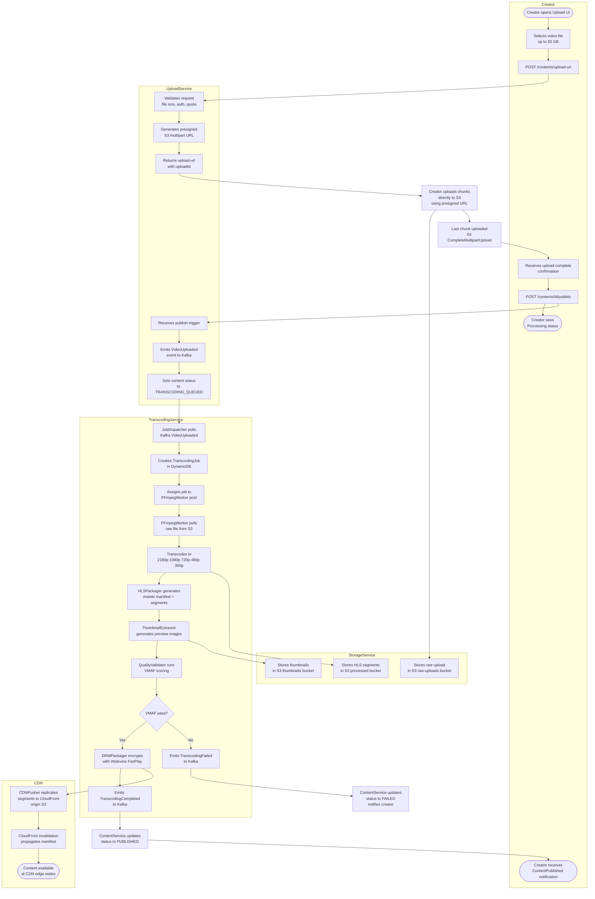
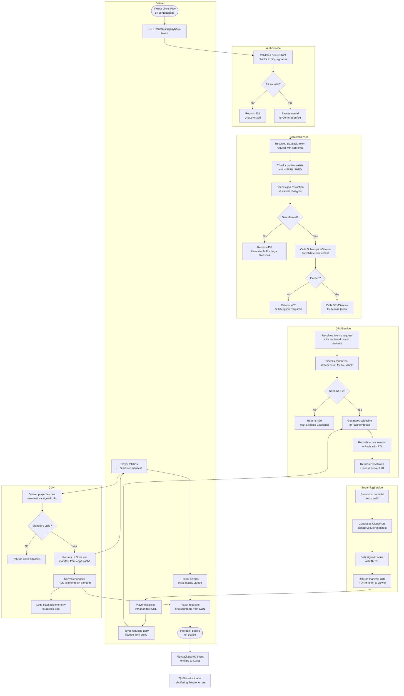

# Swimlane Diagrams

Swimlane diagrams partition complex workflows by the actor or service responsible for each step. For the Video Streaming Platform two critical end-to-end flows are documented here: the content upload and transcoding pipeline, and the subscription-gated playback flow. Each swim lane represents a discrete system boundary; handoffs between lanes correspond to asynchronous events or synchronous API calls.

---

## Content Upload and Transcoding

This flow covers every step from a creator initiating an upload through to CDN-distributed, DRM-packaged content being available for playback.



### Lane Responsibilities

| Lane | Responsibility | Key SLOs |
|---|---|---|
| Creator | Initiates upload, triggers publish | N/A (user-facing) |
| UploadService | Presigned URL generation, event emission | URL generation < 200 ms |
| TranscodingService | FFmpeg processing, HLS packaging, DRM encryption | 1080p ready < 30 min |
| StorageService | Raw and processed object persistence | 99.99% durability |
| CDN | Edge distribution, cache invalidation | Propagation < 60 s |

### Key Events in This Flow

- **VideoUploaded** — emitted by UploadService after creator triggers publish; payload includes `contentId`, `s3RawKey`, `fileSizeBytes`, `creatorId`.
- **TranscodingJobStarted** — emitted by JobDispatcher when a worker picks up the job.
- **TranscodingCompleted** — emitted after DRM packaging and CDN push succeed; includes variant manifest URLs.
- **TranscodingFailed** — emitted when VMAF score is below threshold or FFmpeg exits non-zero; triggers creator notification.
- **ContentPublished** — emitted by ContentService after status flip; consumed by search indexer, recommendation engine, and notification service.

### Error Paths

If the FFmpegWorker crashes mid-job the JobDispatcher detects a heartbeat timeout after 5 minutes and re-enqueues the job on a different worker. If S3 upload of processed segments fails, the CDNPusher retries with exponential backoff (3 attempts, max 2 min). If DRM packaging fails the content is held in `TRANSCODING_COMPLETE_DRM_PENDING` status and an alert fires to the on-call engineer.

---

## Subscription and Playback

This flow covers a viewer requesting to watch premium content from the moment they click play through to the CDN delivering encrypted media segments to their player.



### Lane Responsibilities

| Lane | Responsibility | Key SLOs |
|---|---|---|
| Viewer | Initiates playback, receives media | Startup time < 3 s |
| AuthService | JWT validation, identity assertion | p99 < 10 ms |
| ContentService | Entitlement, geo-restriction, routing | p99 < 50 ms |
| DRMService | License issuance, concurrent stream enforcement | p99 < 100 ms |
| StreamingService | Signed URL / cookie generation | p99 < 50 ms |
| CDN | Segment delivery, manifest caching | Hit ratio > 95% |

### Concurrency Enforcement

DRMService maintains a Redis sorted set keyed by `householdId`. Each active session is a member with the session start time as score. When a new stream is requested the service counts members where `now - score < sessionTTL`. If count ≥ 3 the request is rejected with `MAX_STREAMS_EXCEEDED`. Sessions expire automatically via Redis TTL aligned to the last heartbeat timestamp; the player sends a keepalive every 30 seconds.

### Playback Token Structure

```json
{
  "manifestUrl": "https://cdn.example.com/content/{id}/master.m3u8",
  "drmToken": "<base64-encoded-widevine-or-fairplay-token>",
  "licenseServerUrl": "https://widevine.example.com/license",
  "signedCookies": {
    "CloudFront-Policy": "...",
    "CloudFront-Signature": "...",
    "CloudFront-Key-Pair-Id": "..."
  },
  "expiresAt": "2025-01-15T22:00:00Z",
  "sessionId": "sess_01HXYZ...",
  "maxBitrate": 8000000
}
```
