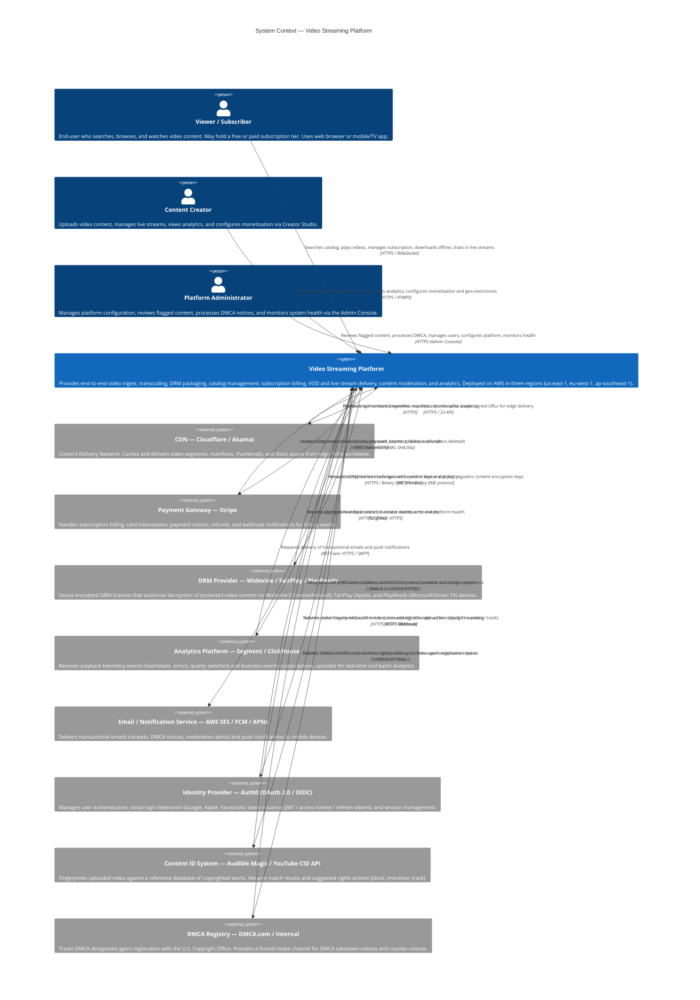

# System Context Diagram — Video Streaming Platform

## Introduction

This document presents the **System Context** view of the Video Streaming Platform using the C4 model (Level 1). The C4 model, developed by Simon Brown, provides a hierarchical set of software architecture diagrams that progressively expose more detail. The Level 1 Context diagram is the entry point: it shows the system under design as a black box and maps every person and external system that interacts with it, along with the nature of each interaction.

### Why the C4 Context Diagram

At this level, stakeholders do not need to know how the system is built internally — they need to understand:
- Who uses the system and for what purpose.
- Which third-party systems the platform depends on.
- What data flows across each boundary.
- Where the security perimeter lies.

The diagram acts as the anchor for all more detailed architecture views (Container, Component, Code) and is the primary communication tool for engineering leadership, security reviews, and external compliance audits.

### Notation

The Mermaid `C4Context` diagram type is used below. Nodes are typed as `Person`, `System`, `System_Ext`, or `Boundary`. Arrows carry a label describing the interaction and the primary protocol.

---

## System Context Diagram



---

## System Boundary Description

The **Video Streaming Platform** system boundary encompasses all software components, databases, queues, and infrastructure that are owned and operated by the platform engineering team. Anything outside the boundary is operated by a third-party vendor and communicated with over defined API contracts.

**Inside the boundary:**
- API Gateway layer (GraphQL + REST)
- Authentication Middleware (token validation, scope enforcement)
- Upload Service and Multipart Upload Manager
- Transcoding Orchestrator and FFmpeg Worker Pool
- Live Ingest and Live Transcoding Services
- Playback Manifest Service
- DRM Proxy and Key Management Service
- Entitlement Service and Concurrent Stream Enforcer
- Subscription Service (wrapper around Stripe)
- Content Moderation Service (ML pipeline + human review dashboard)
- Catalog and Search Service (Elasticsearch)
- Recommendation Engine
- Analytics Event Ingestion Endpoint
- Notification Dispatcher (façade over SES/FCM/APNs)
- Admin Console
- Creator Studio
- CDN Origin Bucket (S3)

**Outside the boundary (external systems):**
All external systems described in this document. The platform treats each as a black-box dependency with documented contracts, SLAs, and fallback strategies.

---

## External System Profiles

### CDN — Cloudflare / Akamai

| Attribute | Detail |
|---|---|
| **Purpose** | Edge delivery of video segments, HLS/DASH manifests, thumbnails, and static web assets |
| **Protocol** | HTTPS (manifests, thumbnails), HTTP/2 + QUIC (segment delivery), RTMP/SRT edge ingest for live streams |
| **Data Pushed by Platform** | Transcoded video segments (`.ts`, `.m4s`), HLS/DASH manifests (`.m3u8`, `.mpd`), thumbnail images (JPEG/WebP), signed URL policies |
| **Data Received by Platform** | Cache analytics (hit rate, origin bandwidth), security alerts (DDoS mitigation events), bot detection reports |
| **Authentication** | HMAC-SHA256 signed URLs generated by platform; mutual TLS for origin shield communication |
| **Availability SLA** | 99.99% uptime; >300 edge PoPs |
| **Failover** | Secondary CDN provider (dual-CDN strategy). Manifest service can switch between CDN providers at the URL level per content item within 30 seconds |

**Integration Pattern:** Origin Pull with Pre-warming. The platform stores canonical assets in the CDN origin (an S3 bucket). The CDN pulls segments on first request and caches them at the edge. For popular content (>100 expected viewers), the platform triggers a pre-warm API call to seed the top 20 PoPs.

**Data Flow:** `Platform → S3 Origin → CDN Edge → Viewer`. The platform signs each manifest URL with a viewer-specific short-lived token; the CDN validates the signature at the edge using a shared secret without round-tripping to origin.

---

### Payment Gateway — Stripe

| Attribute | Detail |
|---|---|
| **Purpose** | Subscription billing, one-time payments, refunds, and invoicing |
| **Protocol** | REST over HTTPS (TLS 1.3); Stripe.js for client-side card tokenisation |
| **Data Sent to Stripe** | Customer creation requests, subscription create/update/cancel, payment method attachment, refund requests |
| **Data Received from Stripe** | Payment intent status, invoice objects, subscription lifecycle events via webhooks, dispute notifications |
| **Authentication** | Stripe API keys (restricted key with write-only on customers/subscriptions, read-only on invoices) stored in AWS Secrets Manager |
| **Webhook Security** | HMAC-SHA256 signature on webhook payload verified using `Stripe-Signature` header before processing |
| **PCI Scope** | PCI-DSS SAQ A: card data never touches platform servers; only Stripe payment method tokens are stored |

**Integration Pattern:** Stripe-hosted Payment Element (client-side) + server-side Subscription API + webhook-driven entitlement updates.

**Data Flow — Subscription Creation:** `Viewer browser → Stripe.js (tokenise card) → Platform API (payment_method_id) → Stripe API (create subscription) → Stripe webhook (invoice.paid) → Platform entitlement update`.

**Data Flow — Renewal:** `Stripe automated billing → invoice.paid webhook → Platform entitlement renewal → Notification Service`.

---

### DRM Provider — Widevine / FairPlay / PlayReady

| Attribute | Detail |
|---|---|
| **Purpose** | Hardware/software content protection; prevents unauthorised copying and redistribution of video content |
| **Protocol** | HTTPS for licence acquisition; binary EME (Encrypted Media Extensions) protocol for browser CDMs; custom binary protocol for native SDKs |
| **Systems Covered** | Widevine: Chrome, Android, Chromecast, smart TVs; FairPlay: Safari, iOS, tvOS, macOS; PlayReady: Edge, Xbox, Windows apps, Roku |
| **Data Sent to DRM Provider** | DRM licence challenge (binary, device-bound), content key (CEK) wrapped in provider's public key, licence policy (expiry, resolution cap, rental flags) |
| **Data Received** | Encrypted licence response (device-bound, policy-enforced) |
| **Authentication** | Platform credentials stored in AWS Secrets Manager; certificate-based mutual TLS to Widevine proxy API |

**Integration Pattern:** Platform-Proxied Licence Acquisition. The video player sends the licence challenge to the platform's DRM Proxy endpoint (not directly to Widevine/FairPlay servers). This allows the platform to:
1. Validate the viewer's active entitlement before authorising a licence.
2. Inject the correct Content Encryption Key from the platform's Key Management Service.
3. Enforce per-viewer policy (resolution cap, offline flag, rental expiry).
4. Audit every licence issuance event.

**Key Management:** Content keys are generated during transcoding and stored in the platform's KMS (AWS KMS backed by HSM). Keys are never stored in plaintext in any database. The DRM proxy retrieves keys at licence issuance time using authenticated KMS API calls.

**Data Flow:** `Player CDM generates challenge → POST /v1/drm/license/{system} → DRM Proxy validates entitlement → fetches CEK from KMS → forwards to Widevine/FairPlay/PlayReady licence server → returns encrypted licence to player → CDM decrypts and loads key`.

---

### Analytics Platform — Segment / ClickHouse

| Attribute | Detail |
|---|---|
| **Purpose** | Real-time and historical analysis of viewer behaviour, content performance, platform health, and business metrics |
| **Protocol** | HTTPS REST (event ingestion to Segment), gRPC (internal pipeline), WebSocket (real-time creator dashboards) |
| **Data Sent by Platform** | Playback heartbeat events (every 10s: position, bitrate, buffer level, CDN PoP, rebuffer count), playback start/end events, subscription events, upload/publish events, error events |
| **Data Received** | Aggregated viewer counts (live), content performance metrics (plays, watch time, completion rate), subscription MRR metrics, error rate dashboards |
| **Volume** | ~5 billion events/day at platform scale |

**Integration Pattern:** Event Streaming with Fan-out. The platform's API servers publish events to an internal Kafka topic (`analytics.events`). A Kafka consumer forwards events to Segment's Track API. Segment fans out to ClickHouse (batch analytics), a real-time event store (for live dashboards), and optionally a third-party BI tool.

**Data Flow — Playback Telemetry:** `Player → POST /v1/analytics/events (batched, every 10s) → Kafka producer → Kafka topic → Analytics Consumer → Segment → ClickHouse + Real-time Store`.

---

### Email / Notification Service — AWS SES / FCM / APNs

| Attribute | Detail |
|---|---|
| **Purpose** | Transactional email (receipts, DMCA notices, moderation alerts, upload confirmations) and mobile push notifications |
| **Protocol** | AWS SES: REST/SMTP over TLS; FCM (Firebase Cloud Messaging): HTTP v1 API; APNs: HTTP/2 |
| **Data Sent** | Email recipient, subject, template ID, template variables; push notification device token, title, body, deep link |
| **Authentication** | AWS IAM role for SES; Firebase service account key for FCM; APNs private key (.p8) |

**Integration Pattern:** Notification Dispatcher Façade. The platform's Notification Service exposes a single `SendNotification(user_id, event_type, context)` API. The dispatcher resolves the user's preferred channels (email, push, or both), selects the appropriate provider, renders the template, and dispatches. This decouples business logic from notification channel selection.

---

### Identity Provider — Auth0 (OAuth 2.0 / OIDC)

| Attribute | Detail |
|---|---|
| **Purpose** | User authentication, social login federation, JWT issuance, session management, MFA enforcement |
| **Protocol** | OAuth 2.0 Authorization Code Flow with PKCE; OIDC for identity layer; JWT (RS256) for access tokens |
| **Data Sent to IdP** | Authorization requests, token exchange requests, user profile update requests, account linking requests |
| **Data Received** | JWT access tokens (short-lived, 15 min), OIDC ID tokens, refresh tokens (long-lived, 30 days), user profile claims |
| **Custom Claims** | Platform injects: `platform_role` (viewer/creator/admin), `subscription_tier`, `creator_id` into the JWT via Auth0 Action |
| **Security** | Token signing key rotation every 90 days; RS256 asymmetric signing; JWK endpoint published at `/.well-known/jwks.json`; token revocation via Auth0 blacklist |

**Integration Pattern:** Auth0 as the external Identity Provider with platform-specific enrichment. The platform validates all JWT access tokens locally (using cached public keys from Auth0's JWK endpoint) without a network round-trip on every API call. Refresh token rotation is handled by the client SDKs.

**Data Flow — Login:** `User browser → Auth0 /authorize (Authorization Code + PKCE) → Auth0 authenticates user → redirects with auth code → Platform backend exchanges code for tokens → Platform stores refresh token in HTTPOnly cookie → Platform returns session`.

---

### Content ID System — Audible Magic / YouTube Content ID API

| Attribute | Detail |
|---|---|
| **Purpose** | Automated copyright fingerprinting to detect uploaded content that matches registered reference works |
| **Protocol** | HTTPS REST (submit fingerprint job, poll result); Webhook for async result delivery |
| **Data Sent** | Audio fingerprint (derived locally from the video file; raw audio is never sent), video fingerprint hash, `upload_id` for correlation |
| **Data Received** | Match result: `{matched: bool, confidence: 0–100, reference_asset_id, rights_holder, suggested_action: block|monetise|track|none}` |
| **Privacy** | Only derived fingerprints (not raw media) are sent to the Content ID service, minimising data exposure |

**Integration Pattern:** Asynchronous Fingerprint Submit + Webhook Callback. After upload, the platform generates a fingerprint locally and submits only the hash to the Content ID API. The Content ID system processes the fingerprint asynchronously and calls back the platform's `POST /v1/webhooks/contentid` endpoint with the result.

---

### DMCA Registry

| Attribute | Detail |
|---|---|
| **Purpose** | U.S. Copyright Office agent registration; formal DMCA notice intake and tracking |
| **Protocol** | Email (primary DMCA intake), HTTPS REST (internal case management integration) |
| **Data Exchanged** | Inbound: DMCA takedown notices (claimant identity, copyrighted work description, infringing URL, legal statements). Outbound: Takedown confirmation, counter-notice forwarding, restoration notifications |
| **Legal Requirement** | 17 U.S.C. § 512(c)(2) requires the platform to register a Designated Agent with the U.S. Copyright Office and maintain a public list of the agent's contact information |

---

## Security Boundaries

### External Boundary (Internet Perimeter)
All inbound traffic from the public internet passes through the CDN's WAF (Web Application Firewall) and DDoS mitigation layer before reaching platform API endpoints. The CDN terminates TLS at the edge; traffic from CDN edge to platform origin travels over a private, certificate-authenticated origin shield channel.

### Service-to-Service Boundary
All internal service-to-service communication uses mutual TLS (mTLS) with service mesh (Istio). Service identities are bound to short-lived X.509 certificates issued by the platform's internal Certificate Authority (SPIFFE/SPIRE).

### Data Boundary
- **Viewer PII:** Stored in the User Database (AWS RDS, encrypted at rest with AES-256, KMS-managed keys). Not sent to external systems except the Identity Provider and Payment Gateway (for billing purposes).
- **Payment Data:** Never stored on platform servers. Only Stripe Customer IDs and Subscription IDs are stored.
- **Content Keys (CEK/KID):** Stored exclusively in AWS KMS (HSM-backed). Transmitted to DRM licence servers only over mTLS-authenticated channels.
- **Analytics Data:** Anonymised before being forwarded to the external Analytics Platform. No PII fields (email, name, phone) are included in analytics events.

### Regulatory Boundary
- **GDPR:** EU user data is processed exclusively in `eu-west-1`. The Identity Provider (Auth0) and Analytics Platform (ClickHouse) must have EU data residency configurations enabled.
- **COPPA:** Content identified as directed at children is geo-restricted to territories without COPPA obligations, or is processed with parental consent flows enabled.
- **DMCA Safe Harbour (17 U.S.C. § 512):** Platform maintains safe harbour by: acting expeditiously on takedown notices, not having knowledge of infringement, and not financially benefiting from infringing activity it has the right and ability to control.

---

## Data Flow Descriptions

### Flow 1: Viewer Watches a Video
```
Viewer → [HTTPS] → CDN WAF → [HTTPS] → Platform API Gateway
    → Playback Service [validate JWT with IdP JWK, check Entitlement]
    → DRM Proxy [acquire licence from Widevine/FairPlay]
    → Signed Manifest URL returned to Viewer
Viewer → [HTTPS] → CDN Edge [validates signed URL]
    → CDN Origin (S3) [cache miss only]
    → Viewer Player receives segments and decrypts with DRM licence
Player → [HTTPS] → Platform Analytics Endpoint → Kafka → Analytics Platform
```

### Flow 2: Creator Uploads a Video
```
Creator → [HTTPS Multipart] → Platform Upload Service → S3 Origin
    → ContentUploaded event → Kafka
    → Content ID System [fingerprint submission, async]
    → Transcoding Orchestrator [transcode to multi-bitrate]
    → DRM Packaging [generate CEK, register in KMS]
    → Push to CDN Origin
    → TranscodingComplete event → Notification Service → Email/Push to Creator
```

### Flow 3: Viewer Subscribes
```
Viewer → Stripe.js [tokenise card in browser]
    → Platform Subscription Service [create Stripe Customer + Subscription]
    → Stripe [charge card]
    → Stripe Webhook (invoice.paid) → Platform Entitlement Service [grant access]
    → Notification Service → Email receipt to Viewer
```

### Flow 4: DMCA Takedown
```
Rights Holder → DMCA Registry / Email → Platform DMCA Officer
    → Platform disables content [CDN cache purge + status = DMCA_DISABLED]
    → Notification Service → Email to Creator (takedown notice)
    → Notification Service → Email to Rights Holder (confirmation)
    → Case record stored in Legal Case Management System
```

---

## Integration Patterns Summary

| External System | Pattern | Latency Budget | Failure Mode |
|---|---|---|---|
| CDN | Origin Pull + Pre-warm | Edge delivery <50ms p99 | Fallback to secondary CDN |
| Payment Gateway | Webhook-driven entitlement | Webhook processing <500ms | Retry queue with 3-day window |
| DRM Provider | Proxied licence acquisition | Licence round-trip <300ms p95 | Standby licence server failover |
| Analytics Platform | Async event streaming | Events delivered within 60s | Kafka durability; no data loss |
| Email / Push | Async dispatcher façade | Email delivery <5 min | Dead-letter queue; retry 3× |
| Identity Provider | Token validation (local JWK cache) | JWK cache TTL: 5 min; token validation <5ms | JWK cache serves stale keys for up to 30 min |
| Content ID System | Async fingerprint + webhook | Scan completes within 30 min | Content held in PENDING_SCAN; manual review triggered at timeout |
| DMCA Registry | Email + REST manual workflow | Response within 24 business hours | N/A (manual process) |
